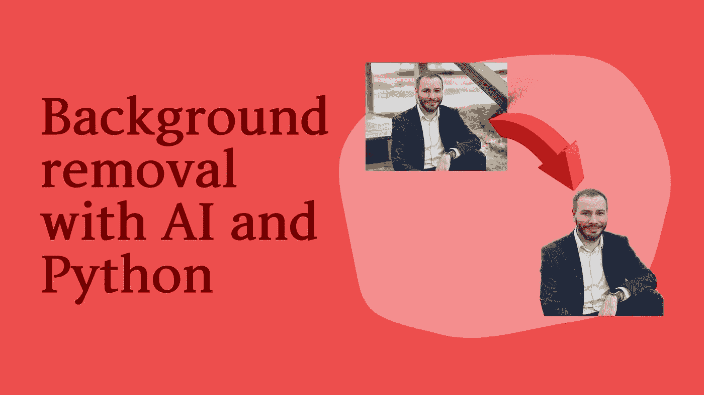
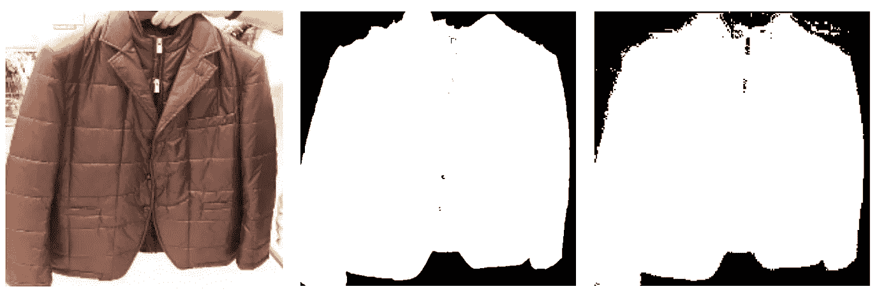
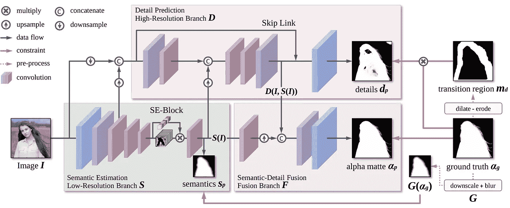
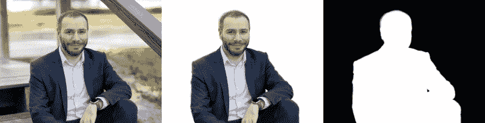

# 用人工智能和 Python 去除图像背景

> 原文：<https://betterprogramming.pub/removing-background-from-images-using-ai-and-python-fee6c3192b60>

## 就像那个超级趋势应用——但是由 Python 驱动



作者图片

人工智能席卷了全世界。随着越来越多的职业将人工智能与各自的领域相结合，这一概念已经彻底改变了几乎所有其他领域。下面的文章随后探讨了使用人工智能去除图像的背景。

背景去除的想法并不现代；相反，自从现代技术出现以来，它就存在于这一领域。因此，在计算机视觉领域已经有了许多背景去除技术。然而，经典的计算机视觉技术不断被现代的、基于人工智能的技术推翻，这些技术提出了更多创新的想法，给出了更精确和准确的结果。

# 经典计算机视觉

传统的计算机视觉依赖于大量的人工工作来构建基于规则的技术，以检测和分类图像中的特定像素组。模型需要明确地被告知检测什么和分类什么，以及图像中存在什么对象。它包括多种视觉模型技术，如边缘检测器和对象检测器。过滤图像的概念也属于同一范畴。此外，还包括卷积、霍夫变换和平滑技术。要了解更多关于计算机视觉的经典方法，请访问[计算机视觉中的经典概念](https://ai.plainenglish.io/concepts-in-classical-computer-vision-197a631673d5)。

更深入地探讨手头的问题，经典计算机视觉如何处理从图像中去除背景的想法？前景提取最著名的方法之一，也称为背景去除，是基于分割的颜色阈值法。在这个模型中，整个图像被分成多个更小的片段，每个像素值与预先设置的阈值进行比较。阈值通过将像素的强度值降低到单一纯色灰色(通常是纯白色，像素值为 255)来抑制背景信息。你可以在论文中了解更多:[自然图像分割的颜色阈值法](https://www.researchgate.net/publication/268348536_Color_Thresholding_Method_for_Image_Segmentation_of_Natural_Images)。

使用经典方法去除背景的已处理图像。来源:https://datacarpentry.org/image-processing/07-thresholding/

经典方法的另一个好例子是我们在博客上为自动驾驶汽车和自动车道检测系统所做的工作。

# 现代计算机视觉

现代人工智能和机器学习的出现彻底改变了计算机视觉领域。与更多依赖复杂编码数学函数和变换的经典计算机视觉不同，现代计算机视觉主要基于人工智能的深度学习技术来执行计算机视觉任务。[深度学习是机器学习的一个分支](https://livecodestream.dev/post/artificial-intelligence-vs-machine-learning-vs-deep-learning/)，涉及主要受人脑功能启发的算法。深度学习模型的算法被称为人工神经网络。你可以在我们的[你应该知道的顶级深度学习算法](https://livecodestream.dev/post/top-deep-learning-algorithms-you-should-know/)中找到更多关于神经网络的信息。


神经网络架构。来源:[https://www . extreme tech . com/extreme/215170-人工神经网络正在改变世界](https://www.extremetech.com/extreme/215170-artificial-neural-networks-are-changing-the-world-what-are-they)

深度学习中卷积神经网络的概念对日常计算机视觉任务的思考和处理方式产生了重大影响。人工神经网络需要大量的输入数据来进行训练，以至于对于深度学习，我们甚至可以颠倒“少即是多”的说法，将数据称为“多即是少”。

卷积神经网络将图像作为输入，并使其通过几个卷积和非线性过程，以输出包括关于输入图像的空间信息的所谓“特征图”。然后使用特征图提取该类的输出标签，然后使用损失函数将该标签与输入图像类的已知实际标签进行比较。

对训练数据中存在的所有训练示例迭代地进行该过程，并且获得优化的模型。然后，使用优化的模型来提取新图像的标签。标签可以是二进制的(0 和 1)，也可以是两个以上的。当只有两个类时，标签是二进制的；例如，我们必须确定图像是猫还是狗，或者图像是猫还是狗。要了解更多关于深度学习在计算机视觉中的使用，请参考这里的[博客。关于计算机视觉中的图像处理及相关方法，请参考我们的](https://www.dynam.ai/what-is-computer-vision-technology/)[使用 OpenCV for Python 的第一步](https://livecodestream.dev/post/first-steps-with-opencv-for-python/)。

# 语义分割

现在转回文章最初的问题，如何利用人工智能实现背景减除？实现这一目标的最著名的方法叫做语义图像分割。

语义图像分割背后的概念是图像的每个像素属于特定的类别，并被赋予该类别的标签。这种方法在世界各地的许多应用中都有使用。它扩展并不限于手写识别、虚拟化妆、虚拟试穿、视觉图像搜索和自动驾驶汽车。

该方法的抽象思想是，当每个像素被给定一个类别标签时，神经网络通过大量的例子被训练，以学习哪种像素属于特定的类别，比如前景类别，以及哪个像素属于另一个类别，即背景类别。

在像素分类器被训练之后，具有对应于背景类的标签的结果像素被分配灰色阴影(通常是白色)。前景图像保持原样；因此，图像的背景被称为被移除。

用于语义分割的模型建立的最先进的方法是“UNet”和“DeepLab”这两种架构都提出了各种技术来获取语义分割，从而最小化计算成本并最大化准确性。

要了解更多关于语义分割如何用于图像和视频，请访问[2021 年语义分割指南](https://nanonets.com/blog/semantic-image-segmentation-2020/)。



使用 DL 的最新示例。来源:[https://dev blogs . Microsoft . com/CSE/2018/04/18/deep-learning-image-segmentation-for-ecommerce-catalogue-visual-search/](https://devblogs.microsoft.com/cse/2018/04/18/deep-learning-image-segmentation-for-ecommerce-catalogue-visual-search/)

本文将描述一个称为 MODNet 的最新模型，它使用图像抠图(一种高级的语义分割形式)来执行背景减除。

# 什么是图像抠图？

图像抠图是图像分割的高级扩展概念。在图像抠图中，不是将像素仅分配给两个标签；前景(1)和背景(0)，我们用 0 到 1 之间的任何值来标记每个像素，指的是前景的强度或不透明度。如已经理解的，图像抠图是比图像分割复杂得多的任务；因此，交互式方法，如三分图和笔画，用于输出用户所需的结果。

三分图的概念本质上产生了对前景的有意义的提取。在三分图的情况下，用户可以手动为图像的像素分配三个标签中的一个，即前景、背景和未知区域。因此，对于给定的三分图，图像抠图被简化为基于前景和背景像素来估计背景颜色、前景颜色和图像的未知区域中的像素的阿尔法值。

与三分图方法不同，笔画方法只需要在适当的图像区域中指定一些前景和背景涂鸦。在基于笔画的算法中，这些标记的涂鸦被认为是输入，并用于提取 alpha 值。

除了三分图和笔画方法之外，还有多种不同的交互式图像抠图模式，包括蓝屏抠图、自然图像抠图、基于采样的图像抠图、基于传播的图像抠图和基于学习的图像抠图。要了解有关这些图像抠图交互式技术的更多信息，请访问“图像抠图在图像分割中的作用是什么？”。

# MODNet

首先，我们将抽象地看一下 MODNet 的架构，它本身是一个复杂的算法，由交互式和非交互式技术的组合组成，用于执行图像抠图。

# MODNet 的体系结构

就其主干而言，MODNet 是基于这样一种思想构建的，即作为分割步骤的无三分图抠图加上基于三分图的抠图步骤可以实现更好的性能。MODNet 通过进一步将无三分图图像抠图分为语义估计、细节预测和语义细节融合来扩展这一思想。语义估计输出粗略的前景遮罩，而细节预测输出精细的前景遮罩。语义细节融合融合了前两层的特征。

1.  语义估计——语义估计的第一步是定位图像中的人。与原始方法的不同之处在于，高级特征的提取仅由编码器完成，即低级分支。这使得估计更加有效，因为它不再由除了编码器之外还包含解码器的独立模型来完成。
2.  细节预测-前景肖像周围的区域使用高分辨率分支进行处理，该分支将图像、低级分支输出和来自低级分支的低级特征作为输入。重用低级特征的目的是减少细节预测的计算开销。
3.  语义细节融合 MODNet 的融合分支是卷积神经网络架构。要了解卷积神经网络，请访问[卷积神经网络综合指南](https://towardsdatascience.com/a-comprehensive-guide-to-convolutional-neural-networks-the-eli5-way-3bd2b1164a53)。来自前两个分支的值连接在一起，以预测最终的 alpha 遮罩。

MODNet 提供了一种简单、快速和有效的架构，以避免在实时人像抠图中使用绿色屏幕。通过只查看 RGB 图像，该模型能够在不同的场景下预测 alpha 遮片。虽然有许多优点，MODNet 架构的缺点是它不能处理奇怪的服装和强烈的运动模糊，这些不包括在模型没有训练过的训练集中。要广泛研究 MODNet 架构及其实验，请参考论文[实时人像抠图真的需要绿屏吗？](https://arxiv.org/abs/2011.11961)



MODNet 架构。来源:https://arxiv.org/abs/2011.11961

# 编码时间到了

和往常一样，你可以自己编码，或者你可以在 Google Colab [这里](https://colab.research.google.com/drive/1PaZJpk_xlYsJgsbNqNIwzfmolpa8r1tZ?usp=sharing)获得完整的工作代码。

现在，我们已经介绍了从经典计算机视觉和现代计算机视觉之间的差异到 MODNet 的基本架构的所有背景减除基础知识。我们可以继续运行代码，使用预先训练好的 MODNet 作为图像的背景去除器。

请注意，该代码是为 Google Colab 开发的，所以如果您想在本地运行，您必须对存储和加载文件的方式进行调整。

# 模型准备

“导入操作系统”命令导入操作系统模块，这是标准库的一部分。os 模块提供了创建和删除目录、获取内容、改变或识别当前目录等功能。

“%cd”命令输入其路径在前面提到的目录。if 语句放在那里是为了建议在代码中进行检查，以确定 MODNet 目录是否已经存在于当前目录中。否则，MODNet 目录将从包含该目录的 GitHub 存储库中克隆。

克隆 MODNet 目录后，我们从该目录导入预先训练的模型检查点文件。这里，进行了另一项检查，以查找目录中是否存在检查点文件。如果没有，则下载预先训练的模型检查点文件。

# 上传图像

现在我们继续下一段代码。我们首先导入必要的模块。“shitil”模块提供了几个函数来处理对文件及其集合的操作。它提供复制和删除文件的能力。类似地，我们导入 colab 的 os 模块和 files 模块。文件模块将帮助我们从本地机器上传文件到 Google colab。首先，我们通过检查输入和输出文件夹是否已经存在于目录中来创建它们。如果是，则删除现有文件夹，并创建同名的新文件夹。接下来，我们使用 colab 的 files 模块在 Google colab 运行时上传本地机器上的图像。上传后，我们将上传的图像移动到之前创建的输入文件夹中。

# 推理

```
!python -m demo.image_matting.colab.inference \
        --input-path demo/image_matting/colab/input \
        --output-path demo/image_matting/colab/output \
        --ckpt-path ./pretrained/modnet_photographic_portrait_matting.ckpt
```

运行上面的命令，因为它使用预训练的 MODNet 模型来推断输入图像上的 alpha 遮片。上面的命令使用我们在步骤 1 中下载的检查点模型文件来对上传的图像执行遮片操作。

# 形象化

现在，我们继续研究背景被移除的新图像的可视化。我们还将查看从输入图像中提取的 alpha 蒙版。

首先，我们导入必要的模块。NumPy 是一个库，它支持大型多维数组和矩阵，以及大量高级数学函数集合来操作这些数组。要了解更多关于使用 NumPy 可以执行的操作，请阅读文档[这里](https://numpy.org/doc/stable/)。Python 图像库(PIL)是一个添加了对打开、操作和保存许多不同图像文件格式的支持的库。

我们从“组合显示”功能开始首先，计算要显示的图像的分辨率。因此，我们通过执行某些图像操作来提取预测的前景图像，即其背景被移除的图像，这些图像操作包括将图像整形为 3 通道(RGB)图像，然后我们将这些图像连接成单个图像，使得三个图像(原始图像、前景图像和遮片图像)显示在单个图像中。我们获得如下所示的输出。



原始、已处理和遮罩图像

# 保存结果

```
zip_filename = 'matte.zip'
if os.path.exists(zip_filename):
  os.remove(zip_filename)os.system(f"zip -r -j {zip_filename} {output_folder}/*")
files.download(zip_filename)
```

最后，您可以使用 OS 模块将预测的 alpha matted 保存到本地运行时/机器的 zip 文件中。

# 结论

基于深度学习的现代计算机视觉及其应用席卷了全世界。背景去除有许多经典技术，但最近人工智能已经证明自己能够提供更好、更有效的方法来完成这项任务。一种这样的方法被称为语义分割，其中我们通过查看图像的每个像素并为其分配两个类别之一(前景或背景)来训练输入和输出图像。

因此，许多研究人员和开发人员致力于创建改进的、更有效的模型和架构来执行每项任务。背景去除器也是如此，也称为前景提取器。这种架构的一个例子是 MODNet，它使用 trimap 交互式技术使用图像抠图的概念，其中图像像素被分成三类，即:前景、背景和未知区域。基于前景的不透明度，为未知区域计算不同的 alpha 值。

使用预训练的 MODNet 模型很简单，只需从官方公开的 GitHub 库导入预训练的模型，然后输入想要移除背景的图像。它输出去除了背景的图像。

感谢阅读！