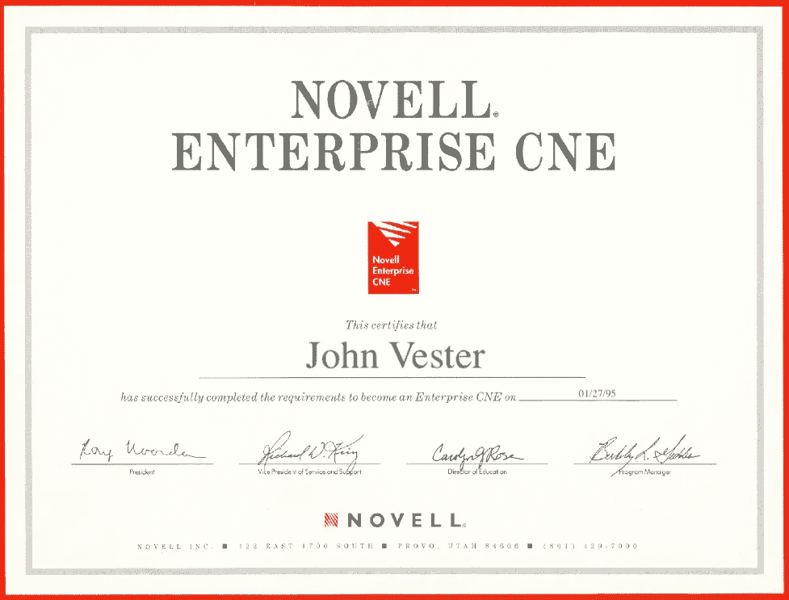
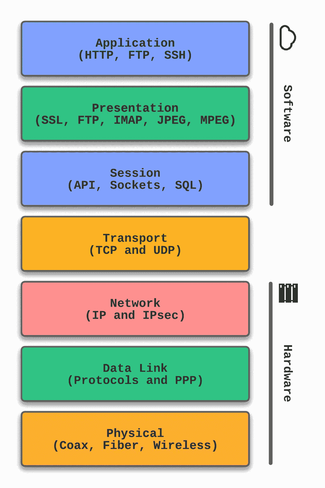
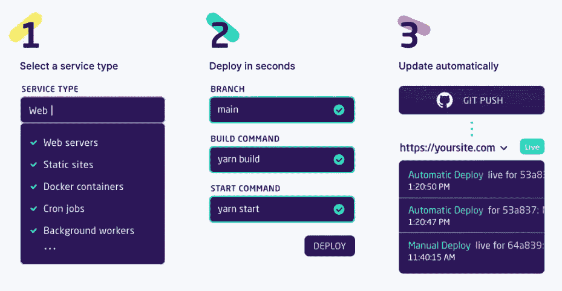
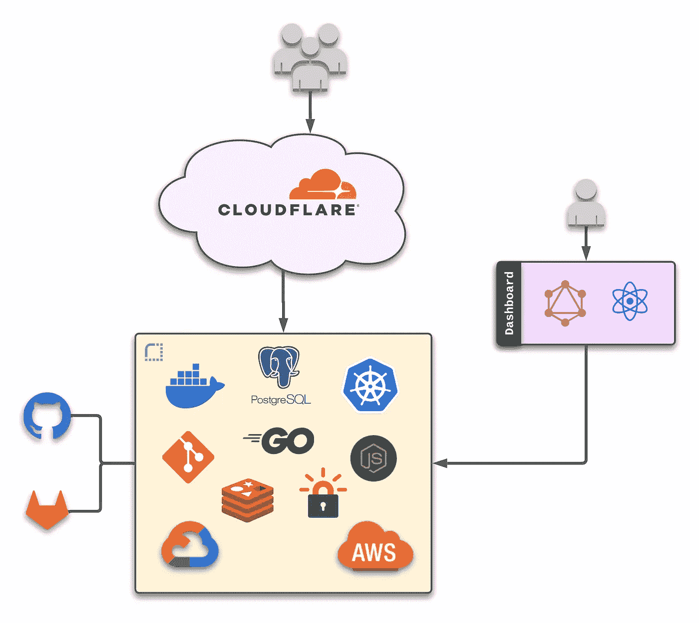

# 渲染统一云—幕后

> 原文：<https://betterprogramming.pub/render-unified-cloud-under-the-hood-940d097cede8>

## 它实现了零 DevOps 的承诺吗？

在我职业生涯的早期，作为一名网络程序员，我的部分职责包括支持企业实现 Novell、T2 和 NetWare。那是 20 世纪 90 年代中期，Novell 在网络操作系统市场占据主导地位。我决定成为一名注册的 Novell 工程师(CNE)对我最有利。几个月后，经过几次紧张的考试，我获得了我自己版本的证书:

这一系列考试中要求最高的考试集中在网络概念和 [OSI 模型](https://en.wikipedia.org/wiki/OSI_model)上，该模型为计算机系统通过网络进行通信提供了七个层次。

那场特殊的考试激发了我的好奇心，这种好奇心在 25 年后依然占据着我的脑海。

> *CNE 认证经历训练我在考虑新技术、解决方案和框架时要“深入观察”。*

在对“[如何使用 Render and Go](/how-to-create-a-web-service-using-render-and-go-75d211421a00) 创建 Web 服务”出版物有了非常积极的体验之后，我觉得我需要更深入地理解承诺零 DevOps 的服务的设计。

# 什么是渲染？

Render 为希望快速部署的软件工程师提供了统一的云。该平台生活在一个可良好扩展的生态系统中。

> *想象一下，能够获得 AWS、GCP 和 Azure 的优势，并且像 Heroku 这样的解决方案一样易于使用。*

这一基础设计与零开发运维承诺同步推进，使得每一次部署都像下面这样简单:

在这个三步模型中，开发人员首先选择服务类型，然后为初始部署指定一些基本信息。按下**部署**按钮启动渲染平台上运行的服务流程。

第三步是未来会发生什么。基本上，当您将更改推送到指定的分支(上例中的 main)时，代码将自动部署到 Render 上，无需任何进一步的操作。

由于这个前提听起来很神奇，通过 CNE 考试的我需要知道“引擎盖下”的渲染是什么样子

# 建筑和设计

在与 Render 的工程团队交谈中，我了解到他们提供来自多家云提供商的托管服务。所有服务都使用 Cloudflare 进行 DDoS 保护和 CDN。

Render 有目的地专注于创建云、独立于提供商的解决方案，以避免依赖于任何提供商或服务。这意味着一年后，幕后的技术可能会改变，而不会对现有的渲染客户产生影响。

在 Render unified cloud 内部，工程团队利用 containers、PostgreSQL、Kubernetes、Go、JavaScript、Git、Redis 和 Let's Encrypt 进行内部设计。为了支持基于 Git 的推送/合并部署，Render 和 GitHub/GitLab 之间存在连接器。

对于渲染仪表板用户界面，渲染工程团队使用 React 和 GraphQL 来允许客户配置和维护他们在平台上运行的服务。

# 渲染提供价值的地方

当我开始关注 Render 时，老实说，我对这个领域的另一个竞争平台并不感到兴奋。但是当我开始深入渲染生态系统时，我看到了一个更加通用和可扩展的平台。

为了澄清，如果我回顾我作为 CleanSlate 技术组工程团队的一部分所参与的最近五个主要项目，所有这些项目都超过了使用 Heroku 服务的最可行的实现。

这是因为 Heroku 似乎非常适合中小型应用程序，这些应用程序不需要考虑随时间推移的可伸缩性和灵活性。这个概念通常被称为“毕业问题”，这意味着随着服务的成熟或发展，服务通常必须毕业于更通用的选项。

对于大型应用，Heroku 可能会面临以下挑战:

*   水平扩展需求会对您的预算产生非线性影响
*   随着使用量的增长，市场型附加组件的实施可能会导致高于预期的费用
*   解决方案架构的发展可能需要平台上不存在的选项，导致“方孔中的圆栓”设计

相比之下，Render 通过在硬件和服务的每一层提供灵活和经济的解决方案，提供了一种消除分级问题的解决方案，而不管项目的规模如何。

Render 提供了一些优于竞争对手的额外优势:

*   Render 为每个客户提供了服务之间的私有网络。这是经常提供给签署合同的“企业”客户的东西，他们为每个私人空间收取高额的月费。随着部署的服务系统变得越来越复杂，专用网络对于服务之间的延迟以及降低网络流量泄露数据的风险变得越来越重要。
*   渲染提供了一个持久磁盘选项。虽然这“打破”了 12 因素(12factor.net)原则，但一些服务在没有连接磁盘的情况下无法运行。
*   Render 提供免费的静态网站，而竞争对手需要新的应用程序来服务静态网站，或者使用 GitHub 页面或类似的第三方产品。

# 但是等等…还有更多

Render 的软件工程师也意识到，客户经常为他们的应用程序寻找的不仅仅是客户端和 API 服务(比如 JAM-stack 风格)。请考虑 Render unified cloud 中已经提供的这些功能:

*   **私有服务**:未公开的服务，但可通过自动发现获得。他们可以监听任何非 HTTP 端口。示例:缓存或数据库服务。
*   **后台工作人员**:类似私有服务，但是没有暴露端口。例子包括消息队列消费者和处理器。
*   **Cron 作业:**驻留在基于 Git 的存储库中的调度作业。
*   **蓝图:**基础设施即代码，允许在基于 Git 的存储库中维护服务基础设施的各个方面。

与他们的竞争对手相比，这四个项目是真正的游戏规则改变者。

# 结论

25 年前，为了获得对产品、解决方案或框架的信心，我开始“深入”研究技术解决方案。我将永远记得我第一次和 Spring Boot 完成这个练习时，对 Pivotal 基于 Java 的微框架感到非常满意。

现在，通过使用 Render 完成同样的练习，我感受到了同样的信心——不仅对于原型级应用程序，对于企业级解决方案也是如此。这与我以前的经历大相径庭，在我以前的经历中，我一直认为，一旦我的“毕业问题”成为现实，我最终将不得不移民。

自 2021 年以来，我一直试图按照以下使命宣言生活，我觉得这可以适用于任何 IT 专业人士:

> *“将您的时间集中在提供扩展您知识产权价值的特性/功能上。将框架、产品和服务用于其他一切。”*
> 
> *- J. Vester*

我真的觉得 Render 坚持我的个人使命陈述有两个原因。首先，它实现了零开发运维的承诺，允许功能和服务团队专注于开发可靠的解决方案。第二，它消除了与“毕业问题”相关的长期负担，这是你在这个市场上与其他所有竞争对手都会面临的问题。

如果您是一名软件工程师，对云服务提供商的替代方案感到好奇，我强烈建议尝试一下 Render……只要访问以下 URL，您就可以零成本地做到这一点:

[https://dashboard.render.com/register](https://dashboard.render.com/register)

祝你今天过得愉快！