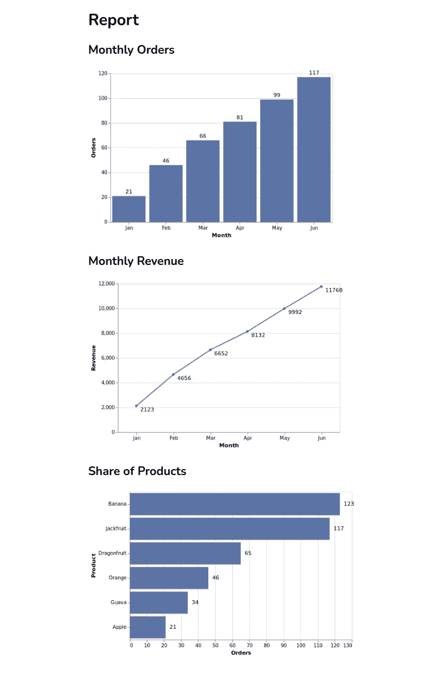
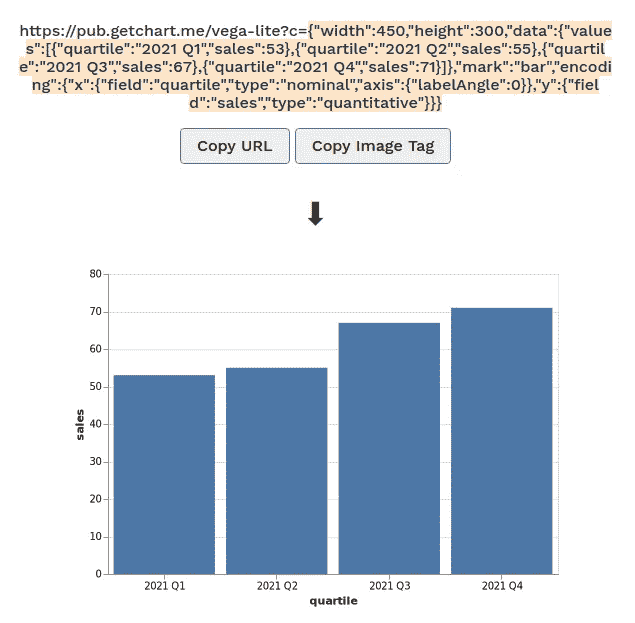

# 在 Laravel 应用程序中呈现图表

> 原文：<https://betterprogramming.pub/rendering-charts-in-laravel-applications-b6cd1ef982f6>

## 在 Laravel 应用程序中呈现图表的最简单快捷的方式

在 [Unsplash](https://unsplash.com/s/photos/analytics?utm_source=unsplash&utm_medium=referral&utm_content=creditCopyText) 上由 [Adeolu Eletu](https://unsplash.com/@adeolueletu?utm_source=unsplash&utm_medium=referral&utm_content=creditCopyText) 拍摄的照片。

人们说一张图胜过千言万语。这对于图表来说再真实不过了，图表让你将数据浓缩成一个有意义的信息，人们可以很容易地消化。

在本文中，我们将讨论如何在 [Laravel](https://laravel.com/) 应用程序中呈现图表。我们将采用的方法不需要安装任何库，这意味着可以快速简单地呈现图表。

# 我们将建造什么

带有图表的示例报告页面

让我们假设我们正在为一个在线商店构建一个报告页面。该报告可能包含:

1.  月订单—客户每月下的订单数量
2.  月收入—每月产生的收入额
3.  产品份额—一段时间内最畅销产品的列表

在 Laravel 应用程序中，该报告作为网页被访问。

# 技术选择

Laravel 中呈现图表的方法很少。比如使用一个 JavaScript 前端库比如 [Chart.js](https://www.chartjs.org/) 、 [Highcharts](https://www.highcharts.com/) 或者 [Vega-Lite](https://vega.github.io/vega-lite/) 。然而，这样做的缺点是在前端包含了正在讨论的库。对于 JavaScript 被停用的客户端(例如电子邮件)，这是不可行的。

另一种方法是在服务器中呈现图表，并将其作为图像发送给客户机。这一领域没有太多竞争。我能找到的一个选项是 [c-pchart](https://github.com/szymach/c-pchart) ，不幸的是对我的口味来说感觉太冗长了。在服务器中呈现图表的缺点是增加了服务器所需的处理能力。呈现图表不如典型的服务器工作负载(从数据库获取数据、转换等)便宜。).

另一种方法是使用 [GetChart.me](https://getchart.me?m=mdm.laravel.0) 来呈现图表。简而言之，GetChart.me 是一个允许我们从 URL 中编码的图表定义中获取图表图像的服务。这意味着在 HTML 页面中嵌入图像就像``一样简单。这种方法的缺点是依赖于外部服务，这意味着图表图像的可用性取决于服务的可用性。

在本文中，我们将使用 GetChart.me，原因如下:

1.  这很容易快速开始—只需构建一个 URL 并将其作为图像嵌入到 HTML 文档中。
2.  没有 JavaScript —图表可以覆盖更多客户(例如电子邮件)。
3.  使用开源图表定义(Vega-Lite) —如果服务停止运行，我们可以通过将 Vega-Lite 添加到 HTML 页面来退回到“客户端库”方法。

# 辅导的

我假设你已经设置了一个 Laravel 应用程序。如果没有，您可以按照[官方指南](https://laravel.com/docs/8.x#your-first-laravel-project)设置一个。

## 设置刀片模板

首先，让我们在`resource/views`文件夹中创建一个名为`report.blade.php`的新[刀片模板](https://laravel.com/docs/8.x/blade)。顾名思义，这个模板将显示报告页面。刀片模板的内容如下:

这里没什么花里胡哨的。如您所见，图表基本上是指向一些 URL 的图像。URL 将通过三个模板参数从控制器传入:`monthlyOrdersImageUrl`、`monthlyRevenuaImageUrl`和`shareOfProductsImageUrl`。

## 创建控制器并连接刀片模板

在`app/Http/Controllers`文件夹中创建一个名为`ReportController.php`的新文件。将以下代码放入文件中:

从源代码中，我们连接了之前使用`view('report', ...)`创建的刀片模板。我们还传入了三个模板变量，尽管现在它们都是空字符串。

## GetChart.me URL 帮助函数

在制作实际的图表之前，让我们创建一个助手函数来生成 GetChart.me URL。

显示 GetChart.me 如何工作的图表

GetChart.me 的工作方式是发送一个 URL 编码的 Vega-Lite 图表定义作为 URL 参数。在 PHP 中，我们将其实现为一个简单的单行程序，如下所示:

这个函数接收一个 Vega-Lite 图表定义(在 PHP maps 中),并输出一个有效的 GetChart.me URL。

## 创建图表

创建图表涉及两件事:

*   定义图表的外观。
*   定义图表的数据。

图表的数据可以来自任何地方。数据库是典型的数据源。在本文中，为了简明起见，我们将只对数据进行硬编码。

定义图表视觉效果基本上与编写 Vega-Lite 图表定义是一样的。在 [Vega-Lite 示例](https://vega.github.io/vega-lite/examples/)中有大量图表。[图书馆的文档](https://vega.github.io/vega-lite/docs/)也相当可靠。在我们的例子中，我们使用条形图、折线图和水平条形图。

创建图表的代码如下:

刷新页面。您应该会看到报告页面现在看起来非常有用，带有图表。

如果你成功地达到了这一点，那么我们就完成了。很简单，对吧？

# 结论

在本文中，我们用 Laravel 创建了一个包含图表的报告页面。在 Laravel 应用程序中呈现图表有多种方式:使用客户端图表库、服务器端图表呈现或第三方图表呈现服务(GetChart.me)。我们选择使用 GetChart.me 是因为它的低复杂性和可移植性。