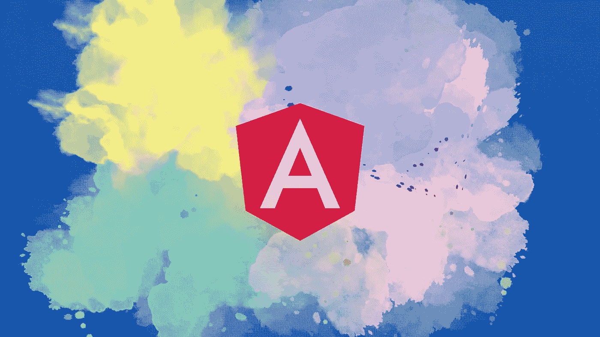
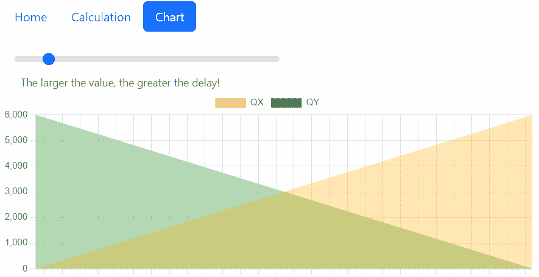
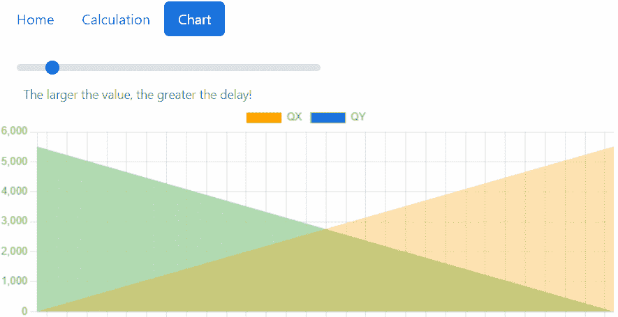

# 在 Angular 中使用 Web Workers 呈现图表

> 原文：<https://betterprogramming.pub/rendering-charts-with-web-workers-in-angular-f7ac576e21d1>

## Angular | Web Workers | Chart.js

## 如何使用 OffscreenCanvas 在 web worker 中创建图表



使用 [Canva](https://www.canva.com/) 创建的照片——来自 [Angular 新闻包](https://angular.io/presskit)的 Angular 徽标

在我们的[上一篇文章](https://medium.com/better-programming/exploring-web-workers-in-angular-84b9949a4fab)中，我们谈到了 Angular 中的 web workers。我们介绍了使用这种方法的一些优点和缺点。我们也有机会在一个演示应用程序中看到它们的运行。

在本文中，我们将继续研究网络工作者。我们将使用`OffscreenCanvas` API 通过 web worker 创建一个图表。在此过程中，我们将强调它们的一些局限性，以及我们如何解决它们。

我们开始吧！

> **免责声明:**截至今天，OffscreenCanvas API [尚未被所有浏览器支持](https://caniuse.com/offscreencanvas)。

# 呈现图表

我们将使用 [Chart.js](https://www.chartjs.org/) 来渲染我们的图表。因此，我们需要通过在终端中运行以下命令来安装相应的包:

```
npm install chart.js
```

我们在演示应用程序中添加了一个新页面。此页面基于通过范围输入元素选择的数字创建图表。

分别地，我们有类文件。每当用户更改该值时，就会调用`modelChange`方法。这个方法将`newValue`传递给`DataService`的`updateDataLength`方法(第 13 行)。

我们没有真正的后端，所以`DataService`模拟数据生成和从 API 获取数据。每次调用`updateDataLength`时，服务都会生成新的数据。

回到`ChartComponent`，我们订阅了这个服务的`data$` observable。我们在`ngAfterViewInit`生命周期挂钩方法中这样做。我们将使用生成的数据来做一些事情。

正如我们将看到的，这涉及到使用对 DOM 元素的引用`chartCanvas`。我们使用`[ViewChild](https://angular.io/api/core/ViewChild)`装饰器查询视图中的元素。但是视图查询是在调用`ngAfterViewInit`之前设置的，因此是订阅的位置。

在第 15 行，我们检查 web workers 是否受支持。如果不是，我们从主线程创建图表。

让我们看看这是什么样子的。



加载图表时，应用程序“冻结”(例如，用户无法导航离开)。网络工作者能对此有所帮助吗？

让我们再次回顾一下这个应用程序，这次使用一个 web worker。



网络工作者完成了这项工作。但是现在又出现了一个问题。请注意，当鼠标悬停在图表上时，不再出现标签！

# 限制

web 工作者的一个主要限制是他们不能访问 DOM。此外，他们对`window`对象的方法和属性的访问是有限的。

根据他们的[官方文档](https://www.chartjs.org/docs/latest/general/performance.html#parallel-rendering-with-web-workers-chromium-only)，在 web worker 中使用 Chart.js 时:

> “[…]使用 DOM 的 Chart.js 插件(包括任何鼠标交互)可能无法工作。”

好消息是我们可以绕过这些限制…但是我们必须做所有的工作。

哇，坏消息是什么？

坏消息是，所有与 DOM 相关的事件都不再工作了。调整大小也不行。所以我们必须为我们感兴趣的每一个事件工作。

但是首先要做的是！

# 尽管它们有局限性

我们如何在 web worker 内部创建图表呢？

输入`[OffscreenCanvas](https://developer.mozilla.org/en-US/docs/Web/API/OffscreenCanvas)`。

我们没有将画布本身传递给 web worker，而是将画布的渲染控制转移给了[。我们创建画布一次，然后使用它的`OffscreenCanvas` transferable 在 web worker 中执行任何渲染。](https://developer.mozilla.org/en-US/docs/Web/API/HTMLCanvasElement/transferControlToOffscreen)

可以把可传输对象看作是可以传输到不同的 JavaScript 上下文的对象，比如另一个窗口或工作器。

*   在第 16–21 行，我们处理画布上的渲染。首先，我们初始化 web worker(第 17 行)并第一次在画布上绘图(第 18 行)。然后，我们执行任何后续重绘(第 20 行)。
*   在第 34-40 行，第一次抽签发生了。我们创建屏幕外画布(第 34 行)并将其传递给 web worker。我们还将屏幕外的画布作为可转移对象传递(第 40 行)。
*   在第 44–46 行，我们手动创建一个画布，将它附加到 DOM，并返回它的`OffscreenCanvas`。
*   在第 50 行，我们使用`postMessage`发送新数据并执行重绘。

## **工人的实现呢？**

到目前为止，web worker 的实现如下所示:

我们[使用](https://stackoverflow.com/questions/63795576/using-chart-js-in-web-worker) `[importScripts](https://stackoverflow.com/questions/63795576/using-chart-js-in-web-worker)` [来导入 chart.js](https://stackoverflow.com/questions/63795576/using-chart-js-in-web-worker) 。如果我们试图用通常的语法导入它，我们会得到编译错误。原因是我们前面谈到的 DOM 限制。我们在之前的文章中也详细解释了这一点。

简单地说，我们向 web worker 发送定制的事件，并声明一个函数来处理 web worker 内部的每个事件。

我们在开始时发送一个`firstDraw`来初始化画布并创建图表。然后，我们发送`redraw`事件来销毁之前的图表，并在屏幕外的画布上绘制一个新的图表。

# 添加调整大小事件

在 web worker 中呈现图表会带来一些副作用。

其中之一是图表不再响应。如果我们调整浏览器窗口的大小，图表不会随之调整，这可能会有问题。

不要害怕！

我们可以代理 resize 事件并手动调整图表的大小。

*   在第 16 行，我们注册了调整大小事件。
*   在第 23 行，我们在`window`对象上添加了一个事件监听器。每当调整浏览器大小时，我们将事件代理给 web worker 以相应地调整图表的大小。

我们的 web worker 必须能够处理 resize 事件。我们创建一个`resize`函数，并将其添加到处理程序中。

# 添加鼠标事件

我们之前观察到的另一个副作用是鼠标互动停止了。悬停在图表上时不显示标签。

你知道该怎么做！

我们可以代理鼠标事件，并按照我们认为合适的方式处理它们。我们修改了`ChartComponent`，更具体地说，是它的`createCanvas`方法。我们为`mousemove`、`mouseenter`和`mouseleave`事件添加事件监听器。

在工人端，我们添加各自的处理函数。代码如下:

在第 3-16 行，我们处理`mousemove`事件。

我们确定 x 轴上相对于鼠标当前位置最近的条。在我们的例子中，我们有两个数据集。我们[从图表](https://github.com/chartjs/Chart.js/issues/2447#issuecomment-216940741)中访问每个数据集的元数据(第 7 行和第 8 行)。

然后我们检查鼠标是否接触到任何附近的条，并以编程方式显示(或隐藏)标签(第 9–14 行)。

在`mouseenter`上，我们启用`mousemove`事件处理，而在`mouseleave`上，我们禁用它并关闭任何打开的标签。需要启用/禁用以确保没有标签将保持显示。

> **免责声明:**这仅仅是我们的自定义实现，适用于本演示的垂直条形图。我们的重点是教你方法，而不是实现。希望你能明白！

我们不会深入讨论特定于实现的助手函数的细节，比如`getNearestElementOfX`和`getNearestTouched`。

你可以在 GitHub 库中找到完整的源代码。

别忘了[订阅我的时事通讯](https://vkagklis.medium.com/subscribe)来关注更多类似的内容！

# 结论

本文研究了如何使用 web workers 在 Angular 中呈现图表。

在后台呈现图表是可能的，但是会带来一些副作用。这是因为 web 工作者对 DOM 的访问权限有限。
我们演示了如何通过将事件代理给 web worker 来解决这些副作用。但是接下来必须做所有的工作，也就是用他们自己的定制实现来处理这些事件。

感谢您的阅读。我希望你喜欢这篇文章，并且你学到了一些新的东西。如果有，请考虑通过我的推荐链接注册 Medium:

[](https://kagklis.medium.com/membership) [## 通过我的推荐链接加入 Medium—kakk lis Vasileios

### 阅读 Kagklis Vasileios(以及媒体上成千上万的其他作家)的每一个故事。您的会员费直接…

kagklis.medium.com](https://kagklis.medium.com/membership)