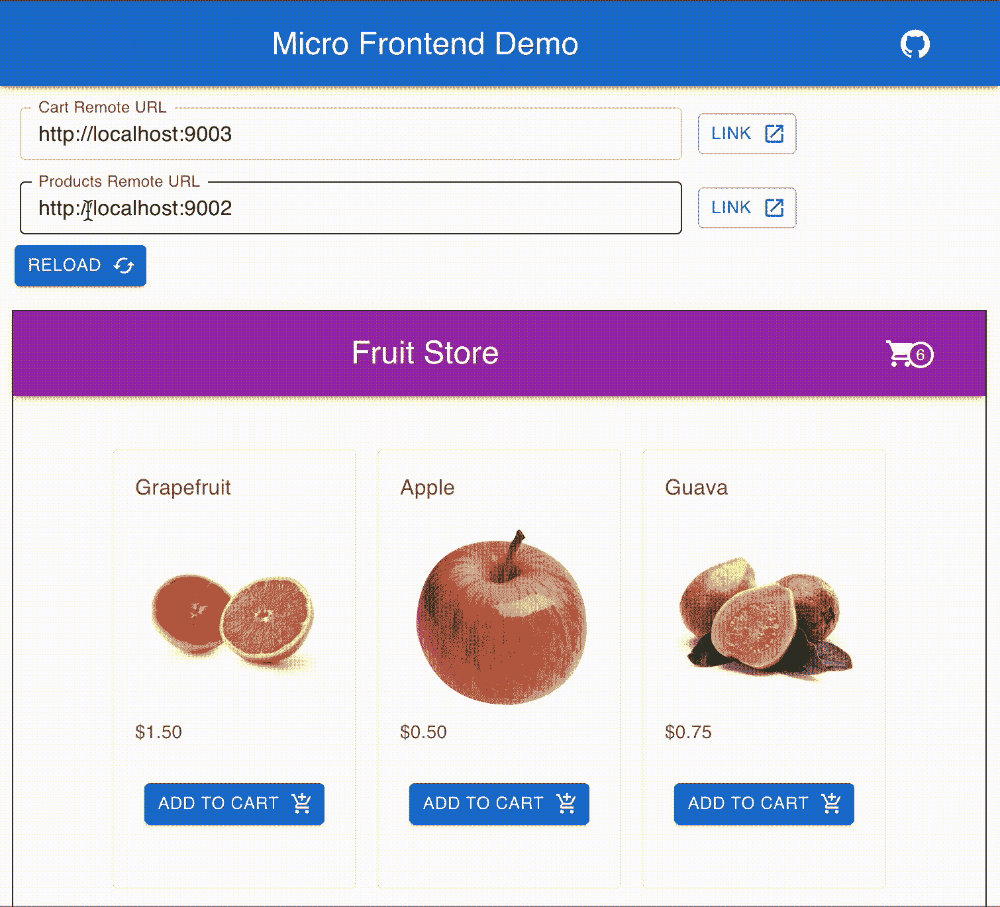

# 在 React 微前端中呈现动态远程容器

> 原文：<https://betterprogramming.pub/rendering-dynamic-remote-containers-in-a-react-micro-frontend-1dd97019824f>

## 通过模块联合安全呈现动态远程反应应用。

照片由[威廉·威廉](https://unsplash.com/@william07?utm_source=medium&utm_medium=referral)在 [Unsplash](https://unsplash.com?utm_source=medium&utm_medium=referral) 上拍摄

我们如何在 React 微前端应用中安全、高效、高性能地使用 Webpack Module Federation 的[动态远程容器](https://webpack.js.org/concepts/module-federation/#dynamic-remote-containers)？

让我们从我们想要的愿景开始:

是一个 React 组件，我们可以在整个应用程序中使用它来呈现远程应用程序中的模块。它封装了:

*   `ErrorBoundary`在不破坏我们的主机应用程序的情况下安全地呈现远程代码。
*   延迟加载可以根据需要解析远程代码，而不会阻塞应用程序的其他渲染。
*   获取和管理动态远程容器。

下面是实现过程:

我们懒惰地加载从`loadComponent()`返回的`Component`，并将其包装在`ErrorBoundary`周围，以防止整个应用程序在出错时崩溃。在获取远程应用程序时，我们使用一个`React.Suspense`来可选地呈现一个加载指示器。

是一个 React 钩子，管理我们的远程应用程序的 URL。对于这个例子来说，细节并不重要，但是您可以根据您的用例以许多不同的方式实现 URL 管理。关键是我们可以获得一个 URL，并将其传递给管理远程容器的`loadComponent`实用程序:

我们只加载远程应用程序一次，即使我们在整个应用程序中重用它的组件。我们获取的容器必须匹配模块联合所期望的`get/init`接口。如果我们的远程应用程序的 Webpack 配置使用模块联合插件，这种方式效果最好。

`fetchRemote()`处理获取远程应用程序的`remoteEntry.js`文件。首先，它创建一个新的脚本标记，然后将其注入 DOM 以获取远程 javascript:

瞧啊。我们在 React 微前端中有一个可靠地获取和呈现远程应用的机制。

现在让我们来看看它的运行情况:

在水果店微前端应用程序中的远程应用程序的不同 URL 之间切换

在这里看看一个活生生的例子:[https://micro-frontend-demo-main.vercel.app/](https://micro-frontend-demo-main.vercel.app/)

源代码:[链接](https://github.com/rautio/micro-frontend-demo/tree/dynamic-remote-react)

关于如何在 React 中使用模块联合的分步指南，请查看我的另一个故事:

 [## 如何在 React 中使用 Webpack 模块联邦

### 轻松构建微前端架构

better 编程. pub](/how-to-use-webpack-module-federation-in-react-70455086b2b0)