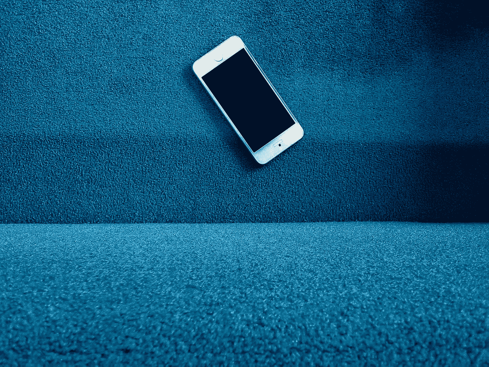
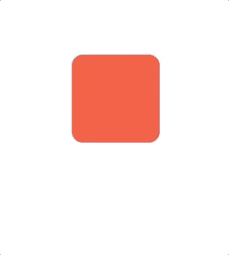
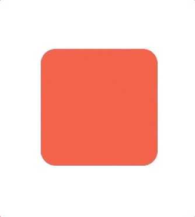
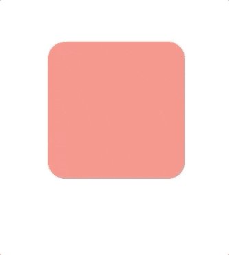
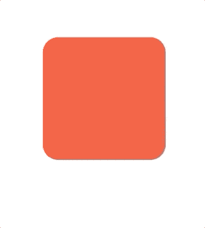
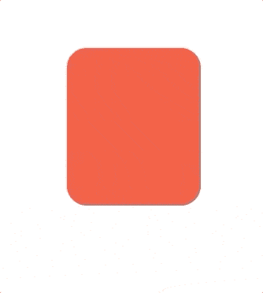

# 在 SwiftUI 中重复动画

> 原文：<https://betterprogramming.pub/repeating-animation-in-swiftui-8597e56a6df9>

## 构建可在您的应用中重复的漂亮动画



由 [Al Hakiim](https://unsplash.com/@alhakiim?utm_source=medium&utm_medium=referral) 在 [Unsplash](https://unsplash.com?utm_source=medium&utm_medium=referral) 上拍摄的照片。

由于苹果提供了如此多的支持，SwiftUI 中的动画比 UIKit 中的动画更容易实现。我想知道这将是一件好事还是坏事。不管怎样，我们需要利用所提供的东西，对吗？

在本教程中，您将学习如何在 SwiftUI 中执行重复动画。

重复动画基本上就是一遍又一遍重复的动画。不言自明。你可以把它想象成一个不断重复的 GIF。

# 先决条件

要学习本教程，您需要了解以下方面的一些基本知识:

*   迅速发生的
*   至少 Xcode 11

# 设置视图

您将在这里使用`RoundedRectangle`。你可以选择任何你喜欢的形状，但是现在，我们将使用`RoundedRectangle`。

要想抢先一步，这基本上是你需要的:一个`State`来知道它是否有动画效果。

```
@State private var isAnimating = false
```

还有一个`RoundedRectangle`嵌在一个`VStack`里面。这里使用的动画将缩放`RoundedRectangle`:

# 使用自动反转永远重复动画

这是一个不断重复的动画。通过简单地将下面的代码添加到`RoundedRectangle`中，您将获得一个永远重复的动画。

根据您的需要，您可以将持续时间调整为小于 1 的任何数字，以使动画快速移动，或者调整为大于 1 的任何数字，以减慢动画速度。

默认情况下，自动反转是真的。当它放大时，它会回到原来的位置:

```
.animation(Animation.linear(duration: 1).repeatForever())
```


# 永远重复动画，不自动反转

缩放后，自动反转不会反转到其原始位置。它会移回到原来的位置。这就产生了心跳的动画:

```
.animation(Animation.linear(duration: 1).repeatForever(autoreverses: false))
```



# 延迟动画

也许延迟动画将满足您的设计标准:

```
.animation(Animation.linear(duration: 1).delay(2))
```


# 延迟，然后永远重复动画

如果动画不断重复，延迟会好得多:

```
.animation(Animation.linear(duration: 1).repeatForever().delay(2))
```



# 不同修饰符

除了缩放，你甚至可以修改`opacity`:

```
.opacity(self.isAnimating ? 0.0 : 1)
```



或者`fill`通过改变颜色:

```
.fill(self.isAnimating ? Color.red : Color.green)
```



甚至是`frame`本身:

```
.frame(width: self.isAnimating ? 100 : 200, height: 200)
```



有很多方法可以通过使用不同的修改器来创建动画。和他们一起玩耍，拥抱你的创造力。