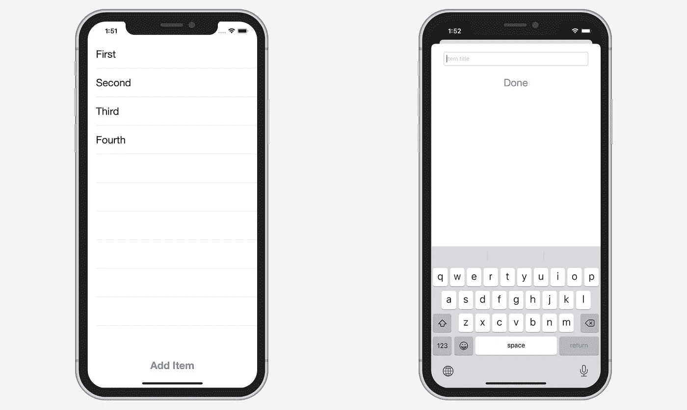

# 在 Swift 5 中将委托替换为组合

> 原文：<https://betterprogramming.pub/replace-delegation-with-combine-in-swift-5-e4c193655e7b>

## 摆脱这种冗长的协议一致性

[丹尼尔·罗梅罗](https://unsplash.com/@rmrdnl?utm_source=medium&utm_medium=referral)在 [Unsplash](https://unsplash.com?utm_source=medium&utm_medium=referral) 上的照片。

在本教程中，我们将学习如何实现一个通用的 iOS 设计模式，委托，使用[结合](https://developer.apple.com/documentation/combine)的发布者和订阅者。

我们将比较标准委托方法和使用组合的方法。

该项目的源代码可以在文章的底部找到。

# 入门指南

考虑以下两个屏幕:

在第一个屏幕上，我们简单地显示了一个项目列表。当我们点击“添加项目”按钮时，第二个屏幕出现，允许我们添加新项目。

实现它的传统方法如下:

## ItemsViewController

正如我们所看到的，在`addButtonTapped(sender:)`方法中，我们创建了`AddItemViewController`并将`self`分配给它的`delegate`属性。

我们按照`AddItemViewControllerDelegate`获得一个新增加的项目，并更新`tableView`。

## AddItemViewController

这里，在`doneButtonTapped(sender:)`方法中，我们运行委托的`didAddItem(item:)`并关闭视图控制器。

我们怎样才能让这变得更简单呢？如果我们不需要任何委托协议，可以简单地通过*观察*来寻找`ItemsViewController`中的新项目，那会怎么样？

欢迎联合出版公司的出版商和观察员。

# 使用联合收割机

让我们移除`AddItemViewControllerDelegate`并创建一个`String`类型的`PassthroughSubject`:

我们看到我们在`doneButtonTapped(sender:)`方法中向`newItem`主题发送了一个新值。

现在`AddItemViewController`有了一个有效的发布者，我们可以在`ItemsViewController`中订阅它:

让我们仔细看看我们是如何观察新物品的:

一旦一个新值被发送到`AddItemViewController`中的`newItem`主题，我们就更新`.handleEvents`操作符中的`tableView`。注意，为了防止我们的订阅被立即取消分配，我们创建了`subscriptions`属性来存储我们的订阅。

我们最终用 Combine 取代了传统的委托方法。

# 结论

从 GitHub 下载完成的项目:

 [## zafarivaev/replace delegation-组合

### 示例项目展示了一种在两个视图控制器之间进行对话的组合方法。为中等教程写的…

github.com](https://github.com/zafarivaev/ReplaceDelegation-Combine) 

想了解更多关于联合收割机的信息吗？查看我的其他相关文章:

 [## Swift Combine 中您应该知道的 7 个顺序运算符

### 第一个、最后一个、计数、包含、全部满足、减少等等

medium.com](https://medium.com/better-programming/7-sequential-operators-you-should-know-from-swift-combine-1775ce3c47c8)  [## 如何在 Swift 5 中创建自己的联合收割机订户

### 将逻辑封装在单独的类中

medium.com](https://medium.com/better-programming/how-to-create-your-own-combine-subscriber-in-swift-5-702b3f9c68c4)  [## 5 你应该知道的变换组合运算符

### 用清晰的例子

medium.com](https://medium.com/better-programming/5-transforming-combine-operators-you-should-know-4603fe112d74)  [## 你应该知道的 9 个过滤组合运算符

### 用清晰的例子

levelup.gitconnected.com](https://levelup.gitconnected.com/9-filtering-combine-operators-you-should-know-9c1ef2911352) 

感谢阅读！