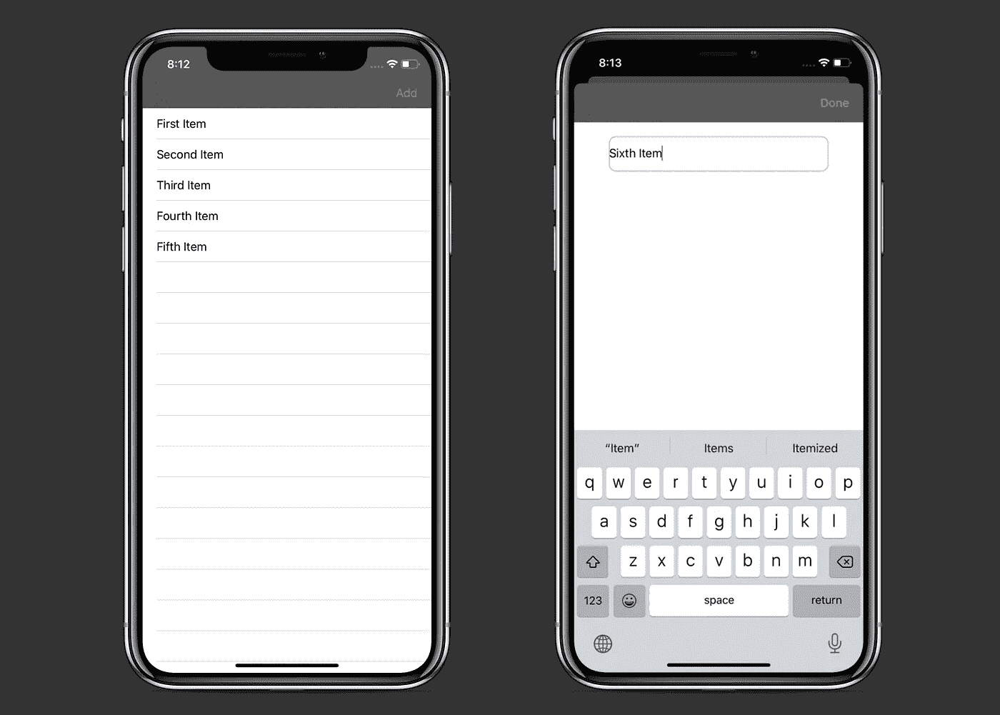

# 用 RxSwift 替换委托

> 原文：<https://betterprogramming.pub/replace-delegation-with-rxswift-32ad18d75140>

## 不再有协议一致性，只有简单的可观察性

由[赫克托·马丁内斯](https://unsplash.com/@oria_hector?utm_source=medium&utm_medium=referral)在 [Unsplash](https://unsplash.com?utm_source=medium&utm_medium=referral) 上拍摄的照片

在本教程中，我们将学习如何将数据从一个显示的视图控制器发送到另一个显示的视图控制器。我们将使用 RxSwift 的`Observable`代替标准的委托方式。

项目的[源代码可以在 Github 上获得。](https://github.com/zafarivaev/RxSwift-Delegation)

# 我们开始吧

首先，让我们看看呈现视图控制器。它有一个`tableView`，在每个相应的`UITableViewCell`中显示一个标题:

## ListViewController.swift

我们设置`tableView`的方式非常简单明了。如果不是，请随意访问我的另一篇文章，在那里我解释了如何以编程方式创建它。

仔细看看这一部分:

这段代码的作用如下:

*   我们使用`.debounce`方法来防止意外双击。
*   使用`.flatMapLatest`，我们呈现`AddItemViewController`并等待，直到它向`newTitle`属性发出一个`onNext`事件，这是一个`String`类型的`PublishSubject`。
*   使用`.do`，一旦发出`onNext`事件，我们就解除`AddItemViewController`。
*   最后，我们使用`.subscribe`订阅结果(新标题)，其中我们将全新的`title`附加到`ListViewController`的`titles`属性，并重新加载`tableView`。

让我们看看如何在`AddItemViewController`中向`newTitle`发出一个`onNext`事件:

## AddItemViewController.swift

我们需要做的就是创建类型为`PublishSubject<String>`的`newTitle`属性，订阅`doneButton`点击事件，并将`textField`的内容发布到`newTitle`主题。注意，当`textField`为空时，我们使用`.filter`忽略点击事件:

我们已经成功地用 RxSwift observables 替换了 delegation。

我们可以使用 [RxDataSources](https://github.com/RxSwiftCommunity/RxDataSources) 大大缩短`ListViewController`中与`tableView`相关的代码，您可以在本文中了解到这一点:

 [## 用 RxDataSources 实现 UITableView 和 UICollectionView

### 以及为什么您再也不会直接使用 UITableViewDataSource

medium.com](https://medium.com/better-programming/how-to-implement-uitableview-and-uicollectionview-with-rxdatasources-1afcd68729bf) 

要开始使用 RxSwift，并了解您可能想要学习它的原因，请查看以下资源:

 [## 我创建 iOS 应用程序 RxSwift 适合我吗？

### 很难从地图和过滤器跳到显示视图控制器或搜索栏，因为它们需要调用一个…

学院.领域. io](https://academy.realm.io/posts/tryswift-Marin-Todorov-I-create-iOS-apps-is-RxSwift-for-me/) 

非常感谢您的阅读！