# 用皮卡丘 Chrome 扩展替换一切

> 原文：<https://betterprogramming.pub/replace-everything-with-pikachu-chrome-extension-de40497c7f5a>

## 学习如何制作你的第一个 Chrome 扩展——第 1 部分

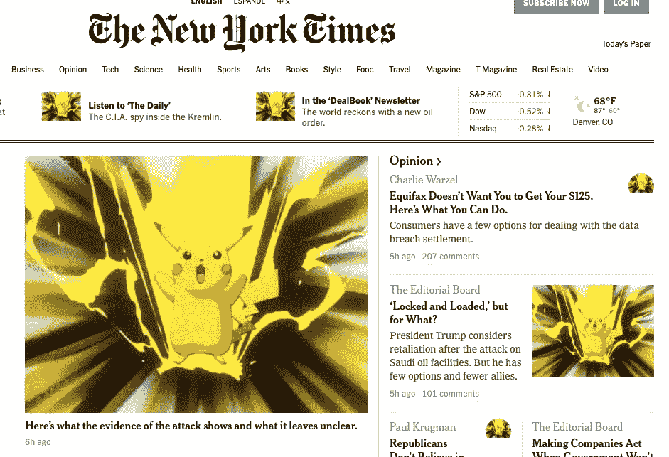

这个由两部分组成的系列是为那些想用浏览器扩展做些酷的东西的人写的。具体来说，任何人都希望在网上冲浪时抓住口袋妖怪。这是第一部分，这里是第二部分。

所以，各位。

十有八九，你使用浏览器扩展的唯一目的就是打广告。*也许*你有数独或省钱宝贝，但几乎可以肯定你有 AdBlock——更好浏览的卓越动力。

我的希望是，在这两篇文章结束时，你会受到启发，去创造同样无处不在和强大的东西。

在第一篇文章中，我们将学习浏览器扩展的基本原理，然后构建一个小项目，让我们可以将页面上的所有图像转换成皮卡丘。

在第 2 部分-[*Catch ' Em All Chrome Extension*](https://medium.com/@jdprince555/d51a8b6813fd)**-我们继续我们的主要项目:为我们访问的每个新网页提供可捕捉的口袋妖怪。**

**我将把我的代码写成一个 Google Chrome 扩展，但是要知道所有的浏览器扩展共享一种通用语言。**

**文章大纲:**

1.  **什么是扩展？**
2.  **为什么要延期？**
3.  **如何构建扩展？**
4.  **我们的第一个扩展(用皮卡丘代替一切)。**

**如果一切按计划进行，这就是我们在本文结束时的情况:**

**首先，基本面…**

# **什么是扩展？**

## **额外的技能**

**你的网络浏览器是你电脑上最强大的软件。它比你拥有的任何东西都知道得多，在点击一下鼠标就能得到的范围内，包含了大量的难以置信的具体数据。**

**然而，它足够谦虚地意识到它并不知道所有的事情。**

**它不知道你更喜欢你的[光标是披萨](https://chrome.google.com/webstore/detail/custom-cursor-for-chrome/ogdlpmhglpejoiomcodnpjnfgcpmgale)。当你在网上购物时，它也不知道如何帮你省下一大笔钱。它本身也不会屏蔽公司付钱让你的浏览器显示的广告(这将构成一种合理的利益冲突)。**

**取而代之的是，这些精确的、特定的技能被作为“扩展”提供**

**但那是什么？**

## **这只是代码**

**像网络上的所有东西一样，扩展只是代码。当你从一个网址浏览到另一个网址时，你正在给你的浏览器增加几行功能来增强它的能力。**

**也许你写的代码把页面上的一切都改成了小猫。也许它检测广告并阻止它们进入 DOM。也许它会根据你大概的地理位置把你的浏览器导航条变成天空的颜色(不知道是否存在，但会很酷，而且很有可能)。**

**在一个扩展中，几乎任何事情都是可能的，因为在它的核心，它只是 JavaScript、HTML 和 CSS，以及所有需要的功能。**

# **为什么是一件事？**

**延期符合所有人的最佳利益。**

## **为什么是我们的最佳利益？**

**它们符合我们的最佳利益，因为我们可以个性化和增强我们的网络体验。**

**我们可以指定视觉外观、玩游戏、即时访问特定的网络服务(例如谷歌翻译)、通过点击单词来查找单词(字典)…所有这些都无需离开当前页面。**

**太棒了。**

**作为一名开发人员，这真是太棒了，因为我可以写出自己想要的浏览体验，然后通过公开发布来测试它的价值。首先，他们基本上完全免费。无成本。所有利益。**

## **为什么 t *继承人*最有利益？**

**与此同时，他们也符合谷歌的最大利益，因为我们，用户，对我们的网络体验拥有更多的个人所有权，因此，更喜欢谷歌的产品。我们的幸福就是他们的幸福。**

**更不用说开源思想，它是网络精神和坚持不懈的基础，带来更大的创新和更好的*产品。谷歌绝不会在内部开发 chrome 网上商店的所有功能。***

**扩展还通过消除原本不是绝对必要的代码来为浏览器提供整体服务。**

**通过提供一个“附加浏览选项”库，浏览器减轻了它们的基线计算负荷，同时仍然为那些想要或需要它们的人提供所需的服务。**

**高效。**

# **如何编写扩展代码？**

**扩展带有一种不必要的令人生畏的复杂气氛。好像他们的代码有些“不同”。事实上，如果你用 JavaScript、HTML 和 CSS 制作了一个网页，那么你就已经赢得了 90%的胜利。**

**只有三个外来概念需要特别注意。把这些植入你的大脑，你就很棒:**

## **1.您正在处理三个独立的网页**

**我怎么强调这个事实都不为过。我的第一个发现！构建 Chrome 扩展的那一刻，我意识到我正在与三个独立的网页一起工作，这三个网页对彼此一无所知，除非我们指示它们进行交流。**

**这是给你的那几页，第一页你已经非常熟悉了:**

*   **我们的网页:**

**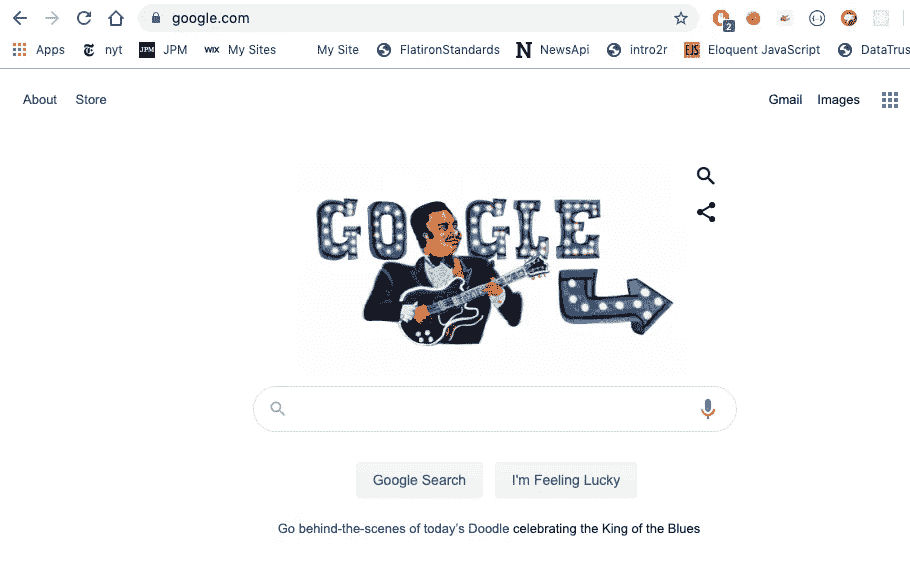**

**以上是一个正规的老网页。它很可能是亚马逊、Medium 或 Reddit。**

*   **我们的弹出窗口:**

**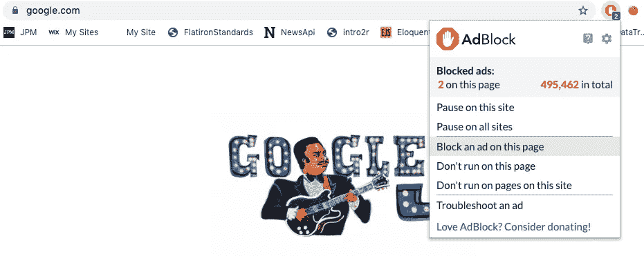**

**你看到的广告拦截弹出窗口是一个完整的网页。它不是谷歌主页的*部分*。它对 B.B .金一无所知。也不是任何其他网页的一部分。它是自己的实体，包含 HTML、CSS 和 JavaScript，完全独立运行。**

**当您到达一个新的 URL 时，浏览器会加载相应的 HTML、CSS 和 JavaScript，同样，当您单击 AdBlock 图标并看到一个小页面出现时，也会发生这种情况。您的浏览器将 HTML、CSS 和 JavaScript 加载到该弹出屏幕中。**

**不同之处在于，你的浏览器只是一直带着那些文件，而不是去*通过网络请求找到*那些文件。当你在浏览器中加载一个新的 Chrome 扩展时，代码总是可以立即使用的。**

**注意:AdBlock 当然知道当前的网页，否则它将无法完成它的工作。但它只知道网页和 B.B. King，因为有 JavaScript 文件指示这两个页面进行通信。**

**它们没有内在联系。我们迟早会对此有深刻的理解。现在，把他们之间的互动想象成隔着栅栏大喊大叫，而不是分享一个家。**

**最后一页是三页中最重要也是我最喜欢的一页:**

*   **我们的背景页面/脚本:**

****

**没有图片，因为它在背景中看不见。**

**我们使用这个页面来监控与浏览器本身相关的事件，例如，当我们的扩展的图标被按下或者检索和存储信息直到弹出窗口调用它。**

**(提示:我们将使用后台脚本检索口袋妖怪。)**

**如果你能意识到在一个扩展中有三个独立的网页在工作，你就差不多成功了。你不需要使用所有三个。如果你只需要其中一页就能完成工作，那当然可以。用那个。**

**在本系列的课程中，我们将学习并使用这三种方法。这意味着我们将在*三个独立的开发人员控制台上工作！***

**展示这是三个独立的网页的最好方法就是调出三个独立运行的控制台。这是一张动态静态照片:**

**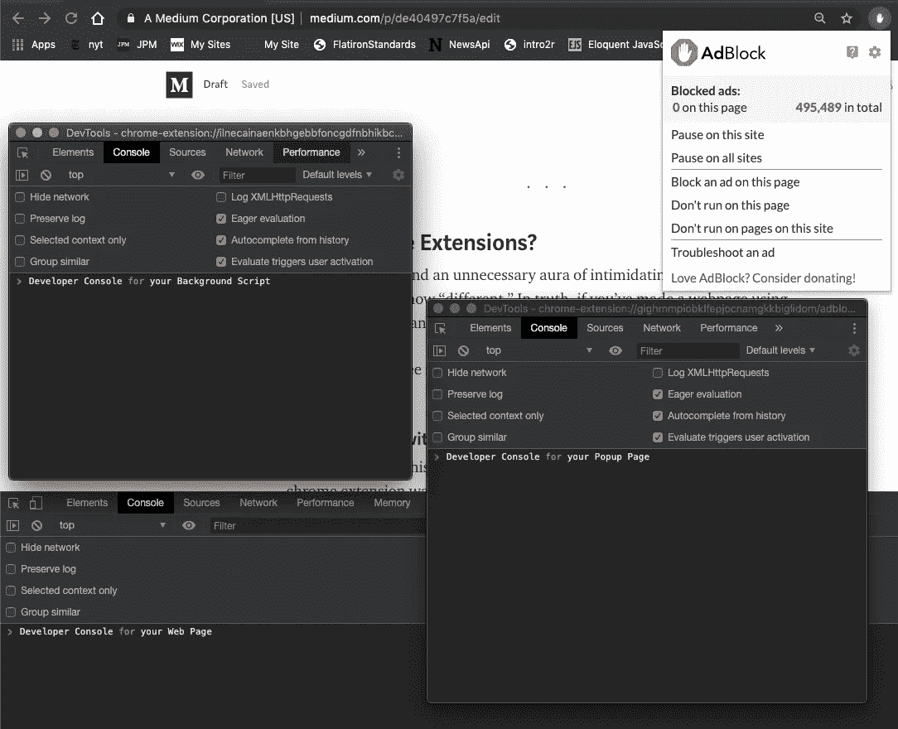**

**你看到的是三个不同的控制台，每个都完全不知道其他两个。左边是背景，右边是弹出窗口，下面是网页。**

**如果这让你觉得奇怪和混乱，那就让我感到安慰，因为它对我来说也是如此。但是，好消息是:你已经熬过了最艰难的部分。**

**剩下的就是肉汁了。**

## **2.您可以引导您的扩展网页之间的对话**

**同样，你的扩展的三个页面(网页，弹出窗口，背景)是独立拥有和操作的。为了让他们交流，你将使用 Chrome API。**

**让我们忽略这样一个事实:API 是所有编程中最糟糕的缩写(“应用程序编程接口”不是指什么？).**

**把短语 *Chrome API* 想成:“Chrome 提供给做扩展的人的功能”。或者说 *Chrome-Speak* ，这也是我在本文剩余部分中提到它的方式。**

**下面是一些 Chrome 语言的例子:**

```
chrome.tabs.sendMessage()
```

**翻译:**

**在`chrome`的扩展函数列表中，让我们抓住一个叫做`tabs`的函数，它属于当前窗口的标签。现在，从选项卡的根函数开始，让我们使用“发送”一条“消息”的函数。**

**这个函数说明的是，我们必须不怕麻烦地在我们的三个页面之间发送和接收信息。我们稍后将使用这个函数从我们的后台向我们的网页发送一条消息。**

**学习 Chrome-Speak 的最好工具是 Chrome 的[文档](https://developer.chrome.com/extensions/devguide)，这很好，但不太好。但它完成了任务。**

## **3.你需要一份清单**

**扩建的最后一个奇怪之处是你需要一个叫做清单的东西。 *Manifest* 又是一个比它需要的要长两倍又晦涩难懂的词。扩展清单是一个列表。**

**这份名单说明了两件事:**

*   **这是我的扩展中的关键文件。**
*   **以下是一些默认行为(例如，“我想要弹出页面”或“我不想要弹出页面”)。**

**就是这样。**

**您的浏览器要求您在您的扩展中包含一个清单，这样它就可以更好地组织它的思想并定位自己来接收和实现您的代码。**

**请记住，您的浏览器并没有为您在扩展中编写的任何代码做好准备。因此，你的浏览器处理好你的代码的唯一方法是告诉你的浏览器你的代码中有什么，以及你期望你的浏览器如何处理它。**

**在这个示例清单中，我们告诉浏览器绝对最小值:名称和版本号。**

```
{
  "name": "Everything Pikachu",
  "version": "1.0", 
  "manifest_version": 2 
}
```

**注意:必须写成`“manifest_version”: 2`。不知道为什么。顺其自然吧。**

**就浏览器所知，基于这个清单，我们的整个扩展只是一个名称和几个版本号。没有 JavaScript。没有 HTML。没有 CSS。**

**不管你的扩展文件夹中实际上有多少精彩的脚本，如果不先告诉你的浏览器它们的存在，它们都不会出现或运行。**

**让我们现在就开始吧:**

```
{
  "name": "Everything Pikachu",
  "version": "1.0", 
  "manifest_version": 2,
  "browser_action": {
    "default_popup": "popup.html"
  }
}
```

**很好。你的浏览器现在知道了一些以前没有的重要信息。**

**它知道你的扩展名为`“Everything Pikachu”`，这是这个扩展的第一个版本；当你点击扩展的图标时(你的浏览器认为它是一个`“browser_action”`，因为它是一个直接发生在浏览器中的动作)，你的扩展文件中名为`“popup.html”`的页面就会出现。**

**不言自明。只要我们让浏览器知道发生了什么，它就会遵从。**

**就要回顾的重要总体概念而言，就是这样。我们现在处于开始建设的有利位置。**

# **我们的第一个扩展(皮卡丘的一切)**

**目标:点击屏幕角落的 Pokeball 图标，立即可以看到当前网页的图片被皮卡丘所取代。**

**没有弹出窗口(我们将在下一篇文章中创建一个弹出窗口)。我们所有的工作将包括后台脚本和网页之间的通信。**

**注意:我假设您对 JavaScript 有基本的了解。如果没有也没关系。**

## **创建并加载扩展**

**首先在你的计算机上创建一个新目录，用你想要的扩展名命名，并在里面导航，这样我们就可以开始创建新文件了。**

```
$ mkdir everythingPikachu
$ cd everythingPikachu
```

**还记得我上面提到的我们需要的清单吗？让我们首先创建该文档，并添加上面的前几行。**

```
$ touch manifest.json
$ atom .// Within manifest.json =>{
  "name": "Everything Pikachu", 
  "version": "1.0", 
  "manifest_version": 2
}
```

**再次注意:如果清单版本值不是 2，Chrome 就不能加载我们的扩展。**

**您应该会看到这样的设置:**

**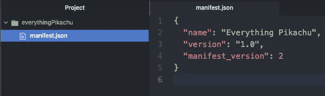**

**你猜怎么着？那是一种延伸。一个空的，但仍然是一个扩展。让我们把它载入系统。**

**在您的 URL 中导航至`chrome://extensions`…**

**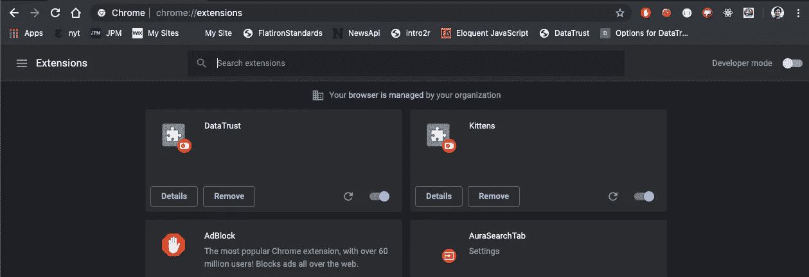**

**…确保*开发者模式*(右上角)已打开…**

****

**…点击 *load unpacked* 并选择您的 *everythingPikachu* 目录。如果您完成了这些操作，您应该会看到您的新扩展已经加载:**

****

**每当我们对清单和脚本进行修改时，我们都会返回到这个页面。**

**构建 Chrome 扩展的一个不幸的必要性是，您需要不断地将扩展重新上传到浏览器中(popup 的 CSS 和 HTML 除外)。好消息是只需要一秒钟。**

## **添加图标**

**返回到`everythingPikachu/`目录。让我们给目前令人厌烦的“E”扩展添加一个图标(见浏览器工具栏中新添加的灰色图标)。**

**寻找一个好的。png 你喜欢的在线(皮卡丘或者口袋球)并且确保它的尺寸是正方形的。如果你能找到一个透明的背景就更好了。我救了这个家伙。**

**您的文件结构应该如下所示:**

****

**记住，我们需要告诉货单所有的关键信息。让我们让它知道我们希望这个扑克球成为我们的图标…**

**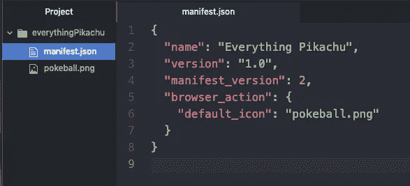**

**…返回到`chrome://extensions`并按下*重新加载*按钮。现在，您应该会在屏幕的一角看到以下内容:**

****

**看到那个球了吗？你站起来了。点击它。什么都没发生。但是这个小小的连锁反应让你知道 Chrome 已经准备好创造奇迹了。**

## **到处展示皮卡丘**

**到目前为止，我已经提到有三个页面，其中一个是网页。确实如此。在 Chrome-Speak 中，我们将该页面称为*内容*。网页包含了我们在浏览网页时所接触到的内容。所以这是有道理的。**

**如果我们想要访问这些内容，我们就创建一个所谓的`content_script`。事实上，您可以创建许多不同的脚本来操作网页内容。只要你声明他们都是`content_script`的，你就没事了。**

**现在让我们创建并声明一个。**

**从我们的`everythingPikachu/`目录…**

```
$ touch content.js// Within content.js => console.log('content script is running')
```

**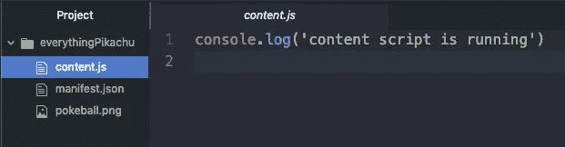**

**如果我们告诉 Chrome 正确的信息，我们应该看到*内容脚本正在我们的网页开发控制台中运行*,无论何时我们进入一个新的网页。也就是说，每当我们加入新内容时。**

**现在让我们在清单中做出这些断言:**

**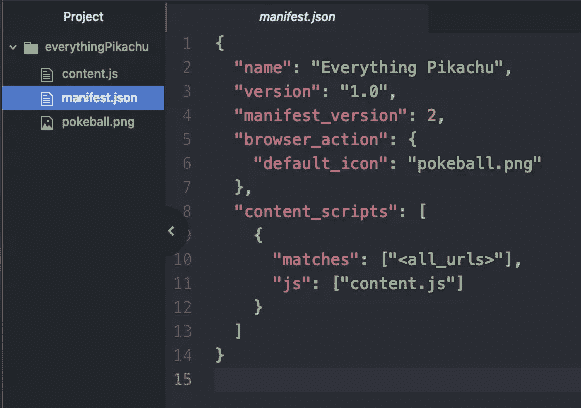**

**Chrome，这里是我们加载“任何”新网页(即“所有 URL”)时想要运行的 *content_scripts* 。第一个用“JavaScript”写的叫做`“content.js”`。帮我找到它。它在这个目录里。**

**确保在您的管理页面中点击*重新加载*(右下角):**

**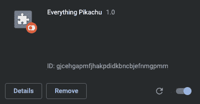**

**通过打开新选项卡或刷新当前选项卡来测试新脚本。打开开发人员控制台。您应该看到*内容脚本正在运行*已记录…**

**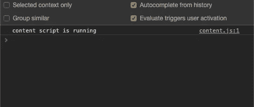**

**现在我们知道我们的扩展可以访问我们的网页，让我们开始操纵它们，把所有可用的图像都改成这张[皮卡丘](https://steemitimages.com/0x0/https://vignette.wikia.nocookie.net/pokemon/images/c/cd/PLEEI_Pikachu_Thunderbolt.png/revision/latest/scale-to-width-down/639?cb=20141209160531)在愤怒的电流中爆炸的图像。**

*   **`content.js`更新了…**

**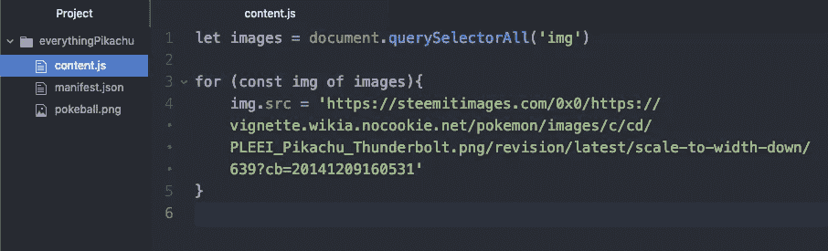**

**我们正在遍历网页的图像集合并改变它们的来源。**

**在扩展管理器页面中重新加载扩展，然后打开一个新网页。《纽约时报》是一个特别有趣的例子。**

****

**不错！您刚刚成功地创建了一个处理网页上图像的扩展。**

**现在，让我们练习我们的“内容脚本”(与网页相关联的脚本)和“后台脚本”之间的通信，后台脚本不断地在幕后运行，监听浏览器的动作。**

## **背景脚本**

**在我们做任何事之前猜猜我们要去哪里？回到我们无所不知的清单。**

**我们必须首先让 Chrome 知道我们正在添加一个后台脚本，然后再尝试向我们的文件添加一个新文档:**

**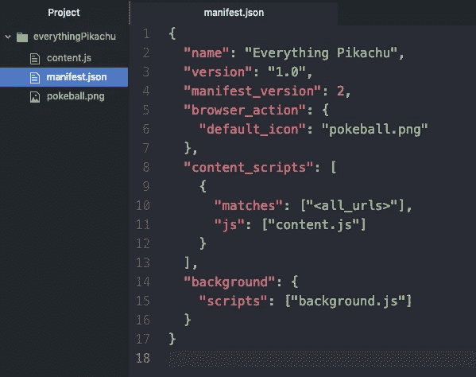**

**检查底部的条目`“background”`……它非常简单明了。我们正在给`“background”`添加一个名为`“background.js”`的`“script”`。**

**在管理控制台中重新加载扩展之前，让我们创建一个登录到控制台的`background.js`…**

```
$ touch background.js // Within everythingPikachu => console.log('background script is running')
```

**…在文件树中应该是这样的…**

**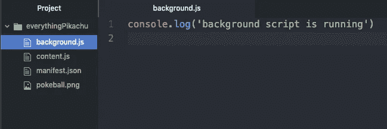**

**请确保重新加载您的扩展。对后台脚本的更改需要重新加载。**

**刷新你当前的网页或加载一个新的，然后打开开发者控制台…你应该看到…**

**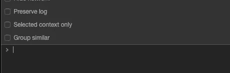**

**没什么！**

**记住，*后台脚本和后台页面在后台静默运行，独立于内容脚本和网页。***

**如果我们想要访问后台脚本的控制台日志，我们需要*检查后台页面*，这是在`chrome://extensions`提供给我们的一个选项:**

****

**点击*背景页面*，你会看到一个弹出窗口。该窗口是您专用的后台脚本开发控制台。在它的控制台中有几个字*后台脚本正在运行*:**

**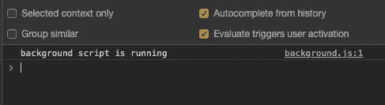**

**注意:如果您重新加载或访问新的网页，*后台脚本正在运行*将不会重新登录到控制台。**

**只要 Chrome 打开，后台脚本就会一直运行。只要 Chrome 是活动的，扩展也是激活的，它的后台脚本就会不停地运行，不断地监听正在发生的动作。**

**让我们测试一下，每当我们单击扩展图标时，后台脚本都会通过控制台日志记录`“pokeball icon was pressed”`来监听事件。这将需要一些受欢迎 Chrome 用户:**

**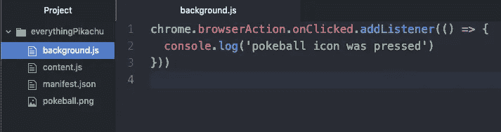**

**翻译:"`chrome`，"你有一堆"`browserActions`"可以发生，其中之一是我"点击"图标的事件…"听"当那发生的时候。当它出现时，将`‘pokeball icon was pressed’`记录到控制台。**

**记住，这个脚本属于不可见的后台页面，所以所有的控制台日志都会出现在我们刚刚重新发现的后台控制台中。**

**现在，如果我们单击屏幕顶部的图标 18 次，我们应该会看到相同的消息在后台的控制台中出现 18 次:**

**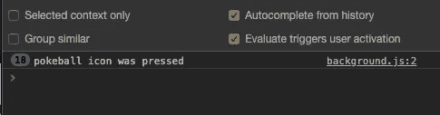**

**我们很接近了。**

**我们的目标是能够通过点击 Pokeball 图标来触发皮卡丘图像级联。我们已经独立完成了这两件事。现在，我们将它们组合成一系列的呼叫和响应。**

**沟通流程:**

1.  **后台脚本将检测到图标已被按下。**
2.  **按下时，它会提醒内容脚本。**
3.  **内容脚本将接收消息。**
4.  **如果消息正确，内容脚本将转换所有图像。**

# **把所有的放在一起**

**我们已经完成了第一点。让我们做第二点。**

**当我们按下图标时，不要在控制台记录文本，而是让后台脚本向当前选项卡发送一条消息(使用我们在*您引导您的扩展的网页之间的对话*一节中演示的相同 Chrome-Speak)。**

****

**Ln 1 翻译:**

**当图标被点击时，运行函数`tellContentScript`，该函数接受当前`tab`的一个参数(当前标签被 Chrome 隐式检索和传递)。**

**Ln 3+ translate: " `chrome`"给我所有的"标签页"和"发送消息"到当前标签页(我们知道是哪一个，因为当前的`tab`对象正通过`tellContentScript`函数隐式传递)。**

**注意:`sendMessage`默认情况下接受两个参数:一个 ID 和一个对象形式的消息。**

**此时，我们每次点击图标都会发送一条消息，但是什么也收不到。我们需要建立双方的沟通。**

**返回我们的`content.js`文件，准备 Chrome 从后台脚本接收消息。**

****

**Translate: " `chrome`"当您"运行"这个内容脚本时，"倾听"来自后台脚本的"消息"。收到后，运行功能`gotMessage`。**

**注意:`gotMessage`(或者任何您决定命名的函数)默认接受三个参数。**

**第一个是从后台脚本收到的消息，第二个是发送者的身份，第三个是一个回调函数，您可以使用它向后台脚本返回一个响应，也许是感谢它发出的警报。**

**在`gotMessage`中，我们检查收到的消息是否是我们期望的(“发送它，伙计”)——如果是，继续将所有图像更改为皮卡丘。**

**在我们测试我们的工作之前:从我们的扩展管理器页面重新加载扩展。**

**完成后，您应该能够这样做:**

**强大。使用这种格式，我们可以改变页面上的任何内容:文本、按钮、视频等。**

**这非常有趣，而且代码非常少。我们将在下一篇文章中改进我们的项目，创建一个弹出窗口，对其进行样式化，并使其与后台脚本进行交互，以模拟随机的口袋妖怪遭遇(使用有史以来最棒的 [PokeAPI](https://pokeapi.co/) ):**

**[*【捉迷藏】全铬扩展*](https://medium.com/@jdprince555/d51a8b6813fd)**

# **结论**

**如果你在这里停下来，我希望你已经学到了一些好的新技能，并且正在为你自己的浏览器扩展酝酿一些好的想法。**

## **开源代码库**

**本文项目的 GitHub repo 可从以下网址获得:**

**[皮卡丘](https://github.com/SwanHub/everythingPikachu)**

**快乐编码，**

**杰克逊**