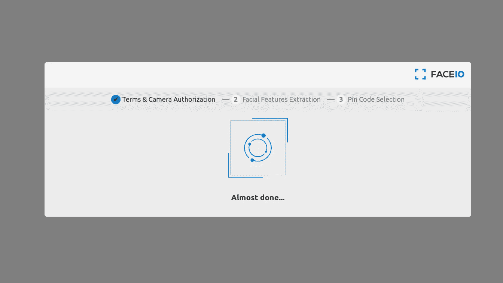
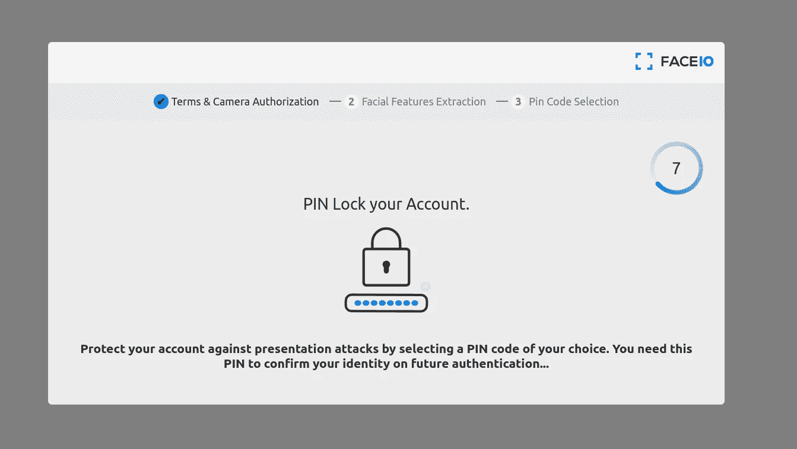
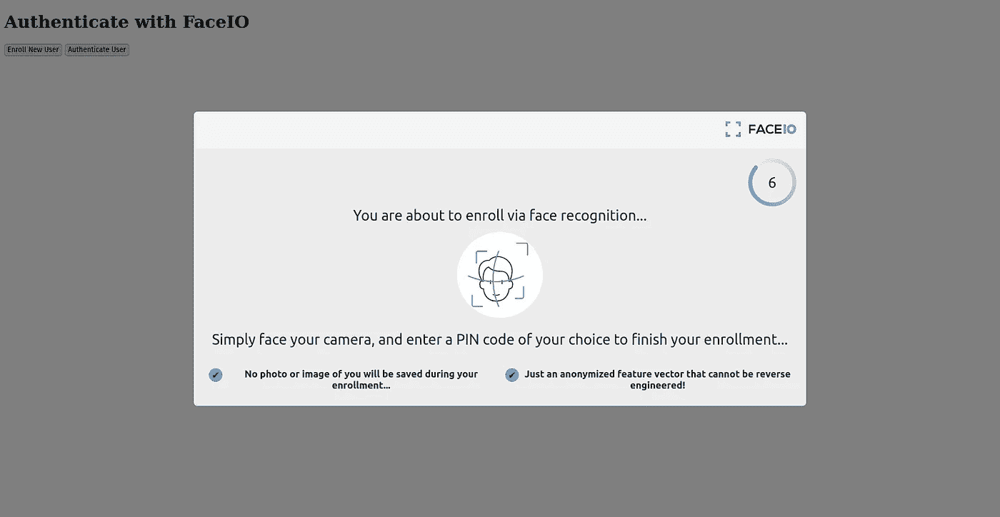

# 使用 React.js 和 TailwindCSS 实现面部识别身份验证

> 原文：<https://betterprogramming.pub/replace-your-auth-system-with-facial-recognition-using-reactjs-and-tailwindcss-9af4898ab5a2>

## 通过面部授权保护您的应用


认证是网站最关键的部分。如果处理不当，会导致无法想象的情况。随着最近的技术进步，许多不同的技术栈和框架被创建来构建最有效的 web 应用程序。但是开发人员很少关注改进身份验证系统和在 web 身份验证领域构建新的和创新的东西。

随着人工和机器学习技术的进步，人脸识别已经变得容易实现并且非常可靠。现在大多数智能手机都带有光学面部识别技术来解锁手机。但在 web 开发领域，我们看不到面部识别作为认证用户的一种手段。

在本文中，我将讨论我们传统身份验证系统的问题，如何使用[人脸识别](https://faceio.net/)解决这个问题，以及使用 reactjs 和 taiwindCSS 实现相同功能的详细分步指南。

# 当前认证系统的问题

目前，基于电子邮件密码的认证是网络上最流行的。但是这个系统的主要缺点是要记住你注册的每个网站的唯一密码。如果您忘记了密码，您需要您的电子邮件地址来重置密码。如果你失去了对电子邮件的控制，几乎不可能恢复你的帐户。

为了解决所有这些问题，oAuth 应运而生。OAuth 是一种使用 OAuth 提供商注册网站的协议。你可能会在各种网站上看到使用谷歌、脸书、GitHub 等登录的选项。这是 oAuth 的一个例子。在我们的系统中，作为一个用户，你只需要维护一个账户，并允许使用其他网站上的信息。作为开发人员，您必须相信 OAuth 提供者能够提供正确的信息。

现在无密码签到或者魔链认证很流行。在这个系统中，你需要在网站上输入你的电子邮件地址。然后，您会收到一封包含登录链接的电子邮件。如果您浏览此链接，您将通过验证并在相应的网站上注册。这是一个非常容易登录的系统，你不需要记住密码。

在上述所有例子中，你都可以找到一个熟悉的模式。所有这些认证过程都需要您的电子邮件。电子邮件在上述所有系统中是如此重要，以至于如果你不知何故失去了对它的控制，你就无法保持对你所有账户的控制。这是认证系统中的一个主要问题。但是正如问题有解决方案一样，这个问题也有一些解决方案。让我们在下一节讨论它。

# 人脸认证如何解决这个问题

为了从认证堆栈中删除电子邮件，我们有一些选项，如指纹认证和面部识别。

指纹认证的问题在于它需要专门的硬件来工作。大多数计算机硬件都没有默认的指纹识别器。由于 web 上没有与设备指纹读取器交互的本地标准化 API，指纹认证在不久的将来是可行的。

由于人工智能和机器学习的快速进步，面部识别不是很难。开源机器学习库的存在，让开发者更容易快速为其 web 应用开发函数 AI。

但这需要之前接触过一些机器学习。如果你没有这种经验，你可以使用机器学习 SaaS 产品，如 faceIO，轻松地为你的网站创建一个面部识别认证系统。

在本教程中，我们将使用 [FaceIO 库](https://faceio.net/getting-started)来演示我们的 web 应用程序中的人脸认证。创建一个 FaceIO 的[免费账户。](https://console.faceio.net/)

# 使用 tailwind CSS 创建 Rectjs 项目

在本教程中，我们将使用 vite 来创建 ReactJs 项目。打开您的终端并运行以下命令，使用 vite 搭建 React 项目。

```
npm create vite@latest my-project — — template react
```

现在按照终端提示来搭建您的项目。完成这一步后，在您喜欢的代码编辑器中打开这个项目。项目结构应该是这样的。

```
.
├── index.html
├── package.json
├── package-lock.json
├── public
│ └── vite.svg
├── src
│ ├── App.css
│ ├── App.jsx
│ ├── assets
│ │ └── react.svg
│ └── main.jsx
└── vite.config.js
```

现在，要在您的 vite 项目中安装 tailwind CSS，请仔细遵循这些步骤。

```
npm install -D tailwindcss postcss autoprefixer
npx tailwindcss init -p
```

现在打开您的`tailwind.config.cjs`文件并添加您的项目源路径。

在您的`src/App.css`文件中，添加 tailwind CSS 指令。

现在，您已经在 React 和 vite 项目中成功安装了 tailwind CSS。让我们在下一节中关注如何在我们的项目中集成人脸认证。

# 在 React 应用程序中添加 FaceIO auth

FaceIO 的伟大之处在于它们提供了一个非常易用的 Javascript 库。这个库有两个主要功能`enroll`和`authenticate`。但是在讨论这些函数之前，让我们将 FaceIO 库链接到 react 应用程序。

打开项目中的`index.html`文件，并将 FaceIO CDN 链接到您的项目。

成功链接 FaceIO CDN 后，打开`App.jsx`文件，删除`App`组件内的所有样板代码。为了初始化我们的 FaceIO 库，我们添加了一个`useEffect` react 钩子。当组件被初始化时，这个钩子中的代码只运行一次。

你可以看到我们在实例化`faceIO`对象时使用了一个 ID 作为参数。当你注册一个 faceIO 账户时，你可以在`faceIO`控制台中访问这些 id。

现在所有的设置都完成了，让我们把重点放在使用`FaceIO`认证用户上。

## 使用 FaceIO 注册新用户

FaceIO 提供了一个非常简单的界面来注册新用户。我们使用**注册**功能注册一个新用户。由于 FaceIO 需要您的网络摄像头许可，请在提示时接受许可对话框。

注册函数有两个别名。您可以使用`register`和`record`功能替代`enroll`。

当您在浏览器中运行这个函数时，它会启动 faceIO 小部件。首先，需要用户同意扫描他们的面部，然后提示接受摄像头许可。如果满足了所有要求，faceIO widget 会打开您的相机并扫描您的面部。它将你的面部数据转换成一个浮点数数组。



收集面部数据后，faceIO 会被提示输入 PIN 码。此 PIN 码用于区分面部极其相似的用户。当事情变糟时，你会认为这是一个双因素认证。



让我们在 react 应用程序中添加 faceIO enroll。我们保持应用程序非常简单。因此，让我们创建一个名为`**register**`的按钮，当有人点击这个按钮时，我们运行`**enroll**`函数来注册一个新用户。

在添加了注册按钮和按钮 click 上的 javascript 处理程序后，`App.jsx`文件看起来像这样。

在上面的代码中，您可以看到我将代码包装在一个 try-catch 块中。如果出现问题，FaceIO 会抛出一些错误。错误消息非常有用，您可以在官方文档中获得完整的错误代码列表。

注册函数只接受可选的参数对象。这些可选参数接受属性来配置用户注册过程。在上面的例子中，我在注册函数的可选参数中定义了`locale`和`payload`属性。`locale`属性代表用户的默认交互语言。在我们的例子中，我们提供了`auto`来自动检测语言。

在`payload`中，您可以添加任何对您的用户唯一的 JSON 可序列化值。在这个例子中，我们添加了用户的电子邮件作为有效负载。以后无论何时使用登录，我们都可以从 FaceIO 返回对象中访问电子邮件有效负载。

FaceIO 中的注册函数返回一个承诺。因此，在这个例子中，我使用 javascript 的 async/await 特性。如果不喜欢 async/await，可以用`.then`代替。

当承诺完成时，它产生一个`**userInfo**`对象。通过使用对象，我们可以访问用户的唯一面部 ID。除此之外，userInfo 对象还提供了一个`**details**`属性，从中我们可以得到用户的大概年龄和性别。

# 使用 FaceIO 验证注册用户

成功注册用户后，就该对注册用户进行身份验证了。为此，Pixlab 提供了`authenticate`函数。这个`authenticate`函数也有 3 个别名，`auth`、`recognize`和`identify`。

认证功能只需要用户识别单个帧。因此，它对带宽非常友好。认证成功后，它返回一个`userData`对象。这个`userData`包含您在注册中指定的有效载荷和用户的面部。



在我们的`App.jsx`文件中，我们制作了另一个名为**登录**的按钮。当用户点击这个按钮时，它调用`handleLogIn`助手函数。该函数最终负责调用“身份验证”函数。让我们看看所有这些代码。

在`handleLogIn`函数中，如果认证失败，我们使用 try-catch 块来捕捉错误。当`authenticate`函数返回一个承诺时，我们使用了异步 await 方法来获取承诺完成时的值。

`authentication`函数接受一些可选参数来定制 faceIO 身份验证小部件。您主要可以使用权限超时、`idleTimeout`和`replyTimeout`参数自定义超时。编译后，我们的 web 应用程序应该是这样的。

# FaceIO REST API

在 FaceIO 中创建您的帐户时，您将被分配一个 API 密钥。您可以在 faceIO 控制台中找到这个 API 密钥。通过使用这个 API 键，您可以使用 [RESTful API](https://faceio.net/rest-api) 与 FaceIO 后端进行交互。REST API 的基本 URL 是“https://api.faceio.net/”。

目前，FaceIO REST API 支持 3 个函数。删除用户的面部，将附加有效载荷设置为 faceID，以及为 faceID 设置 Pin 码。切记从安全的环境或后端服务器使用这些 API 端点。不要从客户端运行这些 API。

## 删除 faceID

要删除 faceID，我们必须向[https://api.faceio.net/deletefacialid](https://api.faceio.net/deletefacialid)端点发出 get 请求。这个端点有两个请求参数。一个是接受 API 键的**键**，另一个是接受想要删除的 faceID 的 **fid** 。

```
curl — request GET \— url '[https://api.faceio.net/deletefacialid?key=APIkey&fid=FaceID'](https://api.faceio.net/deletefacialid?key=APIkey&fid=FaceID')
```

作为响应，FaceIO 返回一个状态代码和一个“payload”布尔值，该值表明数据和有效载荷是否被成功删除。

## 将有效负载设置为 FaceID

通过使用这个 API 端点，您可以为已经存在的 FaceID 设置一个有效负载。请求的网址是[https://api.faceio.net/setfacialidpayload](https://api.faceio.net/setfacialidpayload)。此端点需要 3 个请求参数。`key`是 API 键，`fid`是你想要附加有效载荷的面部 ID，`payload`是定义你的定制有效载荷数据。

```
curl — request POST \— url '[https://api.faceio.net/setfacialidpayload?key=APIkey&fid=FaceID&payload=%22name%3AHrishikesh%22'](https://api.faceio.net/setfacialidpayload?key=APIkey&fid=FaceID&payload=%22name%3AHrishikesh%22')
```

作为响应，FaceIO 返回一个状态代码和一个“payload”布尔值，该值表明数据和有效载荷是否被成功删除。

## 将密码设置为 FaceID

在 faceID 注册部分，我们讨论了使用密码来区分两张非常相似的脸的必要性。如果你想修改他们的密码，你可以很容易地这样做，通过使用[https://api.faceio.net/setfacialidpincode](https://api.faceio.net/setfacialidpincode`)端点。

像前面的端点一样，这也需要 3 个参数。一个是 API 密钥，另一个是 faceID，最后一个是 PIN。对端点的 curl 请求如下。

```
curl — request POST \— url '[https://api.faceio.net/setfacialidpincode?key=APIkey&fid=FaceID&pin=12345'](https://api.faceio.net/setfacialidpincode?key=APIkey&fid=FaceID&pin=12345')
```

# FaceIO Webhooks

Webhooks 被用作服务器之间的通信方法。FaceIO 提供了丰富的 webhook 体验，可以用来更新后端服务器。FaceIO 在 3 个事件上发送一个 [webhook](https://faceio.net/webhooks) 。`enroll`当一个新用户注册到您的系统中时，`auth`当一个已经注册的用户使用 faceIO 进行认证时，以及`deletion`当一个 faceID 使用我们上面讨论过的 REST API 被删除时。

每个 webhook 请求都是来自 faceIO 服务器和 JSON 对象的 POST 请求。请求正文如下所示。

每个字段的名称对于它包含什么值是不言自明的。

按照以下步骤用 faceIO 服务器配置 webhook。

1.  首先通过 FACEIO 控制台连接到您的帐户。
2.  在控制台主视图上，访问应用程序管理器。
3.  选择要为其设置 webhooks 的目标应用程序。
4.  一旦选择了目标应用程序。输入用于接收事件的 Webhook 端点 URL，并保存修改。
5.  你都准备好了。一旦事件被触发，FACEIO 将向您配置的 URL 发出 HTTP POST 请求。

# 结论

这是关于将面部认证添加到 React 应用程序的深入指南。如果你喜欢这个指南，想了解更多关于 faceIO 的信息，请访问官方[文档页面](https://faceio.net/dev-guides)。如果你有任何问题，你也可以查看他们的 [FAQ 页面](https://faceio.net/faq)。如果你喜欢我的文章，你可以在[我的网站](https://hrishikeshpathak.com/blog)上阅读更多内容，我在 Twitter 上的名字是[@ hriskshpathak](https://twitter.com/hrishikshpathak)。