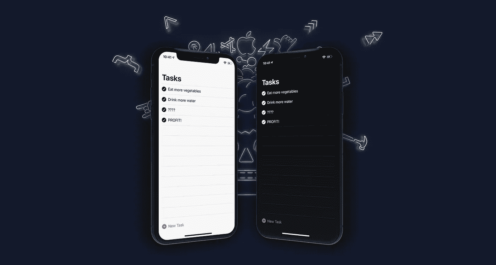
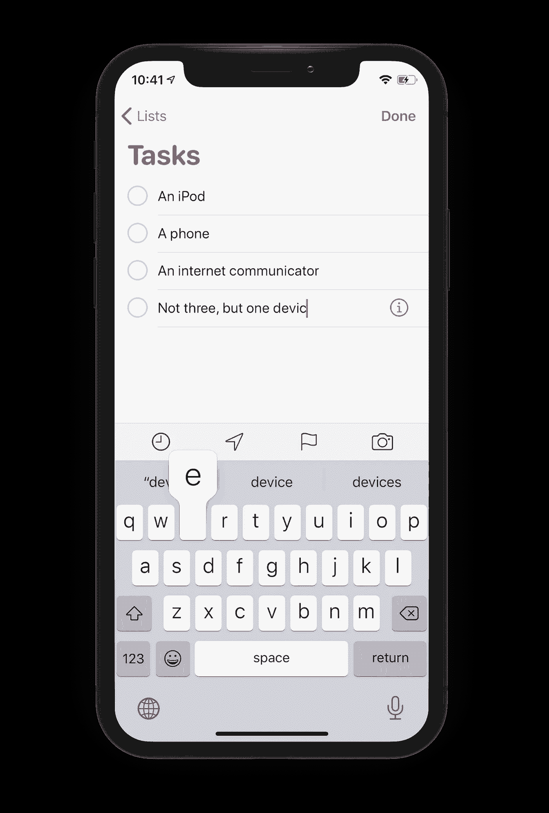
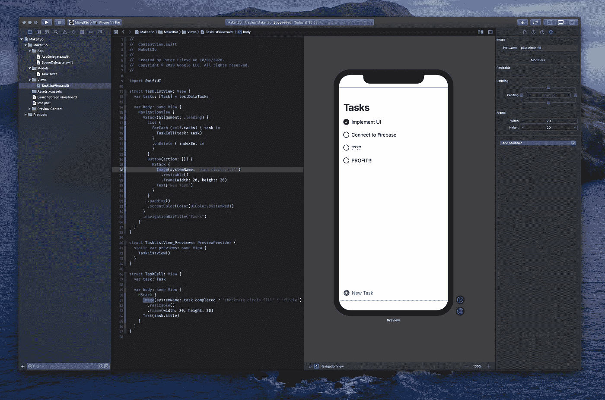
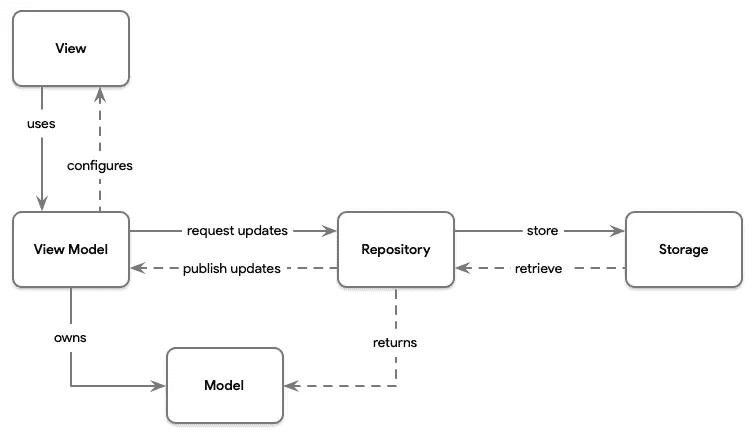

# 使用 SwiftUI、Combine 和 Firebase 构建待办事项应用程序

> 原文：<https://betterprogramming.pub/replicating-the-ios-reminders-app-part1-44211a7b7029>

## 功能反应式编程

## 复制 iOS 提醒应用程序，第 1 部分

在 WWDC 2019 上，苹果公司宣布了其声明式 UI 框架 SwiftUI。到目前为止，你们中的大多数人可能已经花时间体验了 SwiftUI，并了解了它的一般工作原理。

在这个系列中，我想改变一下思路，看看我们在使用 SwiftUI 和其他一些技术编写真实的 iOS 应用程序方面能走多远。

为了更容易看出 SwiftUI 的优势(和不足)，让我们复制一个大家都知道的应用程序:iOS 提醒应用程序。

现在，如果你和我一样，你可能很少使用提醒应用程序，而是使用 App Store 中流行的待办事项应用程序。

我惊喜地发现，iOS 提醒应用程序已经赶上了竞争对手，并成为一个功能更加完整和强大的生产力应用程序。

为了简单起见，我们将把重点放在核心功能上，并将在以后的文章中逐渐添加更多的特性。

因为还有很多内容要介绍，所以我决定将这个项目分成一系列文章，这些文章互为基础。下面是我们将要构建的内容的快速概述:

*   在本系列的第 1 部分(您现在正在阅读的部分)中，我们将关注使用 SwiftUI 构建 UI，使用一个简单的数据模型。
*   在第 2 部分中，我们将把应用程序连接到 [Firebase](https://firebase.google.com/) ，并将用户的任务与[云 Firestore](https://firebase.google.com/docs/firestore) 同步。
*   在第 3 部分中，我们将实现与 Apple 的登录，将应用程序变成一个真正的多用户应用程序。

如果你觉得不错，那我们就开始吧！

# 入门指南

应用程序的源代码可以在这个 GitHub 库中找到，应用程序的各个阶段都有相应的标签。

如果您想继续，请随意查看存储库——我会指出我们在哪个分支/标签，这样您就可以将您的实现与我的进行比较。

首先，克隆[库](https://github.com/peterfriese/MakeItSo)，并查看签出的文件夹:

*   `starter`文件夹包含一个已经清理了一点的单视图应用程序，以及一个好看的应用程序图标。
*   `final`文件夹包含项目的完成版本，以及所有中间步骤。

您可以在起始文件夹中编写自己的实现，或者在最终文件夹中检查各个检查点。

# 数据模型

如果你正在跟进，检查标签`[stage_1/data-model/start](https://github.com/peterfriese/MakeItSo/tree/stage_1/data_model/start)`并打开`final`文件夹中的`MakeItSo.xcodeproj`。

如上所述，我们将特意实现简化版的 iOS 提醒应用程序，以便能够更好地关注核心概念。例如，我们的实现将只支持一个任务列表(iOS 提醒应用程序支持多个列表并在它们之间导航)。

因此，我们的数据模型非常简单:

每个任务都有:

*   标题(即指示用户需要做什么)。
*   优先级(高、中、低)。
*   指示任务是否完成的标志。

以下是我们的数据模型的代码:

有几点需要注意:

*   我们制作了`Task`结构`Identifiable`，还添加了一个`id`属性。这是必要的，因为我们将在 SwiftUI `List`中显示任务，这要求它的项目是`Identifiable`。使用`UUID`确保每个任务将获得一个唯一的标识符。
*   我们用测试数据定义了一个集合，我们可以用它来驱动 UI 的开发，直到我们真正连接到一个数据源。

# 构建任务列表视图

如果您正在跟进，检查标签`[stage_1/build_task_list/start](https://github.com/peterfriese/MakeItSo/tree/stage_1/build_task_list/start)`并打开`final`文件夹中的`MakeItSo.xcodeproj`。

在我们开始自己构建任务列表视图之前，让我们来看看 iOS 提醒应用程序。查看主列表视图界面，我们可以看到三个主要的 UI 元素:

1.  列表标题(本例中为“任务”)。
2.  列表视图。
3.  添加新任务的按钮。

原始 iOS 提醒应用程序的用户界面元素

您还可以通过点击最后一个项目下方的空白区域来添加新项目，这将向列表视图添加一个新的空行，光标在文本字段中等待您，准备接收您的新任务。

同样的在线编辑 UX 也可以用来修改条目:点击一个任务，开始输入进行修改。这个 UX 模式非常简洁，因为它允许用户在列表中的其他项目的上下文中看到他们当前正在编辑的项目:

编辑模式下的 iOS 提醒应用程序

用 SwiftUI 重新创建这个布局或多或少很简单——让我们看看它是如何完成的:

您会注意到，我们正在使用数据模型中的测试任务(1 ),由于 Xcode 的预览画布，我们在构建数据模型时可以在 UI 中看到一些数据。

让我们看看代码的几个有趣的方面:

*   整个视图被包装在一个`NavigationView` (2)中，这让我们可以使用`.navigationBarTitle()`设置视图标题。
*   我们没有用`List(self.tasks)`遍历我们的任务集合，而是使用了嵌套的`ForEach` (3)，原因是`.onDelete()`只在`ForEach`可用。
*   说到这里，`onDelete()` (4)启用列表上的*删除模式*，让用户在单元格上向左滑动以显示删除操作。不幸的是，SwiftUI(还)不支持任何其他上下文动作。我的猜测是，苹果想用一些额外的时间来完善 DSL，为列表添加上下文动作。
*   每个任务的单元格已经被提取到一个单独的视图中，`TaskCell` (5)，这使得调用点(6)更加清晰。
*   用于添加新任务的按钮(7)由两个子视图组成:加号图像(8)和文本“新任务”(9)。这是 SwiftUI 如何推广可组合 UI 的一个很好的例子。
*   为了确保复选框(即 [SF 符号](https://developer.apple.com/design/human-interface-guidelines/sf-symbols/)图标)和加号提供足够大的触摸目标，我们将图标的大小调整为 20 x 20 像素(11)和(12)。
*   最后，我们添加一些填充，并用强调色将按钮染成红色(13)。使用系统颜色确保这在亮暗模式下都很棒(阅读[这篇文章](https://developer.apple.com/documentation/xcode/supporting_dark_mode_in_your_interface)了解更多关于如何在你的应用中实现暗模式的背景)。我想不出一种方法来给导航条标题上色——如果你知道如何做到这一点，请在回购上提交一个 pull 请求！

至此，我们已经有了 UI 的基本版本。

和往常一样，你可以在模拟器或物理设备上运行应用程序，以查看它的运行情况，但由于 SwiftUI 的预览，我们不需要这样做！

事实上，由于我们的测试数据和 Xcode 的 SwiftUI 预览画布(这相当拗口)，我能够在构建 UI 时享受预览:

Xcode 预览画布中完成的用户界面

要快速打开预览窗格，请按下`⌥ + ⌘ + ↩`。如果预览显示“自动预览更新暂停”，按`⌥ + ⌘ + P`恢复。更多 Xcode 快捷键，参见 [*更高效编码的基本 Xcode 快捷键*](https://peterfriese.dev/xcode-shortcuts/) 。

当运行该应用程序(或使用实时预览)时，您会注意到它的功能还不是很好——例如，当您试图添加一个新任务时，什么都不会发生，甚至点击其中一个复选框也不会将该任务标记为已完成。

所以，现在让我们改变这种情况，实现我们应用程序的业务逻辑！

# 应用架构

在我们继续深入之前，让我们花点时间考虑一下我们的应用程序的架构。虽然当然可以构建包含业务逻辑的 SwiftUI 视图，但是这种方法很容易导致代码不仅难以阅读，而且几乎不可测试。

幸运的是，SwiftUI 的声明性本质使其适合于功能性反应方法，这种方法由 MVVM(模型、视图、视图模型)架构支持，将产生易于阅读、可测试性好的代码。

为了更好地概述 SwiftUI 的不同架构模式，包括对 MVVM 的深入讨论，请查看 [*SwiftUI 架构:模型视图、Redux 和 MVVM*](https://quickbirdstudios.com/blog/swiftui-architecture-redux-mvvm/) 。

除了我们的应用程序的视图和模型之外，我们还需要一些视图模型和存储库:

*   视图负责显示数据和处理用户交互。
*   视图模型负责向视图提供数据，并将用户交互转化为对数据存储库的更新请求。
*   模型保存应用程序操作的数据。它们在视图模型和存储库之间来回传递。
*   存储库提供了数据层的抽象，使得将本地存储替换为基于云的存储变得容易。

从下图中可以看出上述所有因素之间的关系:

SwiftUI 的 MVVM(模型、视图、视图模型)架构

# 实现视图模型

如果你正在跟随，检查标签`[stage_2/implement_view_models/start](https://github.com/peterfriese/MakeItSo/tree/stage_2/implement_view_models/start)`并打开`final`文件夹中的`MakeItSo.xcodeproj`。

MVVM 呼吁在视图和视图模型之间建立 1:1 的关系:每个视图都有一个视图模型，所有的 UI 元素都绑定到这个模型，这个模型将处理在这个特定屏幕上发生的任何用户交互。

当我告诉您我们将需要为我们的应用程序实现两个不同的视图模型时，一开始可能会有点惊讶:`TaskListViewModel`和`TaskCellViewModel`。

这是因为列表视图中的每一行都是各自底层模型元素的编辑器视图。因此，`TaskListViewModel`是列表本身的视图模型，而`TaskCellViewModel`是单个列表视图行(或者说，单元格)的视图模型。

所有的空谈都是廉价的，我们来看一些代码吧！

这里是`TaskListViewModel`:

这里是`TaskCellViewModel`:

一些注意事项:

*   两个视图模型都实现了`ObservableObject` (1)，因此我们可以将它们绑定到 SwiftUI 元素，并确保 UI 对视图模型的任何更改做出反应。这就是 SwiftUI 的超能力:无需手动将您的 UI 与底层数据模型同步。我不能夸大这方面的重要性。
*   在后面的步骤中，我们将连接到本地存储(然后，连接到 Firestore)，但是目前，我们将使用在`testDataTasks` (2)中定义的测试数据。使用`map()`方法，我们将这个集合中的`Task`模型转换成`TaskCellViewModel` s。包含这些转换后的视图模型的数组`taskCellViewModels` (3)被注释为`@Published`，这允许我们将`TaskListView`上的`List`绑定到它。
*   为了进一步帮助将 UI 从底层模型中分离出来，我们还添加了两种添加和删除任务的方法— `addTask` (5)和`removeTask` (4)。
*   `TaskListView`中的单个行由`TaskCellViewModels`支持。由于 SwiftUI 要求`List`视图中的项目是`Identifiable`，我们必须实现这个协议(6)并提供一个`id`属性。每当`task`属性改变时，`id`属性的值将被更新。为了实现这一点，我们将`task`属性标注为`@Published`，并在构造函数中订阅它(7)。
*   类似地，我们通过订阅`task`属性并将其`completed`属性映射到相应的图像名称(8)来更新代表任务完成状态的图标的名称。

# 绑定视图模型

现在，我们已经准备好将视图模型绑定到我们的 UI，并连接任何 UI 操作，例如删除或添加新项目，以及在编辑单元格或点击行的复选框时更新底层任务。

让我们先来看看`TaskCell`更新后的实现，以了解需要更改的内容:

有很多变化，所以让我们一次看一个:

*   我们将`TaskCell`的所有子视图绑定到一个`TaskCellViewModel`，这并不奇怪，因此我们将`task`属性重构为`taskCellVM`。
*   我们没有用业务逻辑来计算视图状态，而是将视图属性绑定到各自的视图模型属性。例如，我们从`taskCellVM.completionStateIconName` (2)中获取已完成状态图像的图标名称。
*   也许最大的变化是我们将一直用来显示任务标题的`Text`视图换成了`TextField` (3)。这允许用户通过点击单元格并开始键入来编辑任务标题，这非常方便。

在处理用户交互方面，有几个明显的变化，但也有一些需要更多的解释。让我们从一个简单的开始:

如前所述，用户可以通过点击相应的`TextField`并开始输入来编辑任务标题。这些更改将反映在本地视图模型(`taskCellVM`)和包含父视图的视图模型中的数组中。

那么在`TextField`上实现`onCommit` (4)的原因是什么，为什么我们要将它转发给我们自己的`onCommit`处理程序(5)？

要回答这个问题，我们先来看看`TaskListView`的更新实现:

让我提醒你注意这个类中的两个位置:首先，我们使用`TaskCell`在`List`视图(1)中呈现一个普通单元格的地方。这里没有什么特别的，我们只是在这里使用一个普通的`TaskCell`。

然而，再往下一点(2)，一大堆事情正在发生:

*   最突出的是，单元格现在有一个接收`Result`的尾随闭包。
*   如果结果是一个`success`，我们从结果中提取一个`Task`，以便添加一个新的`TaskCellViewModel` (3)到包含所有任务单元视图模型的视图模型中。
*   其他任何情况都会被默默忽略。如果你回到`TaskCell`的实现，你会看到唯一的另一种情况是`empty`，如果用户没有输入任何文本，我们将发送它。
*   最后，我们切换`presentAddNewItem` (4)。这是一个标志，用来保护整个块的可见性，当用户点击“新任务”按钮时，这个标志就会被切换。

如果您仔细观察，您会注意到整个块都被包裹在`List`中，这意味着每当用户点击“新任务”按钮时，我们都会在列表的末尾添加一个新的空单元格。这是用户可以用来添加新任务的单元格。

回到为什么我们需要`onCommit`回调的问题:这是必需的，因为我们只想在用户点击键盘上的回车键时添加一个新的`Task`。

最后，你会看到我们创建了一个`TaskListViewModel` (7)，注释为`@ObservedObject`，允许我们将`List`视图绑定到它的`taskCellViewModels`属性(8)。

如果你现在运行这个应用程序，你会注意到 UI 大部分是功能性的:你可以添加新任务，修改现有任务，并将任务标记为已完成。

但是，您的更改不会持久化:每次重新启动应用程序时，您都会回到硬编码的演示数据。

为了解决这个问题，我们需要实现一个持久层(我们从用户界面到磁盘……)。

# 将任务保存在存储库中

如果你正在跟随，检查标签`[stage_2/implement_repository/start](https://github.com/peterfriese/MakeItSo/tree/stage_2/implement_repository/start)`并打开`final`文件夹中的`MakeItSo.xcodeproj`。

为了在应用启动时保持用户的任务，我们将实现一个*存储库*。存储库充当持久层的抽象——这将使我们更容易选择不同的技术来存储数据。

例如，我们将首先在磁盘上存储用户的数据，然后实现一个连接到 Firebase 的存储库，让我们在 Cloud Firestore 中存储数据。

作为中间步骤，我们将实现一个`TestDataTaskRepository`，从我们的测试数据数组中检索数据(并写回其中)。

在这个过程中，我们将研究依赖注入，以及它如何帮助我们编写更加灵活和可维护的代码。

事不宜迟，下面是`TestDataTaskRepository`的代码:

如您所见，`TaskRepository`协议定义了一些添加、删除和更新任务的方法。任务本身保存在一个数组`Tasks`中，这个数组是`@Published`，所以我们的客户可以很容易地订阅任何更新。

在初始化器中，我们获取实际的测试数据。显然，我们对任务数组所做的任何更改都不会在任何地方持久化。

为了改变这一点，我们将提供一个能够读写磁盘的`TaskRepository`实现。

但是在我们这样做之前，我们需要谈谈依赖注入。

# 依赖注入

将架构图与我们目前得到的代码进行比较，很明显我们需要从两个视图模型中访问`TaskRepository`。

这说起来容易做起来难，因为存储库是有状态的:它保存了我们的任务集合。如果我们在每个视图中创建一个任务存储库的实例，我们很快就会失去同步。

解决这种情况的一种方法是使存储库成为单例。关于单例已经说了很多，也写了很多，虽然使用单例没有错(苹果也这样做)，但我想在这里采取不同的方法，使用依赖注入，因为它会给我们带来一些好处。

Swift 最优雅和轻量级的依赖注入框架之一是由 Michael Long 开发的[Resolver](https://github.com/hmlongco/Resolver)，所以让我们将它添加到我们的项目中吧！

您可以使用 [Swift 包管理器](https://swift.org/package-manager/)、 [Carthage](https://github.com/Carthage/Carthage) 或 [CocoaPods](https://cocoapods.org/) 来完成这项工作。

由于我们需要在稍后阶段将 Firebase 添加到我们的项目中，所以让我们选择 CocoaPods(在撰写本文时，Firebase 仅支持 CocoaPods 和 Carthage，并支持正在进行的 SPM)。

使用 Resolver 很简单，只需要对我们的项目做三处修改:

首先，我们必须使用 CocoaPods 将它添加到项目中:

如果您正在跟进，不要忘记在您的项目文件夹中运行`pod install`来安装 Resolver。

在 CocoaPods 安装完 Resolver 及其依赖项之后，关闭 Xcode 中的项目，打开 CocoaPods 为您创建的工作区。

专业提示:在项目文件夹中运行`xed .`——这将打开项目或工作空间(取决于哪个存在)。

接下来，我们需要在其他地方注册我们想要注入的任何类。为了做到这一点，Resolver 提供了一个方便的扩展，我们可以挂接:

这段代码本质上说:“创建一个`TastDataTaskRepository`的实例，并在任何需要`Taskrepository`实例的地方注入它。”

最后，我们的视图模型需要更新。让我们看看`TaskViewModel`来了解变化:

如您所见，我们通过调用`Resolver.resolve()`请求 Resolver 为`TaskRepository`提供一个实现，之后我们就可以像使用常规属性一样使用`taskRepository`属性。

有了这些，在我们的应用程序中使用不同的`TaskRepository`实现现在只需要将注册从`register { TestDataTaskRepository() as TaskRepository }.scope(application)`更改为`register { SomeOtherTaskRepository() as TaskRepository }.scope(application)`。

就这么简单——不需要接触任何其他代码！

# 坚持是有回报的

如果您正在跟进，请检查标签`[stage_2/implement_disk_repository/start](https://github.com/peterfriese/MakeItSo/tree/stage_2/implement_disk_repository/start/final/MakeItSo)`并打开`final`文件夹中的`MakeItSo.xcworkspace`。

最后，让我们构建一个在磁盘上持久化任务的`TaskRepository`实现。

为了帮助保持我们的代码尽可能的干净，我决定使用 [Disk](https://github.com/saoudrizwan/Disk) ，这是一个很好的小框架，它抽象了对 iOS 文件系统的访问。它支持`Codable`，所以读写磁盘只需要一行代码。

你自己看看:

到现在为止，这些代码的大部分你应该已经很熟悉了，唯一的区别是对`saveData()`和`loadData()`的一些调用。

从磁盘中读取一组`Codable`对象是与磁盘的一行代码:`try? Disk.retrieve("tasks.json", from: .documents, as: [Task].self)`。

存储数据也不会复杂多少:`try Disk.save(self.tasks, to: .documents, as: "tasks.json")`。

值得注意的是，我们必须稍微更新一下`TaskListViewModel`中的代码，以反映这样一个事实，即当对存储库进行更改时，我们的视图模型会自动更新:

因此，我们不需要从存储库中删除一个任务，然后再从本地`taskCellViewModels`集合中删除它，我们只需要从存储库中删除它。这将触发我们在初始化器(2)中设置的订阅者，它将适时地将输入模型转换成视图模型。

这同样适用于添加新任务:只要将它们添加到存储库中，订阅者就会自动更新视图模型的本地集合。

# 终点线

如果您正在跟进，检查标签`[stage_2/finish_line](https://github.com/peterfriese/MakeItSo/tree/stage_2/finish_line/final/MakeItSo)`并打开`final`文件夹中的`MakeItSo.xcworkspace`。

现在是运行应用程序并享受我们辛勤工作的成果的时候了(实际上并没有那么难，不是吗)。继续点击*运行*按钮，在你的模拟器或手机上启动应用程序，并添加一些任务！

运行中的最终应用

用很少的代码，我们就能够构建一个功能齐全的任务列表应用程序。在本系列的下一部分中，我们将研究如何将应用程序连接到 Firebase，以便在云 Firestore 中保存数据。

# 家庭作业

在等待本系列的下一篇文章时，作为一个小小的挑战，为什么不尝试实现对任务优先级的支持呢？

iOS 提醒应用程序会在任务标题的左侧显示感叹号，以指示任务的优先级。

更改任务优先级不太容易发现:您需要点击任务的信息图标来打开其详细信息屏幕，向下滚动一点，然后从选择器中选择所需的任务优先级。

随意实现这种行为，或者想出自己的解决方案。

如果您想展示您的实现，请执行以下操作:

1.  分叉[仓库](https://github.com/peterfriese/MakeItSo/)。
2.  查看[阶段 2 终点线标签](https://github.com/peterfriese/MakeItSo/tree/stage_2/finish_line)。
3.  实施您的解决方案。
4.  发个 PR。
5.  (可选)在推特上发布一个你公关的链接，作为对[这条推特](https://twitter.com/peterfriese/status/1221715939651092487?s=20)的回复。

然后，我会浏览解决方案，并转发最有创意的解决方案。

感谢您的阅读，祝您在完成作业挑战的过程中愉快！

# 资源

 [## 彼得·弗里斯/马凯索

### 这是 Make It So 的源代码，它是我的博客文章“复制 iOS 提醒应用程序…

github.com](https://github.com/peterfriese/MakeItSo)  [## 在你的界面中支持黑暗模式

### 在 macOS 和 iOS 中，用户可以选择采用全系统的浅色或深色外观。黑暗的外表，被称为黑暗…

developer.apple.com](https://developer.apple.com/documentation/xcode/supporting_dark_mode_in_your_interface)  [## Swift 中的现代依赖注入

### 在 iOS 应用程序中充分利用依赖注入系统的技巧、技术和策略

medium.com](https://medium.com/better-programming/modern-dependency-injection-in-swift-952286b308be)  [## SwiftUI 架构:模型视图、Redux 和 MVVM -快鸟工作室博客

### 随着 SwiftUI 和 Xcode 11 最近刚刚发布，我们决定研究不同的应用架构，可以…

quickbirdstudios.com](https://quickbirdstudios.com/blog/swiftui-architecture-redux-mvvm/)  [## hmlongco/解析器

### iOS 上 Swift 5.1 的超轻依赖注入/服务定位器框架。依赖注入框架…

github.com](https://github.com/hmlongco/Resolver)  [## saoudrizwan/磁盘

### 安装*使用*调试* A Word *文档*使用磁盘的应用*许可证* Contribute *问题？磁盘是…

github.com](https://github.com/saoudrizwan/Disk)