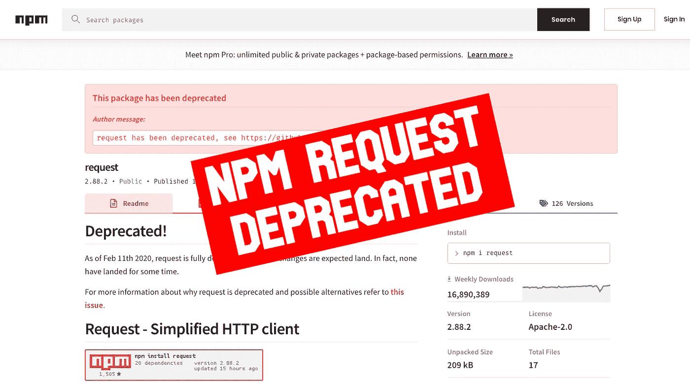
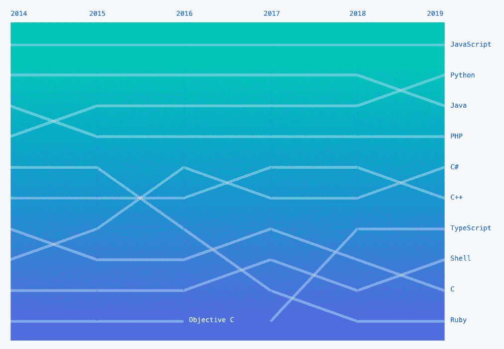

# 请求已被否决

> 原文：<https://betterprogramming.pub/request-has-been-deprecated-a76415b4910b>

## 现在最大的 NPM 软件包之一已经被否决了，这对你的项目意味着什么？

照片来自 [npm](https://www.npmjs.com/package/request) 。

截至 2020 年 2 月 11 日，最大的 NPM 软件包之一——Request——已被正式否决。

这个受欢迎的库已经存在了十多年，第一个版本于 2009 年发布。自那时以来，它已经获得了超过 1600 万的每周下载量，超过 47，000 个图书馆依赖于它。

# 为什么作者会停止开发？

[原作者 Mikeal Rogers 用他自己的话](https://github.com/request/request/issues/3142)说:

> “Request 能为 JavaScript 生态系统做的最有价值的事情就是进入维护模式，停止考虑新功能或主要版本。”

随着现代 JavaScript 和更新的设计模式的出现，Rogers 面临着一个艰难的选择:

1.  驾驭变革的浪潮
2.  反对

起初，罗杰斯认为他可以适应，但他最终选择了后者，并继续说“`request`的核心模式已经过时了。”作者并没有从转变中幸存下来，相反，他确信情况正好相反。

micha Parzuchowski 在 [Unsplash](https://unsplash.com?utm_source=medium&utm_medium=referral) 上的照片。

# 这对你意味着什么？

嗯，如果你是 47，000 个依赖库中的一员或者使用它的人，那就太多了。你很有可能知道。使用不推荐使用的包并不理想，但这并不意味着现在就必须改变。

迄今为止，请求将处于维护模式。

根据罗杰斯的说法，计划是这样的:

*   `request`将停止接受新功能。
*   `request`将停止考虑突破性的变化。
*   仍然活跃的提交者将尝试及时地合并修复。不过，不能保证。
*   发布将完全自动化。任何合并到母版的内容都将被发布。

# 那么有哪些选择呢？

有一个 GitHub 线程[专门处理这个问题。](https://github.com/request/request/issues/3143)

# 结论

JavaScript 是 GitHub 上的主流语言。

随着 JavaScript 的不断发展，使用它们的库和开发人员的数量也会增加。如果您目前正在使用 Request 或任何依赖于它的库，请与您的团队讨论可能的替换。另外，不要忘记运行`npm audit`来检查项目依赖树的安全性并修复任何漏洞。

编码快乐！