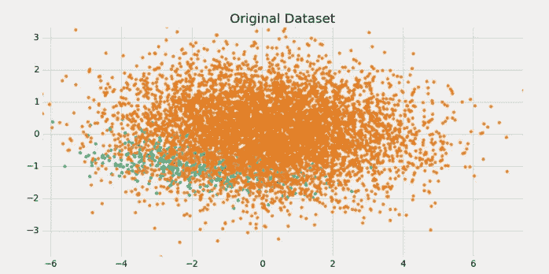
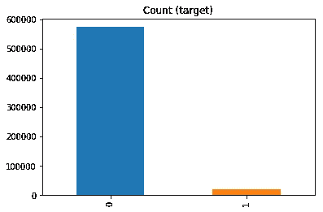
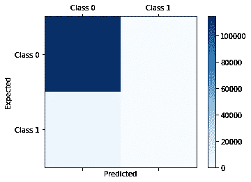
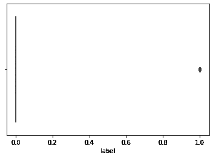
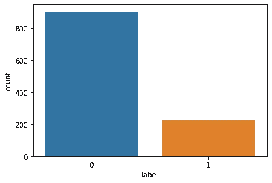
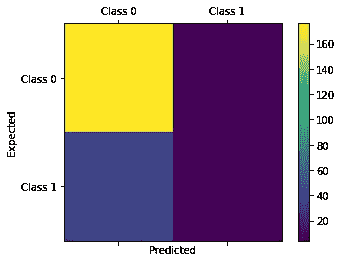
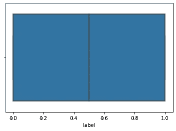
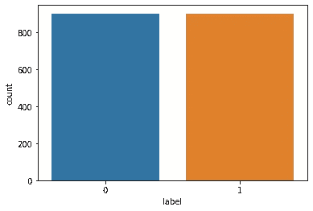
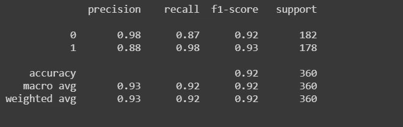
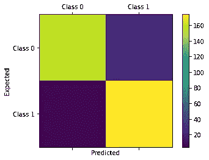

# 对不平衡数据进行重采样并应用机器学习技术

> 原文：<https://betterprogramming.pub/resampling-imbalanced-data-and-applying-ml-techniques-91ebce40ff4d>

## 当您的数据不平衡时该怎么办

不平衡数据集图解来源:-[https://us . 123 RF . com/450 WM/boy kung/boy kung 1211/boy kung 121100073/16393037-不平衡-高分辨率-3d-图像-。jpg？ver=6](https://us.123rf.com/450wm/boykung/boykung1211/boykung121100073/16393037-disbalance-high-resolution-3d-image-.jpg?ver=6)

# 介绍

来源:-[https://miro . medium . com/max/1396/1 * CD 6 aorhojymfyj 7 izd 2 nog . png](https://miro.medium.com/max/1396/1*cd6AorHoJYMFyj7IZd2nOg.png)

如果你处理机器学习问题，最终你会遇到不平衡的数据。那是什么呢？

***当数据集中某一类的观测值明显低于其他类的观测值时，就会出现不平衡数据。***

不平衡数据集的示例:

*   用于在医学诊断等中识别罕见疾病的数据集。
*   与信用卡欺诈或信用卡风险相关的数据集。
*   与评估计算机网络攻击风险相关的数据集。

# 当数据集不平衡时会发生什么？

当您应用带有不平衡数据的机器学习算法时，您获得的模型将更偏向于多数类，即您的模型将预测多数类而不是少数类。大多数机器学习模型都假设数据是均匀分布的。这导致不准确的预测。传统的机器学习算法旨在通过提高精度来减少误差，但它们没有考虑不平衡。

# 公制傻瓜

通常，我们使用准确性作为模型的度量标准。这让我们觉得我们的模型是准确的，但它并没有让我们对模型有太多的了解。

例如，一个数据集有 90%的总观测值属于 A 类，10%的总观测值属于 b 类。TK 现在，如果您拆分您的模型并训练您的模型，那么大部分训练数据集包含 A 类观测值，并且预测您遇到的测试数据集标签您的预测观测值属于 A 类并提供更高的准确性，但实际上，您需要了解您的模型更偏向于 A 类，甚至不预测 b 类的一个标签。

图片来源:作者

# 如何识别模型中的偏差

我们需要使用混淆矩阵作为模型的度量标准。例如，我们上面讨论的模型的混淆矩阵如下所示:

混淆矩阵-图片来源:作者

如果您看到类 0 有更多的观察值，而类 1 没有被预测，这意味着模型偏向于类 0，这决定了我们的模型是不合适的。

# 如何处理数据集中的不平衡

让我们考虑一个来自 Kaggle 的[信用风险分类数据集。探索下面的数据集见解。](https://www.kaggle.com/praveengovi/credit-risk-classification-dataset)

1.  标注分类上的箱线图:

标签类上的箱线图-图像来源:作者

2.标注分类上的计数器图:

标签类上的对策

当我们在一些预处理技术后分割数据集，如将空值分为 20%作为测试集，80%作为训练集，并执行随机森林分类时，我们得到以下结果:

1.  模型的准确率为 80.88%
2.  分类报告:

分类报告-图片来源:作者

3.混淆矩阵:

混淆矩阵-图片来源:作者

通过这些评估指标，我们可以清楚地看到，该模型更偏向于 0 类，而不是 1 类的现实模型。我们需要应用一种策略来减少模型的偏差，以便它能够执行正确的分类。这个问题的解决方案是对数据进行重新采样。

## 重采样

**重采样**是一种从原始数据样本中抽取重复[样本](http://www.statisticssolutions.com/sample-size-calculation-and-sample-size-justification/sampling/)的方法。这是一种统计推断的非参数方法-换句话说，重采样方法不涉及使用一般分布表(例如，正态分布表)来计算近似 p 概率值。尽管有平衡类的优势，这些技术也有它们的弱点。

有两种广泛使用的重采样类型:

*   欠采样
*   过采样

编辑图片来源:-[https://pbs.twimg.com/media/EA8WwfaUYAgaPDY.jpg](https://pbs.twimg.com/media/EA8WwfaUYAgaPDY.jpg)

**欠采样**包括从多数类中随机选择样本，并将其从训练数据集中删除。在随机欠采样中，大多数类实例被随机丢弃，直到达到更平衡的分布。

**过采样**包括从少数类中随机复制样本，并将它们添加到训练数据集中。

## 在上述数据集中实现重采样

在上面的例子中，很明显少数类是 1，risk，所以我通过增加 risk 类的观测值对数据集进行过采样。实现如下:

让我们从生成的数据中收集见解。

1.  箱线图:

标签类的箱线图-图像来源:作者

2.计数器图:

一个标签类的对策-图像信用:作者

现在我们需要将数据分成训练集和测试集。为此，我们将测试规模设为 20%，并将随机森林分类应用于该数据。然后，我们评估指标以获得洞察力。

以下是通过评估指标获得的结果:

1.  精度:模型的精度为 92.22%
2.  分类报告:

重采样数据后的分类报告-图像来源:作者

3.混淆矩阵:

数据重采样后的混淆矩阵-图片来源:作者

观察上述结果后，我们可以说该模型在预测结果方面工作良好。

# 结论

这就是当我们在机器学习中遇到不平衡数据问题时，我们如何使我们的模型无偏。

感谢阅读！