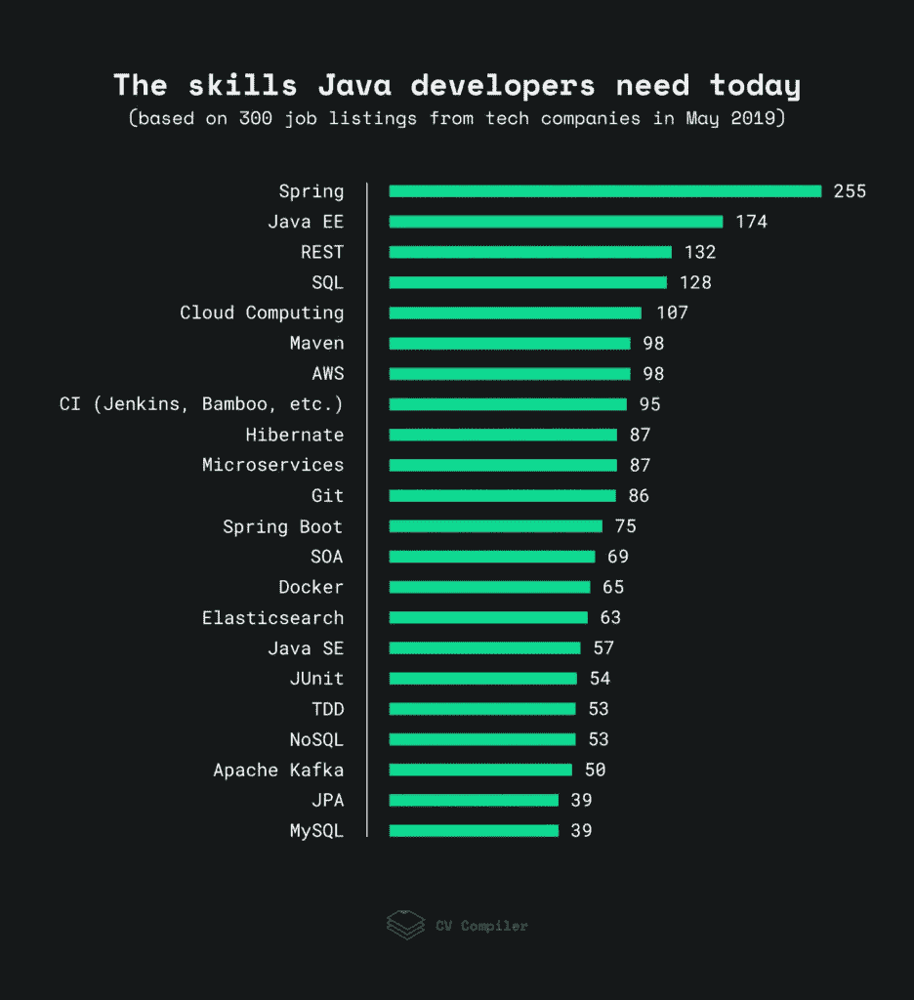

# 研究:你需要在 2019 年提升你的 Java 职业生涯的技能

> 原文：<https://betterprogramming.pub/research-skills-you-need-to-boost-your-java-career-in-2019-5d11ed61f4e8>

## 探索市场需求

在 [Unsplash](https://unsplash.com/photos/O2MdroNurVw) 上由 [Shahadat Shemul](https://unsplash.com/@shemul) 拍摄的照片

自 2001 年以来，Java 在 T4 Tiobe 排名中的最低位置一直是第二名。

根据 StackOverflow 开发者调查，2019 年，Java 是世界上第五大最受欢迎的编码语言。

除了数字:当我写这几行的时候，我的笔记本电脑建议我更新 Java，我需要它来运行一系列程序，比如文本处理器和科学软件包。

使用如此广泛的语言可能需要很多特定的技能。在 [CV 编译器](https://cvcompiler.com/blog/research-skills-you-need-to-boost-your-java-career-in-2019/?utm=dbd3a059e1bb0b5a)这里，我们试图找出 Java 开发者需要哪些技能才能在 2019 年的职业生涯中脱颖而出。

# 2019 年 Java 开发者需要具备的技能

我们处理了来自 AngelList、StackOverflow、LinkedIn 等网站的 300 个 Java 开发人员空缺。这些空缺来自不同规模和不同活动领域的公司。这是结果——对最常被提及的技能的评分。

*2018 年，Java EE 更名为 Jakarta EE，因为它现在是在 Eclipse Foundation 的支持下开发的。然而，旧的术语仍然经常出现在工作规范中，所以我们决定将它包括在图表中，而不是一个新的头衔。*

**注:**该数据更多的是指市场需求，而非行业洞察。该图表反映了雇主的偏好，而不是开发商本身。要获得行业见解，请参考 JetBrains 的[开发者生态系统状态调查](https://www.jetbrains.com/research/devecosystem-2018/java/)等调查。

# 关键要点

我们的**主要结论**是:Java 开发者需求大。我是说，非常大。如果你在 LinkedIn 的搜索栏里输入‘Java’，你会得到 37 万个空缺。相比之下，Python 有 249k 份工作列表，JavaScript 有 278k 份。

下面是我们对 Java 开发当前和未来趋势的研究中的一些重要收获。

## 网络编程

根据我们的研究，大多数公司更喜欢使用 [**Spring MVC**](https://docs.spring.io/spring/docs/current/spring-framework-reference/web.html) 构建他们的 web 应用的后端，而最普遍的前端框架是 [**Angular**](https://angular.io/) (95)或 [**React.js**](https://reactjs.org/) (50)。当然，这并不意味着 Java 开发人员必须精通 JavaScript 前端框架，但是对这些技术如何工作以及如何与您的 Java 代码交互有一个大致的了解肯定是有用的。

在那些 Java 后端框架中，图中没有提到的，[**Apache Struts**](https://struts.apache.org/)(33)是最受欢迎的一个。然而，我建议只有当你的(未来)雇主确实在使用这个框架时，才学习这个框架(例如，维护旧的应用程序)。Struts 的最新版本是在 5 年前发布的，但是 Spring 却不是这样，它一直试图跟上最新的 Java 更新。此外，Spring MVC 只是复杂解决方案的一部分，它可以处理应用程序的许多方面，(比如测试或数据访问)。

## 数据处理

大数据并不是 Java 最受欢迎的用途，但根据我们的研究，它似乎在不久的将来会越来越流行。[据 IBM](https://www.ibm.com/blogs/insights-on-business/consumer-products/2-5-quintillion-bytes-of-data-created-every-day-how-does-cpg-retail-manage-it/) 称，90%的数据是在过去两年中创建的，因此我们确实需要强大而稳定的解决方案来处理所有这些信息。我认为 Java 是一个。或许有一天它甚至会和 Python 分享数据科学市场。

至于现在，一些雇主已经希望候选人熟悉诸如 [**阿帕奇卡夫卡**](https://kafka.apache.org/)(49)[**Hadoop**](https://hadoop.apache.org/)(27)[**Azure**](https://azure.microsoft.com/en-us/)**(23)[**Spark**](https://spark.apache.org/)(21)等与数据相关的解决方案。对了，**大数据**这个词本身在我们分析的整个职位空缺中被提到了 33 次，相当有说服力。**

## **JVM 语言**

**因为我们只分析了 Java 开发人员的空缺，所以没有一种 JVM 语言被频繁地提到，以至于无法出现在我们的图表中。然而，他们仍然在一些工作规范中得到满足，最受欢迎的是 **Scala** (33)。如果你还不熟悉 Scala，你可能想在 2019 年学习更多关于它的知识，特别是如果你正在处理数据。**

## **微服务**

**Java 被许多经验丰富的开发者认为是微服务开发的最佳语言。因此，我们毫不奇怪地看到术语**微服务**和 **Spring Boot** 非常接近我们图表的顶部。开发者也喜欢微服务:更好的微服务支持是 2019 年 Jakarta EE 的主要社区优先事项。**

**2019 年，扩大你对这种软件开发技术的了解是必须的。顺便说一下，您可能还想了解更多关于**服务网格**的信息。虽然术语 [**Istio**](https://istio.io/) (7)没有像[**Kubernetes**](https://kubernetes.io/)(18)那样被频繁提及，但随着微服务应用的日益流行，类似的编排技术肯定会变得更加流行。**

## **Web 服务器和数据库**

**最后，如果谈论 NoSQL 数据库，这里是雇主更喜欢的: [**卡珊德拉**](http://cassandra.apache.org/) (41)和 [**MongoDB**](https://www.mongodb.com/) (33)。至于 web 服务器， [**Tomcat**](http://tomcat.apache.org/) (35)和 **Apache** (35)是领头羊。**

# **Java 趋势:专家观点**

**下面是专家们对即将到来的 Java 趋势的看法。**

> **在不久的将来，我们可能会看到对运行在 GraalVM 上的 Quarkus 和相关技术越来越感兴趣。例如，它可能是 Vert.x，因为 Java 响应了容器革命。**

***詹姆士总督，
创始人* [*雷德莫克*](https://redmonk.com/) *。* [*推特*](https://twitter.com/monkchips)**

> **与“经典”的春天相比，Spring Boot 相对较低的受欢迎程度让我感到惊讶。另一方面，我对 Java EE 的第二名感到惊喜。作为 Java EE APIs 之一的 JPA (Java Persistence API)被列为一个独立的项目，加上对 SQL 技能的强烈需求，表明了人们对关系数据库的持续兴趣。**
> 
> **对 Maven 技能的强烈需求与我的真实世界经验相匹配:Maven 是领先的构建工具之一。Apache Kafka 目前在会议上非常流行，但它不能作为通用架构适用于所有项目，这解释了它相对较低的需求。**
> 
> **我还预计对谷歌云和 Azure 技能的兴趣会增加——这两种云已经在项目中大量使用。一名 Java EE 开发人员，并且在 JPA、SQL、JMS (Kafka 也是 JMS 实现)、JAX-RS (REST)、Maven(Java EE 中的默认)、Git(事实上的标准)方面经验丰富，在 2019 年 5 月的市场上处于最佳位置。**

***Adam Bien，
Java 冠军，*
*JavaOne Rockstar 顾问。* [*博客*](http://adambien.blog/) *|* [*推特*](https://twitter.com/AdamBien)**

> **如今，Spring 框架和微服务架构是 Java 世界事实上的标准。但是不断发展的行业要求软件工程师除了掌握现有的技能之外，还要开发新的技能。服务网格和服务代理正在改变微服务的开发方式，因此雇主正在寻找与 Istio、Linkerd2 或 Envoy 一起实践的工程师。随着越来越多的公司转向公共和混合云计算，拥有亚马逊 AWS、谷歌云平台或微软 Azure 的体验非常重要。**
> 
> **反应式编程在 Java 世界中仍处于上升趋势。即使我不期望它完全取代更传统的命令式方法，但对具有反应式编程专业知识的工程师的需求很大。探索什么是反应式编程以及它如何改变 Java 生态系统的状态是值得的。获得一些反应式框架(Project Reactor、RxJava、Spring WebFlux 等)的经验，并了解反应式编程与构建反应式系统的区别。**
> 
> **在数据存储方面，NoSQL 和多语言持久性是当今工程师的必备技能，但全球系统正在提高对新型数据库管理解决方案的需求。高度一致的 Google Spanner 是作为服务提供的生产就绪的 NewSQL 数据库的一个例子。虽然很难预测 NewSQL 存储解决方案本身的受欢迎程度，但未来是关于高度分布式软件的，因此理解一致系统背后的原理是至关重要的，尤其是共识协议。**

**Alex Borysov，
网飞高级软件工程师，
前谷歌员工。
[*推特*](https://twitter.com/aiborisov)*|*[*YouTube*](https://www.youtube.com/playlist?list=PLi7MQHgzNDNcOZwIsMSQw5wIqAYYq7uaX)**

> **对于一个企业 Java 项目来说，这种技能评级对我来说是合理的。然而，我再也看不到 SOA 有什么需求了。至于 Spring 和 Spring Boot，它们经常同时使用，所以区别可能不再相关。**
> 
> **就未来而言，我确实看到了一种趋势，人们对各种云原生技术越来越感兴趣。如果这种趋势继续下去，那么几年后可能会更有趣。**

***塞巴斯蒂安·达施纳，
Java 冠军* [*个人网站*](https://www.sebastian-daschner.com/)**

> **Java 开发人员(像所有开发人员一样)，将始终受益于对核心工具和语言(如 Git 和 SQL)的深入理解。无论你使用什么操作系统，任何脚本语言都是另一个可以加速你工作的东西。想要进步的开发人员还应该了解代码工作的基础设施(云)以及它是如何到达那里的(CI)。**
> 
> **我们的工作不是写代码，而是改变软件。理解更广泛的系统，包括业务领域，将使开发人员在 Java 和任何其他语言中做出更好的决策。**

***杰西卡·可儿，
开发人员 at Atomist* [*推特*](https://twitter.com/jessitron)*|*[*Blo*](https://blog.jessitron.com/)*g***

# **结论**

**Java 是一种成熟的语言，有一套稳定的工具来满足不同的需求。然而，随着它的不断发展，掌握脉搏对你的职业生涯总是有用的。希望这篇文章能帮助您了解最新的 Java 趋势！**