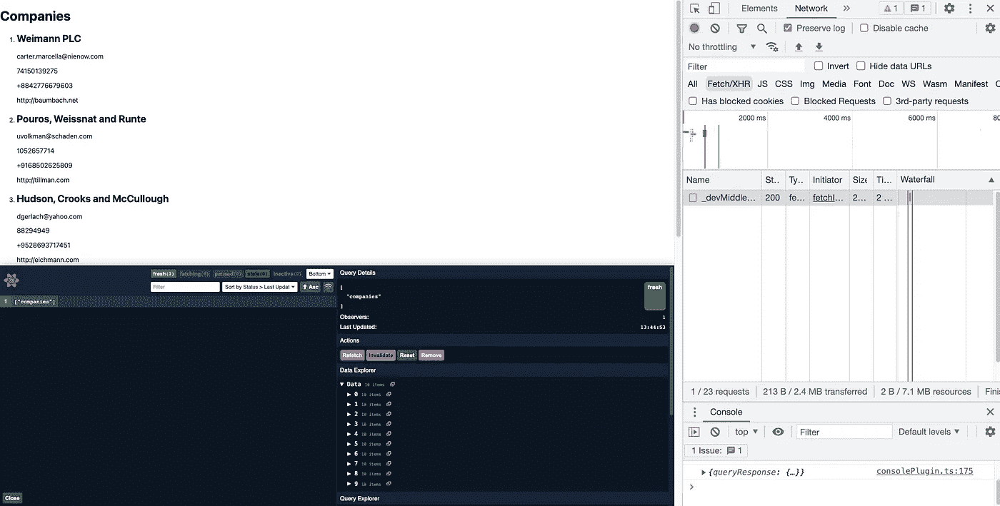
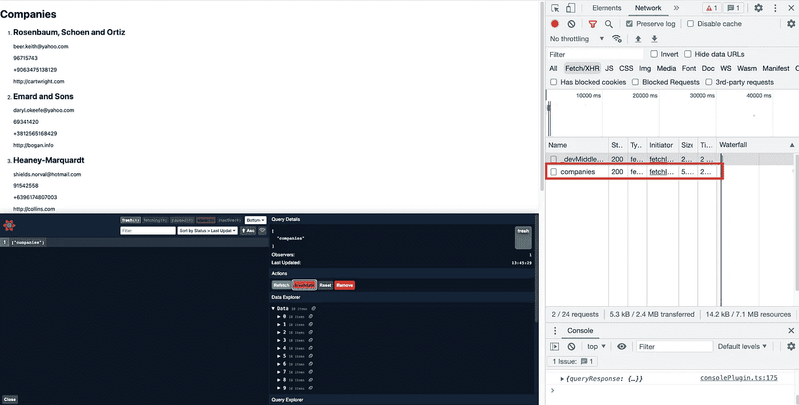

# Next.js 中的弹性和高性能数据提取

> 原文：<https://betterprogramming.pub/resilient-and-performant-data-fetching-in-nextjs-363c40a40502>

## *关于如何使用 React Query 和 Next.js 优化 API 调用和向视图呈现数据的教程*


API 通常是我们驱动网站浏览量的主要数据源。它们是我们的应用程序呈现信息的核心部分，比如天气、用户数据、交易列表等等。考虑到获取和呈现数据的重要性，我们必须确保以高性能和弹性的方式完成这项工作。服务器错误、网络问题、请求超时和其他因素可能会阻止您的数据填充视图。幸运的是，我们可以使用一些工具来优化我们的初始请求，并在数据过时时不断更新数据。

# js 服务器端抓取

当您获取数据时，有什么比显示一个设计良好的加载微调器更好的呢？根本不需要！

[Next.js](https://nextjs.org/) 提供了一个名为 [getServerSideProps](https://nextjs.org/docs/basic-features/data-fetching/get-server-side-props) 的页面级函数，它允许我们执行 NodeJS 获取请求，并将其作为 Props 传递给页面。这给了我们在客户端准备好数据的好处。

从 [Faker API](https://fakerapi.it/en) 获取并呈现公司列表可能如下所示:

```
const fetchCompanies = async () => {
  const res = await fetch("https://fakerapi.it/api/v1/companies");

  if (!res.ok) {
    throw new Error("Something went wrong");
  }

  const { data = [] } = await res.json();

  return data;
};

export default function Home({ data }) {
  return (
    <div>
      <h1>Companies</h1>
      <ol>
        {data && data.map(({ id, name, email, vat, phone, website }) => (
          <li key={id}>
            <h2>{name}</h2>
            <p>{email}</p>
            <p>{vat}</p>
            <p>{phone}</p>
            <p>{website}</p>
          </li>
        ))}
      </ol>
    </div>
  );
};

export const getServerSideProps = async () => {
  const data = await fetchCompanies()
  return {
    props: {
      data
    },
  };
};
```

# 页面视图


看起来很棒，对吧？列表几乎立即呈现，我们甚至不需要显示加载状态(目前)。

如果我们生活在一个完美的世界中，这可能足以进行生产。然而，在现实场景中，我们必须考虑初始请求失败、需要重试、缓存以提高性能以及避免达到 API 限制。

# 对救援的质疑作出反应

[React Query](https://tanstack.com/query/v4/) 是一个优秀的数据获取库，允许我们使用初始服务器端获取、重试、缓存、请求超时等等！

我们可以对上面的代码做的第一个改进是引入查询水合和重试机制。水合是使用客户端 JavaScript 向服务器呈现的 HTML 添加应用程序状态和交互性的过程。

首先，我们需要在`_app.js`中用 React Query 的提供者包装我们的页面。

```
import { QueryClient, QueryClientProvider, Hydrate } from "@tanstack/react-query";
// Create a client
const queryClient = new QueryClient();
export default function MyApp({ Component, pageProps }) {
  return (
    <QueryClientProvider client={queryClient}>
      <Hydrate state={pageProps.dehydratedState}>
        <Component {...pageProps} />
      </Hydrate>
    </QueryClientProvider>
  );
}
```

这里发生了两件事。首先，我们用一个`QueryClientProvider`包装我们的应用程序，它让 React Query 的钩子通过上下文访问一个`QueryClient`的实例。其次，我们正在向`Hydrate`传递脱水状态。脱水状态将来自我们的服务器端获取，是缓存的冻结表示，稍后可以在客户端进行水合。

# 修改我们最初的方法

```
import { QueryClient, dehydrate } from "@tanstack/react-query";

const fetchCompanies = async () => {
  const res = await fetch("https://fakerapi.it/api/v1/companies");

  if (!res.ok) {
    throw new Error("Something went wrong");
  }

  const { data = [] } = await res.json();

  return data;
};

export default function Home() {
  const { data, error, isLoading } = useQuery({ queryKey: 'companies', queryFn: fetchCompanies, staleTime: 60_000 }); // stale after 1 min
  if (isLoading){
   return <h1>Loading...</h1>
  }
  if (error){
   return <h1>{error.message}</h1>
  }
  return (
    <div>
      <h1>Companies</h1>
      <ol>
        {data && data.map(({ id, name, email, vat, phone, website }) => (
          <li key={id}>
            <h2>{name}</h2>
            <p>{email}</p>
            <p>{vat}</p>
            <p>{phone}</p>
            <p>{website}</p>
          </li>
        ))}
      </ol>
    </div>
  );
};

export const getServerSideProps = async () => {
  const queryClient = new QueryClient()
  await queryClient.prefetchQuery(["companies"], fetchCompanies);

  return {
    props: {
      dehydratedState: dehydrate(queryClient),
    },
  };
};
```

# 有什么变化？



如果我们查看我们的初步页面负载，我们仍然得到了公司的渲染列表，没有任何客户端获取请求的迹象。这意味着我们最初仍在获取服务器端。

我们的好处是，当数据过时时，它会刷新客户端。由于缓存过期、us 指示新数据超时或执行另一个请求(例如，使用`POST`请求创建新的数据条目),数据可能进入状态，从而触发当前数据的无效。



重新检查 network 选项卡，我们可以看到，一旦数据被认为过时，就会触发客户端获取。因此，如果初始请求失败，React Query 将多次尝试恢复数据。

# 结论(差不多)

就是这样！我们已经使我们的应用程序对请求失败具有高性能和反应能力。此外，React Query 可以配置为进一步优化应用程序状态和请求，这取决于您正在开发的应用程序的类型。

说到这里，我们还可以做一件事…

# 重构

让我们清理这段代码，把它变成更好的东西。

我们可以从为键定义一个 enum 和为 fetchers 定义一个函数映射开始。

```
const QUERY_KEYS = {
  COMPANIES: "companies",
}
const queryFunctions = {
  [QUERY_KEYS.COMPANIES]: fetchCompanies,
};
```

之后，我们可以用我们的`useQuery`钩子创建一个 HOC ( [高阶组件](https://reactjs.org/docs/higher-order-components.html))。

```
export const withQuery = (Component, key) => {
  return (props) => {
    const queryResponse = useQuery({ queryKey: [key], queryFn: queryFunctions[key], staleTime: 50_000 });
    return <Component {...{...props, ...queryResponse}} />;
  };
};jsx
```

这个 HOC 将包装我们的页面组件，并为我们传播查询响应属性(以及页面属性)，类似于我们在第一次迭代中使用直接从`getServerSideProps` 接收的数据。这给了我们一个简单的接口和抽象实现细节的好处。

我们最终的页面组件将如下所示:

```
const Home = ({ data, error, isLoading }) => {

  if (isLoading) {
    return <h1>Loading...</h1>;
  }

  if (error) {
    return <h1>{error.message}</h1>;
  }

  return (
    <div>
      <ReactQueryDevtools initialIsOpen={false} />
      <h1>Companies</h1>
      <ol>
        {data && data.map(({ id, name, email, vat, phone, website }) => (
          <li key={id}>
            <h2>{name}</h2>
            <p>{email}</p>
            <p>{vat}</p>
            <p>{phone}</p>
            <p>{website}</p>
          </li>
        ))}
      </ol>
    </div>
  );
};

export default withQuery(Home, QUERY_KEYS.COMPANIES);
```

当然，我们也可以扩展它来使用多个查询，将额外的配置传递给`useQuery`，等等。，但就目前而言，这就足够了。

我希望这能让您对如何提高 Next.js 中 API 请求的弹性和性能有所了解。

快乐迷人！