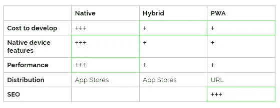

# 解决本地和渐进式 Web 应用之间的困境

> 原文：<https://betterprogramming.pub/resolving-the-dilemma-between-native-and-progressive-web-apps-8897d5ee7423>

## 当我们开始一个新的移动项目时，可能发生的争论的工具

在 [Unsplash](http://www.unsplash.com) 上由 [Imran Bangash](https://unsplash.com/@ikbangesh) 拍摄的照片。

一年前，我致力于开发一个新版本的应用程序，以满足当前客户的需求。为了做出最好的决定，我学习了本地、混合和渐进式 web 应用程序。

无论你想创建什么样的应用程序，我都会告诉你如何找到最合适的。

# 什么是原生 App？

原生应用是为特定平台开发的智能手机应用。原生应用程序是用这些平台支持的语言编写的。

例如，Java 和 Kotlin 用于构建 Android 应用，而 Swift 和 Objective C 用于原生 IOs 应用。

这允许本地应用使用操作系统的工具和框架以及硬件的功能。但正因为如此，如果我们想让这款应用在苹果商店和谷歌 Play 商店上市，我们必须进行两次开发。

构建原生应用的优点:

*   原生应用程序具有最佳性能。
*   支持常见的特定于平台的功能。本机应用程序最容易访问 NFC(近场通信)等高级功能。

另一方面，主要的缺点是成本:

*   开发成本。除非你想只为 Android 用户构建你的应用，否则你必须构建你的应用两次。
*   维护成本。对于应用程序的每个新版本，您必须维护多个代码。

# 什么是渐进式网络应用？

渐进式网络应用程序是通过网络交付的应用软件。PWAs 使用 HTML、CSS 和 JavaScript 等 web 技术构建，可以在使用符合标准的浏览器的任何平台上工作。

作为一个网络应用程序，用户不需要在苹果应用商店或谷歌 Play 商店上下载应用程序就可以在他们的移动设备上使用它。

此外，您可以将 progressive web 应用程序作为网站访问，从而使用搜索引擎找到它。

此外，pwa 使用服务人员来允许应用程序离线工作。服务工作者是 JavaScript 脚本，允许从浏览器进行资产缓存。

将应用程序构建为 PWA 的优点:

*   一次编写，随处使用。通过构建 PWA，你将能够拥有一个面向 Android 用户的网站和一个应用+一个面向 iOS 用户的应用。
*   成本。你有一个单一的代码，更容易维护。
*   SEO。由于他们在搜索引擎上的可见性，PWAs 拥有最高的影响力。

另一方面，也有缺点:

*   一些功能仍然缺失。由于 PWA 访问 HTML5 浏览器支持的功能，您无法访问 NFC 等高级功能。您可以在 [What Web Can Do Today](https://whatwebcando.today) 上找到您的浏览器支持的所有功能。
*   性能。与本机应用程序相比，pwa 的性能较低。

# **什么是混合应用？**

也可以用 [Cordova](https://cordova.apache.org/) 构建一个使用 HTML、CSS 和 JavaScript 的应用程序。

Cordova 是一个移动应用程序开发框架，它将代码嵌入到设备上的本地 webView 中。这样，Cordova 提供了访问设备硬件的链接。

混合应用的利与弊与 PWAs 非常相似，只是你的应用将在应用商店上分发。

# 结论

以下是您应该选择构建本机应用程序的时机:

1.  你的应用程序的性能很重要。
2.  您需要访问用户手机的特定功能。
3.  您拥有维护多个代码的资源。

另一方面，在这些情况下，您应该更喜欢构建 PWA/hybrid 应用程序:

1.  你需要一个可以维护的多平台 app。
2.  你希望你未来的客户在谷歌上找到你。
3.  你的预算有限。

作者照片。

在我的情况下，我需要访问特定的设备功能，比如用户的电话。这就是我们选择打造原生 app 的原因。

此外，有时问题不在于在本地或渐进式网络应用之间做出选择。举个例子，Twitter 选择同步两者来提供最好的用户体验。