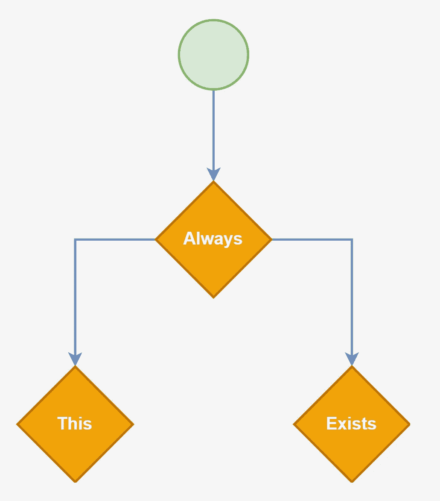

# 对“停止使用 If-Else 语句”的回应

> 原文：<https://betterprogramming.pub/response-to-stop-using-if-else-statements-c3d4c64c69af>

## 让我们提炼一下所说的话



作者

本文回应[案例#2:前置/后置条件和早期回报](https://medium.com/u/7c7a43b3d9de#——定制工作流引擎</a>的文章来讨论这个问题。</p><h1 id=)

[我发现可以删除 if-else 语句的第二种情况是在函数的基本条件检查中。让我们以此为例，](https://medium.com/u/7c7a43b3d9de#——定制工作流引擎</a>的文章来讨论这个问题。</p><h1 id=)

```
protected void ValidateRequest(Model request, ICollection<string> validationErrors)
{
  if (request != null)
  {
    if (string.IsNullOrWhiteSpace(request.Name))
      validationErrors.PropertyRequired(nameof(request.Name));
    if (string.IsNullOrWhiteSpace(request.Description))
      validationErrors.PropertyRequired(nameof(request.Description));
  } else {
    validationErrors.ArgumentRequired(nameof(Model));
  }
}
```

[在这种情况下，我已经在调用主函数之前分离出了我的验证。然而，我使用否定形式来检查请求(不等于`!=`)。如果我们把这个倒过来，提前返回，我们可以让它看起来更干净一点，](https://medium.com/u/7c7a43b3d9de#——定制工作流引擎</a>的文章来讨论这个问题。</p><h1 id=)

```
protected void ValidateRequest(Model request, ICollection<string> validationErrors)
{
  if (request == null)
  {
    validationErrors.ArgumentRequired(nameof(Model));
    return;
  }

  if (string.IsNullOrWhiteSpace(request.Name))
    validationErrors.PropertyRequired(nameof(request.Name));
  if (string.IsNullOrWhiteSpace(request.Description))
    validationErrors.PropertyRequired(nameof(request.Description));
}
```

[这段代码是这样的。我们根本没有删除`else`逻辑。我们只是在语法上改变了它。`return;`是我们替换`else`关键词的方式。如果我们删除了`return`，我们将不得不把`else`添加回代码中。这就是所谓的“提前归还”](https://medium.com/u/7c7a43b3d9de#——定制工作流引擎</a>的文章来讨论这个问题。</p><h1 id=)

[有些人有一个规则，条件句应该总是积极或消极的形式。例如，有些人觉得`if (!string.IsNullOrEmpty(value)) { }`可读性较差。然而，对于早期回报，你真的不能被这种哲学所束缚。它会碍事的。](https://medium.com/u/7c7a43b3d9de#——定制工作流引擎</a>的文章来讨论这个问题。</p><h1 id=)

[现在，上面的代码显示了一个先决条件的例子。然而，这当然适用于后置条件或函数的任何其他内部状态。当你能从函数中返回的时候，就去做吧！这样，你就避免了`else`语句。](https://medium.com/u/7c7a43b3d9de#——定制工作流引擎</a>的文章来讨论这个问题。</p><h1 id=)

# [案例 3:对象类型化](https://medium.com/u/7c7a43b3d9de#——定制工作流引擎</a>的文章来讨论这个问题。</p><h1 id=)

[我看到的第三个主要用例是对象类型化的概念，其中使用一个`string`或枚举来选择某种逻辑。](https://medium.com/u/7c7a43b3d9de#——定制工作流引擎</a>的文章来讨论这个问题。</p><h1 id=)

[假设我们想要播种锦标赛算法。我们可以有这样的代码，](https://medium.com/u/7c7a43b3d9de#——定制工作流引擎</a>的文章来讨论这个问题。</p><h1 id=)

```
public class Tournament {
  // ... All other Tournament Code ...

  public async Task<IEnumerable<SeedResult>> SeedAsync()
  {
    if (tournament.SeedAlgorithm == "ordered")
    {
      // TODO: Run Ordered Algorithm
      return results;
    } else if (tournament.SeedAlgorithm == "random")
    {
      // TODO: Run Random Algorithm
      return results;
    } else if (tournament.SeedAlgorithm == "total-score")
    {
      // TODO: Run Total Score Algorithm
      return results;
    } else {
      throw new InvalidAlgorithmException("...");
    }
  }
}
```

[每次添加另一个算法时，都必须更新这个方法。但老实说，可能没什么大不了的。这种方法的真正问题是当您在代码中的多个地方使用`Tournament.SeedAlgorithm`时。也许有一个点，你检查算法类型，以执行一些逻辑。但是，根据算法的不同，用户界面可能会有一些限制。现在你有了在多个地方“播种”的逻辑。当你添加另一个算法时，你必须绝对肯定你在代码中捕获了所有的实例。](https://medium.com/u/7c7a43b3d9de#——定制工作流引擎</a>的文章来讨论这个问题。</p><h1 id=)

[这是最糟糕的。](https://medium.com/u/7c7a43b3d9de#——定制工作流引擎</a>的文章来讨论这个问题。</p><h1 id=)

[是的，ide 允许我们快速找到所有的引用。但是这对非加载的程序集没有帮助。所以你总是在冒险。](https://medium.com/u/7c7a43b3d9de#——定制工作流引擎</a>的文章来讨论这个问题。</p><h1 id=)

[相反，我们应该创建一个服务类型来处理这些场景。让我们来看一个例子，](https://medium.com/u/7c7a43b3d9de#——定制工作流引擎</a>的文章来讨论这个问题。</p><h1 id=)

```
public interface ISeedAlgorithm
{
  string Name { get; }
  bool IsVisibleToUser { get; }

  Task<IEnumerable<SeedResult>> RunAsync(Tournament tournament);
}
```

[从这里开始，我们实施几次，](https://medium.com/u/7c7a43b3d9de#——定制工作流引擎</a>的文章来讨论这个问题。</p><h1 id=)

```
public class OrderedSeedAlgorithm : ISeedAlgorithm
{
  public string Name => "ordered";
  public bool IsVisibleToUser => false;
  public async Task<IEnumerable<SeedResult>> RunAsync(Tournament tournament)
  {
    // TODO: Run Algorithm
    return results;
  }
}

public class RandomSeedAlgorithm : ISeedAlgorithm
{
  public string Name => "random";
  public bool IsVisibleToUser => true;
  public async Task<IEnumerable<SeedResult>> RunAsync(Tournament tournament)
  {
    // TODO: Run Algorithm
    return results;
  }
}

public class TotalScoreSeedAlgorithm : ISeedAlgorithm
{
  public string Name => "total-score";
  public bool IsVisibleToUser => false;
  public async Task<IEnumerable<SeedResult>> RunAsync(Tournament tournament)
  {
    // TODO: Run Algorithm
    return results;
  }
}
```

[现在你有了一套独立的算法。](https://medium.com/u/7c7a43b3d9de#——定制工作流引擎</a>的文章来讨论这个问题。</p><h1 id=)

[现在，就其本身而言，这在短期内不会带来太多好处。然而，从长期维护的角度来看，我们可以发现许多好处，](https://medium.com/u/7c7a43b3d9de#——定制工作流引擎</a>的文章来讨论这个问题。</p><h1 id=)

1.  [我们可以使用依赖注入(DI)容器将这些算法提供给其他需要它们的类。](https://medium.com/u/7c7a43b3d9de#——定制工作流引擎</a>的文章来讨论这个问题。</p><h1 id=)
2.  [我们可以将算法可能需要的任意数量的依赖注入到这些类中，而不会污染使用`if-else`逻辑的单个类。](https://medium.com/u/7c7a43b3d9de#——定制工作流引擎</a>的文章来讨论这个问题。</p><h1 id=)
3.  [我们可以通过实现接口并将其添加到您的 DI 容器注册中心来快速添加新算法。](https://medium.com/u/7c7a43b3d9de#——定制工作流引擎</a>的文章来讨论这个问题。</p><h1 id=)

[总的来说，对于大多数用例来说，这是一个更好的设计。](https://medium.com/u/7c7a43b3d9de#——定制工作流引擎</a>的文章来讨论这个问题。</p><h1 id=)

# [案例 4:算法](https://medium.com/u/7c7a43b3d9de#——定制工作流引擎</a>的文章来讨论这个问题。</p><h1 id=)

[最后一个要讨论的用例是算法，特别是不允许提前退出或对象分离的算法。例如，我最近有一个案例，我正在为一个锦标赛设置回合，在那里“再见”回合是可能的。它看起来像这样，](https://medium.com/u/7c7a43b3d9de#——定制工作流引擎</a>的文章来讨论这个问题。</p><h1 id=)

```
for(int iMatch = 0; iMatch < len; iMatch++)
{
    var p1 = top[iMatch];
    var p2 = bottom[iMatch];

    // ... other code ...

    // This is a bye for a participant
    if (p1 == -1)
    {
      isBye = true;
      matchName = $"{participants[p2].Name} Bye";
      assignments = new[] { new MatchStationAssignment { Participant = new Reference<Participant> { Id = participants[p2].Id, DisplayName = participants[p2].Name }, Seat = 2 } };
      results = new[] { new IndividualMatchResult { Assignment = assignments[0], Result = MatchResult.DefaultWin } };
    } else if (p2 == -1)
    {
      isBye = true;
      matchName = $"{participants[p1].Name} Bye";
      assignments = new[] { new MatchStationAssignment { Participant = new Reference<Participant> { Id = participants[p1].Id, DisplayName = participants[p1].Name }, Seat = 1 } };
      results = new[] { new IndividualMatchResult { Assignment = assignments[0], Result = MatchResult.DefaultWin } };
    } else
    {
      matchName = $"{participants[p1].Name} vs. {participants[p2].Name}";
      assignments = new[]
      {
          new MatchStationAssignment { Participant = new Reference<Participant> { Id = participants[p1].Id, DisplayName = participants[p1].Name }, Seat = 1 },
          new MatchStationAssignment { Participant = new Reference<Participant> { Id = participants[p2].Id, DisplayName = participants[p2].Name }, Seat = 2 }
      };
    }

    // ... other code ...
}
```

[如果不深入了解这段代码做了什么，如果没有 else 语句，很难将它分解出来。这主要是由于围绕这个`if-else`设置运行的“其他代码”。如果我花时间的话，我确信我能找到一些聪明的方法来做到这一点，但是老实说，可读性会很差。](https://medium.com/u/7c7a43b3d9de#——定制工作流引擎</a>的文章来讨论这个问题。</p><h1 id=)

[我欢迎任何建议:)](https://medium.com/u/7c7a43b3d9de#——定制工作流引擎</a>的文章来讨论这个问题。</p><h1 id=)

# [结论](https://medium.com/u/7c7a43b3d9de#——定制工作流引擎</a>的文章来讨论这个问题。</p><h1 id=)

[`if-else`逻辑的现实和我们上面所做的重新配置，是逻辑仍然存在。打开 Visio 或图表。IO，或者你使用的任何工具，并开始规划你的逻辑。它会一直在那里。我们推出这些产品有两个原因，](https://medium.com/u/7c7a43b3d9de#——定制工作流引擎</a>的文章来讨论这个问题。</p><h1 id=)

1.  [**可读性**:我的观点是，尽早从一个例程中退出，然后确信我的对象是好的，这使得编程变得容易得多。此外，将所有代码放在一个地方，将它们分成不同的类，使得查找细节变得更加简单。](https://medium.com/u/7c7a43b3d9de#——定制工作流引擎</a>的文章来讨论这个问题。</p><h1 id=)
2.  [可维护性:必须在代码库中搜索枚举的所有用例是很痛苦的。最重要的是，不得不改变测试过的代码，总是让我紧张。相反，增加新的课程而不去管旧的，总是给我温暖和模糊。](https://medium.com/u/7c7a43b3d9de#——定制工作流引擎</a>的文章来讨论这个问题。</p><h1 id=)

[但关键是，逻辑是存在的。我们只是试图从这两个角度做得更好一点。](https://medium.com/u/7c7a43b3d9de#——定制工作流引擎</a>的文章来讨论这个问题。</p><h1 id=)

[总的来说，我同意尼可拉斯的观点。我们应该尽我们所能避免`if-else`的设置。然而，绝对会有你不应该这样做的情况(比如情况#4)。这只会让事情变得更糟(除非有人给我看更好的东西)。对于任何编程原则，我们都不能独断专行。你最终会被证明是错的。](https://medium.com/u/7c7a43b3d9de#——定制工作流引擎</a>的文章来讨论这个问题。</p><h1 id=)

[希望这篇文章有助于澄清一些事情！总的来说，我很欣赏 Nicklas 的文章，并相信他在编码实践中有坚实的策略。我只是想帮助那些在这个话题上寻找更多深度的人。](https://medium.com/u/7c7a43b3d9de#——定制工作流引擎</a>的文章来讨论这个问题。</p><h1 id=)

[下次见！](https://medium.com/u/7c7a43b3d9de#——定制工作流引擎</a>的文章来讨论这个问题。</p><h1 id=)

[](https://medium.com/u/7c7a43b3d9de#——定制工作流引擎</a>的文章来讨论这个问题。</p><h1 id=)