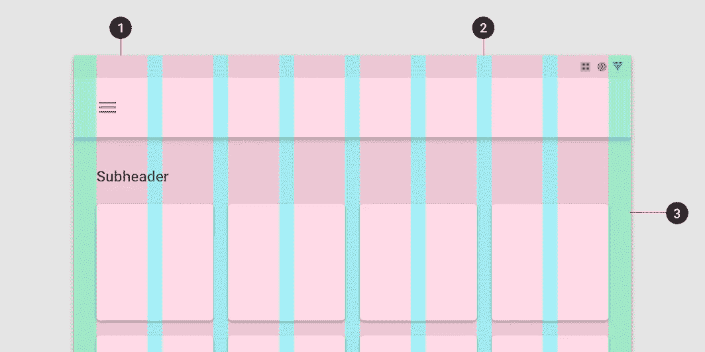
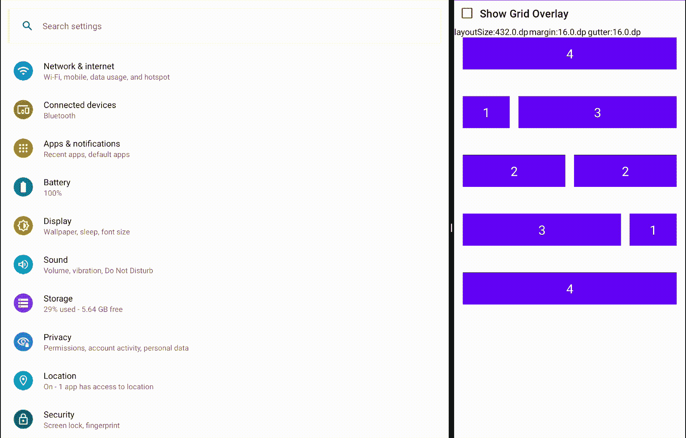

# 使用 Jetpack Compose 的响应式布局网格

> 原文：<https://betterprogramming.pub/responsive-layout-grid-363aa1fb7a8b>

## 构建一致的布局

照片由[莎伦·麦卡琴](https://unsplash.com/@sharonmccutcheon?utm_source=medium&utm_medium=referral)在 [Unsplash](https://unsplash.com?utm_source=medium&utm_medium=referral) 上拍摄

自从**响应式布局网格**模式被引入到基于设备宽度和方向来设计应用以确保布局的一致性以来，已经有很长时间了。

响应式布局网格由三个元素组成:列、装订线和边距。

1.第二栏。排水沟 3。边缘

*   列:内容放在包含列的屏幕区域中。
*   装订线:装订线是帮助分隔内容的栏间空间。
*   边距:边距是内容和屏幕左右边缘之间的距离。

> 不同设备的分栏、装订线、边距值不同，这些也可以为应用程序定制。检查[断点系统](https://material.io/archive/guidelines/layout/responsive-ui.html#responsive-ui-breakpoints)中所有设备类型的元素值。

Jetpack Compose 比其他方法更容易实现。
使用`[CompositionLocalProvider](https://developer.android.com/reference/kotlin/androidx/compose/runtime/package-summary#CompositionLocalProvider(kotlin.Array,kotlin.Function0))`为`[CompositionLocal](https://developer.android.com/reference/kotlin/androidx/compose/runtime/CompositionLocal)`提供一个值。这通常在树的“根”处，但也可以在任何地方，并且也可以在多个地方使用来覆盖为子树提供的值。

所以我们创建了一个数据类`GridConfiguration`。

`layoutWidth`:将应用网格配置的布局宽度。
`columnWidth`:以页边距和装订线后留出的空间计算的栏间距宽度

由于`columnWidth`需要计算，我们编写了一个预定义的计算器函数。

它将从一个可记忆的函数中调用，如下所示:

我们需要一个复合局部变量来通过`CompositionLocalProvider`。

在`CompositionLocalProvider`中被忽略的最后一项是布局宽度。这可以从`[LocalConfiguration#ScreenWidthDp](https://developer.android.com/reference/android/content/res/Configuration#screenWidthDp)`获得，它是应用在任何时间点的宽度(单个应用、分割模式、窗口模式、方向改变或未来的任何其他)。

> **注意**:布局宽度不一定是应用程序的完整宽度，它也可以是屏幕的一部分，如双窗格布局、滑动窗格等。,

一切都完成了，只需在`CompositionLocalProvider`中传递形成的`GridConfiguration`值就可以开始编码了。

网格`Configuration`已经设置好了，现在我们该怎么办！

响应式网格布局用于根据列数设置内容的宽度，并将其在屏幕上对齐。现在，自适应部分是基于`columnSpan` / `columnCount`(可能因设备而异)的宽度。

借助 column-span/count 使用网格配置可以计算宽度。

除此之外，我们将有一个修改器来简化工作。

关于谁看起来像最终输出和完整的代码样本应用程序可在[这里](https://github.com/sahruday/ResponsiveGrid)。

使用网格配置和自定义布局覆盖的示例应用程序。

快乐的编码人们使用响应式布局网格。