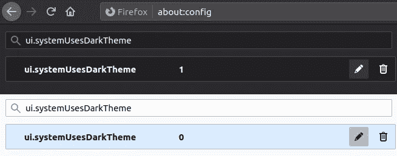
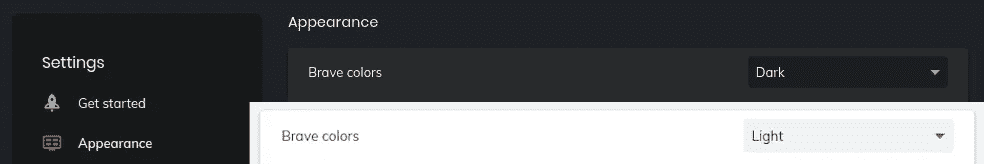

# 最小 CSS 的响应页面和颜色主题

> 原文：<https://betterprogramming.pub/responsive-pages-and-color-themes-with-minimal-css-7a7763eb134a>

## 用颜色主题构建一个响应式网站？最好从根源开始


照片由[诺德伍德主题](https://unsplash.com/@nordwood?utm_source=medium&utm_medium=referral)在 [Unsplash](https://unsplash.com?utm_source=medium&utm_medium=referral) 上拍摄。

如果你碰巧访问我的网站，你可能会注意到我已经把它打扮了一下。Victoria.dev 现在可以更好地响应您的设备和偏好！

下面是如何使用 [CSS 媒体查询](https://developer.mozilla.org/en-US/docs/Web/CSS/Media_Queries/Using_media_queries)和[自定义属性](https://developer.mozilla.org/en-US/docs/Web/CSS/--*)来提高你的访问者的浏览体验，只需要几行 CSS 代码。

# 迎合颜色偏好

可以查询`[prefers-color-scheme](https://developer.mozilla.org/en-US/docs/Web/CSS/@media/prefers-color-scheme)` [媒体功能](https://developer.mozilla.org/en-US/docs/Web/CSS/@media/prefers-color-scheme)来提供用户选择的配色方案。如果没有设置活动的首选项，`light`选项是首选版本，它在现代浏览器中有相当好的支持。

此外，在某些设备上阅读的用户还可以根据时间表设置浅色和深色主题。例如，我的手机在白天使用浅色，晚上使用深色。你可以让你的网站效仿！

通过在你的`:root`伪类上为你的颜色主题设置自定义属性来避免重复大量的 CSS。为您希望支持的每个主题创建一个版本。这里有一个简单的例子供你参考:

如您所见，您可以使用自定义属性来设置各种值。要将这些作为变量与其他 CSS 元素一起使用，请使用`[var()](https://developer.mozilla.org/en-US/docs/Web/CSS/var())` [函数](https://developer.mozilla.org/en-US/docs/Web/CSS/var()):

```
header {
    color: var(--text-primary);
    background-color: var(--background);
    box-shadow: var(--shadow);
}
```

在这个简单的例子中，`header`元素将根据用户的浏览器设置显示他们喜欢的颜色！

## 火狐浏览器

你可以在地址栏输入`about:config`来测试火狐浏览器的`light`和`dark`模式。如果弹出警告，接受它，然后在搜索中键入`ui.systemUsesDarkTheme`。

为设置选择一个`Number`值，然后输入一个`1`表示暗，或`0`表示亮:



## 勇敢的

如果您使用的是“勇敢”,请在“设置”>“外观”>“勇敢的颜色”中找到颜色主题设置:



# 可变缩放

您还可以使用自定义属性根据用户的屏幕大小轻松调整文本或其他元素的大小。`[width](https://developer.mozilla.org/en-US/docs/Web/CSS/@media/width)` [媒体特征](https://developer.mozilla.org/en-US/docs/Web/CSS/@media/width)测试视窗的宽度。虽然`width: _px`将匹配精确的大小，但是您也可以使用`min`和`max`来创建范围。

用`min-width: _px`查询匹配超过`_`像素的任何内容，用`max-width: _px`查询匹配不超过`_`像素的任何内容。

使用这些查询在`:root`上设置自定义属性以创建比率:

然后通过使用`[calc()](https://developer.mozilla.org/en-US/docs/Web/CSS/calc())` [函数](https://developer.mozilla.org/en-US/docs/Web/CSS/calc())使一个元件响应。这里有几个例子:

在本例中，将初始值乘以您的`--scale`自定义属性允许标题和图像的大小神奇地调整到您用户的设备宽度。

相对单元`rem`也会有类似的效果。您可以使用它来定义元素相对于在根元素中声明的字体大小的大小:

当然，也可以将两个自定义属性相乘。例如，将`--max-img`设置为`:root`上的自定义属性可以帮助您节省时间，因为您不必在多个地方更新像素值:

```
img {
    max-width: calc(var(--max-img) * var(--scale));
}
```

# 提高你的反应游戏

尝试这些简单的方法，让网站迎合访问者的设备和偏好。我现在已经在 [victoria.dev](https://victoria.dev/) 上很好地利用了它们。让我知道你有多喜欢它！

感谢阅读！