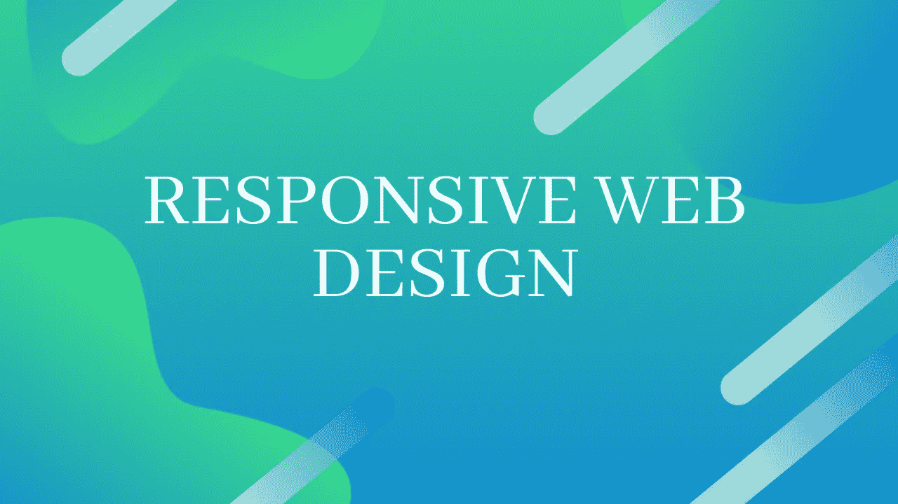
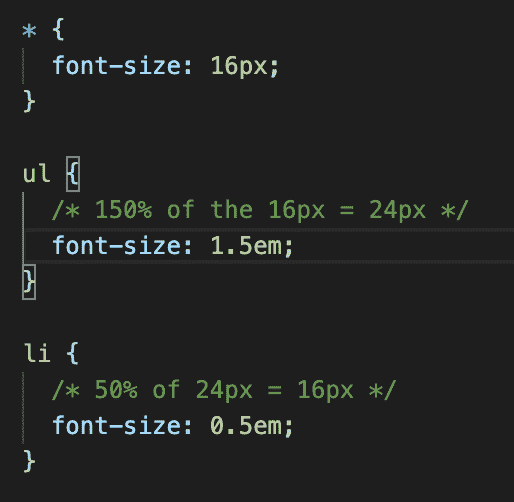
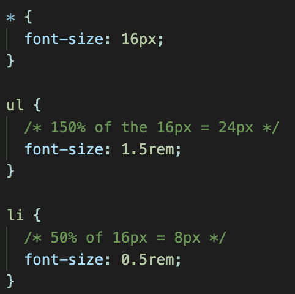
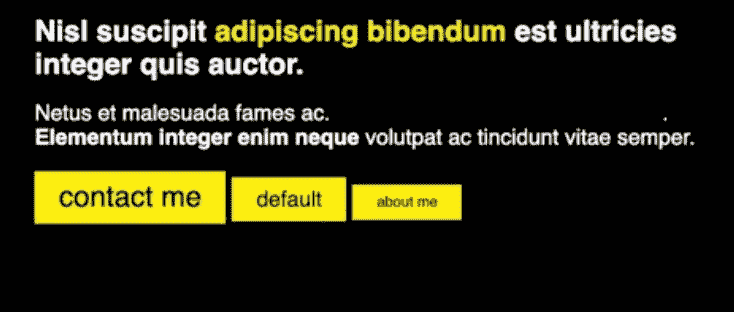
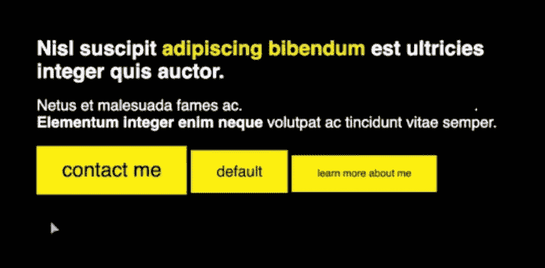
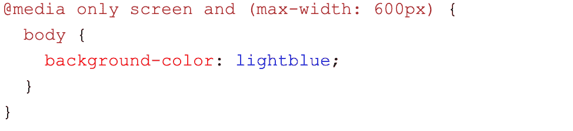
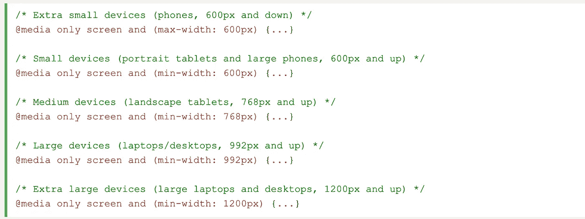
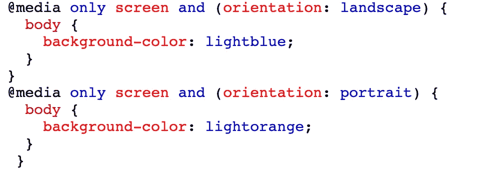
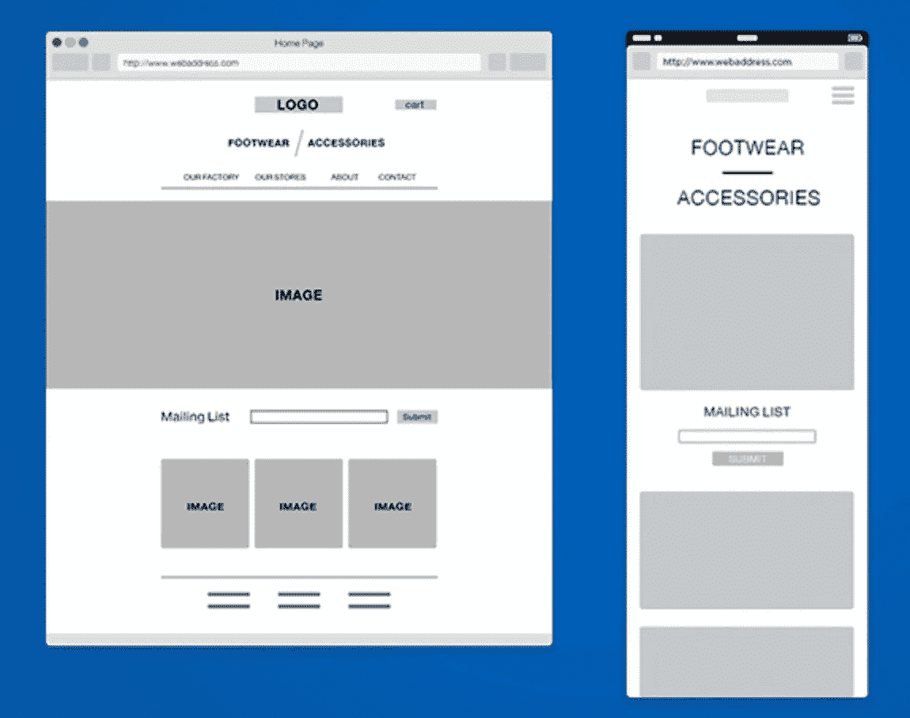

# 响应式网页设计

> 原文：<https://betterprogramming.pub/responsive-web-design-26e6f6213335>

## 从这里开始构建响应性网站和应用



作者照片。

对于我在熨斗学校的最后一个项目，我真的很想通过设计我的作品集来钻研响应式网页设计。所以首先，我需要学习响应式设计背后的基础知识:CSS 单元、flex boxes 和媒体查询。

# CSS 单位

视口指的是观察者看到的东西。

有三种不同类型的 CSS 单元。

## 绝对单位(固定)

1.  px —像素(最常见)
2.  毫米—毫米
3.  厘米—厘米
4.  英寸
5.  pt —点(一个像素的 4/3)
6.  pc —十二点活字/ 12 点(一点的*12 点)

像素是最常用的固定单位。除非是用于打印样式(例如，设计用户可能想要打印的交易单)，否则不应该真正使用像 cm 这样的真实单位。

## 相对单位(相对于字体大小)

1.  em —相对于元素的字体大小
2.  ex-相对于字体的 X 高度
3.  ch-相对于字体的 0 宽度
4.  rem 相对于根字体的字体大小

## 相对单位(相对于视口)

1.  vh —视口高度
2.  VW-视口宽度
3.  vmin
4.  vmax

最常见的相对单位是 rem、em、vh 和 vw。



什么时候应该使用 em 或 rem？

使用 em 作为边距和填充，使用 rem 作为字体大小，使元素按如下方式放大:



不是这样的:



## 百分比

%占据父元素的视区的百分比。

这在响应式设计中非常常用。需要注意的是，父节点的默认值是 100%。

# 柔性盒

> “flex 布局背后的主要思想是让容器能够改变其项目的宽度/高度(和顺序),以最好地填充可用空间(主要是为了适应各种显示设备和屏幕尺寸)。”——[CSS-Tricks](https://css-tricks.com/snippets/css/a-guide-to-flexbox/#flexbox-background)

添加 flex 是用于响应式设计的一个很好的工具，但我现在不会谈论它的太多细节，因为有很多关于 flex 的内容。它主要用于以特定方式对组件进行布局。

[*Flexbox Froggy*](http://flexboxfroggy.com/) 是一个学习如何使用 Flexbox 的好游戏，从非常简单的概念如`flex: centre`开始到更复杂的活动。

# 媒体查询

媒体查询允许您根据是否满足媒体查询的条件来添加或更改 CSS。例如:



这表示如果视窗小于 600 像素就运行代码。这不是一个真实应用的好例子，因为程序不太可能根据视窗大小改变颜色。一个更现实的例子是，如果宽度小于 480 像素(纵向模式下的手机尺寸)，则显示一个汉堡。如果宽度大于 480 像素，则在导航栏中显示菜单项。

您的基本媒体查询如下所示:

```
@media media type and (condition: breakpoint)
```

媒体查询的一些示例如下:

```
Media types: all, print, screen, speech
```

我在下面列出了一些条件。

用于指定设备类型的`max`和`min-width`:



图片来自 [W3Schools](https://www.w3schools.com/css/css_rwd_mediaqueries.asp) 。

并使用`landscape`或`portrait`:



图片来自 [W3Schools](https://www.w3schools.com/css/css_rwd_mediaqueries.asp) 。

既然已经了解了基本原理，让我们开始应用这些原理。

首先，一个好的经验法则是设计移动优先。这是因为它通常需要做的设计最少，这使得它更容易进行调整。这也使得媒体查询更容易，因为你只需要`min-width`，而不是指定最小和最大宽度。

你要做的是创建线框。为桌面创建线框允许你分解不同的组件来理解你要把 flex boxes 放在哪里。



[Adrian Cantelmi](https://dribbble.com/shots/1288498-wireframes) 在 [Dribbble](https://dribbble.com/) 上拍摄的照片。

所以如果你比较这两种不同的设计，你可以看到汉堡菜单和普通菜单之间的变化。这意味着对于这两个组件，您必须创建并切换两个菜单的可见性。你还会注意到，有些项目在桌面上是按行排列的，在手机上是按列排列的。例如，“鞋类/配饰”是您添加伸缩框并在行和列之间切换`flex-direction`的地方。这使得改变布局变得非常容易。

最后一件事是改变字体大小。有很多不同的方法可以做到这一点，但是查看[这篇文章](https://www.ionos.co.uk/digitalguide/websites/web-design/responsive-design-and-font-css-commands/)可以获得更多信息。

# 结论

这些是我用来使我的平台响应的不同概念。感谢阅读。