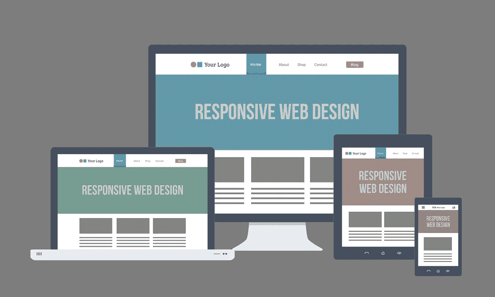
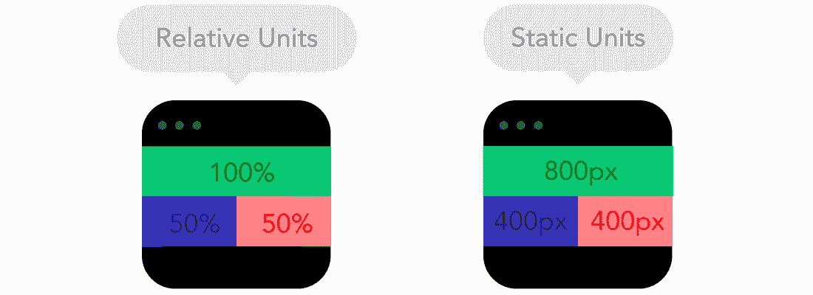
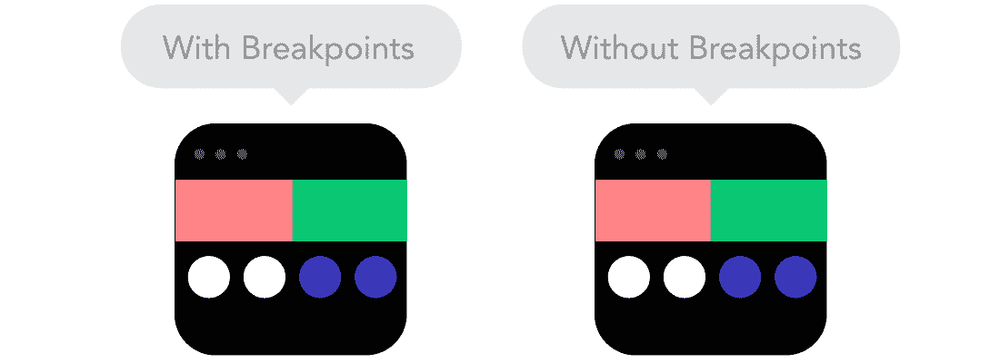
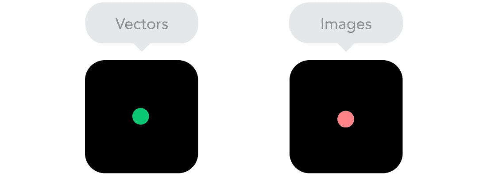

# 响应式网页设计和移动优先

> 原文：<https://betterprogramming.pub/responsive-web-design-and-mobile-first-5-basic-techniques-d89329f3e733>

## 五项基本技术



在达到 10 亿活跃用户大约一年半后，脸书达到了另一个里程碑:超过 10 亿活跃移动用户。关于社交媒体、互联网新闻和数字创新的最大内容来源之一 Mashable 发布了一项调查[称 17.4%的网络流量来自移动设备。这项调查于 2013 年公布，此后该比例逐年稳步上升。](http://mashable.com/2013/08/20/mobile-web-traffic/#EihgwfI3kkqS)

像 Tumblr 这样的社交网络正在将以前只在桌面网站上发现的功能转变为移动平台，使两种环境同步。同样由 Mashable 发布的另一项[研究](http://mashable.com/2013/10/24/content-consumption-desktop-mobile/#EihgwfI3kkqS)显示，花在社交网络上的时间有 65%来自移动设备。

根据 IBM 2014 年[的一份报告](https://www-03.ibm.com/press/us/en/pressrelease/45515.wss)，“感恩节那天，移动设备的在线流量第一次超过了传统的个人电脑。”根据 ComScore 的 2015 年[研究](https://www.comscore.com/Insights/Blog/Mobile-Internet-Usage-Skyrockets-in-Past-4-Years-to-Overtake-Desktop-as-Most-Used-Digital-Platform)，移动设备占数字媒体花费时间的 60%。已经是 2016 年了，根据这篇[文章](https://www.thinkwithgoogle.com/articles/mobile-retail-apps-sites-introduction.html)，“现在所有网购购买的 30%发生在手机上。”

所有这些文章都指向同一个事实:应用响应式设计概念的理由很多，而且还在不断增加。

# 理解概念

开发一个具有灵活、适应性强的布局和上下文，能够响应各种屏幕分辨率、设备和上下文的网站(或任何 web 应用程序)被称为响应式 web 设计。

想象一下一台屏幕为 320px 宽的设备和另一台屏幕尺寸为 1024px 的设备的区别。尺寸差异留下的空间太大，无法简单地拉伸布局，使内容适应可用空间。留下一个粗糙的空白处就更糟糕了。显然，这是一个响应式设计的例子。一些技术允许我们为最终用户提供更好的体验，以一种真正有意义的方式使我们自己适应每种类型的设备。

# 移动优先

当规划响应式设计时，我们为一个给定的屏幕尺寸定义应用程序设计的基础，从那里我们可以应用不同的设计规则，使内容逐渐适应不同的屏幕尺寸。这些规则与屏幕大小直接相关，因为它们可能会限制网站的某些功能。例如，在移动设备上显示大量图片会给用户带来糟糕的体验。

隐藏或显示网站的某些部分，缩小图像大小或调整字体大小，使页面没有水平滚动，确保没有任何内容重叠——甚至用垂直选择框替换水平菜单——所有这些都是设计规则的示例，可以操纵这些规则来允许应用程序响应可用的屏幕大小。用户体验的影响不能被夸大，尤其是在屏幕较小的设备上。

当我们决定应用这个概念时，我们需要从某个地方开始，因此需要决定关注点是什么。一种选择是通过考虑移动设备的限制来开始规划。那么，移动优先意味着如上所述的设计基础是为移动设备上的较小屏幕尺寸而定义的。换句话说，比如说，从开发一个 iPhone 4S (320 x 480)开始(不要拘泥于设备，这只是一个例子)。通过首先关注移动设备带来的限制，我们可以更容易地开发适用于更大屏幕的版本，逐步升级到平板电脑、台式机甚至智能电视。这是移动优先。

# 把手放在某物或者某人身上

那么，我们如何着手创建一个响应式设计呢？下面我们将探索五种基本技术来实现以移动为中心的响应式设计。本文将坚持使用相当基本的方法。

## 1.更改框的大小

在 HTML 页面中，每个元素都表示为一个矩形框，浏览器使用标准的框模型(CSS 框模型)来解释它。这个模型决定了一个元素所占空间的内容，也就是说，元素及其内容与其属性`margin`、`padding`、`border`的比例。

CSS 属性`box-sizing`定义了这个盒子模型相对于它的尺寸和间距度量的行为。浏览器默认为`content-box`，考虑的是原始尺寸(`width`、`height`等)。)，添加到间距(`padding`、`margin`等)。).


但是`box-sizing: content-box`的工作方式并不直观。如果我们希望一个元素用`5px`的`border`占据 50%的屏幕，并因此定义`width:50%; border-width:5px;`，结果会稍微复杂一些，因为这个元素的最终宽度将等于屏幕`width`的 50%加上`10px`边缘。如果屏幕有`100px`，结果将是元素的`60px`宽度。

因此，确保所有元素都将它们的`box-sizing`作为`border-box`是很重要的，这将防止所有属性的大小被添加到为元素定义的`width`中。

```
*, *:before, *:after {
    -webkit-box-sizing: border-box;
    -moz-box-sizing: border-box;
    box-sizing: border-box;
}
```

## 2.转换版式

为了得到流畅布局的结果，我们需要使用相对度量(`%, em, rem, vw, vh`)，当屏幕大小或字体改变时，它为站点提供了流畅性。我们使用这些测量单位如下:

*   PX: 用于不可变值的绝对度量，如`background`、`text-shadow`和 html `font-size`。
*   **%:** 被 W3C 规范分类为数据类型，而不是度量单位。用于容器(`section`、`article`、`div`)、流体网格和图像。
*   EM:相对距离单位，相对于另一个度量单位计算。它的值相对于父元素字体的大小(即，带有`font-size: 2em;`的元素将是父元素源大小的两倍，无论它是什么)。这在`font-size`、`margin`、`padding`中都有使用。与 percentage 不同，`em`像像素一样是一个固定值，但是它的值是从另一个元素的值计算出来的。
*   REM:和`em`一样，是相对距离单位。它的值是相对于文档根的`font-size`(也就是说，带有`font-size: 2rem;`的元素的字体大小是文档根元素的两倍，它可能是`html`标签或`body`标签，这取决于所应用的 CSS 规则)。`rem`也用于字体、页边空白和填充，但在某些版本的 Android 和 IE < 9 中无法使用。
*   视口单位:(vw，vh，vmin，vmax):用于容器，网格，图像，甚至字体。这是一个真正灵活和适应性强的单位。`vh`等于视窗(浏览器屏幕大小)高度的百分之一。例如，如果浏览器高度为`640px`，则`1vh`等于`6.4px`，同样，如果视口宽度为`320px`，则`1vw`等于`3.2px`。

有必要按照上述规范转换版式。例如，我们将在主体中应用`16px`的`font-size`，并使用以下 calc: size ÷ context =result 来调整我们的固定单位，如下例所示:

之前:

```
h1 { font-size: 24px; }h1 span { font-size: 18px; }
```

之后:

```
body { font-size: 16px; }h1 { font-size: 1.5rem; } 
/* 24 ÷ 16 = 1.5 */h1 span { font-size: 1.125rem; } 
/* 18 ÷ 16 = 1.125 */
```



## 3.设置视口

视口是设备的屏幕可见区域，在此显示网站。视口定制允许我们定义网站的可视初始分辨率，避免其小型化。

```
<meta name=”viewport” content=”width=device-width, initial-scale=1">
```

在下面的例子中，我建议一个更完整的配置，禁用缩放功能，并假设用户永远不需要这个功能(小心使用)。

```
<meta name=”viewport” content=”width=device-width, initial-scale=1, maximum-scale=1, user-scalable=no”> 
```

## 4.定义断点

[媒体查询](https://www.w3.org/TR/css3-mediaqueries/)是应用不同 CSS 样式的条件表达式，取决于某些规则，如视窗宽度。通过它的使用，我们定义了页面布局中的重要变化点。例如，只在大屏幕设备上显示某个元素，比如桌面。

```
/* Extra small devices (phones, less than 768px) */
/* No media query since this is the default in Bootstrap */
#banner { display: none; } /* banner not displayed *//* Small devices (tablets, 768px and up) */
[@media](http://twitter.com/media) (min-width: 768px) { … }/* Medium devices (desktops, 992px and up) */
[@media](http://twitter.com/media) (min-width: 992px) { … }/* Large devices (large desktops, 1200px and up) */
[@media](http://twitter.com/media) (min-width: 1200px) {
    /* banner displayed only for desktops */
    #banner { display: block; }
}
```

除了我们上面看到的尺寸规则，我们还可以定义设备方向、屏幕纵横比甚至分辨率等规则。

```
/* Devices on portrait mode */
[@media](http://twitter.com/media) all and (orientation:portrait) { … }/* Devices with screen size like 1280 horizontal pixels and 720 vertical pixels */
[@media](http://twitter.com/media) screen and (device-aspect-ratio: 16/9) { … }/* Devices with resolution greater than 300 dots per inch */
[@media](http://twitter.com/media) print and (min-resolution: 300dpi) { … }
```



## 5.对图像使用 SVG

SVG 代表可缩放矢量图形。它是一种 XML 语言，用于静态地、动态地或作为动画来描述矢量图形和二维图形。我们可以使用`object`标签在网站上相应地加入 SVG，以便为不支持 SVG 的浏览器提供一种图像选择。

```
<!-— ?xml version=”1.0" encoding=”utf-8"? --><svg version=”1.1" id=”Layer_1" xmlns=”http:// 
[www.w3.org/2000/svg](http://www.w3.org/2000/svg)" xmlns:xlink=”http:// 
[www.w3.org/1999/xlink](http://www.w3.org/1999/xlink)" x=”0px” y=”0px” viewBox=”0 0 80 80" \=”” enable-background=”new 0 0 
80 80" xml:space=”preserve”> 
 <circle fill=”#682A68" cx=”40" cy=”40" r=”40"></circle>
 <polygon fill=”#FFFFFF” points=”39.136,15.483 
 45.049,33.682 64.186,33.682 48.704,44.93 
 54.615,63.127 39.136,51.881 !
 !23.655,63.127 29.568,44.93 14.087,33.682
 33.223,33.682 “></polygon>
</svg><object data=”your-svg-image.svg” type=”image/svg+xml”> 
    
</object>
```



# 结论

以上只是极少数的基本技术，还有很多！其他一些专注于移动优先的响应式设计的技术值得一试，如[用户代理](http://www.johnfaulds.com.au/journal/responsive-images-with-expressionengine/)、 [HTML 5 标签](https://www.html5rocks.com/en/tutorials/responsive/picture-element/)、[响应式导航](https://css-tricks.com/convert-menu-to-dropdown/)等等。

我的建议是看一看这两个 CSS 框架中的一个， [Bootstrap](http://getbootstrap.com/) 或 [Foundation](http://foundation.zurb.com/) (尽管你可能不需要它)。然后，花点时间阅读这个叫做[可维护 CSS](http://maintainablecss.com/) 的令人敬畏的方法，它可以帮助你编写模块化的、可伸缩的、可维护的 CSS。

现在就看你的了！继续学习，继续实践，如果你发现了任何实现响应式设计的酷技术，来和我们分享吧！