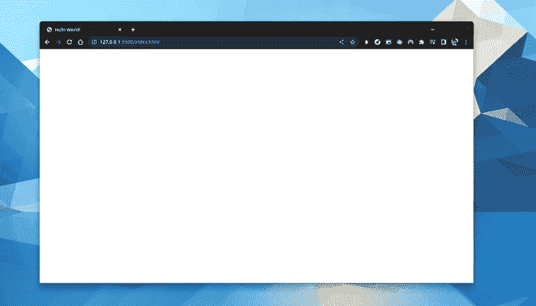
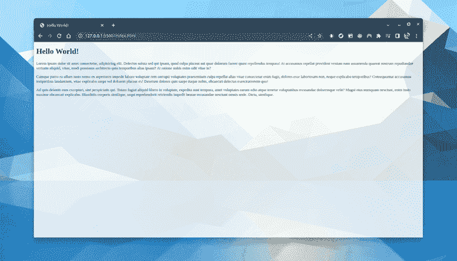
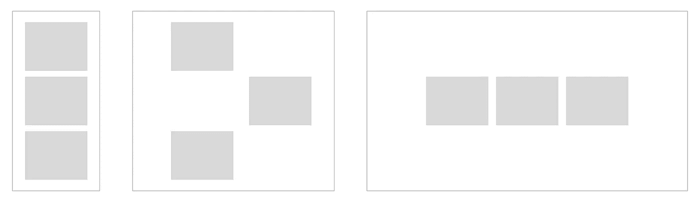
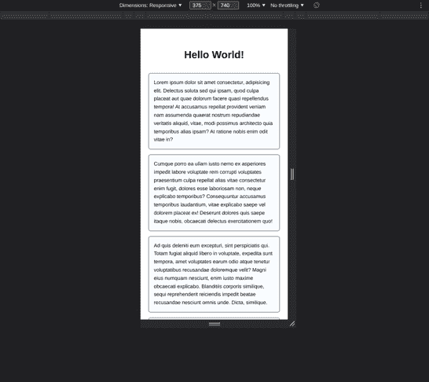
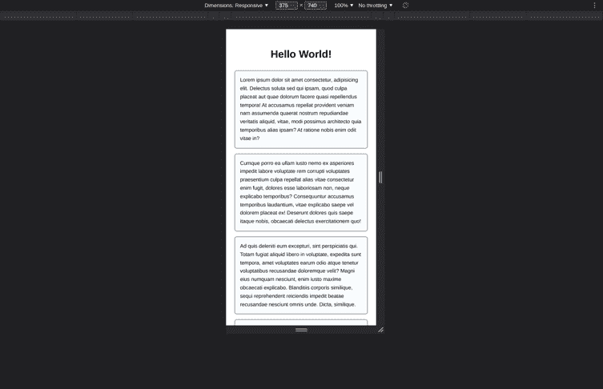
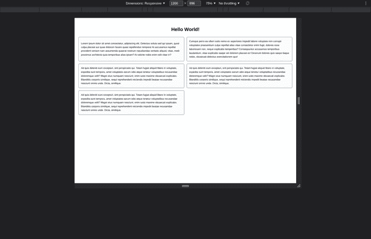

# 以正确的心态对待响应式设计

> 原文：<https://betterprogramming.pub/responsive-web-design-implement-your-website-for-different-screen-sizes-4e151274b88c>

## 用可维护的方法从头开始创建你的响应网站

迈克尔·克里斯滕森在 [Unsplash](https://unsplash.com?utm_source=medium&utm_medium=referral) 上的照片

# 介绍

有趣的是:在我们编写一行代码之前，网页就已经有响应了。

一个完全响应的，高性能的，简约的网站。

即使在我们写了 HTML 之后，它的响应仍然很快。

一个纯 HTML 的网站反应非常迅速

当我们将 CSS 引入其中时，问题就出现了。

添加样式和调整屏幕大小后视觉效果不佳

那么，我们应该如何解决这个问题呢？

# 从小而简单开始

开发一个网络项目需要进行大量的设计。这包括为移动设备和更宽的屏幕设备做设计，如果做得好的话。

设计的不同尺寸变化

那么，为了使我们的响应式实现尽可能顺利，我们应该从哪一个开始呢？

为了回答这个问题，让我们提出一些我们希望在样式实现中出现的标准:

1.  响应:我们希望我们的网站能够处理从手机到桌面(甚至更大)的任何屏幕尺寸
2.  可扩展:我们希望在不破坏对现有设备支持的情况下，轻松添加对新设备的支持。
3.  保持在一起:处理屏幕上特定元素的所有代码应该尽可能地靠近在一起，也就是说，不要分布在太多的类中(或者，上帝禁止，文件！).

在我们的设计中，哪一个最有可能默认满足这些条件？我个人发现这就是移动设计。

想想吧！它是响应性的，因为它通常只是一列东西，宽度是 100%(屏幕宽度)，用户应该在那里向下滚动。当我们扩大屏幕尺寸时，它本来就意味着要扩展得更复杂(一列变成一行或一个网格，一个隐藏的侧导航抽屉变成一个总是可见的侧导航)。最后，最有可能将相关的代码放在一起，因为现在还没有太多的代码。

有了这些信息，让我们想出一个基本的四步计划来实现我们设计的其余部分:

*   为我们想要支持的最小设备实施设计
*   开始放大我们的浏览器，直到我们发现一些不正常的地方
*   添加媒体查询以使其看起来正确
*   回到步骤 2

我们从最简单的设计的最低复杂度开始，随着规模的增加，复杂度也会增加。这样，我们允许我们的设计自然地扩展，而不是在不同的媒体查询中小心翼翼地改变属性。

所以，我们开始吧。

这是我们设计的 HTML(我省略了 lorem ipsum 和 HTML 脚手架的长块)。

我们设计的基本 HTML

风格结构和使我们的网站看起来视觉上有吸引力

最重要的属性在第 7、8 和 20 行。其余的让事情看起来更容易。在第 7 行和第 8 行，我们正在创建我们的列，在第 20 行，我们将列的元素设置为 100%宽度，以便它们填充屏幕，不管它的大小如何。

以下是它处理响应的能力:

演示我们的移动设计的响应能力

我得说那很好！当然，没有什么是不稳定的，无论我们添加多少内容，它只会滚动到底部而不会溢出。厉害！

接下来，我们增加屏幕的尺寸，直到事情看起来不对。当我们缩放屏幕时，我们注意到卡片变得太宽了。所以，我们再加上对笔记本电脑的支持(1200px)。

有趣的部分来了:我们不用再碰我们的 HTML 了！都是风格使然。

通过媒体查询更新我们的风格

我们在这里所做的只是添加一个简单的媒体查询，将 flex 转换成一个包含两列的网格。有多简单？请注意，媒体查询位于它正在更改的类内部。没必要到处找它！

另外，请注意我们仍然可以从第 5 行的`gap`属性中获益。那是因为 grid 和 flex 在属性上有很大的重叠！

它看起来是这样的:

我们支持大屏幕的响应式设计演示

当我们增加尺寸时，卡片又变得太宽了。让我们通过使卡片在一定的屏幕尺寸(1600px)后具有恒定的宽度来一劳永逸地解决这个问题:

对于`.card-container`类，我们添加以下查询:

将媒体查询附加到。卡片容器类

请注意，我们不需要再添加`display: grid`。这是因为先前的媒体查询仍处于活动状态，并且正在应用该属性。我们正在根据需要构建复杂的层次，但几乎没有拆除任何东西！

接下来，我们将以下查询添加到`.card`类中:

将媒体查询附加到。卡片类别

它看起来是这样的:

我们响应式设计实施的最终演示

这就是全部了！

想要更多关于 web 开发中处理样式的技巧吗？去看凯文·鲍威尔的《一个频道的宝石:【https://www.youtube.com/kepowob】T4。我在那里学到了很多我知道的东西！

## 资源

*   [GitHub 回购与最终实施](https://github.com/aziznal/responsive-web-design-example)