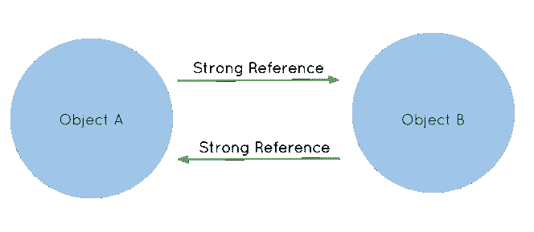
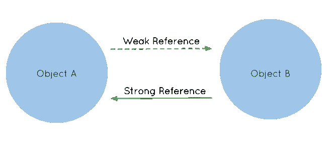

# Swift 中的保留周期和内存管理

> 原文：<https://betterprogramming.pub/retain-cycles-and-memory-management-in-swift-fb6226165b17>

## 构建高性能的 iOS 应用

照片由 [Kirill Sharkovski](https://unsplash.com/@sharkovski?utm_source=medium&utm_medium=referral) 在 [Unsplash](https://unsplash.com?utm_source=medium&utm_medium=referral) 上拍摄

在这篇文章中，我想解释一下保留周期和内存管理的概念是什么，以及如何通过简单地了解这些概念来改进您的 iOS 应用程序。

在 Swift 或任何其他 OOP 语言中，每个实例要么是值类型，要么是引用类型。

值类型实例意味着无论何时你想从该实例创建一个变量并将该变量赋给另一个变量，它都遵循一个称为“按值传递”的概念，这意味着它将该变量的值复制给另一个变量。

其中一个实例的更改不会影响另一个实例，因为原始值被复制到了另一个实例，而复制的值仍然是相同的。

另一方面，引用类型实例遵循按引用传递的概念，这意味着值不会被复制，但两个变量将指向同一个内存空间。如果一个改变，另一个也会改变，因为内存空间中的值会改变。

让我举一个简单的例子来说明这一点。下面是一个值类型示例:

由于 struct 是值类型，当我们使用 struct 创建一个变量并将其赋给另一个变量时，Swift 只将第一个变量的值复制到第二个变量。如果我们想改变第一个变量中的一个属性，并像上面一样打印它们，我们可以看到第一个打印语句打印出`Audi`，第二个打印语句仍然打印出`Mercedes`。

这里是一个为了可视化引用类型的`Class`例子:

首先，我们从`Car`类中创建一个变量，并将它赋给另一个变量。因为类是引用类型，所以两个变量(`car1`和`car2`)指向同一个内存地址。当我们将`car1`变量的品牌属性更改为`Audi`并打印两个变量的品牌属性时，两个打印语句都会打印出`Audi`。

一旦我们弄清楚了值和引用类型这两个理解内存管理的基本概念，我们就可以开始真正的工作了。

Swift 编译器处理值类型(结构和枚举)的内存管理。

在大多数情况下，编译器还处理引用类型类的内存管理。但是，您应该意识到，在某些情况下，类会导致编译器自身无法处理的内存问题。

通常，当引用类型(例如“一个类”)被使用完后，编译器会释放该实例，因此它的空间会从内存中释放出来。

> 提醒:在 OOP 中，我们可以将类变量赋给其他类变量。这种赋值叫做引用传递。这意味着实例的引用将被复制到另一个变量，而不是它的值。

这个概念可能会导致一些内存问题，因为不止一个实例指向同一个内存空间，因此编译器本身无法决定何时从内存中释放实例。在这种情况下，Swift 使用了一种称为自动引用计数(ARC)的概念来简化编译器的任务。

## 自动参考计数

自动引用计数背后的想法很简单。Swift 通过计算每个类实例拥有的引用来跟踪代码中创建的引用，以便知道何时从内存中释放类实例是安全的。

ARC 确保只要一个属性或变量有对它的强引用，类实例就不会被释放。我将用一个例子来解释它。

首先让我们假设约翰想买一辆新车。他使用上面的类为汽车创建了这个对象。每当创建一个新的汽车对象时，`init` 函数分配品牌名称并打印。

当 John 想卖掉他的汽车时，对象将从内存中被释放，因此`deinit` 函数将被触发。

现在，为了在实际例子中演示弧线，我们将从上面的`MyNewCar` 对象创建一些实例。

我们创建了三个类型为`MyNewCar`的变量，并且没有初始化它们。首先，我们用我们的`MyNewCar`类构造函数初始化一个变量。

该操作打印`Porsche is being initialized`语句，因为内存空间被分配给类对象的引用，因此当我们第一次初始化对象时，init 方法将被调用。

之后，我们将`porsche` 变量赋给另外两个变量，如上。我将在下面的段落中解释在这个作业的背景中发生的事情。

然后，我们将`porsche`和`mercedes`变量赋给`nil`。同样，我将在下面的段落中解释在这个作业的背景中发生的事情。

最后，我们将该类的最后一个实例(即`ford`)设置为零。

只有当同一个对象的所有实例都被删除后，该对象才真正被解除初始化并从内存中释放。因此，它打印出了 deinit 函数中的语句。

这个例子中到底发生了什么？我们是否创建了一个对象并将其复制到另外两个对象中？这个问题其实在本文第二段就有回答。

类是引用类型，它们存储在内存的堆部分。当你给同一个类对象分配两个或多个实例时，对象的内容不会被复制，它们只会指向内存中的同一个地址。所以，不复制值，只包含来自内存对象的地址。

该示例的主要目的是解释自动引用计数(ARC)的概念。对象的强引用的数量。当从一个类创建并初始化一个实例时，该对象的 ARC 为 1。当该实例被分配给另外两个实例时，ARC 将为 3(在将 porsche 分配给另外两个对象后的*)。*

当我们将这两个实例设置为 nil 时，我们移除了它们与包含该对象的内存地址的连接。他们不再指向那个地址了。弧会再次成为那个物体的`3–2 = 1`。因为 ARC 仍然大于零，所以这个类对象不会被释放，它仍然存在于内存中。

只有当我们设置了指向该对象的最后一个对象(也就是`ford` 对象)时，ARC 才会为零，类的`deinit`函数才会被调用，类的引用才会从内存中释放。

## 强对弱对无主

什么是强引用？我们将简要地看一下是什么使一个引用变强或变弱。

*在本文中，我将只简要提及强引用、弱引用和无主引用的概念。为了进一步解释，我将只写另一篇关于这个概念的文章。*

> 在 Swift 中，变量可以被声明为*强*、*弱*或*无主*。

为了让一个变量变强，不需要在声明前面写什么。强引用保护所指向的对象不被 ARC 释放。只要一个对象有一个强引用，它就不能从内存中被释放，即使包含该对象的屏幕已经从导航堆栈中弹出。

例如，上面例子中的每个变量都是强引用，因为没有像 weak 或 unowned 这样的关键字。

作者图片

与强引用相反，当没有指向被引用对象的强引用时，弱引用不会保护被引用对象不被从内存中释放。

指向对象时，弱引用也不会增加弧数。当没有强引用指向一个对象时，即使有弱引用指向，ARC 将为零，它将从内存中释放，使弱引用变量为零，因此所有弱引用变量都必须是可选的。为了进行弱引用，我们需要将变量声明为一个`var` ，并在其前面加上一个`weak` 关键字。

如上所述，当没有其他强引用指向对象时，弱引用变量将为零，因此它必须是一个可变变量。这意味着它不能是一个常量(不能声明为“let”)。

一个无主引用和一个弱引用非常相似，除了一些细微的差别。指向对象时，无主参照和弱参照都不会增加圆弧。

然而，一个无主被引用对象不必像 Swift 中的弱被引用对象那样是可选的，它们只应在你确定引用一旦在初始化过程中被设置就不会为零时使用*。*

这意味着，当被引用对象没有强引用时，从内存中释放该对象时，该对象不会清零。这产生了一个名为*悬空指针*的概念，每个 Swift 开发人员都应该知道。

因此，无主引用对象应该像*隐式展开选项*一样使用。我不会解释悬空指针和隐式展开选项的概念，因为它们的细节不是这篇内存管理文章必须知道的。我将在另一篇文章中详细解释它们。

我假设自动引用计数术语已经很清楚了。下一件大事是，如果我们不注意这个 ARC 概念会发生什么，以及它如何损害我们的应用程序的性能。

## 保留周期和内存泄漏

作者图片

我们都知道——至少现在是:)—为了从内存中释放一个对象，它的 ARC 值必须为零。但是，当两个对象通过强引用相互引用时，它们会阻止编译器释放其中一个对象，因为它们的 ARC 值总是 1。这就是所谓的保留周期。

在 iOS 应用程序中，当由于某种原因无法释放一定量的已分配内存空间时，就会发生内存泄漏。在应用程序运行时，该应用程序的内存使用量总是会增长。内存泄漏可能非常严重，因为它们会很快耗尽为应用程序保留的所有内存，并使 iOS 操作系统强制关闭应用程序。

保留周期通常会导致内存泄漏，因为无法从内存中释放所有导致保留周期的对象。我将给出一个小例子来演示我们如何导致一个保留周期和一个具有潜在内存泄漏的应用程序。

首先，我们假设约翰又想买一辆新车。为了帮助他，我们写了一个类似上面的`Car` 类。该类有两个属性；一个是类型为`String`的`brand`**T22，另一个是类型为`Person`的`driver` 。**

并行地，我们编写一个`Person` 类，它有两个属性；`name` 和`car`。这两个类都有初始化器和反初始化器函数，用于创建和销毁从这些类派生的对象。当任何一个对象被破坏(或设置为零)时，应调用`deinit` 函数并打印一条响应语句。

写完类后，我们用它们的初始化器初始化它们。现在，我们需要给`Car`实例(`mercedes`)设置一个`driver` ，给`Person`实例(`john`)设置一个`car` 。我们在第 5 行和第 6 行中就是这样做的。这使得`Car`和`Person`对象实例(即`mercedes` 和`john`)的 ARC 值都为 1。

当我们的工作完成后，我们希望从内存中释放它们的资源，我们希望销毁这两个对象，如第 8 行和第 9 行。我们希望它们的 ARC 值应该减少到 0，编译器从内存中释放它们的资源。然而，我们没有从两个类的 deinit 函数中看到任何 print 语句。出问题的是，我们造成了一个保留周期。

由于有两个相互引用的强引用，Swift 编译器不能从内存中释放它们的资源，因此当我们将它们设置为 nil 时，不能减少它们的 ARC 值。比如说；当我们将`mercedes` 实例设置为`nil`时，编译器不能将其 ARC 减少到 1，因为汽车对象仍然引用奔驰，反之亦然。

为了防止这种保留循环，我们需要声明至少一个变量为弱变量或无主变量。我们可以通过在`Car`类的`driver` 属性或`Person`类的`car` 属性之前添加一个`weak` 关键字来打破保留循环。

这是对保留周期和内存泄漏的简短介绍，以便理解 Swift 中内存管理概念的重要性。我会添加更多关于内存管理和类似主题的博客，因为在我看来这是一个需要学习的重要概念。

我希望这篇文章能够帮助理解内存管理概念的基本部分，并帮助您实现高性能的 iOS 应用程序。保持健康。