# 通过声明式编程重新思考测试

> 原文：<https://betterprogramming.pub/rethinking-testing-through-declarative-programming-335897703bdd>

## 编写可读和可维护的测试


克里斯特尔·海斯在 [Unsplash](https://unsplash.com?utm_source=medium&utm_medium=referral) 上拍摄的照片

这篇文章是关于编写声明性的可读和可维护的测试。我希望它可以成为一个开始提问的起点:我们是否应该有更先进的测试框架来鼓励并使编写声明性测试变得更容易，而不是我们目前基于步骤的通用和命令式测试？

我发现当前的框架抽象如`describe`、`it`和`asserts`只是表面上处理测试结构，但是仍然有足够的空间来探索我们在测试时实际做了什么。Arrange，Act，Assert (AAA)模型是有效的隐喻，但它也有同样的问题。结果是维护需求增加。以一种空白的心态开始每一次考试，意味着未来的问题。

因此，我将具体展示我在过去几年中在 JS 中使用的几个测试模式的例子。

我现在几乎用这些模式编写了所有的测试。在大型代码库中，它变得非常重要！

这些模式在测试中有非常积极的影响:提高可读性和可维护性，并允许代码评审中更好的协作。它们允许从测试中提取更多的价值。

我希望看到这些想法发展成为测试框架的最佳实践。

接下来我们会看到:

```
#1.1 [Tablelike Declarative Tests](#d238)
#1.2 [Custom Describes](#fb6d)
#1.3 [The](#d2d9) ['](#d2d9)[doTest](#d2d9)['](#d2d9) [Declarative Method](#d2d9)
#1.4 [Expressing Tests With DSLs](#f011)
#2\. [Special Note About Code Reusage](#2114)
#3\. [Benefits of the Declarative Approach](#6995)
#4\. [Summary and Conclusion](#f01d)
```

# 类似表格的声明性测试

让测试只是普通的函数调用，比如`describe`和`it`，通过动态调用`it()`可以非常容易地重构有重复部分的测试。

下面举个例子:`isWholeBlockSelected(content, selection):Boolean`函数给出`true`如果选择了一个块的全文。

`createState`已经有一些魔法，使用符号`[> ... >]`来声明选择在哪里，但是我们将在后面讨论(在用 DSL 表达测试中)。

这里的要点是，一旦我们理解了第一个`it`，那么所有其他的都差不多了。很多内容只是垃圾重复代码。这里有一个过滤器来显示大脑是如何阅读的:

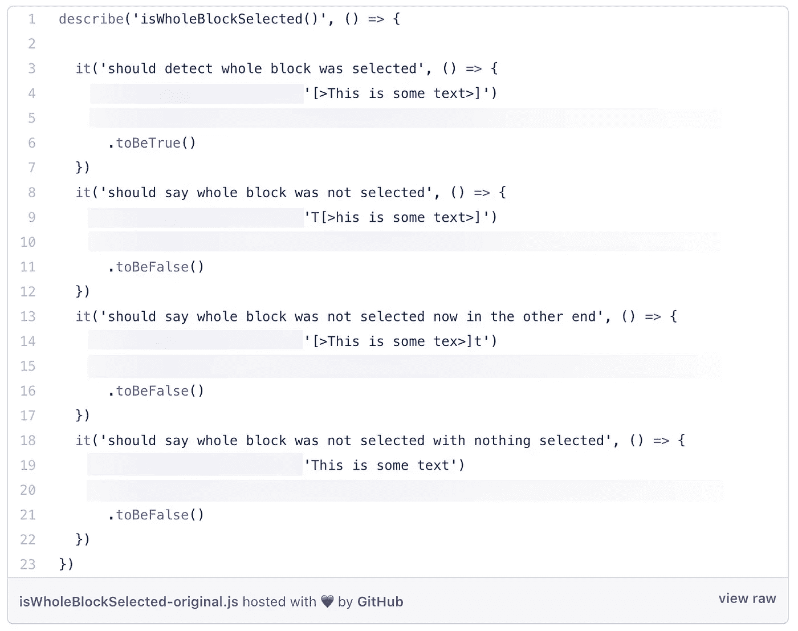

甚至连`it`的描述都被眼睛忽略了。但是如果`it`只是一个普通的电话，我们可以做得更好。那么我们可以做:

你可以忽略复杂的`forEach`部分，只专注于根据场景/输入+预期输出来分析所有情况。测试`title`变得毫无用处，实际上比仅仅阅读`case`更难读懂。运行它们会产生以下结果:

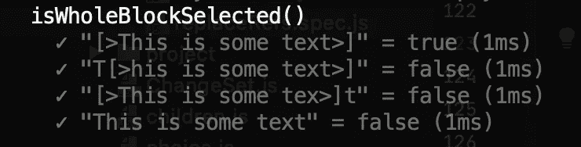

我们甚至可以创建一个通用的`testFunction`高阶函数来测试这样的函数。

这样的测试变成了一组案例和期望。这并不新鲜— [FitNess](http://fitnesse.org/FitNesse.UserGuide.WritingAcceptanceTests) e 提出了一个类似的方法，尽管是在一个特定的工具和环境中，并且是在验收测试的思想中，将焦点放在不同的利益相关者和更高的业务视角上。我认为这种思想可以应用于任何单元测试，不需要任何特殊的工具。即使目标只是开发者。

我们刚刚做的是*声明式编程。*我们已经将测试的信息部分(什么)从创建和运行测试所需的机制和行为(如何)中分离出来。这是整篇文章的基本思想。我们将进一步探索它。

我称它们为*类似表格的测试*，因为给定一个显式建模的框架，我们可以以表格的形式显示和编辑测试。

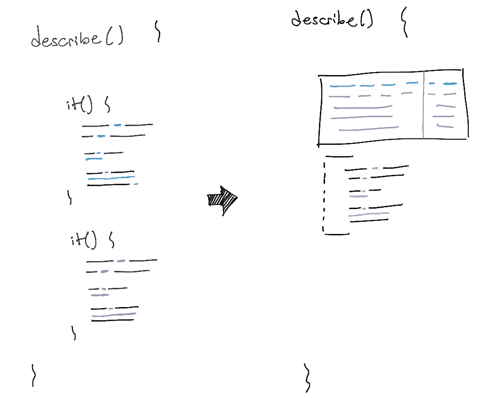

重新思考多重命令这是一个基于案例的测试

# 自定义描述

重用代码(尤其是安装代码)的另一种方法是创建自己的描述块。我通常这样做来创建不同类型的测试，大部分与架构部分相关。例如，我们有`describeMongoDB`来编写需要 Mongo 模拟设置的后端测试。

这种类型的`describe`为使用它来访问上下文的主体提供了有用的函数，在本例中是已配置的`db`实例和`mongoServer`。这里有一个使用`describeMongoDB` *的示例测试。*

在我目前的项目中，我们有一些这样的定制`describe`用于前端和后端。我们特别将它用于以某种方式集成架构的不同部分的测试，比如进行服务器调用的前端或需要 DB 的后端端点，等等。

所以我们有`describeDB`用于 DB 模型测试，`describeGQL`用于测试 GraphQL 查询/变异，`describeAction`用于前端 redux 动作，等等。封装设置代码有利于测试维护。下面是创建自定义`describe`的高阶函数:

我们使用这段代码创建自定义的`'`描述`'`来保持`'.only'`和`'.skip'`的功能。

# `'` doTest `'`声明方法

这是我们最近每次测试的目标。这是一种类似于使用表格的方法，但是控制方式相反。

我们测试的任何一段代码总是涉及至少> 1 个案例，那么我们为什么要把每一个`it`都看作是从头开始的一段代码呢？这听起来很自然，但这与我们在测试时(尤其是事后)遵循的心理流程有关:

*   为一个初始的案例做一个测试:我们把步骤 AAA 想成一个过程:*首先，我将创建一个时钟。那么，我会设置一个闹钟。然后，等等，等等。哦，我需要上下文中的另一个东西。让我们加上那个步骤，等等。*
*   然后，考虑新的情况:我们忘记之前的`it`并从头开始第二次测试，因为*这次不同。更糟糕的是，我们开始复制和粘贴第一个测试的部分。*

我们不应该只是判断那种复制粘贴。即使我们知道复制和粘贴是不好的，这样做也有一个潜在的原因。

所发生的是，我们试图快速地将我们的注意力集中在差异上，以便表达这些新的案例。我们不想在公共部分浪费时间——因为这就是测试的目的:考虑输入变化和预期输出。为这些步骤编写太多的程序代码会分散我们的注意力，很多时候我们会错过一些案例。

所以用另一个流程:

1.  先做个测试。
2.  当要开始第二个测试时，回到第一个测试，想想不同之处。他们共享哪些部分？他们在每一部分都分享了哪些特定的 app 概念(分解每个 AAA 阶段的 app 语义)。
3.  记住这一点，将第一个测试体提取到一个`doTest`函数中，这个函数现在将用于第一个函数。将其建模为给定的输入和预期的输出。把它变成绿色。
4.  然后，回到您将要构建的第二个案例，使用`doTest`编写它。

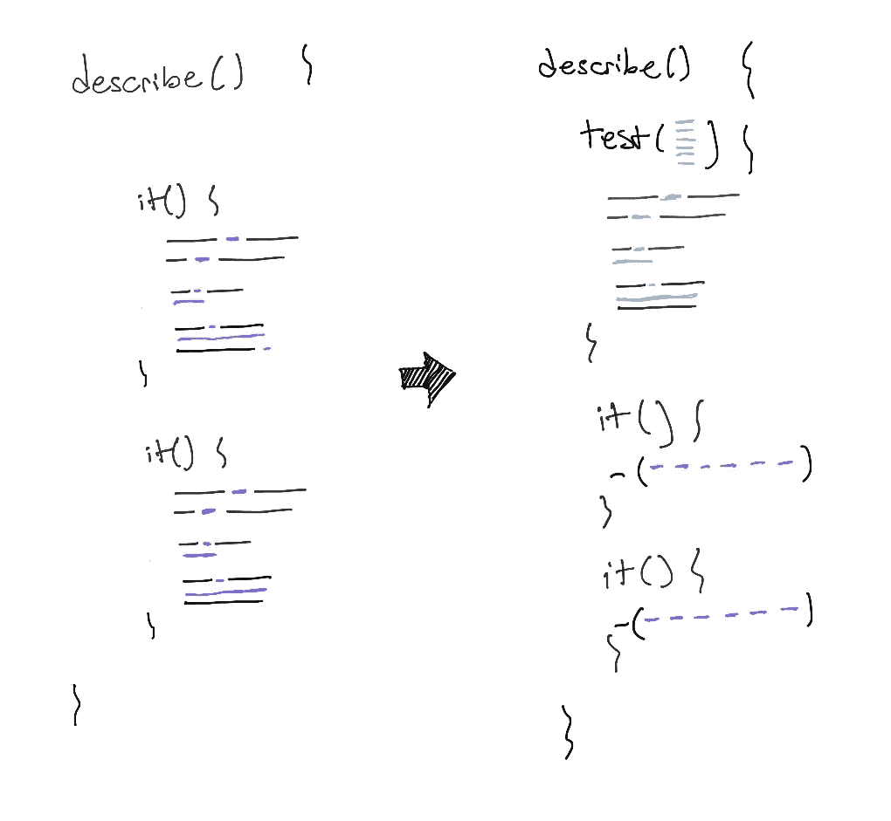

在左边，一些测试在混淆特定于测试的信息时复制命令性代码(黑色)。在右边，测试使用了一个`'` doTest `'`函数来重用代码和清理每个案例。

让我们看一个重构的例子。我们对一个纯函数和一个叫做`project`的 redux reducer 进行了一系列测试。我们正在测试它对特定动作的行为，`receiveChangeSet`。

一个`ChangeSet`就像是对数据对象的一个`commit`操作。这是分布式体系结构的一部分—前端接收另一个用户所做的更改，并更新这些对象的本地副本。所以我们有了包含新对象、对象和对象的。

如果我们一个接一个地按程序编写测试，我们将会得到许多这样的测试:

如果我们通过有用的信息过滤内容，我们会看到…这是眼睛最终需要努力去做的，当这样做时，有时它会错过一些小的差异。

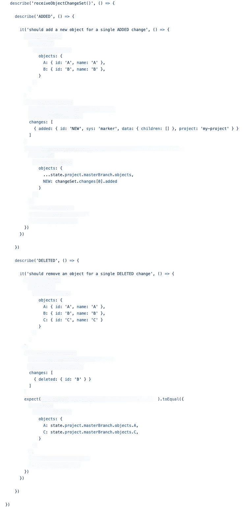

**注意:**我会在最后一节讲类似下面这样的断言。

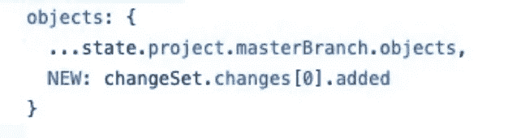

最后，每次测试的变化是:

*   存储中的初始对象是什么(上下文)
*   我们正在处理哪些变化(输入)
*   在应用那些改变(输出)之后，系统中对象的期望输出状态是什么

所以我们可以为这些特殊情况考虑一个`doTest`函数。这是重构后的版本:

下面是一个小截屏，展示了如何使用`doTest`重构其中一个。相当简单！

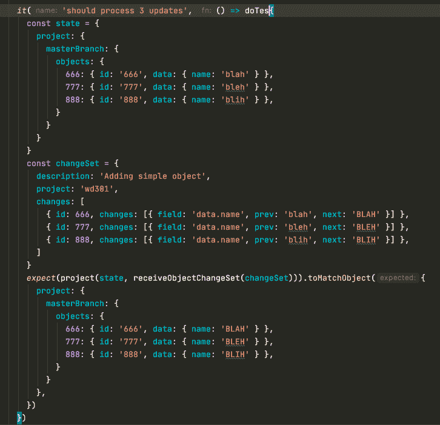

重构一个测试用例来使用一个`'` doTest `'`函数

# 用 DSL 表达测试

假设到目前为止，主要思想是通过用数据而不是过程代码来表达测试，从而使测试具有声明性。我们将上下文、输入和预期输出声明为数据。这适用于表样测试和`doTest`样式。

鉴于此，我们发现在某些领域，表达这些输入或输出可能非常困难。它可能包含大量代码，这会损害测试的可读性。(声明性的全部意义在于尽可能提高测试的可读性，正如[爱德华·塔夫特的数据-墨水比率](https://infovis-wiki.net/wiki/Data-Ink_Ratio)应用于编码时一样。)

让我们来看一些真实的例子。

## **例 1:一个富文本编辑器选择和实体 DSL**

第一个例子测试了`isWithinEntityMatch`函数，它给出了 DraftJS 文本编辑器的内容，告诉我们当前的选择是否在给定的实体内。

[DraftJS](https://draftjs.org/) 是一个在 React 中构建富文本编辑器的框架。我们用它来做游戏对话。在这种情况下，*实体*就是我们所说的*标记，*就像对话中的内联注释，由花括号`{MOVE_CAMERA ... }`分隔。这是它在用户界面上的样子:

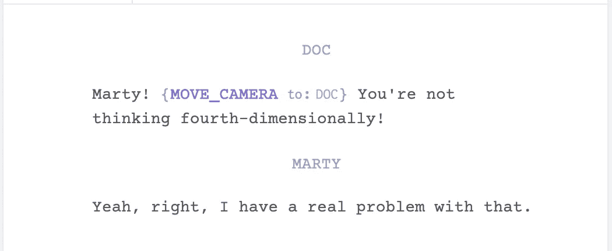

问题是这个文本实际上是一个非常复杂的 DraftJS 模型对象，涉及到特定于 ImmutableJS 和 DraftJS 的模型。因此，我们需要改进创建这些输入或上下文的方式，使它们具有声明性和可读性。我们可以使用 util 函数、工厂、构建器，最后，创建一种特定于领域的语言(DSL)来满足我们的特定需求。

在我们的例子中，我们想出了这个类似表格的测试:

该文本实际上是一个非常小的内部 DSL，仅使用常规字符串和符号约定:

*   `... {something} …`:实体的花括号(与用户类型相同)
*   `[|]`:表示用户光标位于该特定位置(折叠选择)
*   `[>`...`>]`:声明一个*扩展的*选择。也就是说，其中的内容当前是从左到右选择的。根据定义，光标位于右侧。
*   `[<` … `<]`:同上，但选择是从右向左，光标在左侧。(选择方向在文本编辑器中相当重要。)

使用 DSL 解析器可以在这里找到`expectIsWithin`的 impl。我没有内联它，因为它只是一个 impl 就有很多代码。但是看一看，想象一下如果每个测试用例都需要那么多代码来创建输入。这真的很难阅读和维护！

## **例子 2:撤销/重做逻辑**

另一个真实的例子:计算应用程序的撤销-重做堆栈的函数。这是一个纯粹的函数，一个*重选选择器。*这是一个函数，在给定(redux)应用程序状态的情况下，它导出一些数据。

在这种情况下，状态有一个已完成更改的列表。变化可能是:

*   **有规律的变化**:例如`A`(我们为了测试可读性而指定名称)
*   **撤销**:恢复变更。我们使用符号`U(A)`。
*   **重做**:重做变更。我们用`R(A)`。

与 DraftJS 示例相同，当考虑测试时，这些概念之间有很大的距离——比如*让我们测试变更 A、B、C；撤消 C 和 B；看看光标在哪里—* 我们实际上需要编码什么来创建这个场景。

表达输入/上下文将涉及大量代码。因此，我们再次创建了一个小型的、内部的、基于字符串的 DSL，以便能够用非常紧凑的语法来表达案例。

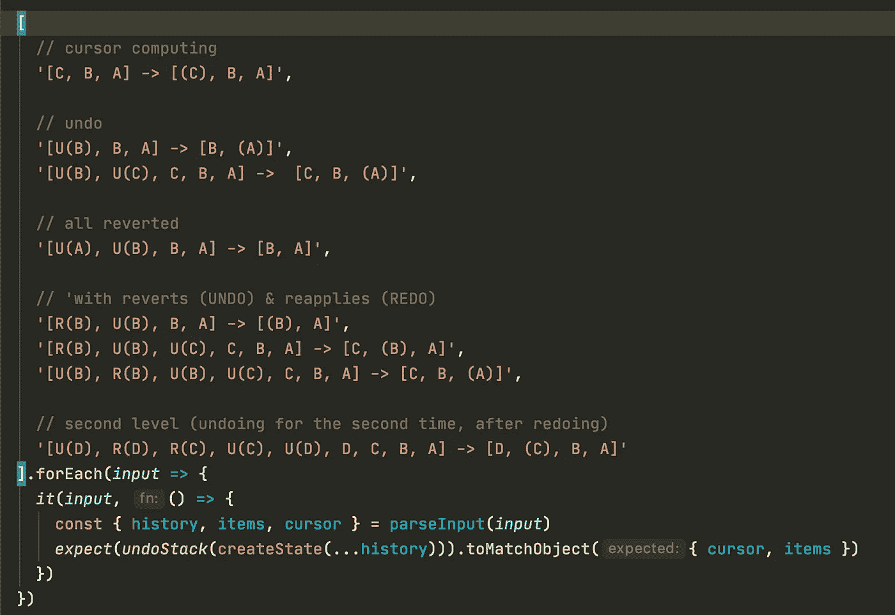

用于构建复杂输入对象的测试表和 DSL。数组中的每个字符串都是一个测试用例，用一个小而简单的 DSL 符号来表示。

实际上，我们最后只是抄写了我们在白板上使用的相同符号来调查问题并提出解决方案。

它是这样写的:

```
// [latest_change    ←   first_change]   => expected_stack[ R(B), U(B), U(C), C, B, A ]            => [C, (B), A]
```

用户做了一个变更，`A`，接着是变更`B`和`C`。然后他们解开了`C`和`B`，但紧接着，他们又重做了`B`。那么我们在哪里？

```
[C, (B), A]
```

这意味着`A`被应用，C 没有(已经撤销)，我们目前在`B`(也应用)。从这一点，我们可以撤销`A`或重做`C`

两个输入以及预期的输出都被表示为一个字符串 DSL，但是底层模型包含复杂的数据结构，这使得测试难以阅读。

[这里的](https://gist.github.com/javierfernandes/34186422ba8a444d1bee4f4deba092f8)是`parseInput`的 impl，而后者又有自己的测试。因此，为了进行更好的测试，我们必须创建一种语言，一个解析器(尽管这很简单)，并为该解析器进行测试。想象一下，如果使用测试工具就能更容易地做到这一点，那该有多好？

DSL 允许我们去掉许多样板代码，只提取对测试有意义的部分。这样更容易思考漏例、冗余例等。尤其是其他人。

# 关于代码重用的特别说明

我们可以认为我们在所有这些例子中所做的是在测试之间重用代码。但是*单独重用代码*并不是一个好的经验法则——它应该受到测试体验如何结束的约束。

有时重用代码有降低测试代码可读性的缺点。我们不想在测试中出现这种情况。

我发现有两种情况会发生这种情况:

## **断言**

正如我们在`receiveChangeSet`示例中看到的，断言试图通过重用来自上下文和输入的数据来避免代码重复。

下面是例子——已经用`doTest`缩短了:

这非常好，而且避免了重复代码。但是它仍然牺牲了测试的可读性。最后，我发现牺牲重复更好。它让作者以外的人更容易阅读。如果我们真的想避免重复，我们可以通过使重用众所周知的输入而不是测试本身变得更容易来做到这一点。像这样:

但是我们在从测试中提取信息时要小心，以避免下一个问题。

## **重复使用输入和输出**

我发现的另一个反模式是以这样一种方式重用测试输入和域对象，使得以后阅读代码变得非常困难。

以这个例子为例，一个测试首先声明了许多在测试用例之间重用的对象。域名并不重要。也是选择者的考验。

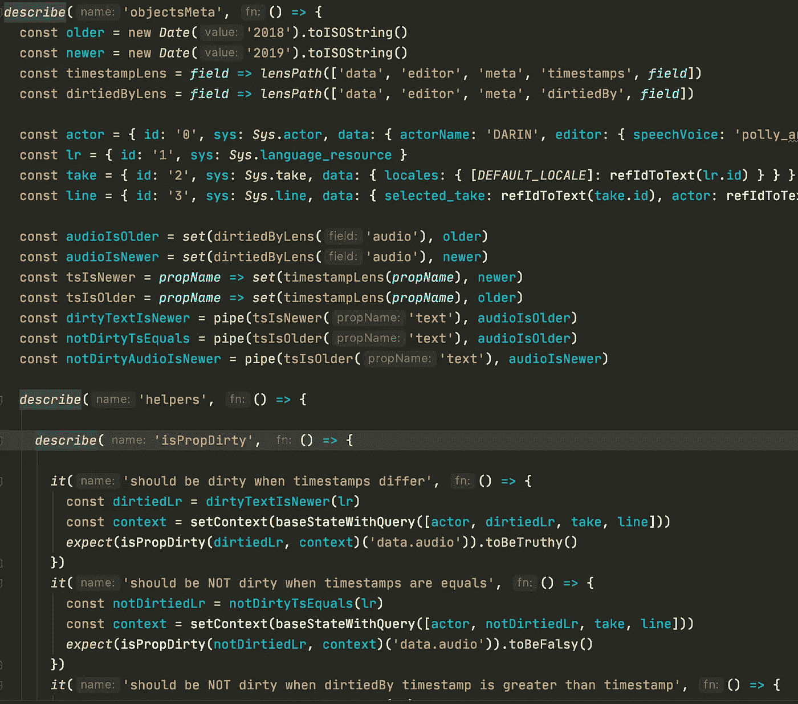

如果我只看了`it`，我真的无法理解它应该测试什么。

为了理解它，眼睛需要频繁地在`it`和文件顶部的对象之间跳跃。此外，如果一些对象只被一些测试使用而不被其他测试使用，那么一次读取所有对象可能没有任何意义。测试遗漏了最重要的信息片段。

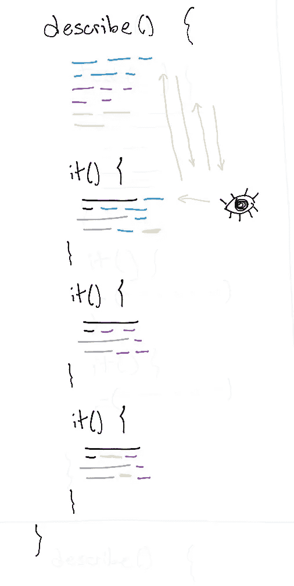

在失去测试语义的情况下重用代码增加了读者的认知负荷。眼睛需要在测试代码和重用代码之间来回跳跃。

这与我们在前面章节中看到的相反。测试复制了命令性代码，同时提取了声明性数据。

这里的结论是，我们应该在测试之间重用的最重要的部分是那些必要的部分(测试的 *how* )，而不是输入/输出定义(测试的 *what* )。否则，它们就失去了明确的意义。

# 声明式方法的好处

设计声明性表达测试:

*   可读性更高
*   改善维护
*   提供一个更好的过程来整理你的思维。(先做祈使句测试。然后，根据输入、它们的作用和你的期望，概括出第二种情况的函数。)还要花点时间思考不同的场景，以及如何用这个测试的语言表达出来。
*   充分利用代码审查的价值:审查一大组有许多命令性和/或重复代码的测试需要额外的脑力劳动，而不仅仅是考虑测试覆盖范围(就 LOC 中可能没有的场景而言)。这种方法完全减少了这种工作，允许评审者关注缺失的案例，以及当前的场景和期望从领域的角度来看是否有意义。

# 总结和结论

这并不新鲜:好的测试需要努力——和我们花在核心逻辑上的努力一样。仅仅使用 AAA 测试模型不足以写出好的测试。我们应该探索，作为开发人员，我们在这些阶段中做什么，在测试和我们的整个软件开发过程中识别模式和它们的结果。

和许多其他问题一样，声明性是我们处理这类编程问题的最强大的元模式。

在编写测试时，测试维护依赖于两种实践。你可以跟着他们:

*   编写声明性测试
*   不要通过将声明排除在测试之外来省略它们(或者在其他文件中，或者在同一个文件中，但是向上/向下——避免阅读时眼睛跳跃的需要)。而是寻找最短最具表现力的方式来表达它们。不多不少。这几乎是爱德华·塔夫特应用于测试的数据-墨水比率。
*   为每组测试创建一种语言(广义上的)。它可以是一个表，一个`doTest`函数，甚至是一个 DSL。将“什么”和“如何”分开。

当你写测试时，你不是在为代码写测试——你现在正在测试！你应该为读者编写测试。测试必须有同理心。

我期待着新的工具和框架，将这些和许多其他想法纳入其核心。测试不应该这么难——我们可以做得更好。有很多值得探索的地方！