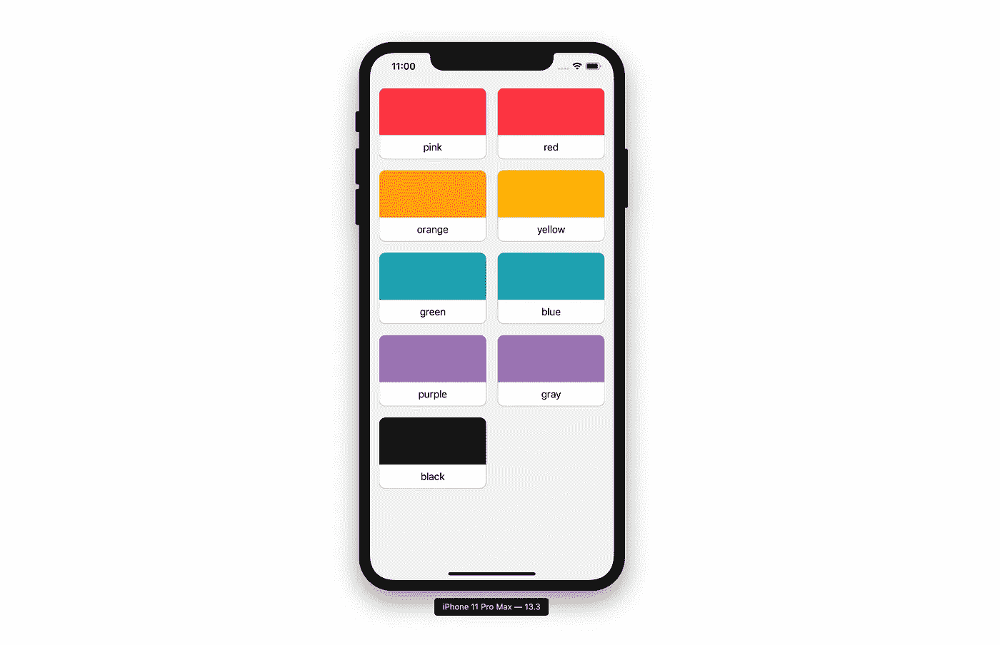

# 使用 SwiftUI 构建可重用的集合视图

> 原文：<https://betterprogramming.pub/reusable-collection-view-with-swiftui-118f8c72730>

## SwiftUI 中缺少 CollectionViews，但下面是我们如何轻松构建自己的视图

随着 SwiftUI 的引入，构建可重用视图变得异常简单。SwiftUI 的视图构建器允许我们将视图嵌入到其他视图中(如 VStack、HStack 等)。

今天我们将通过构建一个简单的`Collection`视图来展示这一功能。以上是我们将要构建的内容(卡片可以替换为任何数据阵列和卡片视图)

# 入门指南

首先，创建一个名为`Collection`的新 SwiftUI 视图。首先，我们需要添加一些通用约束:

*   `**Content**` ( `View`)将代表我们在集合单元格中嵌套的任何视图类型
*   `**Data**` ( `Hashable`)将代表我们收集的数据来源

接下来，我们将添加一些属性和一个初始化器。

*   `**data**` ( `Binding<[Data]>`)将是提供给`Collection`视图的数据。我们在这里使用一个绑定来确保任何变化都反映在我们的`Collection`视图中。
*   `**viewBuilder**` ( `(Data) -> Content`)将返回我们嵌入到`Collection`单元格中的视图
*   `**cols**` ( `Int`)是我们要显示的列数
*   `**spacing**` ( `CGFloat`)是我们想要的单元格间距(垂直和水平)

现在，让我们添加一个助手函数来标识一个数据项，给定一个特定的行和列，并使用我们的`viewBuilder`将它作为`View`返回。

接下来让我们画出我们的`Collection`。

我们首先需要一个`GeometryReader` 来给我们一个`View`框架，这样我们就可以计算出`ScrollView`中内容的最大单元格宽度和最小高度。`ScrollView`内容是使用辅助函数`setupView(geometry:)`绘制的。

在这里，我们简单地创建了两个栈来迭代我们的行和列索引。这样，我们可以使用每个索引组合，通过辅助函数`cell(rowIndex:, colIndex:)`返回我们的单元格。

这就完成了我们的`Collection`组件。现在，让我们将它添加到我们的`ContentView.swift`中来看看它的运行情况。

下面，我们将一组颜色传递给组件。

现在，让我们为每种颜色添加一些显示在`Collection`视图中的单元格内容。

这就完成了！