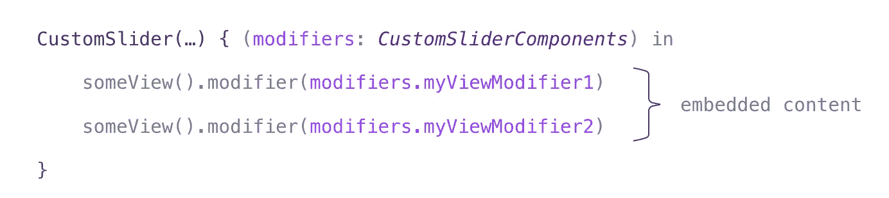
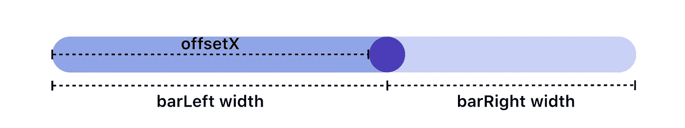
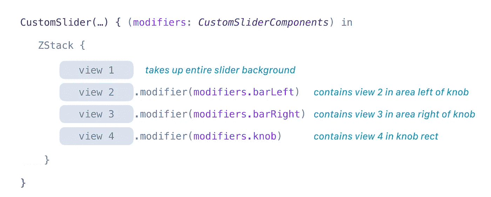

# SwiftUI 中可重用的组件:自定义滑块

> 原文：<https://betterprogramming.pub/reusable-components-in-swiftui-custom-sliders-8c115914b856>

## 构建一个完全可定制的滑块组件，您可以在任何地方重用和重新设计

定制控件的外观是大多数 UI 开发人员都非常熟悉的一项工作。

鉴于这种麻烦，我想我应该展示 SwiftUI 的简单性，用最少的代码创建完全可定制的组件。

在本教程中，我们将构建一个简单的滑块，包括旋钮的完全可定制的外观，旋钮前面的栏区域，旋钮后面的栏区域，以及栏的整个跨度。

# 入门指南

让我们从创建一个名为`CustomSlider.swift`的新 SwiftUI 文件开始。

首先，让我们创建一个助手函数来简化从值到 *x* 坐标的转换，反之亦然。在`CustomSlider.swift`底部粘贴以下内容。

# 视图修改器

为了创建滑块元素(像一个旋钮)，我们将使用视图修改器。如果您不熟悉视图修改器，它们基本上允许您创建一个样式快捷方式。

出于我们的目的，我们将使用它们来定位和调整嵌入元素的大小。我们将通过预先计算`CustomSlider`组件中的修饰符属性，并将它们分配给嵌入的内容来实现。例如:

现在，让我们创建一个名为`CustomSliderModifier`的视图修饰符，用它我们将元素属性传递回我们的内容视图。

因为我们有几个不同的元素想要区分，我们将创建另一个结构，`CustomSliderComponents`，按名称组织我们的修饰符。在`CustomSlider.swift`底部粘贴以下内容。

barLeft 代表滑块从最左边到旋钮中心的区域。barRight 代表滑块从旋钮中心到最右边的区域。

# 构建 CustomSlider 视图

现在让我们开始用一些属性和初始化器构建我们的`CustomSlider`视图。

*   `**value**` ( `Binding<Double>`)将滑块值的变化传递给(或来自)我们的父视图。
*   `**range**` ( `(Double, Double)`)将定义滑块的最小值和最大值
*   `**knobWidth**` ( `CGFloat?`)为我们提供了一个可选参数来覆盖默认旋钮宽度(在本教程中设置为自定义滑块高度)
*   `**viewBuilder**` ( `(CustomSliderComponents) -> Component`)将作为我们输入视图的占位符。不要忘记在我们的`CustomSlider`声明中包含对`<Component: View>`的通用约束。在这里，我们将视图修饰符(`CustomSliderComponents`)传递回父视图，作为回调的参数。

现在，让我们给`CustomSlider`添加一个函数，用于每当拖动旋钮时重新计算我们的滑块值。

给定一个滑块值，添加另一个帮助函数来计算旋钮的 *x* 偏移量(以像素为单位)。

为了在上面的计算中使用我们的视图框架，我们需要将我们的身体包裹在一个`GeometryReader`中。让我们用下面的代码替换我们的自定义滑块:

我们把我们的视图体分解成一个独立的函数来简化我们的计算

现在让我们开始在函数`view(geometry:)`中添加构建视图的逻辑。首先，让我们创建一个`DragGesture`来执行我们的`onDragChange(_ drag:,_ frame: )`函数。

稍后我们将使用手势修改器将它传递到我们的视图中。

请注意，最小拖动距离设置为零，所以只需单击我们的滑块将移动旋钮到点击的位置

接下来，让我们计算旋钮偏移量、旋钮大小、左栏大小和右栏大小。注意`offsetX`反映了滑块视图的前缘和旋钮的前缘之间的距离。

接下来，我们使用上一步中计算的值构建视图修改器。然后，我们将修改器作为参数传递给视图生成器，并添加拖动手势。

这就完成了我们的`view(geometry:)`功能。下面是已完成功能的总结。

现在我们的`CustomSlider`组件已经完成。让我们准备好`ContentView.swift`，这样我们就可以开始添加一些滑块了。

我们将添加一个属性来保存我们的滑块值(类型为`State<Double>`)，并添加一些布局视图来包含我们的滑块。

用以下内容替换您的`ContentView`:

# 使用我们的自定义滑块组件

记住，我们的组件回调一个包含预先计算好的视图修饰符的结构，以确定不同元素的位置(就像我们的旋钮)。

修改器的使用是可选的(如果不想显示旋钮，就不要使用修改器)。

最后，请注意，出于本教程的目的，滑块旋钮宽度默认采用滑块的高度。您可以通过在初始化器中输入`knobWidth`参数来覆盖宽度。

现在让我们使用新组件创建一些滑块。

# 简单滑块

注意，因为这个例子省略了旋钮宽度参数，滑块旋钮将`CustomSlider`帧的高度作为它的高度和宽度。

# 旋钮上有值的渐变滑块

注意，这个例子省略了`barLeft`和`barRight`修改器——因此我们只看到一个旋钮和完整的滑块背景。

# 文本覆盖滑块

# 带箭头记号的滑块

这个滑块包含几个半透明的元素。确保包含相同的窗口背景颜色(设置在我们的内容视图主体的顶部),以实现与上面相同的外观。

**注意**:这个滑块和下一个滑块使用了苹果的 SF 符号。

我强烈推荐使用这些。您可以通过下载 [SF Symbols 应用程序](https://developer.apple.com/design/downloads/SF-Symbols.dmg)查看完整的图标选择。要在 macOS 中使用它们，将这些值作为文本粘贴到一个`Text`视图中。为了在 iOS 中使用，只需使用`Image(systemName:)`初始化器将其初始化为一个映像。欲了解更多信息，请访问[苹果的 SF 符号概述](https://developer.apple.com/design/human-interface-guidelines/sf-symbols/overview/)。

# 带 v 形右图标的滑块

为了便于查看，上面滑块的颜色是反色的。

**注意**:该滑块包含一个 SF 符号。如果您在显示图像时遇到问题或需要更多信息，请参阅此滑块上方的注释。

# 频率条滑块

首先，我们需要一个形状来遮盖这个视图。下面是构建上述形状的一些代码。

遮罩频率条滑块的形状

现在我们的形状已经准备好了，我们可以构建滑块了。

自定义滑块代码来构建频率条滑块

这就完成了本教程。希望你喜欢它！