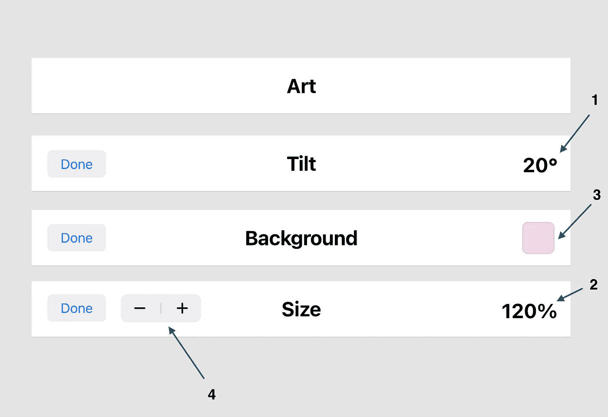

# SwiftUI 中可重复使用的可定制视图

> 原文：<https://betterprogramming.pub/reusable-customisable-views-in-swiftui-db6af84639fa>

## 通过两个实现来理解

SwiftUI 在重用视图方面非常出色，但创建可定制的可重用视图可能非常棘手，因为 SwiftUI 需要在编译时知道视图层次结构中每个视图的类型。让我们考虑下面的设计(这里设计的质量不是问题，只是想法)。

有四个工具栏对应四个不同的屏幕。它们都有一些共同的特点，如*完成*按钮和标题。此外，一些屏幕在侧面有一个或两个自定义视图，如倾斜 **⁽ ⁾** 和尺寸 **⁽ ⁾** 指示器以及颜色指示器 **⁽ ⁾** 和尺寸步进器 **⁽⁴⁾** 。

该工具栏将成为可定制可重用视图的绝佳候选，因为我们有一个通用的重复模式，并且有一个适用于每个非通用组件的概念——定制视图只能位于工具栏的左侧和右侧。

我们有两种方法可以做到。

1.  通过创建包含所有(自定义和公共)视图的视图，并基于配置模型显示它们
2.  通过创建描述基本模板的视图并接受自定义视图作为参数

**第一种方法**更容易实现和理解，但从长远来看，更难维护和添加新的变体。首先，我们需要有一个模型来描述所有可能的布局。

上面代码中描述的`HeaderViewModel`、*、*，涵盖了工具栏的任何变体。我们现在需要的是一个理解这个模型的视图，并且可以根据模型配置显示任何视图组合。

在上面的代码片段中，`HeaderView` *，*总是显示标题，并根据所提供的模型有条件地显示左边的按钮和任何自定义视图。

这种方法的问题是，如果我们有一个工具栏设计的新变体，我们将需要修改`HeaderView` 和`HeaderViewModel` 来提供要显示的配置和 UI。

更好的方法是让`HeaderView` 的客户端在初始化阶段提供自定义的左右视图，这样`HeaderView` 就不需要知道除了通用 UI 和通用配置之外的任何东西。

**第二种方法**描述了`HeaderView` 的客户端如何重用公共 UI 和功能，并直接构造和提供自定义控件。这种方法更具可伸缩性，因为定制控件总是由客户端提供，而不需要更新`HeaderView` 或`HeaderViewModel`*。这种方法也更灵活，因为客户端可以访问正在显示的实际定制视图，而不是只访问模型。*

*首先，我们需要让`HeaderView`接受描述左自定义视图和右自定义视图的两个视图。由于`HeaderView`不能像我们在 UIKit 中使用 UIView 一样，只接受 SwiftUI 中任何视图的基本类型(技术上我们可以使用`AnyView`，但这会带来性能损失，并且需要客户端在`AnyView`中包装自定义视图，这并不理想)，我们将向`HeaderView`添加两个符合视图协议的通用参数，它将保存客户端提供的视图类型。*

> ***注意:** SwiftUI 在编译时需要知道视图层次结构中每个视图的类型，这就是为什么提供带有通用参数的定制视图类型是必要的。*

*这里我们有一个更新的`HeaderView` 可以显示任何种类的视图作为左控件和右控件。这些视图的类型总是某种类型的*视图*并且客户端负责提供它。我们将自定义视图作为用 *ViewBuilder* 属性修饰的闭包传递给`HeadingView`初始化器，以便在表达自定义视图的构造时给予客户端最大的灵活性。*

*现在，客户端可以在`HeaderView`初始化阶段提供左右控件，并且不会溢出任何与定制视图相关的功能*。**

*当提供左视图和右视图时，这种方法非常有效，但是当我们不需要左视图和右视图，或者除了标题和左按钮之外不需要任何自定义视图时，该怎么办呢？SwiftUI 为我们提供了一个叫做`EmptyView` *的占位符视图。*对于不需要左控制键、右控制键或两者都不需要的情况，我们可以传递一个`EmptyView` 。*

> ***注意:**记住，我们需要为`rightControls`和`leftControls` 传递一些东西，为`HeaderView` 的泛型参数提供类型。*

*举个例子，下面是`Tilt` 工具栏变体初始化，它指定了`rightControls` ，并为`leftControls` *提供了一个`EmptyView` 。**

*虽然它完美地解决了这个问题，但它并不理想，因为客户端需要关注实现细节，并显式地传递一个`EmptyView` 来满足编译器。有一种更干净的方法。我们作为`HeaderView` *、*的作者，可以把这种常见的情况提取成一种扩展。假设`LeftControls` 泛型参数是一个`EmptyView` ，我们可以提供一个初始化器，它会将一个`EmptyView` 传递给标题视图初始化器，并且只接受`rightControls` ，因为`leftControls` 已经被认为是一个`EmptyView`。*

*我们可以为空的`RightControls` 创建另一个扩展作为`EmptyView` ，并为左右控件都应该是空视图的情况创建另一个扩展。*

*现在我们可以用一种更简洁的方式重写`Tilt` 头变量，允许客户端只指定它需要的视图，而不需要考虑`HeaderView` *的实现细节。**

*我们最终实现了两种方法的完美结合。客户端通过配置`ViewModel`提供标题和左按钮数据，因为相应的视图对于工具栏的任何变体都是相同的，并且它们的数据是唯一不通用的东西。此外，客户端仅在使用定制视图的地方提供定制视图，并且仅在需要时才提供。*

*您可以在 [GitHub](https://github.com/lutes1/DemoProject) 上找到描述这两种方法的工作示例。*