# 使用 Terraform 模块的可重用 EC2 实例

> 原文：<https://betterprogramming.pub/reusable-ec2-instances-using-terraform-modules-59aac51f1fb>

## 掌握 EC2 重组的指南

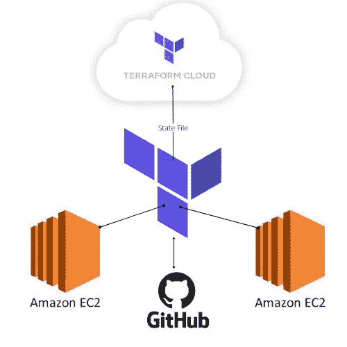

在这个项目中，我们将对 GitHub 派生的 EC2 实例模板进行简单的重组。我们将使用模块重新创建代码，使其更具可重用性，更适合开发或生产环境。我们还将介绍如何在 Terraform Cloud 中远程存储我们的 Terraform 状态文件，以确保状态数据可以在团队的所有成员之间共享。

我将使用 Visual Studio 代码作为我的 IDE，但也可以随意使用 Cloud9 或您选择的其他 IDE。如果您选择使用不同的 IDE，本教程中的步骤会略有不同。

# **先决条件**

*   AWS 帐户
*   您的用户的适当权限
*   GitHub 帐户
*   GitHub 个人访问令牌
*   安装在您的 IDE 上的 Terraform
*   在您的 IDE 上安装和配置了 AWS CLI
*   Terraform 云帐户

# 建立

如果你想从下面的链接获得回购，现在是时候了。如果没有，只需复制`main.tf`文件并将其粘贴到您的 IDE 中，并跳过接下来的几个步骤:

【https://github.com/Michael-Cassidy-88/terraformec2 

接下来，回到您的 IDE，您将需要克隆 repo。对于 VS 代码，只需点击源代码控制图标，并选择“克隆存储库”

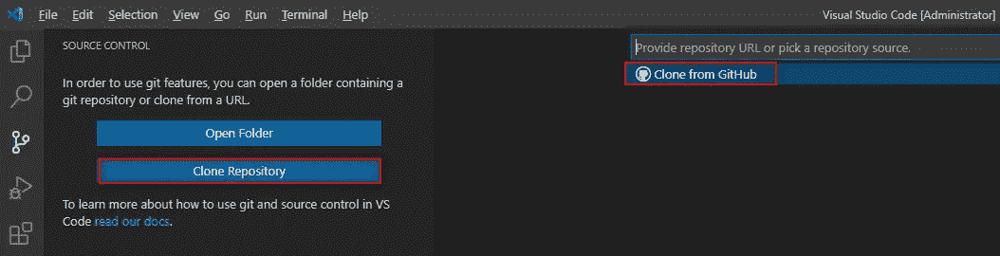

如下所示，从 GitHub 复制 repo URL，然后将其粘贴到 VS 代码中以克隆存储库。

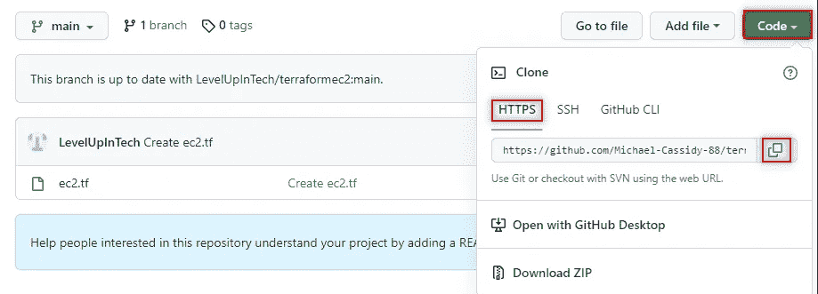

我建议在继续之前创建一个新的分支。通过点击 VS 代码左下角的小签出分支图标，然后创建一个新的分支:

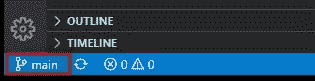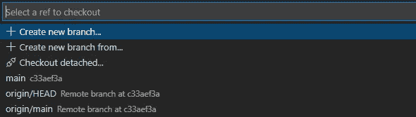

让我们检查一下代码！

如你所见，我们在使用这些代码时受到限制。我们只能在一个区域中创建一个 EC2 实例，使用一个 AMI 和一个实例类型。我们将使用这个文件的片段来创建一个新的文件系统。首先，让我们创建一些新的文件夹和文件。

在当前工作目录中，创建两个文件夹。一个叫模块，另一个叫地形。

terraform 文件夹将保存我们的根配置。在 terraform 文件夹中，我们将添加以下文件夹。这些文件夹将作为我们将在代码中实现的特定值。这样做是为了让不同的团队可以在不同的项目上工作，都使用相同的代码。只需根据您的需要重命名文件夹:

`terraform\dev\us-east-1\t2.micro\0-ec2-deployment`

乍看起来可能很复杂，但是您很快就会看到，文件夹显示我们将处于一个开发环境(dev ),在 us-east-1 地区，并且使用 t2.micro 实例类型。最终文件夹将是所有根文件所在的文件夹。

在模块文件夹中，我们将使它不那么复杂。只需再添加一个文件夹，它是`0-ec2-deployment`文件夹的副本。完成文件夹布局后，它应该如下所示:

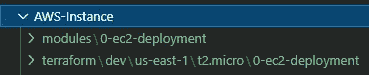

在 AWS 实例目录中创建一个. gitignore 文件。这样，当我们将代码推回 GitHub 时，我们不需要或不想共享的额外文件将不会被发送。

接下来，我们将在 terraform 部署目录中创建以下文件:`main.tf`和`backends.tf`。

在模块部署目录中，创建名为`main.tf`和`variables.tf`的文件。最终的文件系统将如下所示:

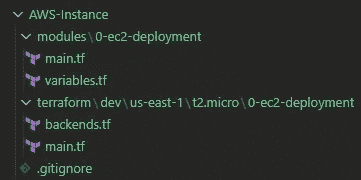

# Terraform 云登录

为了连接到 Terraform Cloud，以便我们能够远程存储我们的 Terraform 状态文件，我们将创建一个新的工作区，然后从我们的 IDE 登录。为此，请前往您的 Terraform 云组织。如果没有组织，请创建一个。在您的组织中，创建如下所示的新工作区:

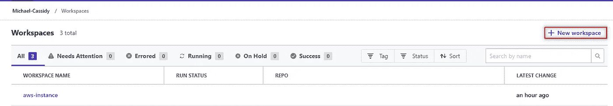

我们将选择一个 CLI 驱动的工作流，这样我们就可以从我们的 IDE 中执行我们的 Terraform 命令。

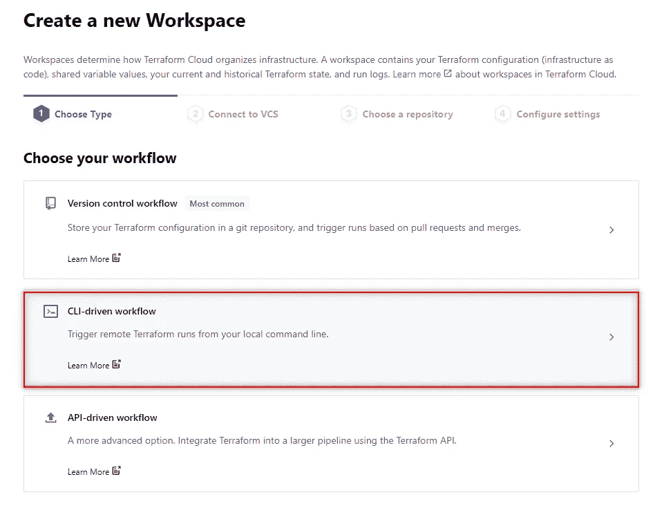

命名您的工作空间，并创建它:

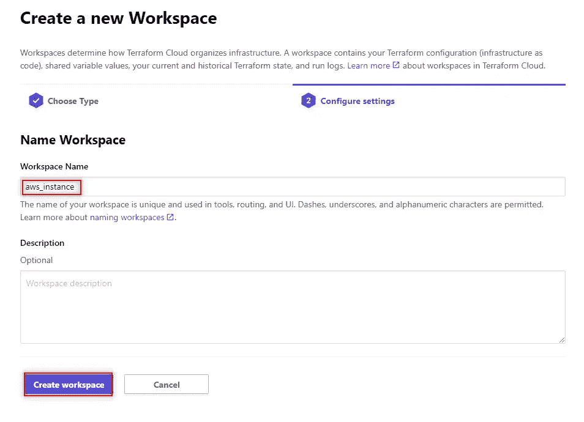

在下一页，我们将复制示例代码中提供给我们的信息，并将其粘贴到 IDE 中的`backends.tf`文件中:

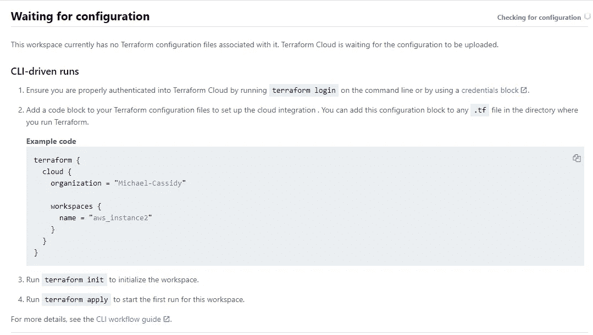

在我们忘记之前，让我们在终端中输入`terraform login`。如果还没有，请将目录切换到 terraform 根部署文件夹。终端将提示您确认是否要继续。

输入 yes 后，您将进入“创建 API 令牌”屏幕，在此您将创建一个 API 令牌，并接收从您的 IDE 登录 Terraform Cloud 所需的凭据。

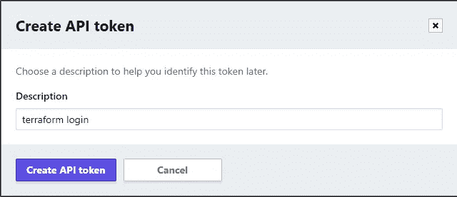

确保将令牌保存在安全的地方。

将令牌粘贴到 IDE 终端后，应该会看到以下显示:

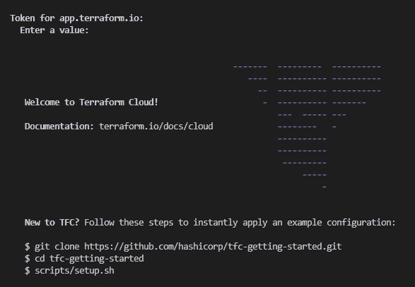

# 地形文件配置

让我们来看看代码。我们已经准备好了`backends.tf`文件。让我们进入 terraform 根部署目录中的`main.tf`文件。输入以下代码:

provider 块将让 Terraform 知道我们正在使用 AWS。locals 块将设置我们当前的工作目录，下面的值将根据相应文件夹的名称来分配。

因为我们在`0-ec2-deployment`文件夹(`index 0`)中，如果我们后退一个文件夹(`index 1`，那么我们到达实例类型(`t2.micro`)。您可以看到，当我们退回到文件夹中时，我们访问了在 locals 块中定义的信息。

在这个配置中，我们唯一可以改变的变量是我们想要启动的实例的数量。我已经把我的调成了`2`。

既然根配置已经完成，让我们转到模块。先说`variables.tf`。在`variables.tf`内，输入以下代码:

这里我们定义了一些变量，我们将把这些变量从`main.tf`根文件传递给`main.tf`模块文件。

接下来，在模块`main.tf`文件中，输入以下代码:

在这里，我们将找到 AWS 实例资源。数据块利用 AWS 系统管理器参数存储来查找最新的 Amazon Linux 2 AMI。AMI IDs 会发生变化，我们希望能够保持 Terraform 代码的可重用性。

我们可以标记 EC2 实例，以便当我们稍后在 AWS 控制台中观察它们时，它们显示 count index 加 1。

让我们最后运行我们的 Terraform 命令，看看会发生什么。运行`terraform init`命令:


接下来，`terraform plan`，然后是`terraform apply`:

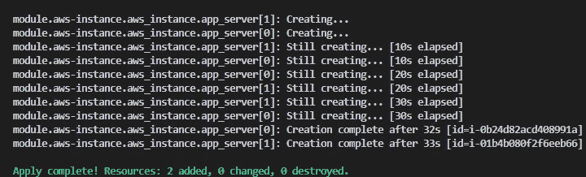

我们来看看 Terraform 云。如果进入您创建的工作区，您应该在 overview 部分看到两个实例和 AMI:

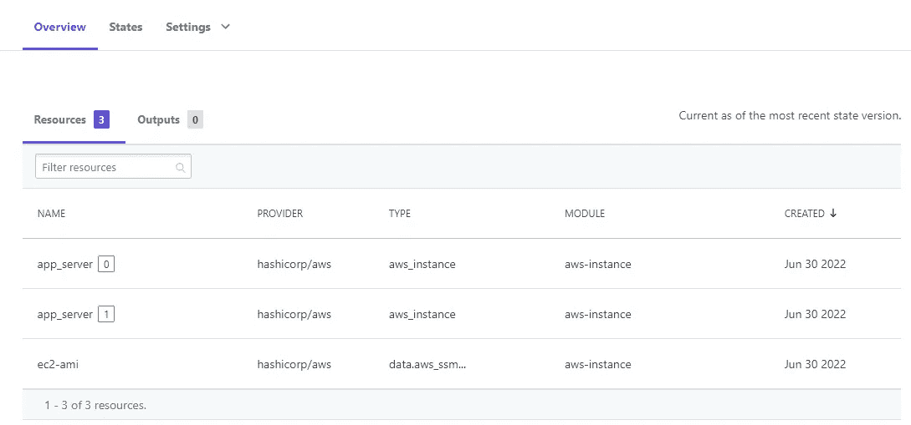

如果你进入“状态”，你会发现我们远程存储的地形状态文件:

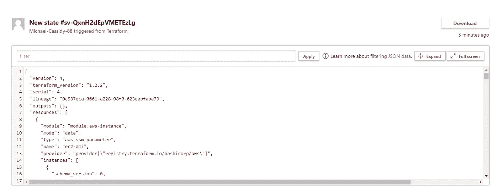

您将不会在本地文件系统中看到状态文件。

在 AWS 控制台中，检查正在运行的 EC2 实例。您应该会看到我们为每个实例定义的标签，如下所示:

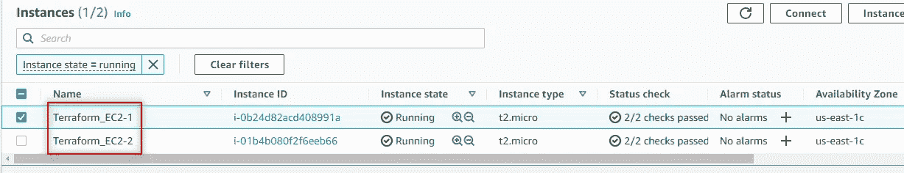

现在，让我们来`terraform destroy`一下，这样我们就不会因为正在运行的实例而被收费。请注意，terraform 状态文件保存在 Terraform 云中。

一旦销毁完成，我们就可以把代码推回 GitHub。

这是。git 忽略我们之前创建的文件的内容:

在 VS 代码中点击左侧的源代码控制图标，准备变更，并输入一条消息让 GitHub repo 知道您正在进行变更:

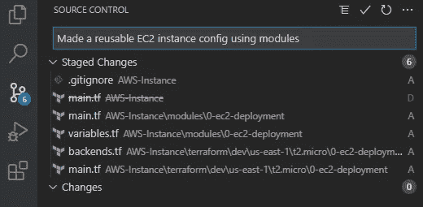

现在按`Ctrl Enter`提交您的更改。最后，在 VS 代码终端中，输入以下命令:

```
git push --set-upstream origin <CURRENT_BRANCH>
```

我创建的分支是`Terraform_Branch`，所以我将在命令中使用它。您可能需要输入您的 GitHub 用户名和个人访问令牌来进行推送。您将需要一个个人访问令牌，该令牌可以在您的配置文件设置下的开发人员设置中创建

您应该在 GitHub repo 上看到一个比较和拉回请求:

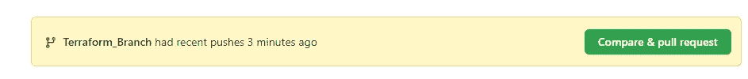

将拉请求合并到您的主分支机构，您应该会看到在您的回购中所做的更改:

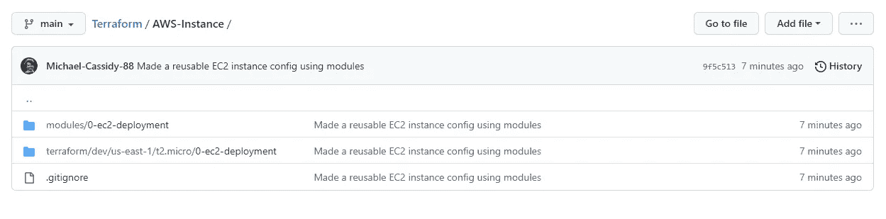

恭喜你。我们在逻辑文件系统中创建了可重用的 Terraform 代码来启动简单的 EC2 实例，同时将 Terraform 状态文件远程存储在 Terraform 云中。

感谢您的阅读。