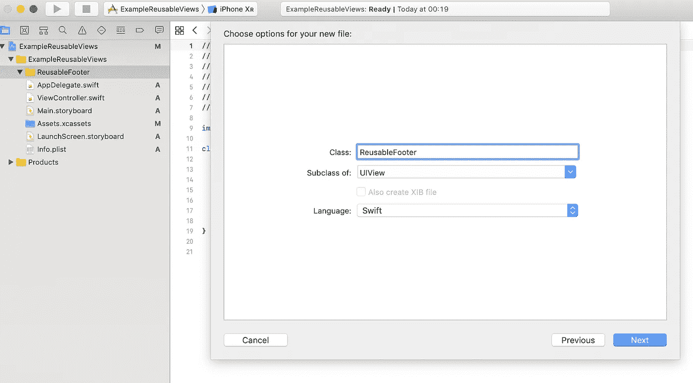
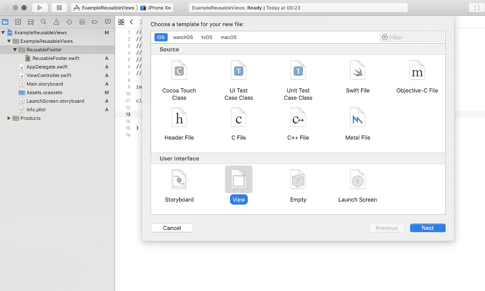
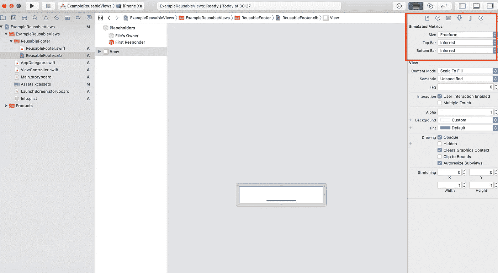
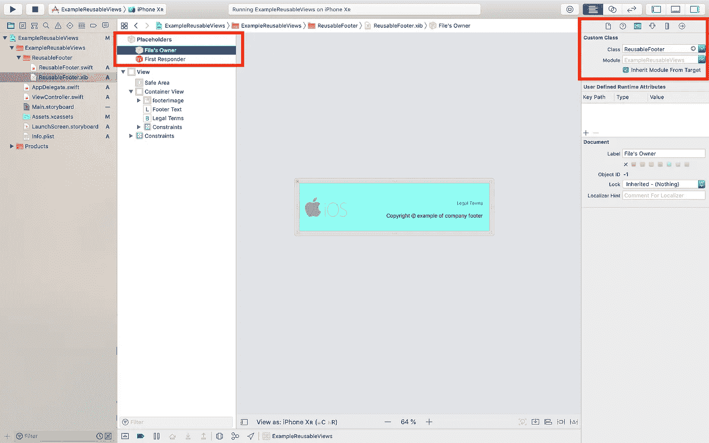
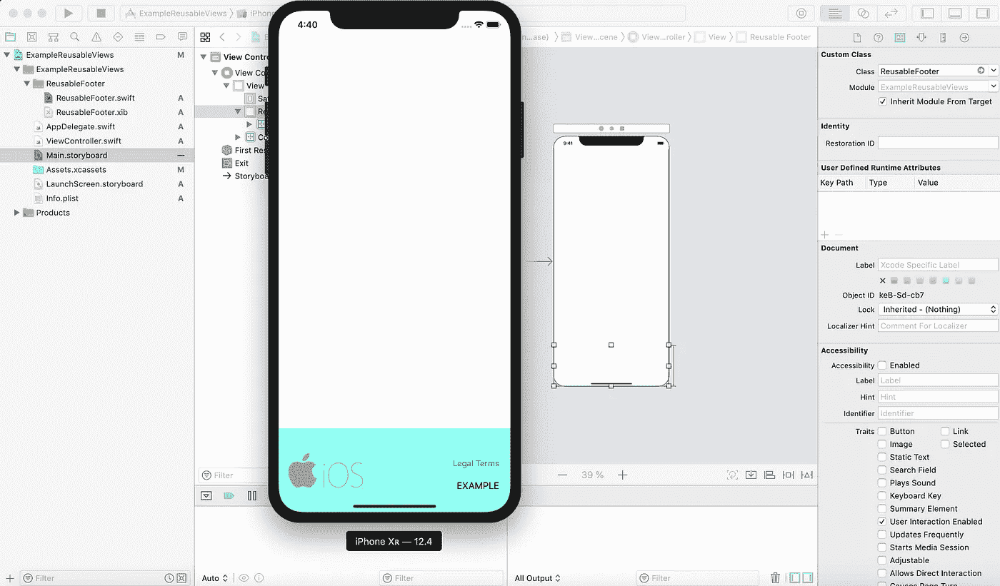

# 如何在 Swift 中创建可重用的 UIViews

> 原文：<https://betterprogramming.pub/reusable-uiviews-in-swift-3f9dca63eaf4>

## **通过可重用的 ui 视图和代码节省时间**

照片由 [Linus Mimietz](https://unsplash.com/@linusmimietz?utm_source=medium&utm_medium=referral) 在 [Unsplash](https://unsplash.com?utm_source=medium&utm_medium=referral) 上拍摄

> 用 Xcode 10.3 和 Swift 5.0 制作的教程

## 为什么要重用 UIViews？

编程的最佳实践之一是尽可能多地重用。

如果你有不止一个屏幕(`UIViewController`、xib…)具有相同的视觉元素(`UIView`、`UIButton` …)，你应该考虑制作一个通用元素，而不是一次又一次地复制粘贴**…**

**该解决方案为您未来的实施节省了时间。如果你需要改变，你只需要改变一次。**

# **可重用视图的示例**

## **步骤 1:创建可重用视图的类**

**新建文件→ Cocoa Touch 类→给你的类视图取你想要的名字。`UIView`的子类。语言:雨燕→下一个。选择所需目标→创建**

****

## **步骤 2:创建 UIView**

**新建文件→视图→给你的视图取你想要的名字(我一般用的都是这个)→下一步。选择所需目标→创建**

****

**首先，我们必须在 xib 文件中将视图配置为自由格式，并设置我们想要的大小或更舒适的大小来设置视图中需要的所有元素。**

****

## **步骤 3:设置视图的类别及其出口**

**将我们创建的类设置为 xib 文件的所有者是非常重要的。之后，根据需要配置您的视图。**

****

## **步骤 4:编写视图的类**

**我们需要创建适当的 inits 方法和一个`commonInit()`方法来实例化视图并设置正确的大小。**

**现在，要使用我们的可重用视图，我们唯一要做的就是将 xib 文件中的类的类型设置为我们想要的视图。**

## **步骤 5:使用我们定制的可重用视图**

****

**没有必要将我们自定义的可重复使用视图中的插座设置到`viewController`。这足以确定我们观点的类别。**

## **第六步:结果**

**这个实现的结果允许我们使用我们的自定义视图很多次，只要我们把我们的`xib`文件中的类设置成我们想要的视图。**

****

**如果这个视图改变了不同屏幕上的文本或颜色，我们可以通过参数设置它的配置。**

**如果我们想改变我们的可重用视图的任何东西，在我们的`viewController`的`viewDidLoad`方法之后设置参数是非常容易的(项目中的简单例子)。**

**如果一个元素出现在不止一个屏幕上，这种实现可以帮助我们节省时间。我们避免了可能出现的复制粘贴问题，如果这个视图改变了，我们只需要改变一次。**

> **这个例子不仅对 UIViews 有帮助，它还可以用于所有类型的元素，如 UITextfields、UIButtons 等。**

> **使用可重用的元素，不要复制粘贴。**

**整个项目可在:[https://github.com/PabloBlanco10/ReusablesElementsSwift](https://github.com/PabloBlanco10/ReusablesElementsSwift)获得**