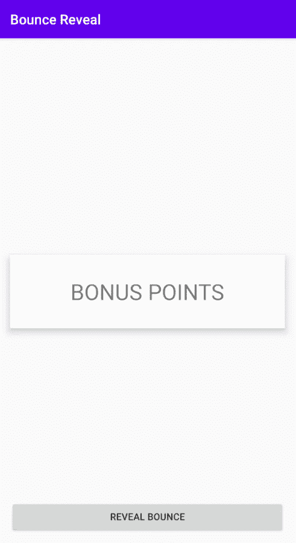
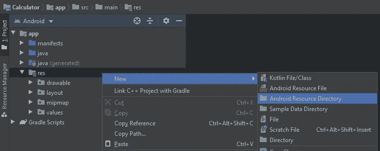
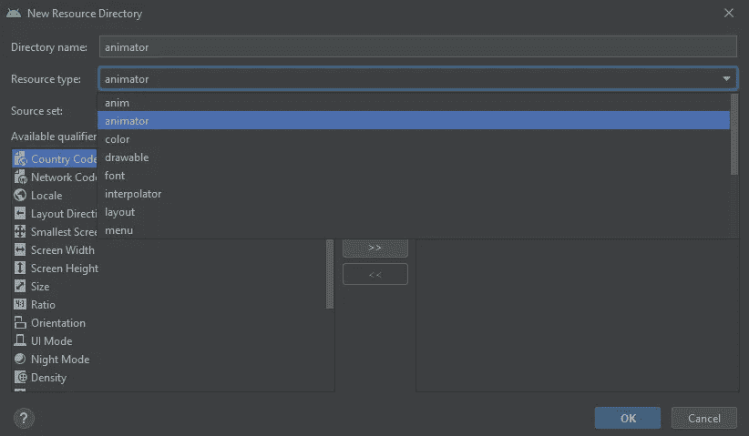
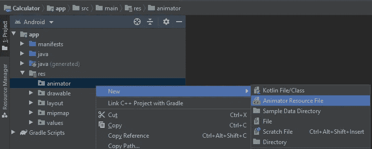
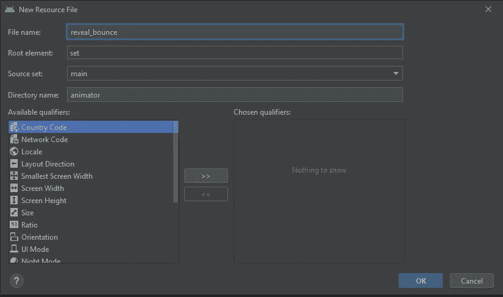
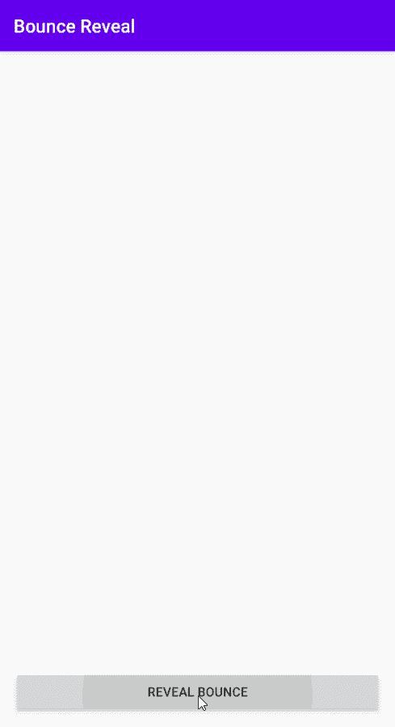

# 在 Android 中显示带弹跳的动画

> 原文：<https://betterprogramming.pub/reveal-animation-with-bounce-in-android-578454f20d0b>

## 展示有风格的新东西

JOSHUA COLEMAN 在 [Unsplash](https://unsplash.com?utm_source=medium&utm_medium=referral) 上拍摄的照片。

在本教程中，我们将学习如何在 Android 的任何视图中应用带有反弹动画的显示。我在之前的应用程序中使用了这个特殊的 reveal 动画来显示加分。出于本教程的目的，我们将在一个简单的定制视图上使用它。这个最终结果可以在文末看到。

首先，让我们为添加动画打下基础。这包括:

1.  我们想展示的观点。
2.  它将驻留的活动。
3.  动画师资源目录。

这里值得注意的是，您没有*也没有*来使用活动。这正是我将在本教程中使用的。

我们将使用的自定义视图是一个简单的`ConstraintLayout`，中间有一个`TextView`。它看起来会像这样:

下面是这个视图的 XML。我们将把它命名为`view_bonus`:

我们将在其中放置该视图的活动是主活动(启动活动)。我们将在它完全显示的状态下对它进行定位和约束，并给它一个 ID`vBonus`。我们还将在底部添加一个按钮，用于演示 reveal 动画。我们给它一个`bRevealBounce`的 ID。它看起来是这样的:

这是活动的 XML。请注意，我们将把`vBonus`的可见性设置为`gone`，因为我们稍后会公布它。

如果在“res”下没有动画师资源目录，那么你必须添加它。为此，右击“RES”->“New”->“Android Resource Directory”

在“资源类型”下，选择“animator”，然后点按“好”。

现在您已经有了一个 animator 资源目录，让我们继续添加 Animator 资源文件，我们将在其中实现动画。要做到这一点，右键单击“动画”->“新建”->“动画资源文件”

animator 资源文件将由一组动画组成，所以要确保“根元素”是“set”将文件命名为`reveal_bounce`。

现在我们已经准备好实现实际的动画了，让我简单解释一下我们打算做什么。我们希望以下事情按顺序发生:

1.  完全水平展开`vBonus`，同时稍微垂直展开，这样就不会完全隐藏。
2.  用`bounce`垂直完全展开`vBonus`。
3.  等待一会儿，然后完全垂直收缩`vBonus`，同时将它的 alpha 设置为 0，这样它就会在结束时消失。

集合的默认排序是`together` —而不是`sequentially` —所以我们需要做的第一件事就是将`reveal_bounce`中父集合的排序显式设置为`sequentially`。

在这个父集合中，我们将添加另外三个集合来实现我们前面解释的三个步骤。

第一组将有两个`objectAnimators`。一个将属性`scaleX`从 0f 动画到 1f，这意味着它将完全水平扩展视图。第二个将属性`scaleY`的动画从 0f 到 0.1f，这意味着它将垂直扩展视图一点点。在这个例子中，我们将持续时间设置为 100 毫秒。

每个数字后面的 *f* 表示它是一个浮点值，而不是一个整数。

第二组将有一个`objectAnimator`将属性`scaleY`从 0.1f 动画到 1f，这意味着它将完全垂直扩展视图。在这个例子中，我们将持续时间设置为 300 毫秒。

要添加一个`bounce`，我们必须将`interpolator`属性设置为`bounce_interpolator`。这个插值器已经存在，你可以使用它。

第三和最后一组将有两个`objectAnimators`。一个将属性`scaleY`从 1f 动画到 0f，这意味着它将完全垂直收缩视图。第二个将使属性`alpha`从 1f 变为 0f，这意味着它将完全淡出视图。

在本例中，我们将持续时间设置为 250 毫秒，并让它在启动前等待 350 毫秒，以便视图在消失前有一点可见。

`reveal_bounce`中的三个集合看起来会是这样的:

让我们应用动画！在我们的`MainActivity`中，我们将做几件事:

1.  添加类型为`Animator`的属性。这将保存动画本身、动画将在其上发生的视图，以及一个关于动画何时开始和何时结束的监听器。
2.  添加一个`setup`函数，它将为我们的`Animator`设置上述所有内容，这些内容将在`onCreate`函数中被调用。
3.  添加一个函数来启动动画。虽然启动动画已经是一行程序，但是我们确实想检查动画是否已经启动，这样我们就可以防止在动画已经启动时再次启动动画。
4.  给`bRevealBounce`添加一个`OnClickListener`，它将调用`start animation`函数。

因为我们将在`onCreate`中设置`Animator`，而不是在 Kotlin 中使用可选的，我们将使用`lateinit`，它基本上是一个非可选的，承诺在使用前初始化。我们将其命名为`revealBounceAnim`。

`setup`函数将加载动画，将目标视图设置为`vBonus`，添加一个监听器，使`vBonus`在动画之前可见，并在动画结束时隐藏视图。我们将把这个函数命名为`setupRevealBounceAnimation`。

为了加载动画，我们将使用`AnimatorInflator.loadAnimator`，它接受一个上下文和我们之前创建的动画文件。这将返回一个我们将设置为`revealBounceAnim`的`Animator`。

为了设置动画的目标视图，我们将使用`revealBounceAnim`上的`setTarget`功能。

为了添加一个监听器，我们将使用`revealBounceAnim`上的`addListener`函数。需要一个`AnimatorListener`。这里我们特别关注两个回调:

1.  在`onAnimationStart`回调中，我们将使`vBonus`可见和不透明。
2.  我们将隐藏`vBonus`的`onAnimationEnd`回调。

在`onAnimationEnd`中`vBonus`被视为可选的原因是为了防止应用程序在动画结束前被关闭，在这种情况下，视图将会消失，并可能导致应用程序崩溃。

这里值得一提的是，这是一个快速而肮脏的实现。理想情况下，我们希望使用反应式模式，这样我们就不会关心应用程序是否被驳回。不过，我将在不同的日子讨论这个话题。

为了开始动画，我们将添加一个函数，确保在开始动画之前动画还没有开始。我们将其命名为`startRevealBounceAnimation`。

最后但同样重要的是，在`onCreate`中，我们将调用`setupRevealBounceAnimation`，然后我们将添加一个`OnClickListener`到`bRevealBounce`，它将简单地调用`startRevealBounceAnimation`。

整个`MainActivity`文件将如下所示:

最终结果。

就是这样！当您点击该按钮时，奖金视图将在再次消失之前反弹显示。我希望这对你有用。直到下一次，这是开发咬签出！