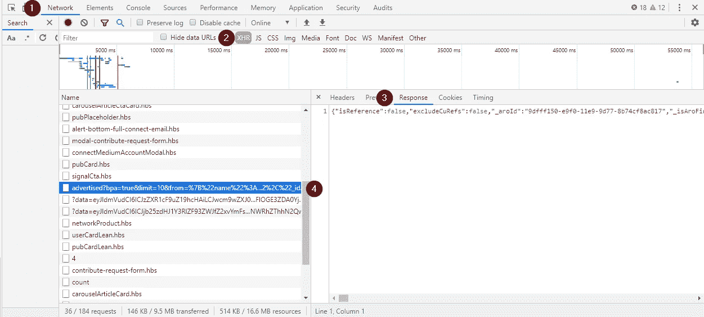
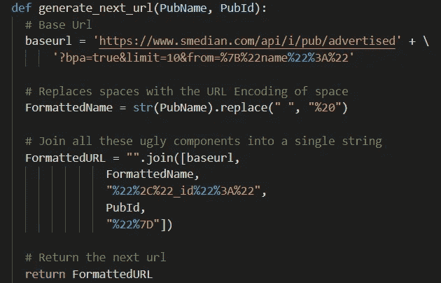
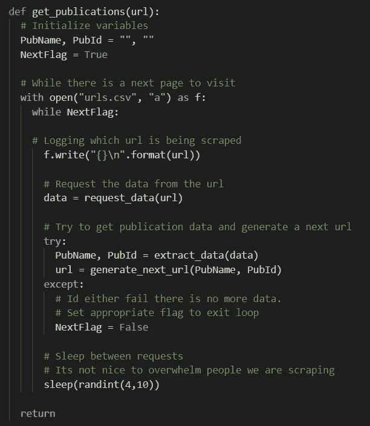
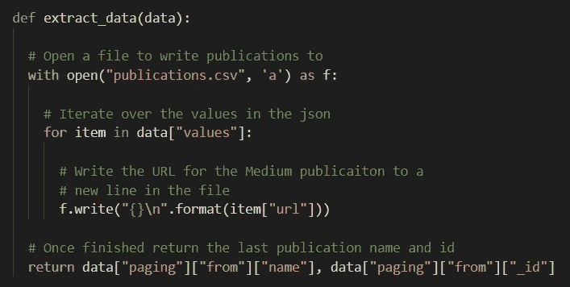
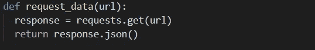

# Python 中更简单的 Web 抓取

> 原文：<https://betterprogramming.pub/reverse-engineering-the-scrape-f5e9fb08a7c6>

## 只针对您想要的数据


由[德文·艾弗里](https://unsplash.com/@officialdavery?utm_source=unsplash&utm_medium=referral&utm_content=creditCopyText)在 [Unsplash](https://unsplash.com/s/photos/reverse?utm_source=unsplash&utm_medium=referral&utm_content=creditCopyText) 上拍摄的照片

每天，我都会看到一些关于如何抓取我订阅的网页的指南。

所有人都在使用某种美丽的汤和木偶师或硒的组合。但是当你只是想搜集一些简单的数据时，对你正在搜集的网站进行逆向工程可能会更容易。

# 逆向工程并不可怕

当我说*逆向工程的时候，*我只是想看看信息是如何到达那里的，看看是否有一种方法可以得到你正在寻找的数据。

对于这个例子，我们将着眼于 Smedian.com，因为我想要一个我正在做的另一个抓取项目的中型文章的大列表。

# 1.研究网页

在深入研究之前，检查是否有`robots.txt`或条款和条件。他们会明确说明抓取他们的网站是否安全。为了一点数据和约翰尼·劳闹僵是不值得的。

对于`robots.txt`，你可以查看基本 URL，如下所示:[https://smedian.com/robots.txt](https://smedian.com/robots.txt)。如果你访问这个链接，你会得到一个 404 的欢迎——这意味着刮擦是安全的。

当我进行抓取时，我查看网络日志，过滤到 XMLHttpRequest (XHR)，这通常是数据请求。我通常会寻找类似查询和 JSON 响应的内容。

找到如下所示的端点后，我将复制 JSON 的主体，并查看我想要的页面关键词是否在 JSON 中。如果是的话，我会开始在网页上工作。



# 2.分析请求 URL

在这里，我会推荐你尽可能的懒。

当我确定了我想要使用的 URL(如下所示)时，我首先看到的是 limit 参数。我插入了一个大的限制，看看我是否需要刮文章。或者，至少，我认为我做到了。稍后会详细介绍。看到这个没用后，我开始解构网址。

```
[https://www.smedian.com/api/i/pub/
advertised?
bpa=true&
limit=700&
from=%7B
"name"%3A"<%20BE%20OUTSTANDING%20%2F>"%2C
"_id"%3A"5927167d5fbc457423b176fc"%7D](https://www.smedian.com/api/i/pub/advertised?bpa=true&limit=700&from=%7B%22name%22%3A%22%3C%20BE%20OUTSTANDING%20%2F%3E%22%2C%22_id%22%3A%225927167d5fbc457423b176fc%22%7D)
```

从 URL 中，我发现它通过查看列表中最后一篇文章的名称和 ID 来请求下面的文章。幸运的是，他们将请求下一组记录所需的参数放在 JSON 开头的一个小数据结构中:

```
"paging": {
  "limit": 10,
  "canLoadMore": true,
  "total": null,
  "from": {
    "name": "Waves Token Movement",
    "_id": "5cef369a32628075008a0bf9"
  },
  "sortOrder": 1
}
```

有了这些，我开始研究一个 janky 函数来为序列中的下一组数据生成 URL。

它将基本 URL、格式化名称、ID 标记和发布 ID 组合成一个 URL。

您还会注意到，我将出版物名称转换为字符串，因为其中一个只是数字。Python 试图这样解释它。



# 3.把它们串在一起

我使用以下三个函数将它串在一起。

`Get_Publications`使用种子输入 URL 启动流程。接下来，它将打开一个 CSV 来记录它正在处理的请求 URL。然后循环，用`request_data(URL)`获取数据，用`extract_data(data)`解析数据，然后生成下一个要处理的 URL。



`Extract_data`将发布 URL 记录到特定文件，并返回上一篇文章的名称和 ID，以生成下一个查询字符串。



另外，`request_data`使用请求模块获取数据并返回 JSON 主体。



# 结论

就是这样。花了 30 分钟的时间，我生成了一些非常难看的代码，节省了我手动复制和粘贴所有数据的时间。

张贴如此丑陋的代码并发表在 *Better Programming，*上可能看起来很奇怪，但这里的要点是，有时编写漂亮代码的价值并不存在。我写这段代码是为了一次性提取一些数据。如果我需要更长时间的支持，我会花一些时间来做适当的错误处理和类型检查。但是这很有效，而且总体上节省了我的时间——这是我在这里所关心的。

此外，我将指出，如果我更好地关注我之前所做的事情，我会节省 20 分钟来编写请求和生成 URL 的代码。在我研究的时候，我曾经尝试改变另一个端点的限制，但是没有成功。然而，这个端点是不受限制的，所以我可以简单地预先请求所有的 JSON，然后专注于解析它。

另一个旁注是对互联网上的一切都要半信半疑。Smedian 为 797 种出版物做广告；然而，在我的计数中只有 721 个，有两个重复的。不知道为什么，但是他们没有回复我的微博。