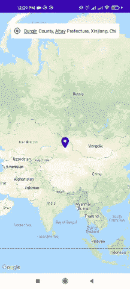
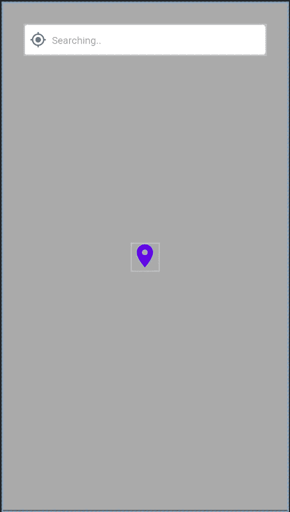

# 使用 Android 中的谷歌地图进行反向地理编码

> 原文：<https://betterprogramming.pub/reverse-geocoding-with-google-maps-in-android-313bed159817>

## 如何使用神奇的地理编码器类

[Aaron Burden](https://unsplash.com/@aaronburden?utm_source=medium&utm_medium=referral) 在 [Unsplash](https://unsplash.com?utm_source=medium&utm_medium=referral) 上拍照。

我们如何将地理坐标转换为人类可读的地址？使用 Android 地理编码器 API！让我们开始吧。

> “培养学习热情。如果你这样做了，你将永远不会停止成长。”
> 
> *–安东尼·j·德安杰洛*

# 什么是 Geocoder？

这是一个用于处理地理编码和反向地理编码的类。

*   地理编码是将街道地址或其他位置描述转换为(纬度、经度)坐标的过程。
*   反向地理编码是将(纬度、经度)坐标转换为(部分)地址的过程。

## 我要用的是

*   安卓`Geocoder`类
*   科特林(编程语言)
*   视图绑定
*   MVVM(建筑模式)

 [## 成为成功的 Android 开发者的路线图

### 如果你想成为一名专业的 Android 开发者，请遵循这个路线图

medium.com](https://medium.com/better-programming/android-free-courses-3b550ce388e6) 

## 概观

令人惊奇的是，我在谷歌地图上使用了`Geocoder`类。在优步和 Careem 等许多应用程序中，你可能已经看到，当用户用大头针在地图上拖动/移动来选择他们的位置时，顶栏上的地址会相应地改变。此功能可以使用反向地理编码来实现。

使用谷歌地图进行地理编码

# 第一步

按照文档创建一个项目并添加 Google Maps API 密钥:

 [## 开始使用 Android 地图| Google 开发者

### " type": "thumb-down "，" id ":" missingtheinformationneed "，" label ":"缺少我需要的信息" }，{ "type"…

developers.google.com](https://developers.google.com/maps/documentation/android-sdk/start) 

我正在用`MapView`创建一个简单的布局:

# 第二步

`Geocoder`有两种方法:

*   `getFromLocation` : 获取纬度和经度，并给出对应纬度和经度的已知地址数组。
*   `getFromLocationName`:将地址名称作为输入(如 1600 amphetica Parkway)并提供一个已知地址数组以对应该地址。

我使用`getFromLocation`，将纬度和经度转换成可读的地址:

我正在使用活动中的`LoadDataCallback`获取位置数据。

# 第三步

让我们看看`Geocoder`在活动中的表现:

根据谷歌的文档，`[onCameraIdle](https://developers.google.com/android/reference/com/google/android/gms/maps/GoogleMap.OnCameraIdleListener#onCameraIdle())()`被称为“当相机移动已经结束，没有未决动画，用户已经停止与地图交互。”

当我在这里使用 MVVM 时，数据通过`viewModel`呈现。下面是一堂`ViewModel`课:

现在运行应用程序，你会看到神奇！

使用谷歌地图进行地理编码

# 结论

我希望你学到了新的东西。感谢阅读。编码快乐！

您可以在下面找到完整的源代码:

 [## must ufa 786/地理编码器示例

### 此时您不能执行该操作。您已使用另一个标签页或窗口登录。您已在另一个选项卡中注销，或者…

github.com](https://github.com/Mustufa786/GeoCoderExample/tree/master/app/src/main/java/com/mustufamedium/geocoderexample) 

关注 [CodixLab](https://medium.com/codixlab) 了解更多科技知识。

## 阅读更多信息:

1.  [使用 RecyclerView 建立多选列表](https://medium.com/better-programming/gmail-like-list-67bc51adc68a)
2.  [完整的 Android 数据绑定教程(第一部分)](https://medium.com/better-programming/android-data-binding-139686b65aec)