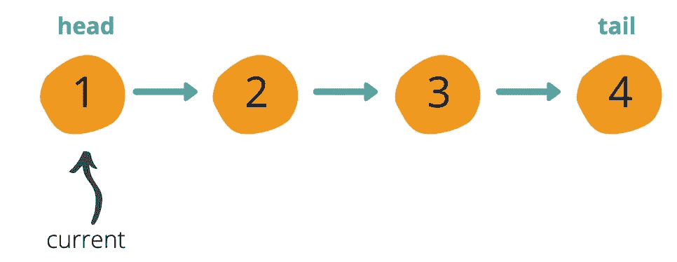
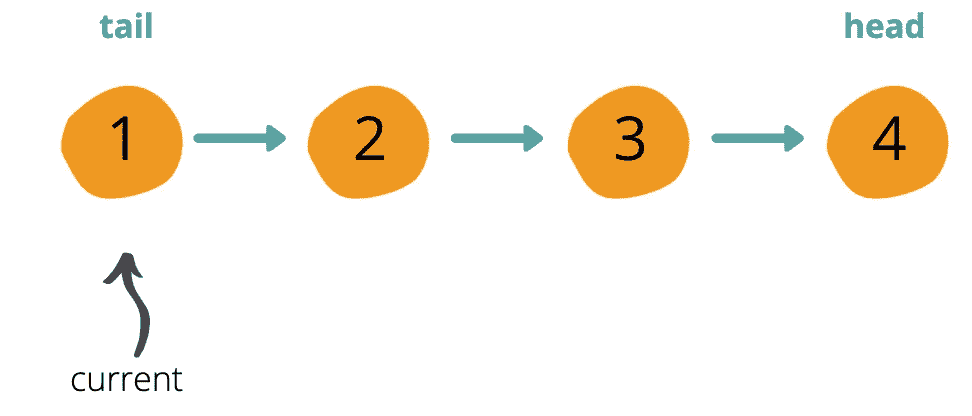
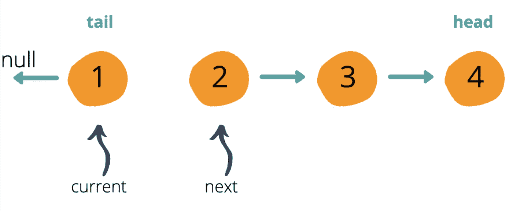
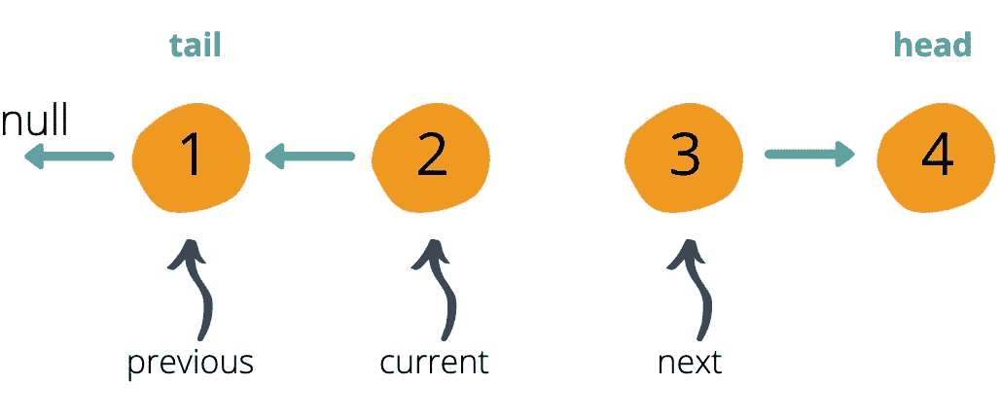
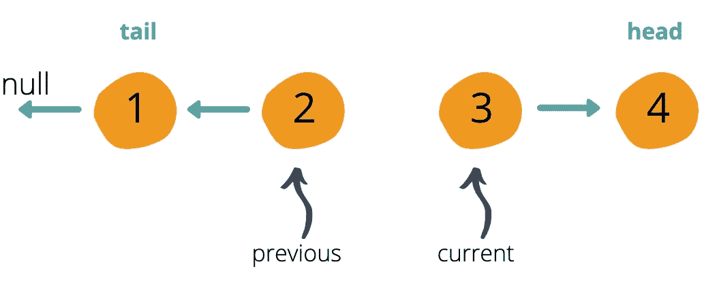
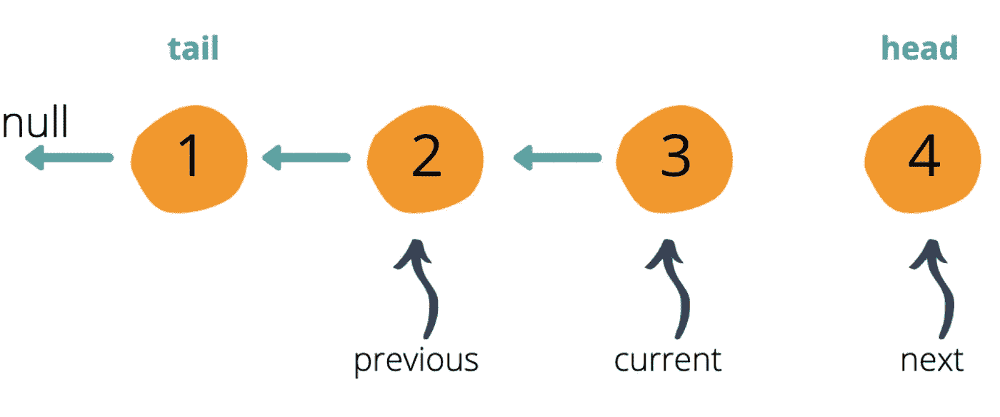
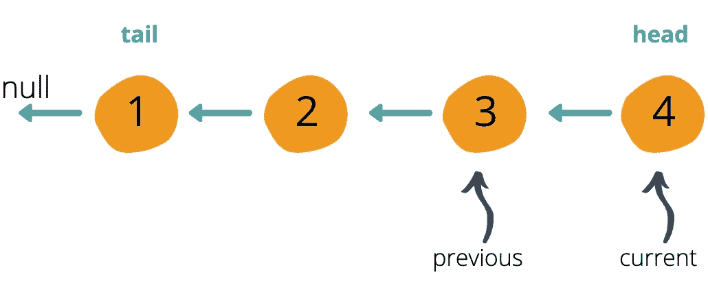

# 反向反向！...链表？

> 原文：<https://betterprogramming.pub/reverse-reverse-a-linked-list-202a2582fb7a>

## 参加你的下一次技术面试

我们的单链表例子。作者照片。

在研究了链表之后，弹出了这个非常流行的问题:如何反转一个链表？不仅如此，你如何做到位？第一次复习这个问题的时候，我费了很大的劲才想通，但是终于想通了！

让我们开始吧。

# 单链表审查

如果你不熟悉单链表的基础知识，可以看看我以前的文章。

我们的单链表的基础可以在 GitHub 上看到[。](https://gist.github.com/joannaylin/d3dfc926ba73833138e4571c8a0f9a15)

# 概观

我们的链表例子将是 1 → 2 → 3 → 4。

我们要找的结果是 1 ← 2 ←3 ←4。

关于单向链表，要记住的关键是每个节点只包含它的值和一个指向下一个节点*的指针。没有指向前一个节点的*指针。因此，我们必须保留一个变量来保存对前一个节点的引用。我们还必须保留一个变量来保存对下一个节点的引用。**

我敢肯定，你想知道为什么，因为每个节点都有一个下一个指针。当我们遍历列表并改变当前节点的下一个指针值时，我们在迭代中丢失了下一个指针。因此，我们必须跟踪下一个节点才能知道我们要去哪里。

我们的方法将从列表的开头开始，并随着列表的移动改变指针的方向。

我们的单链表例子。

# 迭代设置

因为我们从链表的开头开始，所以我们当前的节点是链表的头。我们还没有先前的值，所以我们将把`previous`设置为`null`。我们的下一个引用变量也将被声明，但尚未定义。

当我们反转一个列表时，我们已经知道最后一项成为第一项，第一项成为最后一项。了解了这一点，我们可以从交换头尾值开始。

头节点和尾节点已经交换。

*注意:这段代码是上面链接的 gist 的类单链表的延续。*

# 在列表中循环

有多种方法可以循环链表:一个`for`循环，一个`while`循环，等等。为了便于解释，我将使用一个`while`循环来遍历它。

肉(和土豆！)的问题发生在我们的循环中:

1.  在循环过程中，我们快速地将当前节点的下一个指针保存到变量中。这是因为一旦我们改变了下一个值，我们就与它断绝了关系！所以我们必须把它保存到下一个变量中，以便知道下一步该做什么。
2.  反向反向！我们将当前节点的下一个指针设置为指向前一个节点。当我们第一次启动时，`previous`被设置为`null`。所以`1`的初值现在指向`null`。这就是我们逆转价值观的地方！

我们保存了下一个值，并将当前节点的指针设置为指向前一个节点(开头为 null)。

3.我们已经完成了反转，可以继续前进了，所以我们将前一个节点设置为当前节点。

4.然后将当前节点移动到下一个节点，该节点保存在变量`next`下。

将我们的前一个和当前节点上移一个。

5.重复一遍。随着我们的继续，看看下面几张图片，感受一下在`while`循环中发生了什么。

保存了下一个变量。将当前变量的下一个指针设置为指向上一个节点。

增加我们以前和现在的变量。

保存了下一个变量。将当前变量的下一个指针设置为指向上一个节点。

增加我们以前和现在的变量。

注意，我们的`while`循环声明只要有一个节点，我们就循环。一旦我们到达 tail (final)节点，`next`变量将被设置为 tail 的`next`属性，即`null`。尾部的`next`属性将被设置为前一个节点，前一个节点更新为当前节点。当前节点更新为`null`。这使我们跳出了`while`循环。

# 大 O

迭代求解得到的时间复杂度为 *O(N)* ，其中 *N* 是节点数，因为我们遍历了列表中的所有节点。空间复杂度是 O(1) ,因为我们是在适当的地方做这件事，而不是使用外部数据结构。

查看[完整的要点](https://gist.github.com/joannaylin/665f43712fd5d844a20acea0e901b2a2)。

我希望这有所帮助！感谢阅读。