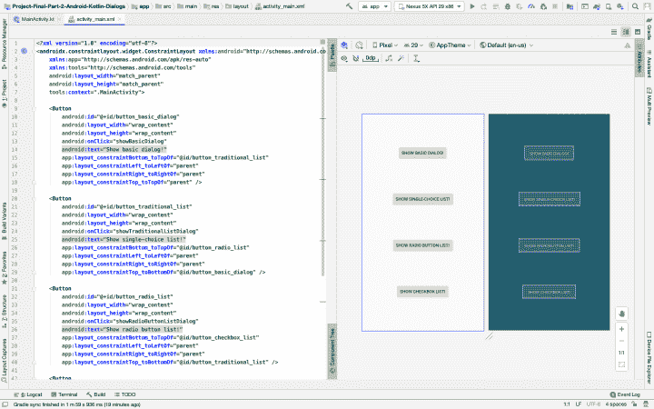
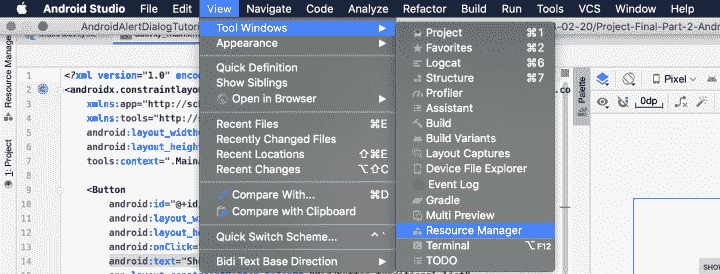
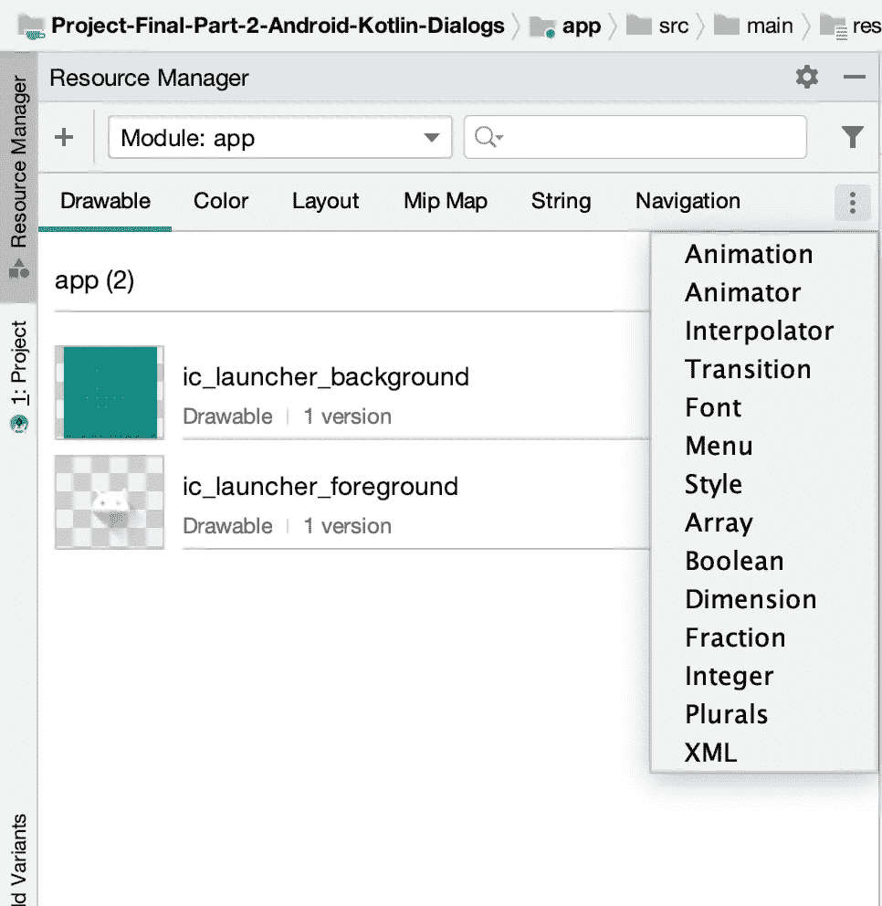
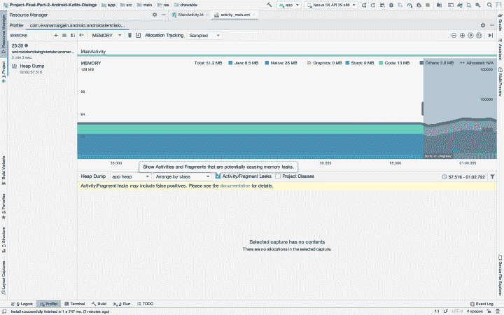

# Android Studio 3.6 综述:手机代码

> 原文：<https://betterprogramming.pub/review-of-android-studio-3-6-code-in-mobile-a6270e735a81>

## Android Studio 中的新功能

2020 年 2 月 24 日，谷歌发布了 Android Studio 的最新版本，标签为 3.6 版。如果你和我一样，你可能没有注意到这个更新，只要你的项目需要它，或者当你最终注意到更新弹出窗口时，你就会这样做。

不要担心，跟上移动开发的变化是很难的——我们几乎不能学习新的 SDK 特性，更不用说知道我们的 ide 的每个新更新中都有什么。好的一面是，每次更新的一些功能将使更新变得值得，并将使我们的生活变得更容易。

如果你想知道这次更新会发现什么，或者想决定是否值得下载，请继续阅读，因为我将总结 Android Studio 3.6 中最重要的功能。

# Android Studio 3.6 中的布局编辑器

当我在 Kotlin 教程(图 1)中打开我的 [Android alert 对话框项目时，我注意到的第一件事是布局编辑器已经改变。](http://www.evanamargain.com/blog/android/android-alert-dialogs-in-kotlin-tutorial-part-3-dialogs-with-lists/)

图 1:布局编辑器

在 Android Studio 中，您第一次可以并排看到您的代码视图和 XML 视图，而无需切换和试图弄清楚更改是否影响了视图。就我个人而言，我很少使用设计编辑器，但也许有了这个新功能，我会更习惯它。

右下角还有一些浮动按钮，用于放大和平移视图，比以前的版本更容易操作。

# 资源管理程序

Android Studio 中另一个通常被低估的图形工具是资源管理器。这个工具可以通过视图>工具窗口>资源管理器打开，如图 2 所示。

图 2:资源管理器访问

> "资源管理器是一个工具窗口，用于在应用程序中导入、创建、管理和使用资源."— [安卓开发者](https://developer.android.com/studio/write/resource-manager)

该功能于 2019 年 4 月在 Android 3.4 中推出，但最初仅支持可绘制性、颜色和布局。更新后，它支持各种来源。单击资源管理器窗口左侧的三个水平点(图 3)，您将看到您可以管理的所有可能的项目。

图 3:资源管理器

# Android Studio 3.6 中的视图绑定

在这个 Android Studio 3.6 版本之前，首选的绑定方式是数据绑定。如果你打算使用视图绑定，你必须使用 Android Studio 的金丝雀版本，正如在 raywenderlich.com 教程的[中提到的。](https://www.raywenderlich.com/6430697-view-binding-tutorial-for-android-getting-started)

> “要使用视图绑定，您需要升级到 Android Gradle 插件版本 3.6.0-alpha11 或更高版本。此版本的 Android Gradle 插件需要 Gradle 5.6.1 或更高版本。此外，你需要使用 Android Studio 3.6 Canary 11+或更高版本，因为旧版本的 Android Studio 不会打开使用 Android Gradle 插件版本 3.6.0-alpha11 或更高版本的项目。”—[Raywenderlich.com](https://www.raywenderlich.com/6430697-view-binding-tutorial-for-android-getting-started)

下载 Android Studio 3.6 后，视图绑定已经可用，无需大修。

# 模拟器更新

## 仿真器位置的改进

Android Studio 3.6 包括对 Android emulator 29.2.7 的支持。作为一个核心特性，这个模拟器版本的优点是可以通过两种方式设置位置:单点和路线。

对于需要 GPS 支持的应用程序来说，这是一个很好的功能，过去需要第三方库来测试功能。

## 新模拟器模板

这个新版本的 Android Studio 还包括虚拟设备和汽车屏幕的项目模板，这将允许您在汽车行业中以一种改进的方式进行定制或定位。

# 可恢复更新

我在 Android Studio 3.6 中发现的最好的改进之一就是你可以继续更新。

有很多原因可以解释为什么这很方便——比如如果你在一个网络连接不好的地方，或者如果你忘记关掉电脑。

在此之前，你需要重新开始更新，这很烦人。幸运的是，这种情况不会再发生了。

# 检漏器

在移动应用中，检测内存泄漏尤为重要。尽管如今智能手机有更多的可用空间，但内存泄漏很容易导致应用程序崩溃，并给用户带来不愉快的体验。

您可以从 Android Memory Profiler 中启用它——在单击“Dump JavaHeap”的向下箭头后，如下图 4 所示。

图 Android Studio 3.6 中的泄漏检测器

# 结论

这些是 Android Studio 3.6 中最重要的功能。这是一个值得下载的重大更新，将帮助我们成为更好更快的开发人员。

下次见！