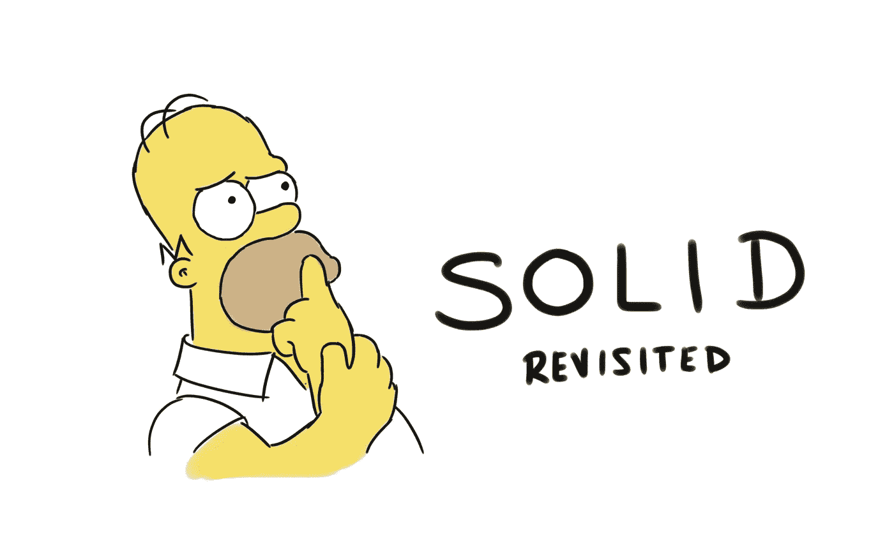
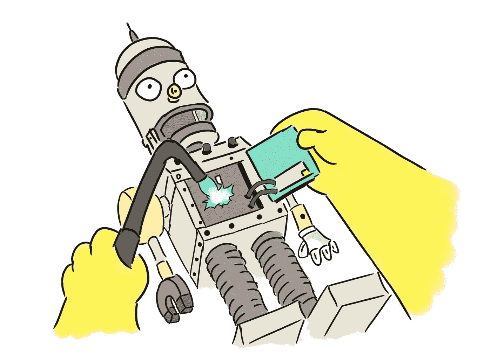
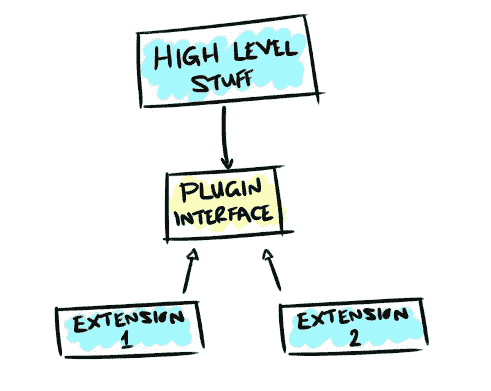

# 重访固体

> 原文：<https://betterprogramming.pub/revisiting-solid-927e6a5202d3>

## 伟大软件开发的基石之一，你还记得它代表什么吗？

大多数软件开发人员在工作的早期都会遇到这些坚实的原则，它们仍然是所有优秀软件的关键驱动力。

我经常听到有人引用它，我也经常在对话中使用它，但遗憾的是，我意识到我无法回忆起每一段都代表了什么。

单一责任原则，OK，开闭原则，确定，然后…？也许是时候重访固了。

# 单一责任原则

> “把因为同样的原因而改变的东西聚集在一起。把那些因为不同原因而改变的东西分开。”

一个常见的误解是将其简化为*“每个模块应该只做一件事”。*这并不完全正确，因为“做”并不是重点。

将你的代码浓缩成尽可能简单的组件会导致软件严重脱节。关键是改变的原因，而不是它在做什么，但是什么定义了改变的原因呢？

原则主要是关于人的。那些推动新特性的用户和利益相关者是那些驱动你的软件变化的人，而这正是我们想要限制的变化的范围。

当一个关注点的合理调整泄漏到另一个关注点并破坏了另一个关注点时，用户和开发人员都会感到沮丧。为了避免这种情况的发生，并且减少开发人员在处理一个部分时所需要的精神负担，你需要将责任分开。

单一责任原则适用于整个堆栈，从微小的细节到高层次的抽象。它适用于构建粒度函数或粗糙组件，以及确定架构边界。

它可能以不同的形式出现，例如，通用闭包原则本身建议组件应该根据变更进行部署，并且任何变更都应该影响最小的组件集(理想情况下是一个)。

SRP 的大部分可以被看作是开发可伸缩性问题的答案。

将那些可能因不同原因而改变的领域分开，你就可以横向扩展你的工程师而不会互相影响，或者纵向扩展团队而不会阻碍他们之间的依赖和瓶颈。

# 开/关原则

> "软件工件应该对扩展开放，但对修改关闭."

延伸，所以这一定是关于继承的？果然，在伯特兰·迈耶的原始化身中，情况就是这样，但是打住！

在过去的 30 年里，我们已经了解到遗传是一个很难驯服的野兽，所以我们可能不想马上走这条路。

我们所说的防止修改和允许扩展是什么意思？如果你每次做一个小的改动都要修改大量的现有代码，那么你就知道你的架构有问题——它不是封闭的。

您应该能够通过扩展在一个健壮的基础上构建，而不是改变已经存在的东西。理想情况下，添加新功能应该容易且风险低。

扩展本身有不止一种形式。首先，你有传统的继承模式。如上所述，这带来了一系列问题(在别处讨论)。

或者，您可以在高级组件中注入额外的行为。接口是通过注入进行扩展的完美工具。它们通过提供一个定义良好的控制变更的契约来防止修改。

然后他们允许我们通过提供和插入这个契约的新实现来扩展我们的软件。

这里接口的使用确保了一个健壮的层次结构，在这个层次结构中，那些重要的高级组件受到保护，不会受到低级组件的更改。当下一个功能请求到来时，您将准备好插入它，而不用接触那些宝贵的现有功能。

# 利斯科夫替代原理

> 如果对于每一个 S 类型的对象 o1，都有一个 T 类型的对象 o2，使得对于所有用 T 定义的程序 P，当 o1 代替 o2 时，P 的行为不变，那么 S 就是 T 的一个子类型

哎哟！这有点拗口。让我们暂时忘记计算机科学-y 语言，专注于核心点。里斯科夫替代原则就是要做好继承。

它告诉我们不要创建子类型，尽管在契约级别上符合正确，但与真正的语义有很大的分歧，在这个过程中给我们的程序行为带来一些令人讨厌的意外。

通常使用的例子(我不会因为懒惰而改变)是正方形/长方形的问题。首先，假设我们有一个类型，`Rectangle`，有两个方法`#setX`和`#setY`来适当地分配两个维度的长度——到目前为止一切顺利。

现在，如果我们为 a `Square`的特殊情况创建一个子类，其中 *X* 和 *Y* 必须总是相等，会怎么样？

如果我们有一个使用`Rectangle`的程序，然后突然我们加入了`Square`子类型，当我们调用`#setX` 时，事情会变得有点奇怪，它也会改变 *Y* (反之亦然)。子类型必须在其父类型的影响下才有意义。

这不仅仅局限于继承，在确保任何接口的健壮性方面也是有意义的，无论是 API、REST 调用还是其他什么。

这些之间的替换应该是无缝的，不会被任何呼叫者察觉。如果客户不得不采用一种变通方法来处理不同的实现，那么我们就搞砸了签订合同的意义。

然而，尊重这一原则往往是相当困难的。许多接口并不像它们真正应该的那样抽象，泄露了一些实现细节。

当涉及到你可能并不总是真正考虑的事情时，比如例外，尤其如此。

为了避免自己设置这个陷阱，尽可能保持接口声明的简单性——其他开发人员会感谢你的。

# 界面分离原理

> “不应该强迫任何客户端依赖它不使用的方法”

从概念上讲，这是最简单的原则，也是与 SRP 密切相关的原则，接口分离原则是关于在你的代码中找到最合适的抽象。这样做的原因也是为了防止一个变更途径影响其他正交的变更途径。

不得不依赖于一个有混乱问题的界面会导致许多不必要的负担。膨胀可能会泄漏到您的代码中，因为您必须迎合您不关心的情况。升级来得又快又厚，但针对的是你不使用的功能，而且这些变化可能会破坏你使用的功能。

过于复杂的界面通常是生长出来的，而不是设计出来的。额外的需求、奇怪的调整和小小的改动慢慢增加，几年后会像滚雪球一样变成一个庞然大物。

强大的界面和 API 设计是一种克制。凝聚力是你的向导。保持你的界面的内聚性，把那些一起变化的关注点收集在一起，把你的客户从额外的负担中解放出来。

# 从属倒置原则

> “最灵活的系统是那些依赖关系仅指抽象而非具体的系统”

应用程序几乎总是由一些核心业务逻辑组成，这些逻辑通过一组实用程序触发现实世界的结果。导出到电子表格的报告生成器或控制停车灯的铁路交通系统就是两个这样的例子。

程序的控制流程通常是从核心逻辑到更专业的工具，比如 I/O。

然而，如果源代码依赖关系沿着这个相同的方向流动，它会导致业务逻辑与较低层次关注点的紧密耦合。由于底层实现可能会经常改变，这将成为应用程序中不稳定性的来源。

为了防止易变，我们希望任何高层次的关注依赖于抽象而不是具体化——也就是说，接口而不是实现。接口的变化比它们的实例化要少得多，因此引用它们将保护客户免受不确定性的影响。

当然，必须知道实现的细节，这就是依赖注入的作用。

核心逻辑不知道直接使用什么，而是注入“一个实现”,确保源代码尽可能不知道那些底层问题。肮脏的连线可以藏在几个关键的地方，比如工厂或者依赖注入框架，比如 [Spring](https://spring.io/) 。

为了总结这个原则，有必要重申一下鲍勃大叔列出的关于倾角的几点:

*   不要引用易变的具体类。
*   不要从易变的具体类中派生(继承)。
*   不要覆盖具体的函数。
*   永远不要提任何具体的和不稳定的东西的名字。

# 结论

我从重温这个主题中得到的一个关键认识是，坚实的原则不仅仅是低级别的编码工具，而是提升软件设计、开发和架构所有级别的指导方针。

希望这篇评论有助于表达这些原则的普遍性，并帮助你下次深入设计时回忆起它们——我确信，这一次，我不会忘记它们！

# 参考

*   [干净的架构:软件结构和设计的工匠指南，作者罗伯特·C·马丁](https://www.amazon.co.uk/Clean-Architecture-Craftsmans-Software-Structure/dp/0134494164/ref=asc_df_0134494164/?tag=googshopuk-21&linkCode=df0&hvadid=311013355418&hvpos=1o2&hvnetw=g&hvrand=13737634568804163962&hvpone=&hvptwo=&hvqmt=&hvdev=c&hvdvcmdl=&hvlocint=&hvlocphy=1007426&hvtargid=pla-423658477418&psc=1&th=1&psc=1)
*   [https://hacker noon . com/you-don-understand-the-single-respons ibility-principle-ab FDD 005 b 137](https://hackernoon.com/you-dont-understand-the-single-responsibility-principle-abfdd005b137)
*   [https://medium . com/@ severinperez/writing-flexible-code-with-single-respons ibility-principle-b 71 C4 F3 f 883 f](https://medium.com/@severinperez/writing-flexible-code-with-the-single-responsibility-principle-b71c4f3f883f)
*   [https://stackify.com/solid-design-open-closed-principle/](https://stackify.com/solid-design-open-closed-principle/)
*   [https://en.wikipedia.org/wiki/Open%E2%80%93closed_principle](https://en.wikipedia.org/wiki/Open%E2%80%93closed_principle)
*   [https://hacker noon . com/interface-segregation-principle-BDF 3f 94 f1 d 11](https://hackernoon.com/interface-segregation-principle-bdf3f94f1d11)
*   [https://deviq.com/dependency-inversion-principle/](https://deviq.com/dependency-inversion-principle/)
*   [https://stackify.com/dependency-inversion-principle/](https://stackify.com/dependency-inversion-principle/)
*   《辛普森一家》的所有图像归 20 世纪福克斯公司所有，根据合理使用政策重新绘制并用于非商业和说明性(教育)目的。