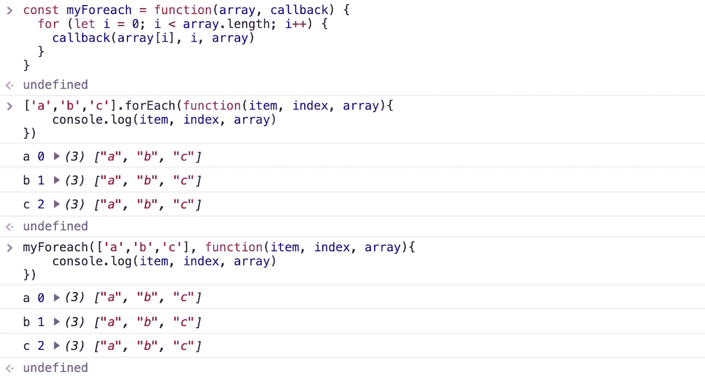
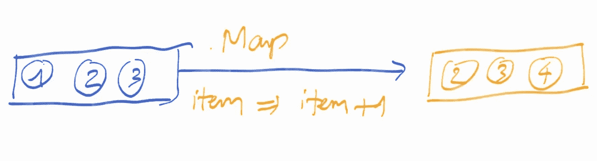
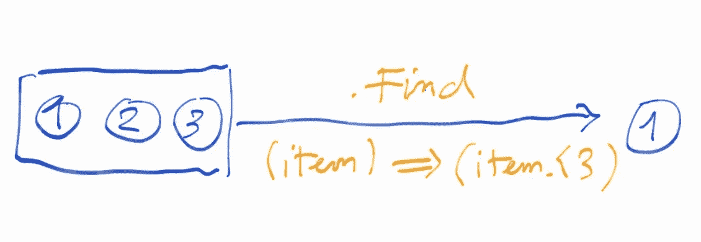
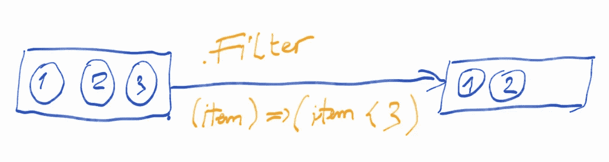
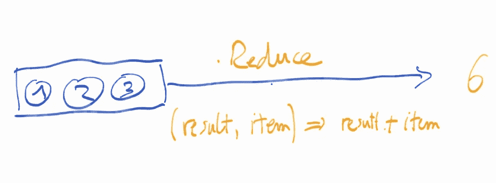

# 重写您自己的数组方法:forEach、map、filter、find 和 reduce

> 原文：<https://betterprogramming.pub/rewrite-your-own-array-methods-foreach-map-filter-find-reduce-1718e1138c3e>

更好地理解这些 JavaScript 方法

我的许多学生都很难理解这些函数是如何工作的，我在许多不熟悉 JavaScript 的初级开发人员身上看到了同样的问题。

所以，我决定重写这些函数，希望能帮助他们更好地理解这些方法。

要使用数组方法，你可以看看我以前写的一篇。

# 为每一个

方法允许你为数组的每个元素运行一个函数。`forEach`不返回任何东西。

重写以用于`for`循环:

在 Chrome 控制台上测试它:

看，结果完全一样。

所以，基本上，`forEach`函数在内部实现了一个`for`循环。

我们还可以通过在数组原型链中添加`myForeach`来使其更好，并将其作为普通的`forEach`函数使用。

搞定了。并且，我们可以使用类似这样的东西`['a','b',c'].myForeach(...)`。

用同样的方法，我们可以用一个`for`循环重写`*map find filter reduce*`。

# 地图

`map`函数总是返回与原数组长度相同的新数组。

# **找到**

`find`函数返回第一个匹配回调函数的条目，如果没有匹配的条目，则返回`undefined`。

# 过滤器

这类似于`find`函数，但是`filter`不是返回第一个匹配项，而是返回匹配项的数组，如果没有匹配项，则返回一个空数组。

# 减少

`reduce`不是返回一个数组，比如`map`或者`filter`，而是返回我们想要的任何值。我们只需要传递初始值，然后在每个迭代器上修改它。

# 结论

请注意，这不是这些函数在 JavaScript 中实际实现。这只是另一种类似的方法来确定它是如何工作的，相当于使用`for loop`来更好地了解它在引擎盖下是如何工作的。

本文中没有提到`.sort`函数，因为它应该有自己的帖子，我会尽快写出来。

感谢阅读。