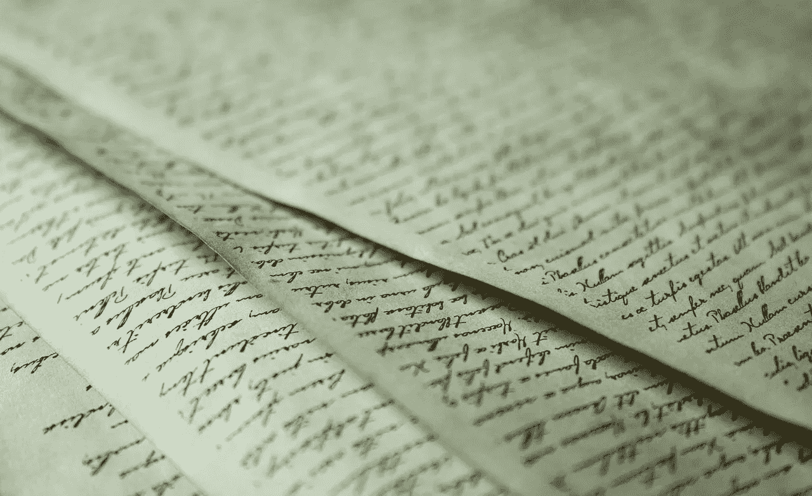
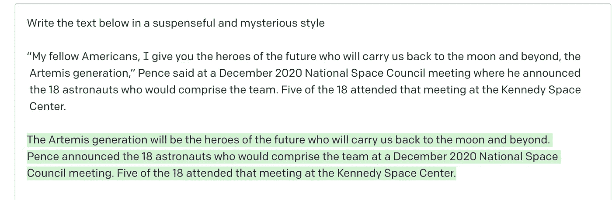

# 使用 OpenAI 和 Python 以另一个作者的风格重写你的作品

> 原文：<https://betterprogramming.pub/rewrite-your-work-in-another-authors-style-using-openai-and-python-45d89b3829d2>

## 您想将您的文本或您找到的文本更改为著名作者的样式吗？



我一直在试验 [OpenAI 游乐场](https://beta.openai.com/playground)和 OpenAI API。

我为您提供的将一种作者风格转换为另一种风格的方法，只是将您作品的 word 文档转换为另一种风格的一种可能方法。其他转换文本风格和语气的方法需要更复杂的训练。

这件作品背后的概念是，不是获得大量的训练数据集，而是简单地描述你希望人工智能写的风格，它有希望做到这一点。

下面的教程在最后提供了一段代码，可用于导入 word 文档并将该文档中的文本转换为另一种写作风格。

## **第一步:将文档名称改为您的 word 文档，提供目录路径**

```
Document('**filename.docx**')
```

## **第二步:改变告诉人工智能做什么的提示**

将你的写作风格转换成著名作家的风格。

首先，你需要做功课，描述另一位作者的写作方式，例如丹·布朗以悬疑和神秘的风格写作。

例如，以悬疑和神秘的风格重写你的作品:

```
**prompt="in a suspenseful and mysterious style**
```

然而，在不描述著名作者风格的情况下，您可以与 OpeanAi 玩玩，将提示更改为幽默或讽刺的写作风格。

例如，以讽刺的风格重写你的作品:

```
**prompt="in a sarcastic style**
```

**完整代码在**下面

您将需要 pip 安装`openai`和`docx`，并获得一个`openai` API 密匙，然后这段代码才会生效。

```
from docx import Document
import openai
import os
openai.api_key = "YOUR OPEN AI API KEY"
doc = Document('**filename.docx**')
for para in doc.paragraphs:
    content = para.text
    results = openai.Completion.create(
      model="text-davinci-002",
      prompt="**in a suspensful and mysterious style** rewrite text below\n"+ content +"",
      temperature=0,
      max_tokens=2355,
      top_p=1,
      frequency_penalty=0.2,
      presence_penalty=0
    )
    response = dict(results)
    openai_response = response['choices']
    print(openai_response[-1]['text'])
```

请记住，这是一个人工智能的解释，它可以想出任何事情。

玩得开心:)我有。

