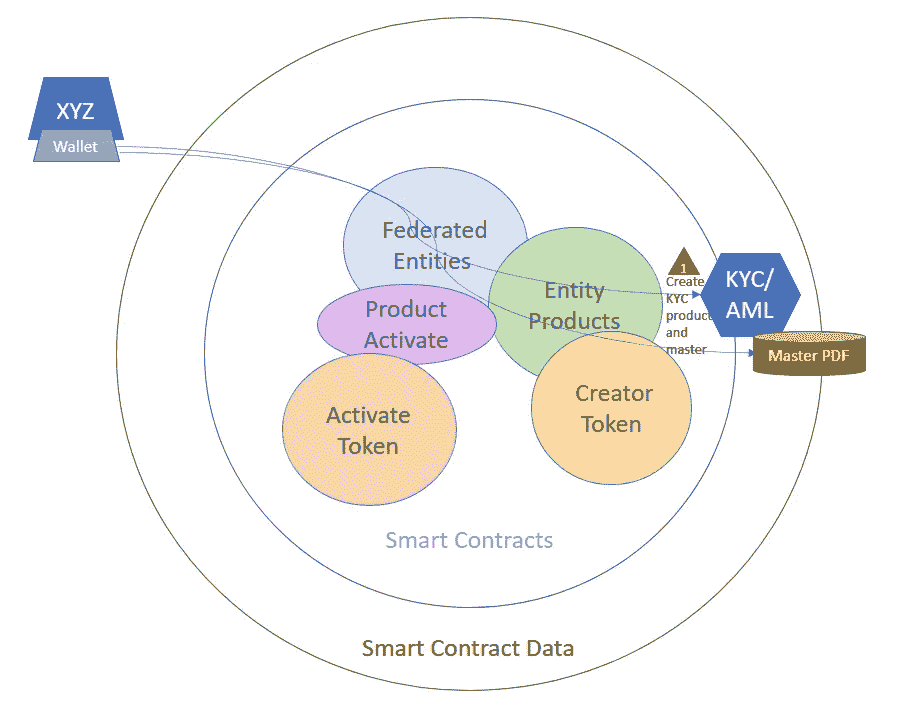
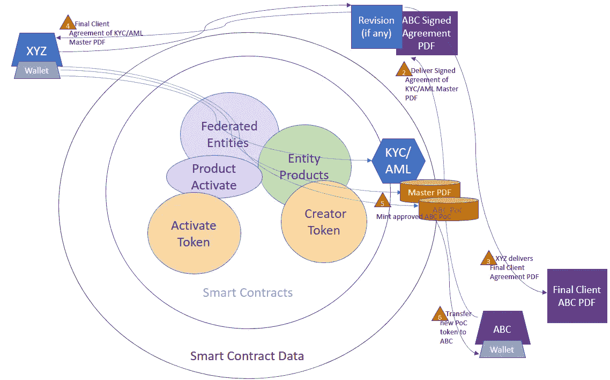
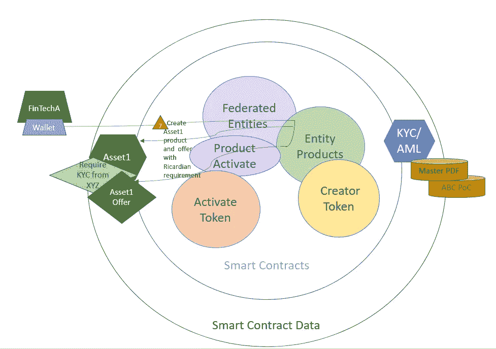
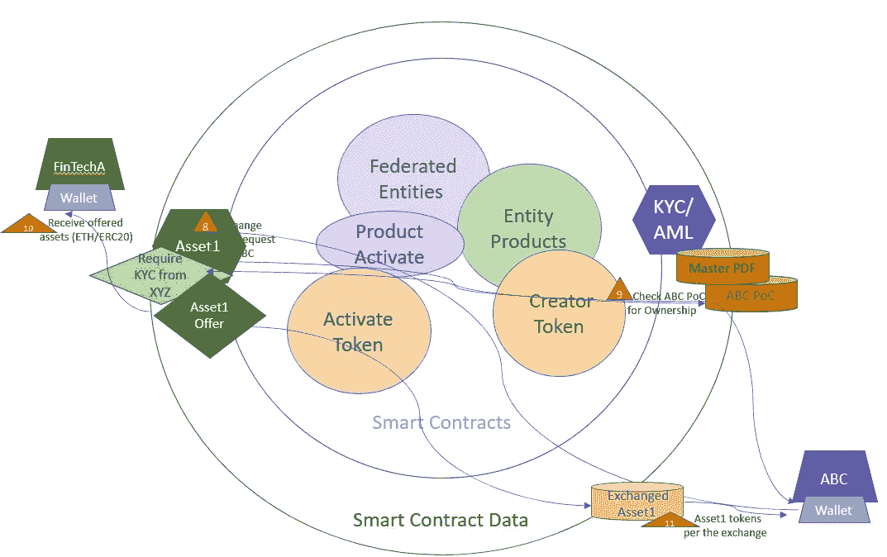

# 李嘉图契约互操作性

> 原文：<https://betterprogramming.pub/ricardian-contract-interoperability-9b9e2919dc43>

## 托管证明(PoC)解决方案经过令牌化，以利用所有权实现互操作性


公共智能合同是联盟和第三方互操作链上解决方案的基础

李嘉图契约是双方或多方之间达成的任何人类可读的契约。利用区块链存在证明(PoE)和李嘉图合同可以确保智能合同中的合法合同合规性。凭借隐私和第三方智能合同互操作性，可合法审计且具有约束力的李嘉图合同将法律合规性与分散式系统和交易所(dex)联系起来，从而支持更多产品。在第三方分散系统上为交易所提供的新金融产品现在可以要求并强制执行李嘉图合约协议，作为在分散交易所(DEX)上接收转账的条件。

这个故事记录了 ImmutableSoft 将李嘉图关系添加到其现有的 Solidity smart contract Federation 的过程，以便用户安全地管理产品文件版本。作为一个联邦系统，每个组织都使用公共智能契约代码中定义的联邦规则来管理自己的事务。PoE 的创新之处在于记录历史和第三方集成。已经支持公共填写合同文档，但是默认情况下，客户端隐私被添加到智能合同逻辑中。下面用粗体突出显示了一些更改，显示了指定文件发布为李嘉图叶所需的新参数`parentHash`。零的`parentHash`是李嘉图主合同或传统文件 PoE 版本。

```
 /// [@notice](http://twitter.com/notice) Create new release(s) of an existing product.
  /// Entity and Product must exist.
  /// [@param](http://twitter.com/param) productIndex Array of product IDs of new release(s)
  /// [@param](http://twitter.com/param) newVersion Array of version, architecture and languages
  /// [@param](http://twitter.com/param) newHash Array of file SHA256 CRC hash
  /// [@param](http://twitter.com/param) newFileUri Array of valid URIs of the release binary
  **///** [**@param**](http://twitter.com/param) **parentHash Array of SHA256 CRC hash of parent contract**
  function creatorReleases(uint256[] memory productIndex,
                           uint256[] memory newVersion,
                           uint256[] memory newHash,
                           string[] memory newFileUri,
                           **uint256[] calldata parentHash**)
  {... **// Only emit events for non-Ricardian leaf's (public)
      if (parentHash[i] == 0)
        emit creatorReleaseEvent(entityIndex, productIndex[i],
                                 version);**
  }
```

每个合同或文档由其 SHA256 哈希唯一标识。文件的这种唯一单向哈希通常被称为存在证明(PoE)哈希。保管证明(PoC)散列是由验证保管的授权机构*安全地记录到不可变区块链的 PoE 散列。提供具有修订历史的已签署文档的基于服务的 PoC 涉及公开主文档，同时保持每个客户/已签署合同的私密性。当记录了父历史时，可以从任何客户端 leaf SHA256 PoC 散列中学习主文档。不可变的文档历史确保第三方可以验证客户已经签署/同意合同。根据历史记录，叶合同的 PoC 哈希是第三方同意主文档的证明。然后可以利用该证明，而不会向第三方泄露任何私人信息。*

由智能合同管理的文档的数据关系最好用向下增长的列表来可视化，除了单个父列表之外，彼此互不了解。第一个文档(根文档或基础文档)是主合同，没有父文档。主合同的每个向下分支是一个完整的、提交的和批准的客户(私人)，或批准的修订合同(公共或私人)。没有办法沿着树向下遍历(为了隐私)，但是通过从树叶向上遍历树，可以很容易地了解合同修订和主文档。


李嘉图契约，以父母关系为象征

存在证明(PoE)适用于任何链上文件哈希，而保管证明(PoC)在本讨论中定义为由验证组织的所有者管理的产品的任何私人客户李嘉图合同，该验证组织拥有与该产品相关联的公共主文档版本作为父级。当 ImmutableSoft 验证联邦实体(即组织或个人)是真实的，并授权他们对不可变智能合同的写访问。然后，该联盟实体可以通过智能合约将他们的李嘉图合约产品与已签署的区块链交易记录到以太坊。

一旦被联合实体或合同服务提供商(CSP)批准并记录在链上，客户协议的任何副本(即 pdf)合同可以通过重新计算提交的合同的文件的 SHA256 散列并检查链上的存在来确认 PoC。确认方用代表最终客户协议的 PoC 的铸造令牌记录该客户叶协议。则可以向客户传送这个新生成的令牌，该令牌不变地记录了所同意的合同(PoC)的散列。当将该令牌呈现给第三方时，令牌所有权可以证明他们是主合同的授权签署者，而不会泄露任何私人信息。带有 PoC 令牌的客户协议的数字表示通过利用令牌所有权来促进互操作性。

李嘉图 PoC 令牌有许多实际用途，可以在维护隐私的同时弥合分散系统中的法律鸿沟。具体细节往往具有启发性，因此本文的剩余部分将集中于第三方可验证的了解您的客户(KYC)合同的单一用例，使用不可替代的(即唯一的)令牌。



通过智能合同为加入 Immutable 的 XYZ 公司配置 KYC/反洗钱服务的交易流程。

一家公司，比如 XYZ 公司，提供 KYC 服务，首先发布他们的律师起草的 KYC 和反洗钱(AML)文档作为公共表格填写主 PDF 文档。在不变的生态系统中，XYZ 公司被配置为 KYC 服务[产品和主版本](https://immutablesoft.github.io/ImmutableEcosystem/#the-product-and-release-interfaces)，然后可以使用该主文档作为其 KYC 服务的根或李嘉图主合同。当 KYC/反洗钱产品的客户 ABC 使用其私人信息完成表格填写 PDF 时，包括附加附加信息和/或验证照片(驾照等。)和/或签署完成的文档，XYZ 公司的多个验证过程并行开始。

在客户 ABC 将带有 SHA256 哈希码(PoC)的文档提交给 XYZ 公司后，对文档的任何修订都会更改 PoC 哈希码，并要求通知双方。如果需要，XYZ 可以澄清/盖章/加水印，但如果需要，必须与客户 ABC 共享任何最终文档和 PoC 散列。一旦内部身份验证(即。XYZ 公司的 AML)程序已圆满完成，XYZ 安全地将交易写入生态系统智能合同，该合同包含一个新版本，其中包含经 XYZ 验证的客户 ABC 最终批准文档的 PoC 哈希。此 PoC 确认完成了 KYC 文书工作，并在不泄露任何信息的情况下验证了客户 ABC。使用[文件发布(PoE)](https://immutablesoft.github.io/ImmutableEcosystem/#the-product-and-release-interfaces) 智能合同接口，此交易的结果是一个 ERC721(不可替换)令牌，代表 ABC 签署和批准的合同的 PoC 哈希。该令牌代表 ABC 已与 XYZ 公司签署法律协议的证明，如公开的 KYC 产品和公共主文档中所述——在本例中为 KYC/反洗钱填表文档和产品。



客户 ABC 的签名 KYC 信息被 XYZ 公司标记化。

虽然只有 ABC 和 XYZ 拥有最终文档，因此可以计算单向 SHA256 哈希，但信任 XYZ 的第三方可以通过 PoC 哈希的令牌所有权来信任 ABC 是由 XYZ 验证的 KYC。ABC 或 XYZ 公司可以在法庭上证明其合规性，方法是出示签名文档，该文档具有与记录为铸造令牌的 PoC 相同的唯一单向 SHA256 哈希码。证明存在的能力允许第三方确保签署的协议存在，而不必知道任何细节。如果检查了李嘉图合同令牌并确保其是主母公司的客户，则可以在第三方智能合同中要求并强制执行 KYC 区块链服务协议。

```
 // Check that Ricardian client matches the offer's parent
      if (theOffer.ricardianParent > 0)
      {
        require(ricardianClients[i] > 0, "Client required");
        uint parentDepth =
          creatorTokenInterface.creatorParentOf(
                                    ricardianClients[i],
                                    theOffer.ricardianParent); require(parentDepth > 0, "Parent not found");
      }
      else
        require(ricardianClients[i] == 0, "Client not allowed");
```

对于任何智能合约，应该仔细研究容易被滥用的角度，在这种情况下，有一些问题值得解决。第一个问题是，XYZ 公司或其他合同服务提供商(CSP)必须可信，因为系统中设计了隐私保护，任何文件哈希都可能被记录为主合同的一部分。该系统的第三方用户必须能够相信 KYC 信息已经过验证，并且相关的 PoC 散列正确地存储在区块链上，与签署/同意的主文档或修订正确相关。这种信任度对于一个以信誉为基础获取收入的合法企业来说应该是相对容易达到的，例如我们之前的 XYZ 公司，该公司为他人提供 KYC/反洗钱服务(即 CSP)。

另一个潜在的滥用是区块链本身的公共性质。区块链的所有信息都是公开的，不可更改的。即使在创建叶契约时没有 API 来查询或触发事件，攻击者也可以逆转或社会工程化其他人的身份令牌(KYC)的 PoC 散列，并将其重放给第三方作为“证明”身份的手段。由于第三方没有用户的直接知识，像这样的重放或假冒攻击可能无法被检测到。为了以加密方式解决集成区块链解决方案的这一问题，第三方智能合同可以利用 PoC 令牌所有权。如果每个客户都被转移(即给定由 XYZ 公司制造的合同 PoC 令牌的所有权)，则客户可以使用令牌所有权向第三方智能合同证明他们自己。ABC 对客户端 PoC 令牌的所有权可以在转移之前/期间由资产令牌本身直接检查，以加密方式证明所有权。



金融公司 A 为其产品资产 1 提供所需的 KYC。

通过利用所有权，当在令牌转移级别检查和执行李嘉图合同令牌链时，KYC 区块链服务协议现在可以在任何第三方交易所被默认要求和执行。如果令牌化资产需要李嘉图合约，则它不能被交换到没有该地址拥有的有效客户端令牌的接收以太坊地址。

```
function _beforeTokenTransfer(address from, address to,
                              uint256 tokenId)
      internal override(ERC721, ERC721Enumerable)
  {
    // Skip this check when first minting
    if (from != address(0))
    {
      // On exchange (not direct transfer)
      //   check any required Ricardian contracts
      if ((msg.sender != ownerOf(tokenId)) &&
          (TokenIdToRicardianParent[tokenId] > 0) &&
          (address(creatorInterface) != address(0)))
      {
        uint hasChild = **creatorInterface.creatorHasChildOf(
                          to, TokenIdToRicardianParent[tokenId]);**
        require(hasChild > 0,
                "Ricardian child agreement not found.");
      }
    }
}
```

当客户 ABC 进行区块链交易时，公钥交易签名证明 PoC 令牌所有权。这样，证明授权的安全区块链方法现在是可用的，而无需向第三方公开任何信息。所有这些都可以通过开放、联合和可互操作的智能合同(如不可变生态系统)在公开的不可变数据库(如以太坊)上获得。当李嘉图客户端验证技术完全封装在令牌传输逻辑中时，默认情况下，第三方交换会强制执行此要求。以下步骤包含在单个区块链事务中，以在交换时加密地证明 KYC 的存在。



在转移时与证明 KYC 的接收方交换资产。

李嘉图合同技术的广泛采用将需要第三方互操作性。令牌化似乎是互操作性的共同基础，可以利用不可替代的唯一令牌 ID 来进行哈希查找，反之亦然。不变地编码到唯一令牌 ID 中或从其查询的应该是发行组织和特定产品(KYC/AML)和主文件(即表格填写文档)。使用只读 PoC 哈希生成的可互操作的唯一令牌(其所有权转移给客户端(ABC ))具有许多优势。反向查找以找到授权的联合实体/产品和主文档(XYZ 公司的 KYC。pdf)通过允许按所有权进行搜索来完善解决方案。

由联邦智能契约管理的公共李嘉图契约为带有隐私的合法契约提供了需求自动化和分散的互操作性。随着分散交换(DEX)技术吸引具有额外法律/合同要求的产品，由 [ImmutableSoft](https://immutablesoft.org/) 提供的可用解决方案已经准备就绪，并经过了测试，可以应对这一挑战。当李嘉图契约协议在可互操作的智能契约中可强制执行时，复杂金融产品的法律流程自动化可以实现去中心化。已建立的金融和法律机构需要制造可互操作的客户端 PoC 令牌的私有和可互操作的合同服务提供商(CSP ),以在这一新的分散化前沿利用其流程。