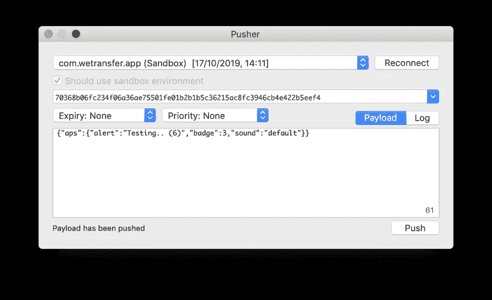
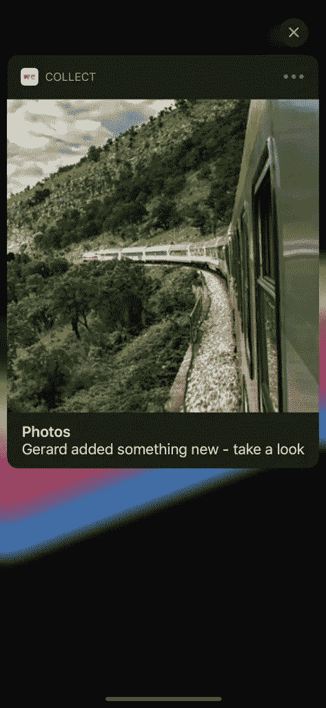
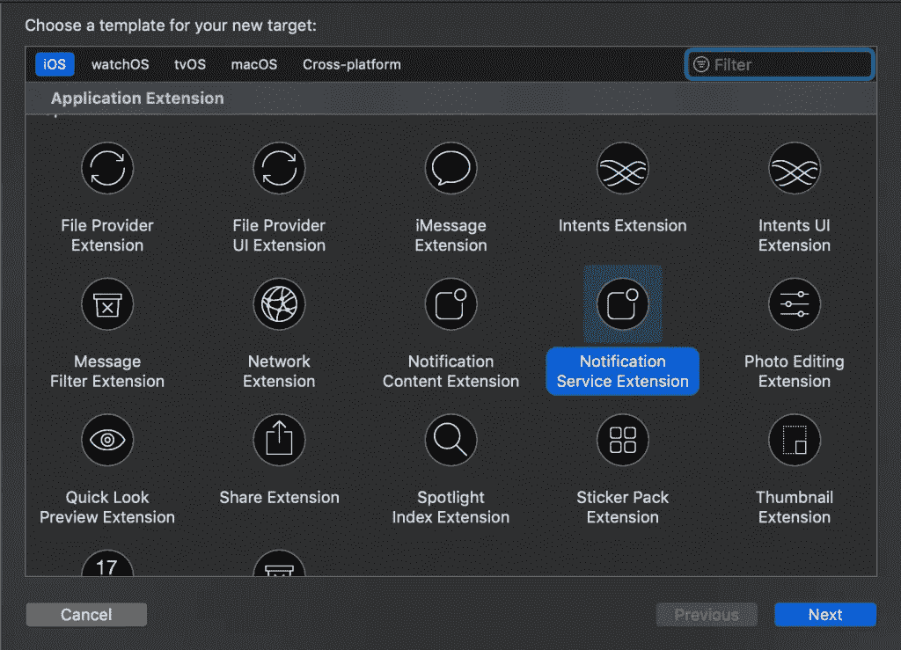
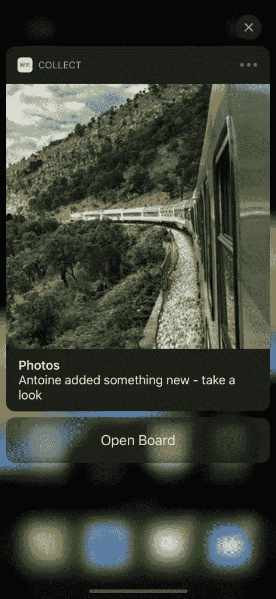

# Swift 中丰富的 iOS 通知说明

> 原文：<https://betterprogramming.pub/rich-notifications-on-ios-explained-in-swift-4ffe76ea32cf>

## 减少无聊的通知


马特·博茨福德在 [Unsplash](https://unsplash.com/s/photos/radio?utm_source=unsplash&utm_medium=referral&utm_content=creditCopyText) 上的照片

iOS 中丰富的通知允许我们通过添加图像、gif 和按钮来使枯燥的默认通知变得更好。在 iOS 10 中引入，并在后来的操作系统更新中得到增强，当你在应用程序中支持通知时，这是一个不能错过的功能。

# 在 iOS 中测试推送通知

在我们开始实施之前，我们需要一个良好的测试环境。这一切都始于手头有合适的工具。

您可以从终端或 Mac 应用程序测试推送通知。推荐后者，因为它给你一个用户界面，使你更容易填写任何细节。

我已经使用一款名为 [NWPusher](https://github.com/noodlewerk/NWPusher) 的 Mac 应用多年了，它从未让我失望过。它易于使用，并带有以下界面:



一款测试 iOS 推送通知的 Mac 应用

您可以选择推送证书，然后连接到 Apple 的推送通知服务(APNS)。该应用程序将从日志中让您知道连接是否已经成功建立。

# 获取 iOS 推送通知令牌

要测试任何通知，您必须拥有推送通知令牌，您可以在 Swift 中轻松获取该令牌。在您的`AppDelegate`中，您添加了以下方法，它将把设备令牌打印到控制台:

```
func application(_ application: UIApplication, didRegisterForRemoteNotificationsWithDeviceToken deviceToken: Data) {
    let deviceToken: String = deviceToken.map { String(format: "%02.2hhx", $0) }.joined()
    print("Device token is: \(deviceToken)")
}
```

# 发送测试通知

设置好 NWPusher 应用程序后，就该发送第一个测试通知了。请确保您已请求推送通知权限来接收大声通知，否则您可能只会看到徽章符号被更新。

如果一切顺利，您已经收到了第一个通知，那么您就可以实现丰富的通知支持了。

# 在 iOS 模拟器上测试推送通知

虽然有一个包含项目框架的[解决方案，但是它已经过时了，不推荐使用。它试图复制苹果发送推送通知的方式，但据说并不完全相同。特别要避免，因为它不再被维护了！](https://github.com/acoomans/SimulatorRemoteNotifications)

强烈建议在真实设备上测试推送通知，直到苹果公司可以在模拟器上测试丰富的通知。

# 创建带有图像的自定义推送通知

创建带有图像作为媒体附件的自定义推送通知会使通知看起来更好。换句话说，它使通知更加丰富！



显示图像预览的丰富推送通知

为此，我们需要创建一个新的通知服务扩展，它将在远程通知发送给用户之前修改其内容。这可以是任何类型的通知，如更改标题，以及下载图像。

仅当满足以下要求时，才会调用扩展:

*   远程通知被配置为显示警报
*   远程通知的有效载荷包括值被设置为 1 的`mutable-content`键

请注意，您不能修改静默通知或那些只播放声音或标记应用程序图标的通知。

# 添加通知服务扩展

通过选择`File -> New -> Target`，可以在 Xcode 中添加通知服务扩展。



创建新的通知服务扩展

这将创建一个新的 Swift 文件，包含一个从`UNNotificationServiceExtension`继承的类。这是我们捕捉远程通知并在显示给用户之前对其进行调整的入口点。

# 将图像添加到推送通知

要将图像作为媒体附件添加到推送通知中，我们需要调整我们的`UNNotificationServiceExtension`类的代码。我们执行以下步骤:

*   检查图像 URL 是否存在
*   下载图像并保存到磁盘
*   将图像文件 URL 附加到通知中
*   发回修改后的通知

为此，我们创建两个新的扩展，从通知请求中获取图像 URL，并将其保存到磁盘。

```
extension UNNotificationRequest {
    var attachment: UNNotificationAttachment? {
        guard let attachmentURL = content.userInfo["image_url"] as? String, let imageData = try? Data(contentsOf: URL(string: attachmentURL)!) else {
            return nil
        }
        return try? UNNotificationAttachment(data: imageData, options: nil)
    }
}

extension UNNotificationAttachment {

    convenience init(data: Data, options: [NSObject: AnyObject]?) throws {
        let fileManager = FileManager.default
        let temporaryFolderName = ProcessInfo.processInfo.globallyUniqueString
        let temporaryFolderURL = URL(fileURLWithPath: NSTemporaryDirectory()).appendingPathComponent(temporaryFolderName, isDirectory: true)

        try fileManager.createDirectory(at: temporaryFolderURL, withIntermediateDirectories: true, attributes: nil)
        let imageFileIdentifier = UUID().uuidString + ".jpg"
        let fileURL = temporaryFolderURL.appendingPathComponent(imageFileIdentifier)
        try data.write(to: fileURL)
        try self.init(identifier: imageFileIdentifier, url: fileURL, options: options)
    }
}
```

它使用 UUID 后跟 JPG 文件扩展名来保存文件。如果您的服务返回不同的文件类型，您可以相应地调整代码。如果您想支持显示 GIF，这里也是将 JPG 转换为 GIF 的地方。

为了实际使用这段代码，我们必须调整默认实现的`didReceive`方法:

```
final class NotificationService: UNNotificationServiceExtension {

    private var contentHandler: ((UNNotificationContent) -> Void)?
    private var bestAttemptContent: UNMutableNotificationContent?

    override func didReceive(_ request: UNNotificationRequest, withContentHandler contentHandler: @escaping (UNNotificationContent) -> Void) {
        self.contentHandler = contentHandler
        bestAttemptContent = (request.content.mutableCopy() as? UNMutableNotificationContent)

        defer {
            contentHandler(bestAttemptContent ?? request.content)
        }

        guard let attachment = request.attachment else { return }

        bestAttemptContent?.attachments = [attachment]
    }

    override func serviceExtensionTimeWillExpire() {
        // Called just before the extension will be terminated by the system.
        // Use this as an opportunity to deliver your "best attempt" at modified content, otherwise the original push payload will be used.
        if let contentHandler = contentHandler, let bestAttemptContent = bestAttemptContent {
            contentHandler(bestAttemptContent)
        }
    }
}
```

该代码使用默认通知内容作为最佳尝试后备，尝试获取附件，如果全部成功，则返回修改后的通知。

请注意，`didReceive`方法执行任务的时间有限。如果您的方法在超时前没有调用完成块，那么将使用此时可用的最佳尝试内容来调用`serviceExtensionTimeWillExpire()`方法。如果您还没有调整任何内容，它将回落到原始内容。

这是我们在通知中显示图像并生成第一个富通知所需的全部代码！

# 添加推送通知交互按钮

下一步是将交互式动作按钮添加到富通知中。包含按钮的通知也称为可操作通知类型。

为此，我们需要注册一个所谓的*通知类别*，我们可以在其中注册按钮。当详细显示时，该类别中的每个通知都将在内容下方显示已注册的按钮。

# 声明您的自定义通知类别和操作

对于可操作的通知类型，我们需要在主应用程序中注册包含启动时操作的通知类别。

```
private func registerNotificationCategories() {
    let openBoardAction = UNNotificationAction(identifier: UNNotificationDefaultActionIdentifier, title: "Open Board", options: UNNotificationActionOptions.foreground)
    let contentAddedCategory = UNNotificationCategory(identifier: "content_added_notification", actions: [openBoardAction], intentIdentifiers: [], hiddenPreviewsBodyPlaceholder: "", options: .customDismissAction)
    UNUserNotificationCenter.current().setNotificationCategories([contentAddedCategory])
}
```

从您的`application(_:didFinishLaunchingWithOptions:)`方法中调用这个方法将为`content_added_notification`类别中的所有通知注册一个“Open Board”动作按钮。我们在 WeTransfer 应用程序的 [Collect 中为新添加的内容触发的每个通知使用此类别。](https://collect.wetransfer.com)

给你的动作一个唯一的标识符是很重要的，因为这是区分不同动作的唯一方法。这甚至包括属于不同类别的动作。在上面的例子中，我们使用了`UNNotificationDefaultActionIdentifier`,因为我们只添加了一个动作。

# 将类别添加到您的丰富通知中

下一步是将类别添加到推送通知中。这可以通过将类别键添加到 JSON 有效负载的“aps”字典中来实现:

```
{
	"aps": {
		"category": "content_added_notification",
		"alert": {
			"title": "Photos",
			"body": "Antoine added something new - take a look"
		},
		"mutable-content": 1
	},
	"image_url": "https://www.example.com/image_url"
}
```

另一种方法是通过调整`didReceive`方法中的代码来简单地重用我们的通知服务扩展:

```
override func didReceive(_ request: UNNotificationRequest, withContentHandler contentHandler: @escaping (UNNotificationContent) -> Void) {
    self.contentHandler = contentHandler
    bestAttemptContent = (request.content.mutableCopy() as? UNMutableNotificationContent)

    defer {
        contentHandler(bestAttemptContent ?? request.content)
    }

    /// Add the category so the "Open Board" action button is added.
    bestAttemptContent?.categoryIdentifier = "content_added_notification"

    guard let attachment = request.attachment else { return }

    bestAttemptContent?.attachments = [attachment]
}
```

然而，这只适用于将`mutable-content`添加到 JSON 有效负载的通知。

这将足以显示带有“打开电路板”操作按钮的通知:



带有按钮的丰富的可操作通知

# 处理丰富通知按钮回调

一旦用户选择通知操作，系统将在后台启动您的应用程序。它将通知代理应该在共享的`UNUserNotificationCenter`实例上设置什么。我们可以使用`userNotificationCenter(_:didReceive:withCompletionHandler:)`方法来识别选中的动作并执行相关的动作。

```
func userNotificationCenter(_ center: UNUserNotificationCenter, didReceive response: UNNotificationResponse, withCompletionHandler completionHandler: @escaping () -> Void) {
    defer {
        completionHandler()
    }

    /// Identify the action by matching its identifier.
    guard response.actionIdentifier == UNNotificationDefaultActionIdentifier else { return }

    /// Perform the related action
    print("Open board tapped from a notification!")

    /// .. deeplink into the board
}
```

执行完动作后，一定要调用`completionHandler`。我们可以通过使用 defer 语句很容易地做到这一点。

# 结论

就是这样，这是一个用丰富的通知来丰富您的应用程序的好方法。我们花了不到一个小时的时间在 Collect 应用程序中实现，因此没有理由退缩！

如果你想了解更多关于通知的信息，我推荐这个由 [Kaya Thomas](https://twitter.com/kthomas901) 所做的精彩演讲，它更加详细:[为 iOS 12](https://www.youtube.com/watch?v=nKB_pqlfp-M) 定制你的通知。

谢谢！