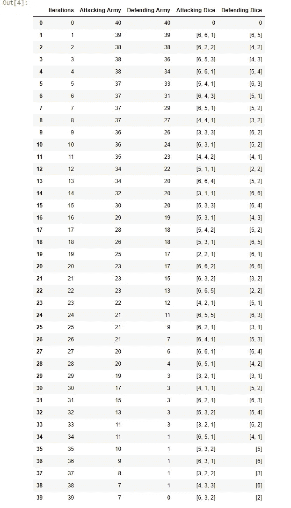
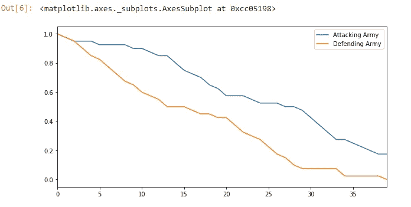
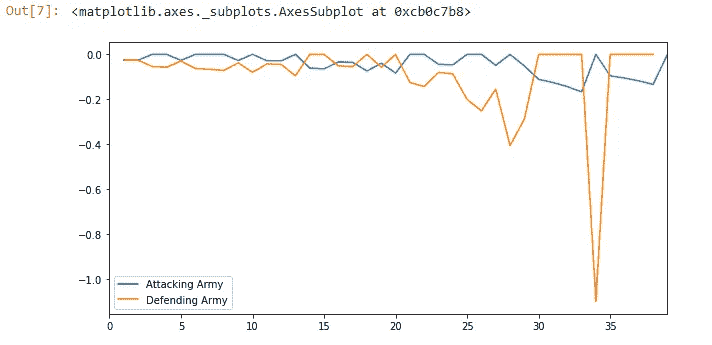
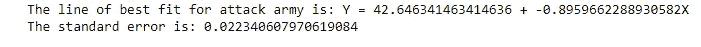
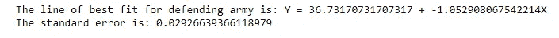

# 风险棋盘游戏战斗自动化

> 原文：<https://betterprogramming.pub/risk-board-game-battle-automation-5e2d955cc9b3>

## 终极风险棋盘游戏程序，帮助简化长期战斗，记录骰子滚动，分析趋势和查看回归统计数据

马修·盖伊在 [Unsplash](https://unsplash.com/@maguay?utm_source=unsplash&utm_medium=referral&utm_content=creditCopyText) 上的照片

有很多像我一样的风险爱好者。我们有与朋友密谋、建立联盟、击败敌人，当然还有掷骰子的美好回忆。

我们也有记忆，特别是在比赛的后半段，随着改变比赛的巴西/北非之战的展开，我们不得不乏味地滚动 15 分钟。游戏棋子被打翻，骰子掉在地板上，有些人可能试图欺骗他们的掷骰子…在战斗结束时，每个人都感到疲惫和困惑。有人通常会怀疑约翰尼连续掷出三个六点的比赛是否公平。

当我在这种情况下，我总是希望有一种方法来保证战斗是 100%公平和简单的。我想要关于这场战斗如何进行的数据，作为下一场战斗的参考。这就是我制作这个工具的灵感。

# 特点:

输入开始进攻和防守的军队后，这个工具:

*   输出一个数据框，该数据框包含骰子分组和每个骰子点数的军队总数，可以导出到 Excel
*   直观地描绘出进攻方和防守方的损失情况
*   绘制损失的标准化趋势
*   绘制每支军队每局的变化百分比
*   输出军队损失的回归线，因此您可以获得攻击者和防御者的平均斜率(每回合军队损失)。

# **程序和数据帧输出:**

在第 10 行和第 11 行输入开始的军队(在这次运行中，双方将有 40 人！).从那里，程序有一个 while 语句，它通过 if 语句过滤器运行军队。它逐渐将防御者的得分降低到 0 分，或者攻击者的得分降低到 1 分。

在 if 语句中，我将每次掷骰子和每次掷骰子的军队总数添加到第 13-16 行的列表变量中。

下面是 total_log 第 174 行的输出:

防守队员最后运气不错，但这场胜利属于进攻队员…

# **图:**

# **全军总损失:**

# **正常化军队损失:**

当进攻和防守的军队不是从相同的值开始时，这个图表是有用的。

# **每卷的百分比变化:**

# **回归:**

攻击者平均每卷损失 0.896 人。守军平均每卷损失 1.053 人。

希望这有助于简化你的游戏。

**程序的 Github 链接:**[https://Github . com/ahershy/Risk-Board-Game-Battle-Program/blob/master/Fixed % 20 original % 20 python % 202 . ipynb](https://github.com/ahershy/Risk-Board-Game-Battle-Program/blob/master/Fixed%20Original%20python%202.ipynb)

**关于大概率风险的有趣文章表:**[https://www . business insider . com/how-to-use-math-to-win-at-the-board-game-Risk-2013-7](https://www.businessinsider.com/how-to-use-math-to-win-at-the-board-game-risk-2013-7)