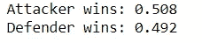
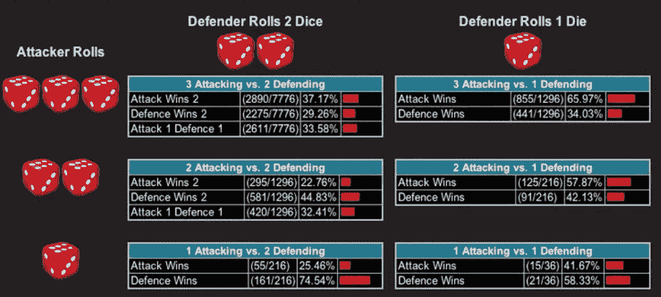
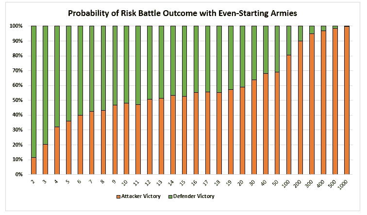

# 风险棋盘游戏——战斗概率网格程序

> 原文：<https://betterprogramming.pub/risk-board-game-battle-probability-grid-program-f3073fb34e5c>

## 击败处于危险中的朋友。使用此工具了解攻击者/防御者之间的战斗有多公平

图片来源:[https://unsplash.com/photos/W8V3G-Nk8FE](https://unsplash.com/photos/W8V3G-Nk8FE)

我对我的战斗自动化程序做了一些编辑，你可以在这里阅读。

这个更新的版本可以输出哪一个营(进攻者/防御者)会获胜的可能性，这取决于每一方有多少首发部队。

## **我给这个版本加的:**

*   将整个工具包装在“for x in range(3000):”语句中以执行迭代
*   捕获每次迭代的攻击者和防御者的胜利

## **代码:**

## **输出:**

这意味着当进攻军队和防守军队都有 12 支军队时，获胜的概率是差不多的！攻击者稍占优势。

# “风险”概率的性质

这让我很好奇，所以我决定用 2-1000 人的初始部队为攻击/防御部队运行这个工具，它给了我一些有趣的结果。但在我们查看结果之前，让我们通过查看概率表来思考与风险作战的本质:

图片来源:[https://www . business insider . com/how-to-use-math-to-win-at-board-game-risk-2013-7](https://www.businessinsider.com/how-to-use-math-to-win-at-the-board-game-risk-2013-7)

这张图表说明了攻击者的优势是规模化的。虽然能够掷出三个骰子，但攻击者获得的概率优势超过了防御者。另一方面，守军最多可以掷出两个骰子，但赢得平局。

当双方掷骰子的数量相当时，优势向防守方倾斜。简而言之——军队越庞大，进攻者就越有利。直到进攻方有一两个骰子，防守方才把优势夺回来。

重要的是要记住，这些表格仅代表孤立滚动的概率。综合防守者的前期优势和进攻者的后期优势后，概率看起来如何？或者换一种说法，随着双方军队的增加，防御者的早期优势能持续多久？

所以在我运行这个程序之前，我假设，即使开始攻击/防御的军队，优势也会在低数量的防御者那里。这种优势可能会减少，直到某一点。然后我假设这种优势会转移到攻击者身上，并随着攻击者的增加而增加。

## **结果:**

# **实际风险提示:**

*   12 支军队基本上都是在抛硬币。
*   战斗规模越大，攻击者就越有可能获胜。
*   战斗规模越小(12 人以下)，防御者就越有可能获胜。

希望这篇文章能给未来的游戏增加价值。如果你想要更深入的了解，你可以自己使用这个工具来试验不同的初始军队。

# 资源

*   [https://github . com/ahershy/Risk-Battle-Probability-Grid-Program/blob/master/Risk % 20 probabilities % 20 python % 202 . ipynb](https://github.com/ahershy/Risk-Battle-Probability-Grid-Program/blob/master/Risk%20probabilities%20python%202.ipynb)