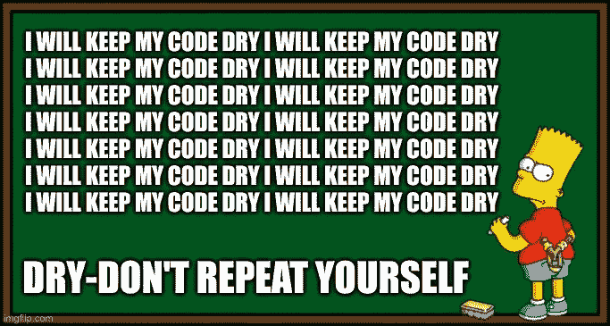
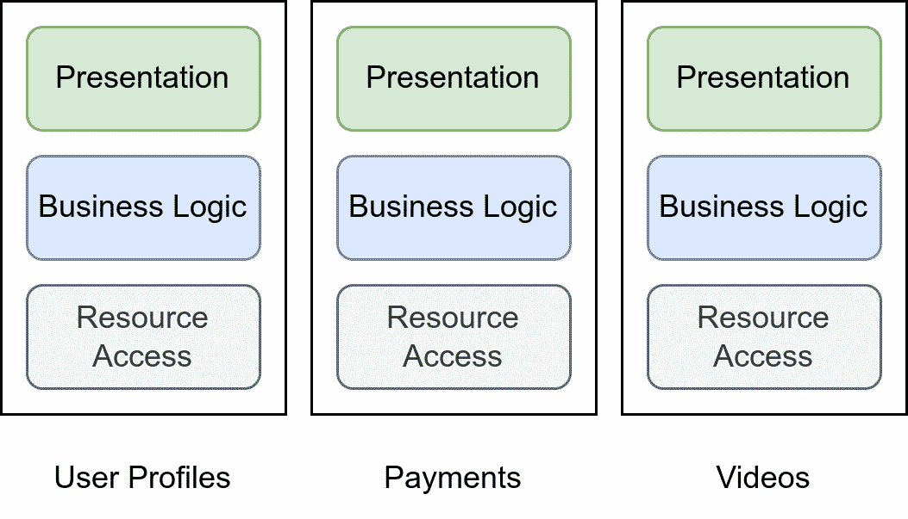

# 9 个流行软件设计原则的风险和好处

> 原文：<https://betterprogramming.pub/risks-and-benefits-of-the-9-popular-software-design-principles-284f8d319ef1>

## 提高你的软件工程技能

蒂姆·莫斯霍尔德在 Unsplash[上的照片](https://unsplash.com?utm_source=medium&utm_medium=referral)

每一个稍微有点经验的软件开发者都知道，保持事情的简单和愚蠢(KISS)是有道理的。一旦你学会了使用类和函数，你就不想重复自己了——保持干爽。

所有这些原则的目标是通过降低心理复杂性来使软件易于维护。

# №1:不要重复自己(干)

来源:由马丁·托马斯通过[https://imgflip.com/i/5zpvee](https://imgflip.com/i/5zpvee)生成

DRY 是软件开发的核心。我们将代码组织成包和模块。我们分解出函数。我们试图使代码可重用，这样我们就有希望更容易维护它。

**好处**:复杂度降低。代码越多，需要维护的就越多。干燥通常导致较少代码。这尤其意味着对于典型的变化，你只需要调整一次。

风险:如果你做得太多，代码通常会变得更复杂。

**工具支持**:有查找重复代码的程序。对于 Python，有`pylint --disable=all --enable=similarities src`

# №2:你不会需要它(YAGNI)

由[帕特里克](https://unsplash.com/@pf91_photography?utm_source=medium&utm_medium=referral)在 [Unsplash](https://unsplash.com?utm_source=medium&utm_medium=referral) 上拍摄的照片

YAGNI 意识到过多的抽象实际上会损害可维护性。Java devs，我看着你呢！

**好处**:复杂度降低。去除抽象使得代码的工作方式更加清晰。

风险:如果你应用 YAGNI 太多，抽象太少，你将很难扩展你的软件。初级开发人员可能会以不好的方式弄乱代码。

**工具支持**:无(也许曾经可以在整个代码库中计算对类的引用？)

# №3:保持简单和愚蠢(吻)

照片由[诺德伍德主题](https://unsplash.com/@nordwood?utm_source=medium&utm_medium=referral)在 [Unsplash](https://unsplash.com?utm_source=medium&utm_medium=referral) 上拍摄

接吻可以适用于很多场合。虽然有些解决方案很聪明，可以解决手头的问题，但是更笨的解决方案可能更好，因为引入问题的可能性更小。这可能会不那么干燥。

# №4:最小惊讶原则

在 [Unsplash](https://unsplash.com?utm_source=medium&utm_medium=referral) 上 [engin akyurt](https://unsplash.com/@enginakyurt?utm_source=medium&utm_medium=referral) 拍摄的照片

以这样一种方式设计你的系统，使得一个特性实现的位置以及一个组件的行为和副作用是最不令人惊讶的。让你的同事了解情况。

**好处**:复杂度降低。你要确保系统的心理模型符合人们的自然假设。

风险:你可能需要违反 DRY 来完成这件事。

**工装支架**:无。然而，有一些迹象表明这被违反了:(1)你一次又一次地向新同事解释你的系统的相同怪癖(2)你需要一次又一次地查找相同的主题(3)你觉得有必要记录一个本身并不复杂的主题。

# №5:关注点分离(SoC)

一个视频流平台的三个不同的微服务尽可能松耦合。在这些服务中，关注点根据它们所服务的功能进行划分。图片作者:马丁·托马斯

每个包、模块、类或函数应该只关心一个问题。如果你做太多事情，你没有一件做好。

在实践中，我最清楚的是数据存储层、表示层和包含业务逻辑的层的分离。其他类型的问题可能是输入验证、数据同步、身份验证等

用 Unix 哲学来表述就是:[做一件事，并把它做好](https://en.wikipedia.org/wiki/Unix_philosophy#Do_One_Thing_and_Do_It_Well)。

**好处**:复杂性降低:(1)通常更清楚需要在哪里进行调整。(2)你需要考虑的不良副作用应该更少。(3)人们可以并行工作，而不会有太多的合并冲突。

风险:如果你在足球上太疯狂，你很可能会违反《吻》或《YAGNI》。

**工具支持**:您可以通过计算使用了多少来自其他包的类/函数来度量内聚性。大量外部导入的函数可能表明 SoC 违规。大量的合并冲突也可能表明存在问题。

# №6:早点失败，大声失败

照片由 [Unsplash](https://unsplash.com?utm_source=medium&utm_medium=referral) 上的[拉克尔·拉克莱特](https://unsplash.com/@raquelraclette?utm_source=medium&utm_medium=referral)拍摄

作为开发人员，我们必须处理各种错误。而且特别是新手，不太清楚怎么处理。

过去对我帮助很大的一个模式是**过早失败**。这意味着非常接近可能发生错误的位置，应该能够识别错误。尤其是用户输入应该直接在输入层进行验证。但是网络交互也是一种常见的情况，您需要处理错误情况。

另一种模式是 **fail loud** ，意思是抛出一个异常并创建一个日志消息。不要只返回 None / NULL。例外是必经之路。根据异常的种类，您可能还想让用户知道。

**好处**:更容易维护，因为功能归属和系统应该如何设计更加清晰。更容易调试，因为错误会提前发生。

**风险**:无。

**工装支架**:无

# №7:防御性编程

照片由[理查德·克拉克](https://unsplash.com/@clarky_523?utm_source=medium&utm_medium=referral)在 [Unsplash](https://unsplash.com?utm_source=medium&utm_medium=referral) 上拍摄

防御性编程以防御性驾驶命名。防御性驾驶是“不顾你周围的条件和他人的行为，为拯救生命、时间和金钱而驾驶”。防御性编程是指不管环境条件和其他人的行为如何，都是健壮和正确的。这可能意味着对错误输入具有鲁棒性，例如，当您在数据库中有一个 IBAN 字段时，要实际确保存储在那里的内容包含一个 IBAN。它还意味着使断言显式化，并在违反断言时引发异常。它可能意味着调用 API 幂等函数。这可能意味着拥有高测试覆盖率来抵御未来的突破性变化。

防御性编程的三个核心规则

*   所有数据都是重要的，除非被证明并非如此。
*   所有的数据都被污染了，直到被证明不是这样。
*   所有代码都是不安全的，除非得到证明。

防御性编程的替代方案是“拉屎进来，拉屎出去”。

**好处**:鲁棒性更高

风险:由于更复杂/冗长的代码库，维护成本更高

工具支持:测试覆盖率，看看你的单元测试覆盖了多少。如果你想发疯，试试[突变检测](https://medium.com/analytics-vidhya/unit-testing-in-python-mutation-testing-7a70143180d8)。对于基础设施，有混沌工程。负载测试。

# №8:实心

坚实的原则为耦合和内聚提供了指导。它们最初是围绕面向对象编程(OOP)制定的，但是你也可以将它们应用于不同的抽象层次，比如服务或功能。稍后我将称这些为“组件”。

两个组件可以以几种方式耦合。例如，一个服务可能需要了解另一个服务的内部工作方式。分量 A 对分量 B 的依赖越强，A 与 B 的耦合就越强，请注意这是一种对称关系。对于耦合，我们不关心方向。

一个模块的高内聚意味着它的内部部分是紧密相连的。他们都在讨论同一个话题。

组件之间的松耦合和高内聚是我们努力的目标。

## 单一责任原则

> "一个类的改变不应该有一个以上的原因."

服务、包、模块、类和功能等软件实体的职责应该是清晰的。他们通常应该在一个抽象层次上操作，不要做太多事情。

单一责任是实现关注点分离的工具之一。

**工具支持**:我不知道有发现违反单一责任原则的自动工具。但是，您可以尝试在不使用“和”/“或”的情况下描述组件的功能。如果这不起作用，你可能会违反它。

## 开闭原则

> "软件实体…应该对扩展开放，但对修改关闭."

如果您更改了其他人依赖的组件，您就有可能破坏他们的代码。

## 利斯科夫替代原理

> "使用指向基类的指针或引用的函数必须能够在不知道的情况下使用派生类的对象."

**好处**:这是你在 OOP 中做的一个非常基本的假设。跟着它走。

**风险**:无？

## 界面分离原理

> “许多特定于客户端的接口比一个通用接口要好。”

**好处**:如果可以挑选的话，扩展软件和重用接口会更容易。然而，如果软件完全是内部的，我宁愿创建更大的接口，并在必要时拆分。

**风险**:违反 KISS / YAGNI。

## 从属倒置原则

> "依靠抽象，而不是具体."

在某些情况下，您希望对更一般的输入类进行操作，而不是当前正在处理的特定类型。我想到的例子有 WSGI(连接 web 服务器和 web 客户端)、JDBC(数据库连接)和基本上任何插件系统(例如 Flake8)。你想定义一个接口并依赖它。这个接口必须由组件来实现。

假设您有一个需要访问关系数据库的应用程序。您现在可以实现所有类型的关系数据库的所有查询。或者定义该函数接收一个实现 JDBC 接口的数据库连接器。现在连接器必须被扩展，而不是所有需要 DB 连接的功能。这就是倒置。

好处:从长远来看，这使得软件更容易维护，因为它的功能更加清晰。这也有助于接吻。

**风险**:如果你做过头了，你可能会违反接吻。一个经验法则是，在创建接口之前，至少有两个类应该实现一个接口。

# №9:局部性原则

米兰·波波维奇在 [Unsplash](https://unsplash.com?utm_source=medium&utm_medium=referral) 拍摄的照片

不要把应该在一起的东西分开。如果代码的两个部分通常是一起编辑的，尽量让它们离得近一些。至少在同一个包中，希望在同一个目录中，也许在同一个文件中——如果你幸运的话，它们可以在同一个类中/在文件中直接位于彼此之下。

**好处**:希望合并冲突少一些。当您试图查找另一个文件时，您不需要切换上下文。当你重构这个片段时，你可能会记住所有属于它的东西。

**风险**:违反松散耦合或关注点分离。

**工具支持**:目前还没有，但是我正在考虑为 Python 创建一个。基本上，我会分析 git 提交。

# 总结一下:Python 的禅

我绝对喜欢[Python 的禅](https://en.wikipedia.org/wiki/Zen_of_Python)。虽然它没有其他几个原则具体，但它是一个非常重要的编程理念:

> 漂亮总比难看好。
> 显性比隐性好。
> 简单总比复杂好。
> 复杂总比复杂好。
> 
> 扁平的比嵌套的好。
> 稀不如密。可读性很重要。
> 
> 特例不足以特殊到打破规则。
> 虽然实用性胜过纯粹性。
> 
> 错误永远不会无声无息地过去。
> 除非明确消音。
> 
> 面对暧昧，拒绝猜测的诱惑。应该有一种——最好只有一种——显而易见的方法来做这件事。
> 尽管这种方式一开始可能并不明显，除非你是荷兰人。
> 
> 现在总比没有好。
> 虽然永远也不会比现在更好。
> 
> 如果实现很难解释，这是一个坏主意。
> 如果实现容易解释，可能是个好主意。
> 
> 名称空间是一个非常棒的想法——让我们多做一些吧！

我喜欢写关于软件开发和技术的文章🤩不要错过更新: [**获取我的免费电子邮件简讯**](https://martinthoma.medium.com/subscribe) 📧或者[如果你还没有报名参加 medium](https://martinthoma.medium.com/membership)✍️——这两者都鼓励我写更多🤗