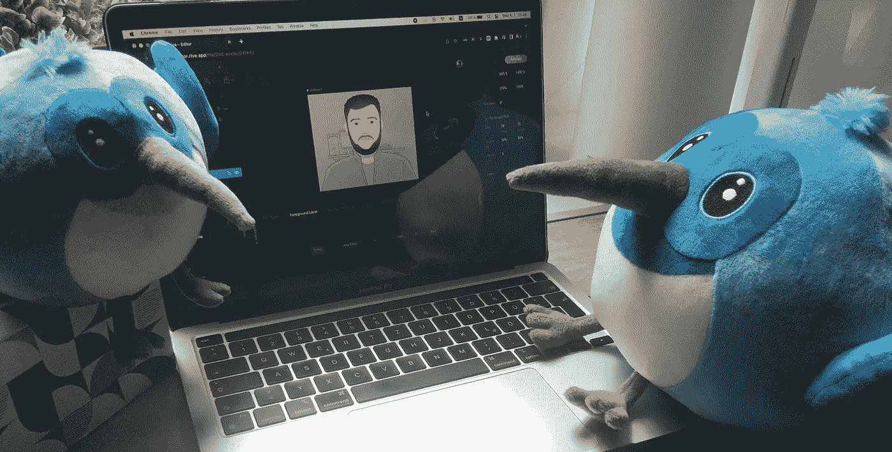
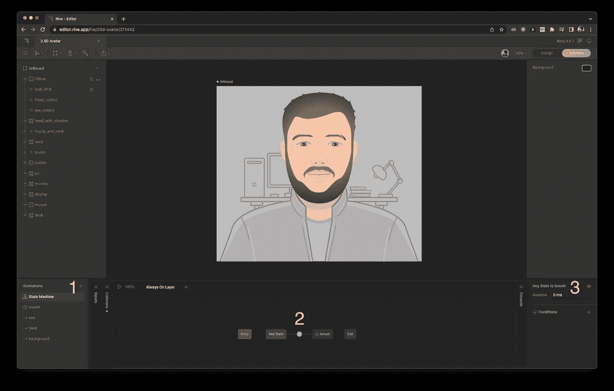
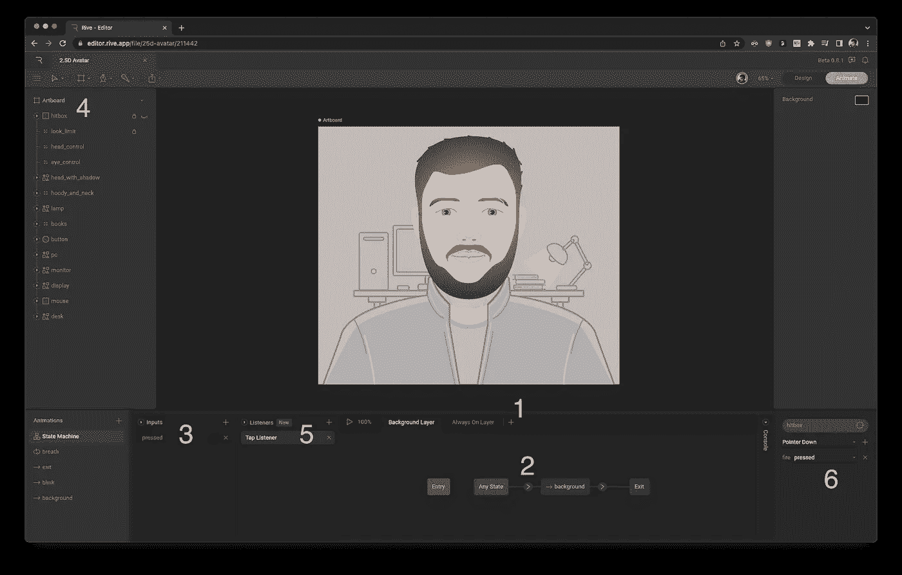
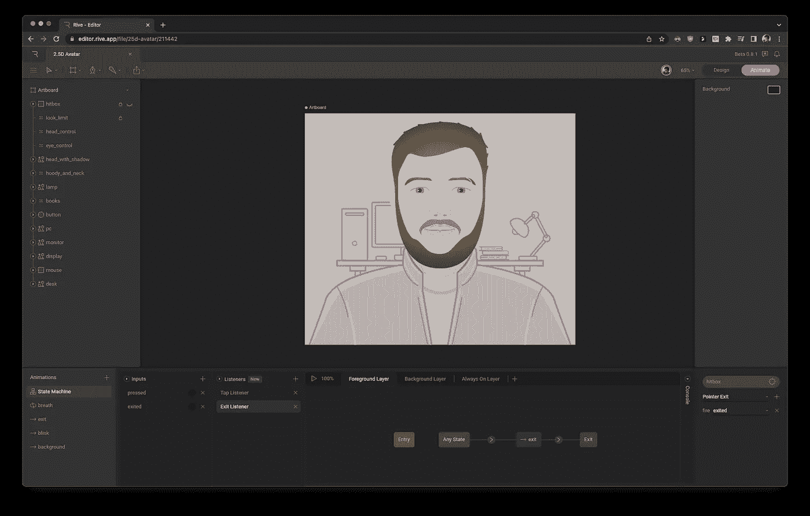
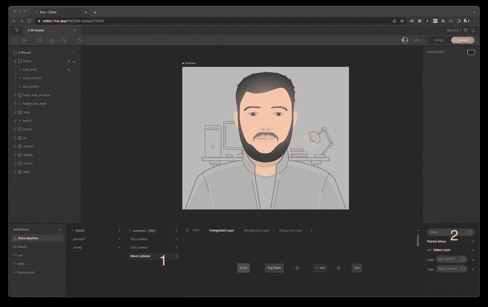

# Rive 2 — 2.5D 头像，使用 Flutter 进行指针跟踪

> 原文：<https://betterprogramming.pub/rive-2-2-5d-avatar-with-pointer-tracking-6ea069df2fa>

## 应用状态机



# 介绍

距离我上一篇 Rive 文章已经过去很长时间了。以前是 Rive 1 (Flare)，但现在，太阳在 Rive 2 升起。它已经拥有了第一部的大部分功能，加上状态机！这是一个游戏改变者，所以在这里我会告诉你为什么，通过这个“如何”教程，在 Rive 2 中创建一个跟随指针/点击位置的实时伪 3D 化身。

类似于[这个视频](https://www.youtube.com/watch?v=UxDAs8RgKyY)的东西，嗯……是啊，设计超级牛逼(和往常一样)，但是如何让它在你的网站或者应用上变得交互？这就是我的解决方法，走吧！

在本教程中，我将展示在 Flutter 中制作的代码部分的实现，然而，这里的逻辑与 React Native 非常相似。

# 设计部分

我不会详细讲述如何正确地创建一个人或生物的化身并制作动画——这只取决于你的想象力和设计技巧，有大量的例子和教程，包括上面链接中的那个。在这篇文章中，我将向你描述如何应用一个状态机并将不同的状态与动画联系起来，最重要的是，将整个事情与你的代码联系起来。不会超过几分钟，你也可以[在这个视频](https://youtu.be/EGv2rjTjzDM)中看到这一部分。

在迁移过程中，状态机为我节省了大约一百行代码。在我的例子中，我将把眼睛和头部的运动与呼吸动画、眼睛返回到原始位置的退出动画(当光标离开化身时)以及背景的按下动画联系起来。比方说，你已经在 Rive 2 中做了一些动画设计，并且想用指针移动来制作动画——那么，让我们开始吧。

## 呼吸动画



始终打开图层设置

首先，创建一个空的状态机，如果你还没有的话，在我的例子中，我需要实现一个循环播放的动画，不考虑任何东西的状态——呼吸的动画。

要在一个空层上这样做，拖动动画(在我的例子中是“呼吸”)，通过从它的边缘拖动到块动画，将蓝色块“任何状态”链接到呼吸的动画。

在出现的箭头处，可以将持续时间设置为零，以便动画立即开始。按“播放”按钮可以看到动画现在无限循环播放。很简单，对吧？下一层会稍微复杂一点。

## 背景动画



背景层设置

创建一个新层，再次拖动你的背景动画，并将其链接到蓝色块，具有相同的持续时间，但这一次我们需要设置回调来播放这个“一次性”动画。我们将使用"**监听器**和"**输入**，因此在输入选项卡中创建一个新的**触发器**，让我们称之为“按下的”，但是现在如何触发它呢？

首先，我们需要创建一个用户点击的对象。你可以用一个透明的矩形大小的画板( *Rive 团队，顺便问一下，为什么我们不能用画板作为 hitbox？*)。现在创建一个新的"**指针向下**类型的"**监听器**"。通过灰色按钮，选择目标—我们的新矩形，在下拉“设置”菜单中指定我们的新触发器“按下”。现在在"**任意状态**"块>你的动画之间的箭头处，添加一个新的"**条件** ": "pressed "并将块动画与红色的" Exit "块链接起来，这样动画将总是结束(*否则，我们不能通过" pressed "触发器再次调用它，因为我们不能调用已经运行的动画，即使它处于完成状态*)。下面的动画会很像，走吧。

## 退出动画



前景层设置

同样，该动画独立于其他动画，创建一个新层，也拖动动画，并将其链接到" **Any State** "块。类似地，创建一个输入触发器“exited”和一个“**指针退出**监听器，再次选择一个“hitbox”目标，并设置“exited”触发器。在退出动画和“**任何状态**块之间的箭头处，将**条件**设置为“按下”。在我的例子中，我增加了 300 毫秒的持续时间，以使眼球运动更加流畅。最后，将动画块连接到红色的“ **Exit** ”块。

## 光标/点击动画



指针移动监听器设置

现在让我们添加一个全局的"**监听器**"它将对指针的位置做出反应。目标将再次成为我们的“hitbox”矩形，监听器类型应该是一个新的“**指针移动**”，并在“设置”菜单中选择您的目标节点，即我们的对象跟随的点并相应地改变它们的位置，在我的例子中，有两个，分别是眼睛和头部，所以选择它们。

我们已经完成了设计部分，检查你的动画，头像移动，和播放按钮的回调。如果你满意，下载你的**。最新运行时的 riv** 文件。在下一节中，我们将看看代码方面。

# 代码部分

## 控制器类别和设置

假设您已经有了一些 Flutter 项目，或者至少已经创建了一个默认项目。向`pubspec.yaml`添加[驱动依赖](https://pub.dev/packages/rive)，版本 **0.9.1** 或更高版本:

```
rive: ^0.9.1
```

或者对最新的 master 使用 git 依赖。

首先，让我们创建一个类来控制动画的逻辑，处理回调等。让我们称之为`RiveAvatar`，对于 [Rive](https://pub.dev/documentation/rive/latest/rive/Rive-class.html) 小部件，我们应该像往常一样需要一个用于画板的字段，还需要一些存储在状态机控制器中的用于输入/触发的字段，所以看起来应该是这样的。

你可能会注意到，`[StateMachineController](https://pub.dev/documentation/rive/latest/rive/StateMachineController-class.html)` 现在有了一个名为`pointerMove`的新方法，它需要[*【Vec2D】*](https://pub.dev/documentation/rive/latest/math/Vec2D-class.html)，这是一个同样来自 Rive 包的类型，但是 Flutter 只提供了一个`[Offset](https://api.flutter.dev/flutter/dart-ui/Offset-class.html)`作为指针坐标参考。另外，那些`[SMITrigger](https://pub.dev/documentation/rive/latest/rive/SMITrigger-class.html)`类型转换看起来很难看，所以让我们写一些助手扩展来将`Offset`映射到`Vec2D`坐标，避免类型转换(因为`SMITrigger`扩展了`SMIInput` 类型，我们可以欺骗飞镖分析器*)，就像这样:*

太好了，现在我们可以用这个可爱的一行程序让我们的化身活起来:

```
*void* move(*Offset* pointer) => _controller.pointerMoveFromOffset(pointer);
```

为了触发我们的退出动画，我们可以这样调用`fire()`方法:

```
*void* onExit() => _exitInput?.fire();
```

对于`onTap`事件也是如此。但是没有鼠标/触控板输入的智能手机、平板电脑和其他设备会怎么样呢？逻辑会稍微复杂一点:

```
*void* onTapDown(*TapDownDetails* details) {
  _pressInput?.fire(); *// Fire background animation.* *if* (details.kind == PointerDeviceKind.touch) {
    move(details.localPosition); *// Move eyes to the tap position.
    Future*.delayed(*const* *Duration*(seconds: *1*), onExit); *// Exit after one sec.* }
}
```

我们的*画板*目前是私有的，但是我们应该在 UI 上引用它，我们需要为它获取一个 getter。还有， *RiveAvatar* 似乎是一个静一些的好地方”。riv "文件缓存方法通过`[RiveFile](https://pub.dev/documentation/rive/latest/rive/RiveFile-class.html)` 类实现。让我们在这个 dart 文件中把所有的[放在一起。](https://github.com/tsinis/tsinis.github.io/blob/master/lib/animations/rive_avatar.dart)

## 缓存和用户界面部分

现在我们有一个方法可以从项目中的任何地方缓存我们的头像，我强烈建议你在应用程序开始之前做，因为它是异步操作:

```
*import* ‘package:flutter/widgets.dart’;
*import* ‘animations/rive_avatar.dart’;
*import* ‘my_app.dart’;*Future*<*void*> main() *async* {
*final* cachedAnimation = *await* *RiveAvatar*.cachedAnimation;
runApp(*MyApp*(cachedAnimation.mainArtboard));
}
```

你可能会注意到`mainArtboard` getter，因为你可能不需要整个 *RiveFile* ，只需要其中的一个画板。同样，如果你有多个画板，你可以调用`riveFile.artboardByName`方法。现在你可以把它提供给任何一个`[InheritedWidget](https://api.flutter.dev/flutter/widgets/InheritedWidget-class.html)`，你喜欢的 DI，或者简单的把它传递给构造函数。我更喜欢第一个或最后一个，所以这就是 avatar 场景类构造函数的样子:

```
*import* ‘package:flutter/material.dart’;
*import* ‘package:rive/rive.dart’;
*import* ‘../animations/rive_avatar.dart’;*class* *AvatarScene* *extends* *StatelessWidget* {
*final* *RiveAvatar* _avatar;*AvatarScene*(*Artboard*? cachedArtboard, {*super*.key})
: _avatar = *RiveAvatar*(cachedArtboard);...}
```

要处理鼠标指针退出和悬停事件，我们绝对应该使用`[*MouseRegion*](https://api.flutter.dev/flutter/widgets/MouseRegion-class.html)` 小部件，对于简单的点击，处理经典的`[*GestureDetector*](https://api.flutter.dev/flutter/widgets/GestureDetector-class.html)` 就足够了，两个小部件都可以提供悬停/点击事件的`localPosition`作为`*Offset*`。*显然将* widget 作为那两个的子控件，并将`useArtboardSize`标志设置为`true`。为了让它更灵活一点——在此基础上增加了一个`[*FittedBox*](https://api.flutter.dev/flutter/widgets/FittedBox-class.html)`。你也可以选择用 [*ColoredBox*](https://api.flutter.dev/flutter/widgets/ColoredBox-class.html) 为你的头像提供背景色，这样[看起来就会像这样](https://github.com/tsinis/tsinis.github.io/blob/master/lib/widgets/avatar_scene.dart)。

> 在撰写本文时，Poscriptum 几乎没有关于“指针移动”侦听器的文档，所以如果您注意到任何错误或遗漏信息，请随意撰写。感谢阅读！

[](https://rive.app/s/5TcK-mI1cUark2TkVaaMNA/) [## 2.5D 头像

### 编辑描述

rive.app](https://rive.app/s/5TcK-mI1cUark2TkVaaMNA/)