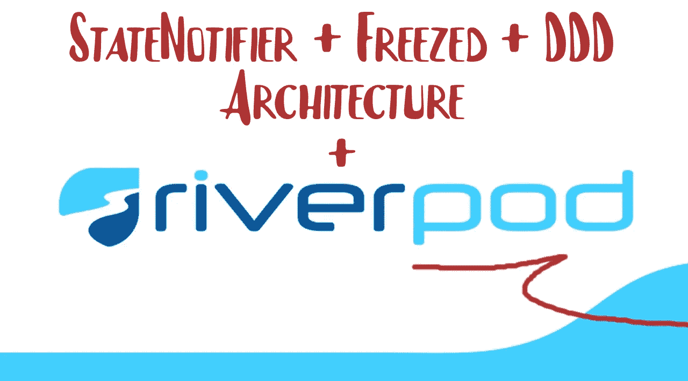
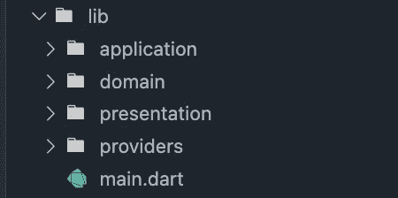

# 使用 Riverpod、StateNotifier、Freezed 和 DDD 的颤振状态管理

> 原文：<https://betterprogramming.pub/riverpod-statenotifier-freezed-ddd-combination-to-manage-the-state-powerfully-in-flutter-e674ba7e932c>

## 让我们构建一个 Todo 应用程序



> 注:在开始之前，如果你想看这个项目的链接，可以在这里访问项目[。同样是这个项目，在 YouTube 上，我上传了一个视频，所以你也可以从](https://github.com/alper-efe-sahin/todo_riverpod_ddd_freezed_statenotifier)[这里](https://youtu.be/wtw_5d7VWmQ)观看。

大家好。在本文中，我们将使用 river pod+state notifier+Freezed+域驱动设计(DDD)创建一个 Todo 应用程序。当我写这篇文章的时候，我也在上传与这篇文章相关的视频。所以，你想要什么，你就可以做什么，你既可以读，也可以看。

首先，在这篇文章中我不会解释所有的事情，因为有一个视频。我只是创建架构，我试着教如何用其他东西创建 Riverpod。

好了，我们开始吧。

# 待办事项应用程序

我在做一个待办应用，因为它很简单，对吧？我不想创建`COUNTER`应用程序，因为有很多计数器应用程序，我不想再看到更多。所以我会创建一个简单的待办事项应用程序。

同样在我的 GitHub 上，我还有一条内容，就是`rickandmortyapi`，又和 river pod+state notifier+Freezed+域驱动设计(DDD)有关。我还会写文章和上传视频，但这个待办事项应用程序对于了解我们如何使用 Riverpod 非常重要。

首先，让我们看看我们的架构(文件夹):



这里我们有应用程序文件夹，用于业务逻辑。领域、表示、可能还有基础设施等等。它们在这里(文件结构部分)有很好的解释[。](https://medium.com/@sahinefe/bloc-pattern-for-login-bloc-login-in-flutter-551fd05beb99)

接下来，在创建小部件(我指的是基本 UI)之后，我们可以转移到真正的问题:

> 我们如何同时使用 river pod+state notifier+Freezed+域驱动设计(DDD)。

注意:对于这个项目，这里是`pubspec.yaml`文件(对于包，如果你想使用它们):

首先，让我们创建一个域文件夹，它有一些模型。

创建模型后，我们需要运行下面的代码:

```
flutter packages pub run build_runner build — delete-conflicting-outputs
```

…错误就会消失。

其次，我们有应用程序文件夹的文件。

让我们也创建它们。当你创建这个架构时，那么你需要从创建一个状态文件开始，因为你可能会感到困惑(这只是一个建议)。

这是我们的`todo_state.dart`文件:

之后，创建`todo_event.dart`文件:

创建 todo 状态和 todo 事件后，我们需要运行以下代码:

```
flutter packages pub run build_runner build — delete-conflicting-outputs
```

错误会消失。

现在，最后一个是状态通知部分。我们的状态是 todo，所以我们可以用`TodoNotifier`重命名它。

此外，创建一个`todo_notifier.dart`文件:

在这里，我们不必运行构建运行程序什么的，我们不需要它。

我们有通知程序、状态、事件和模型。现在，我们可以创建我们的`provider`，之后，我们可以到达这些状态、事件等。通过`Provider`。

在提供者文件夹中，创建`todo_provider.dart`:

这里我们使用`StateNotifierProvider`，因为我们想要到达我们的通知程序，以及它的状态。所以我们用我们的`TodoNotifier`和`TodoState`创造了`StateNotifierProvider`。如您所见，它也返回了`TodoNotifier()`。

我们需要做的最后一件事，调用我们的状态，发送事件，使用我们的提供者，因为我们几乎完成了！

让我们移动`main.dart`文件夹。

如果你想用`Riverpod`树，那么你必须用`ProviderScope()`把所有的东西都包起来。

简单地说，我们的`main.dart`文件在这里:

接下来，我们可以移动演示文件夹。

下面是我们的`app_widget`(核心文件):

当然，不要忘记进口正确的东西！

此外，我们还有`home_page`:

我们有了`final todoList`变量。我们用`ref.watch`方法得到我们的`STATE`，而不是`METHOD`。如果你想访问你的通知程序，它有你的方法和函数，那么你需要使用`yourprovider.notifier`代码。对于州，只需使用`ref.watch(yourProvider)`。有时候选择方法也是有用的。

比如我们用`select`的方法，因为我们只是想看`todoList`，而不是所有的状态。

在`home_page.dart`文件中，我们还有其他部分，如`TodosActionPart`和`TodosPart`部分。

在`TodosActionPart`部分，我们有一个按钮和`textfield`。我们不使用`onChanged`，因为我们有`TextfieldController`，我们在这里保存我们的文本。

当我们使用 Riverpod 时，如果我们使用一个按钮或`onTap`，或`onClick`，没关系，我们不能使用`watch`。不要使用它。我们什么都不听，我们只是点击按钮，就这样。欲了解更多信息，请访问`riverpod.dev`链接。

我们用`provider.notifier`来表示通知者。然后，调用我们的函数，名字叫`mapEventsToState`。首先，我们添加了`TodoTitleChanged`事件，接下来，我们添加了`AddTodo`事件。

对于`todos_part.dart`文件，我们用同样的东西。


这就是我的全部。此外，你可以从[这里](https://github.com/alperefesahin?tab=repositories)浏览我用 Riverpod 创建的应用程序。

感谢您的阅读，敬请关注！