# ROAMEXT——Roam Research Extended:一小段具有强大功能的代码

> 原文：<https://betterprogramming.pub/roamext-roam-extended-a-little-piece-of-code-with-mighty-power-a18184c0c5be>

## Roam 中更好的样式

由 [Kimson Doan](https://unsplash.com/@kimsondoan?utm_source=medium&utm_medium=referral) 在 [Unsplash](https://unsplash.com?utm_source=medium&utm_medium=referral) 上拍摄的照片

【2020 年 12 月 15 日更新: ROAMEXT 1.x 现已过时:)。它所提供的功能已经成为漫游的原生功能。然而，如果你想看看你能用 block 标签做些什么，请继续阅读(只是要注意在官方实现中的术语有一点不同)。

在这篇短文中，我想与你分享我为 [Roam](https://roamresearch.com/) 研究编写的一小段代码，名为 [ROAMEXT (= Roam extended)](https://roamresearch.com/#/app/CatoMinor-public/page/QNv9d89RI) 。这是一个所谓的 JavaScript 插件，你可以安装在你的图形中。但是不要担心，你不必为了理解它能为你做什么而去理解它是如何工作的。

有些人可能会问，“为什么又是一个漫游插件？”已经有这么多了。他们正在做非常惊人的事情！他们添加了[图库](https://gist.github.com/thesved/6574586e102332ab4a010e3dfaa9c4e7)、[过滤属性表](https://twitter.com/shawnpmurphy8/status/1314877901297262593?s=20)、[图标到你的链接](https://twitter.com/mmuehlenstein/status/1299624448614715392?s=20)、[更多的](https://roamresearch.com/#/app/roam-tricks/page/pib_T24F4)。然而，我是一个修补者，我错过了一件事情，它不会为我做一个特定的任务，而是允许我以一种全新的方式定制我的漫游体验。

为了理解 ROAMEXT 做什么，让我们快速回顾一下 Roam 中的普通标签是如何工作的。每个`#tag`生成一个特殊的 HTML 代码，其属性包含它的值。这听起来可能很难，但实际上非常简单。假设我们有一个名为`#roam`的标签。如果我们查看代码，我们会看到:

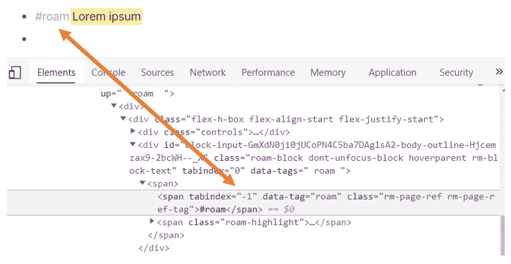

#roam 标签的 HTML 代码

在 HTML 代码中，我们的`#roam`标签夹在开始标签`<span...>`和结束标签``之间。前者包含具有不同值的所谓属性，例如`tabindex`。你知道接下来会发生什么吗？那就是属性`data-tag`和值`roam`(也就是我们没有`#`的标签)。

这可能看起来很小，但它给了 Roam 定制者巨大的力量。例如，它允许我们定义一个简单的样式规则:将`#roam`后的任何高亮文本更改为特定的颜色——或者您甚至可以定义表格或看板的外观！所有这些都使用一种简单的样式语言 CSS——层叠样式表。然而，所有定制者都面临一个巨大的限制。我们不能使用标签来格式化我们的块。原因？`#tags`只能影响跟随他们的东西。

那么我的 ROAMEXT 扩展是做什么的呢？它会在您的块中寻找变化，一旦看到新的标签，它就会获取它的值并保存到父块中一个名为`data-tags`的特殊属性中。这个属性被称为`data-tags`(复数)，因为它可以包含任意数量的标签。

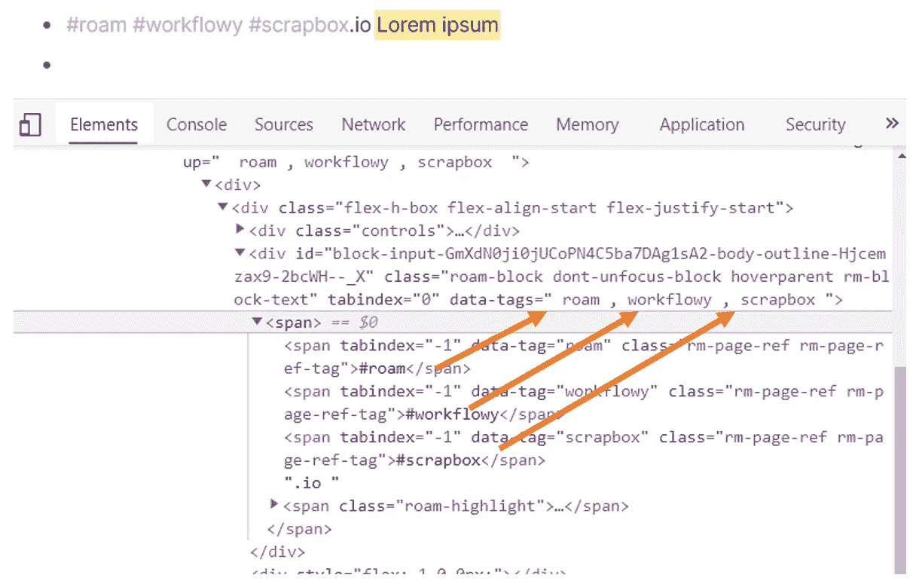

ROAMEXT 将所有标记的值保存到 data-tags 属性中

因为它在父块中，所以您现在可以影响它的外观，但是不能影响任何子块的外观。

为了能够做到这一点，该脚本还将完全相同的标记保存到您的块及其子块所拥有的共同祖先中，保存到一个名为`data-tags-up`的特殊属性中(抱歉，您可能已经注意到，我不擅长给事物命名)。从技术上讲，只有这个可以做所有的事情。但是，将这些值保存在这两个地方会更方便，因为这样可以缩短 CSS 样式代码。

这是我们得到的结果:

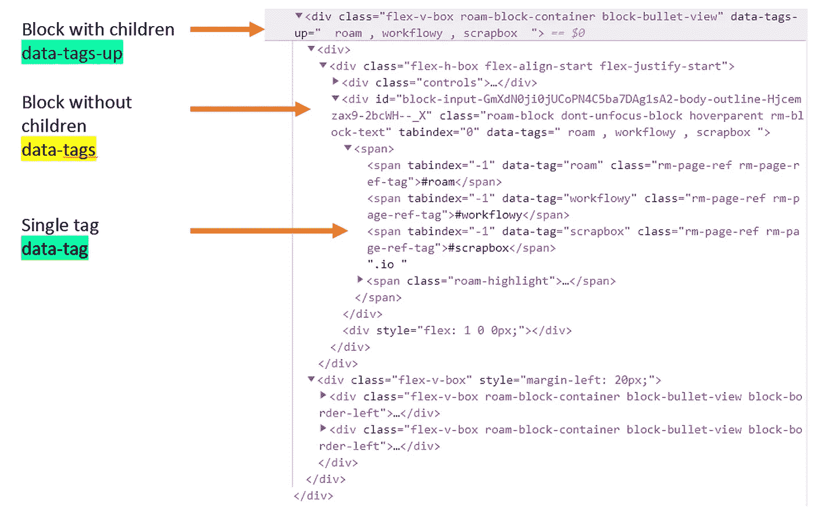

ROAMEXT 将所有标记的值也保存到 data-tags-up 属性中

说明其工作方式的最佳方式是下面的示例，该示例说明了`data-tags`和`data-tags-up`:

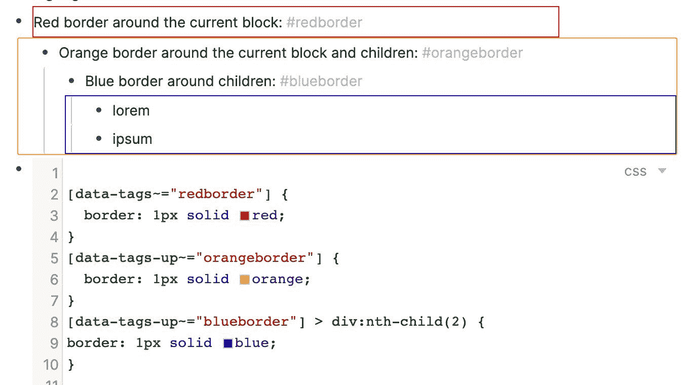

使用不同属性的示例

`#redborder`仅使用`[data-tags~="redborder"]`作为其选择器，并在块周围创建一个红色边框，只是没有任何子块。

`#orangeborder`使用更高的`[data-tags-up~=”orangeborder"]`匹配该块及其子块的共同祖先。这使得它非常适合给整个街区上色。

`#blueborder`也使用`data-tags-up`；但是，它指定不选择整个有子块的块，而只选择它的子块`> div:nth-child(2)`。

注意一件重要的事情:在`data-tag`(即，在单个标签的情况下)我们使用`=`操作符来匹配标签(像`[data-tag="Roam"]`，这里我们必须在`data-tags`和`data-tags-up`中使用`~=`操作符。有一个很好的理由，但是超出了本文的范围:)。

# 关于 ROAMEXT 的三个例子

现在是一些真实例子的时候了，从简单的例子到更复杂的例子。

## 大宗报价

那么我们能做些什么呢？我的基本方案是将它用于块报价——这可能是 Roam 中最需要的缺失特性之一。我所需要的只是下面使用`data-tags`的简单代码:

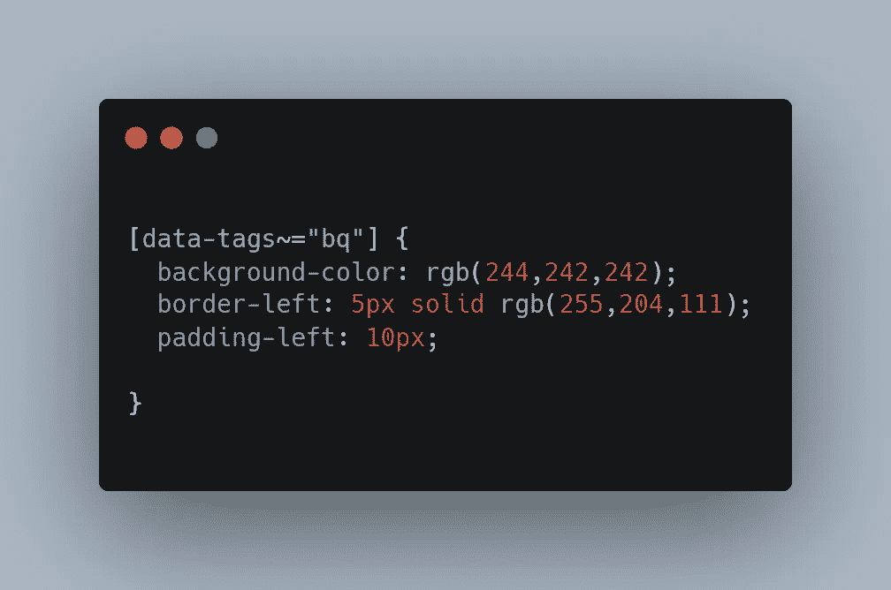

块引用的简单 CSS

然后我可以简单的写`#bq`然后…

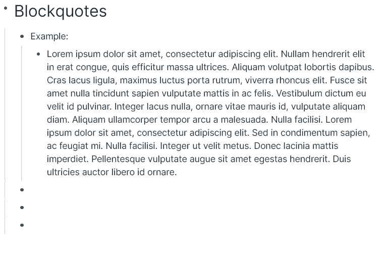

创建批量报价非常容易…

瞧，一个完整的报价！

如果我想让`#bq`消失，我只需要添加一个简单的规则:

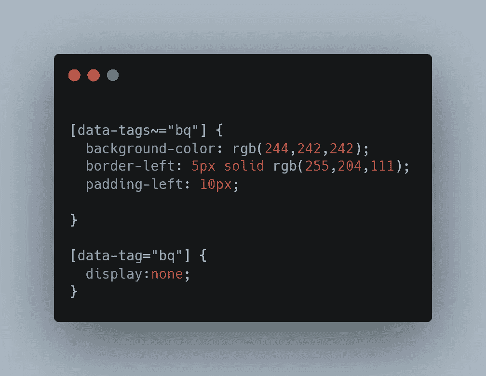

如何隐藏标签

现在它是完美的:

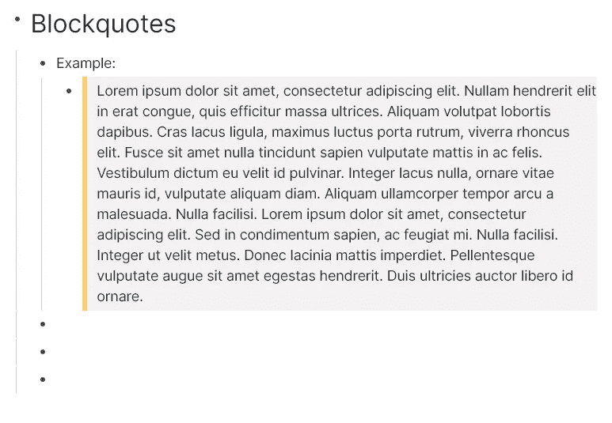

我们大宗报价的最终版本

让我们转向更复杂的情况。

## 彩色块(有和没有子节点)

从基本意义上说，我们已经有了色块。我们的`#bq`与此无异；我们应该稍微改变一下它的边框:

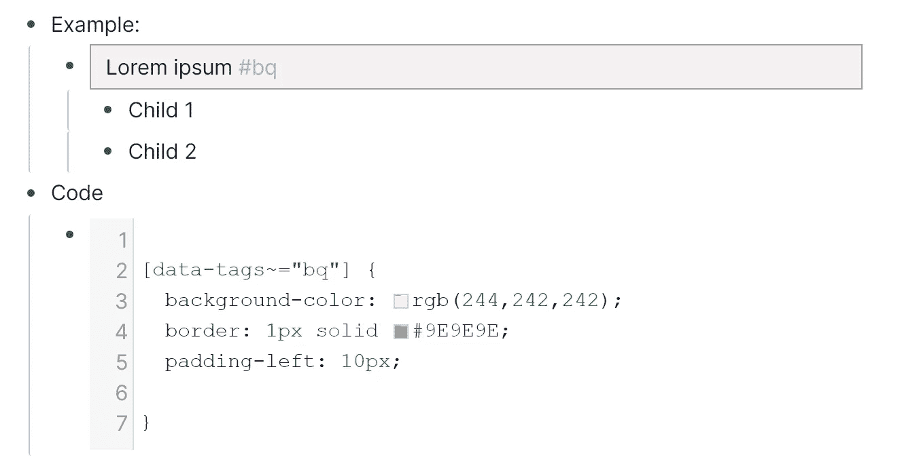

从方块报价到彩色方块

但是，如果我们想拥有包括他们孩子在内的彩色积木呢？是时候前进了！我们将使用`data-tags-up`来创建彩色块，以打破 outliners 倾向于成为的可怕的匿名子弹墙(Roam 在这里也不例外)。

其实我们不用做太多。如果我们简单地在我们的`#bq`代码中将`data-tags`改为`data-tags-up`，我们会得到这样的结果:

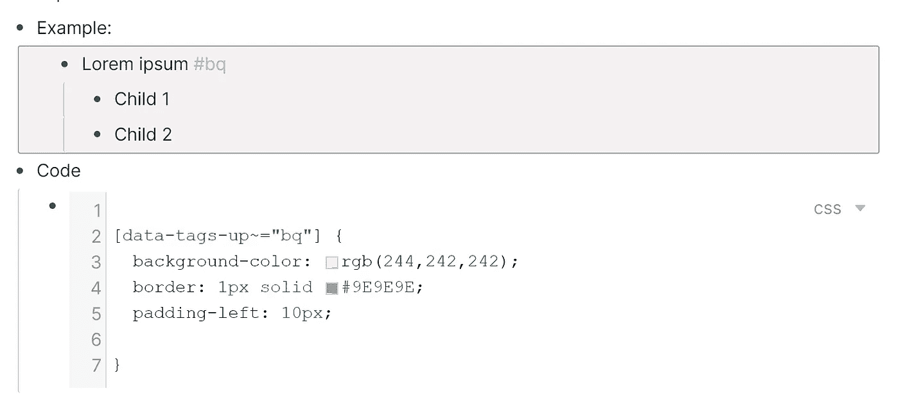

给积木涂上颜色

我们刚刚把`data-tags`改成了`data-tags-up`。如果我们只想给块的子块着色，我们可以给`[data-tags-up~="bq"]`附加一个短字符串，表示`> div:nth-child(2)`，即选择第二个子块`div`(这是一个包含子块的容器)。

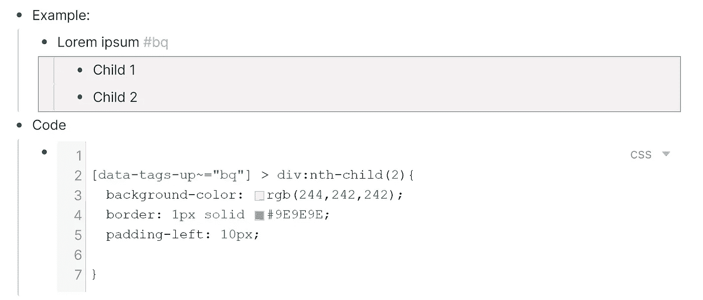

只给孩子上色

现在您可以将您的`#bq`重命名为例如`block:grey`，适当地更改代码，您就可以开始了。

如果你不想自己想出所有的颜色块，查看本文的伙伴网站中的[，它包含一个现成的解决方案，你只需要复制到你的图表中。](https://roamresearch.com/#/app/CatoMinor-public/page/Hjcemzax9)

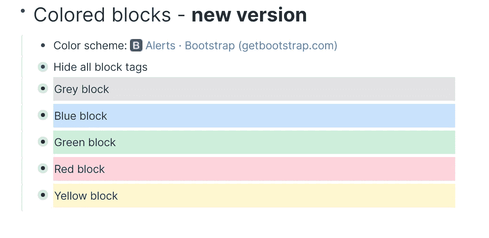

彩色积木

## 粘性块

还记得 ROAMEXT 保存了`data-tags`和`data-tags-up`中所有标签的列表吗？这意味着我们实际上可以组合不同的标签。

假设我们想让我们的彩色积木粘在一起。我们可以重新定义它的代码，但是更容易的是简单地创建另一个`#tag` ——例如`#sticky` ——来完成这一项工作。然后，我们可以将它添加到我们想要的任何块中。而我们的`#sticky`的内容应该是什么？只是这个:

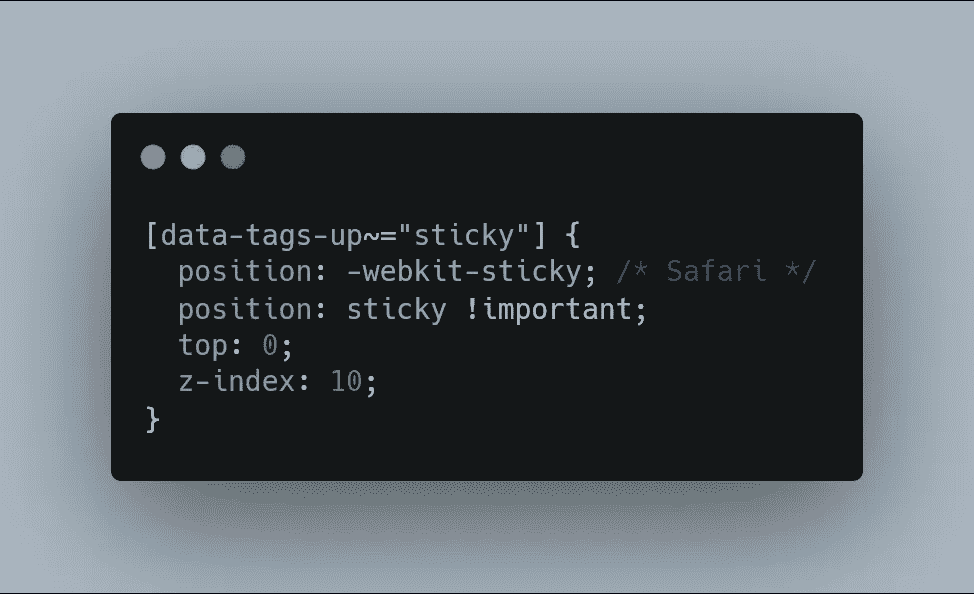

一个简单的粘性分组码

结果呢？

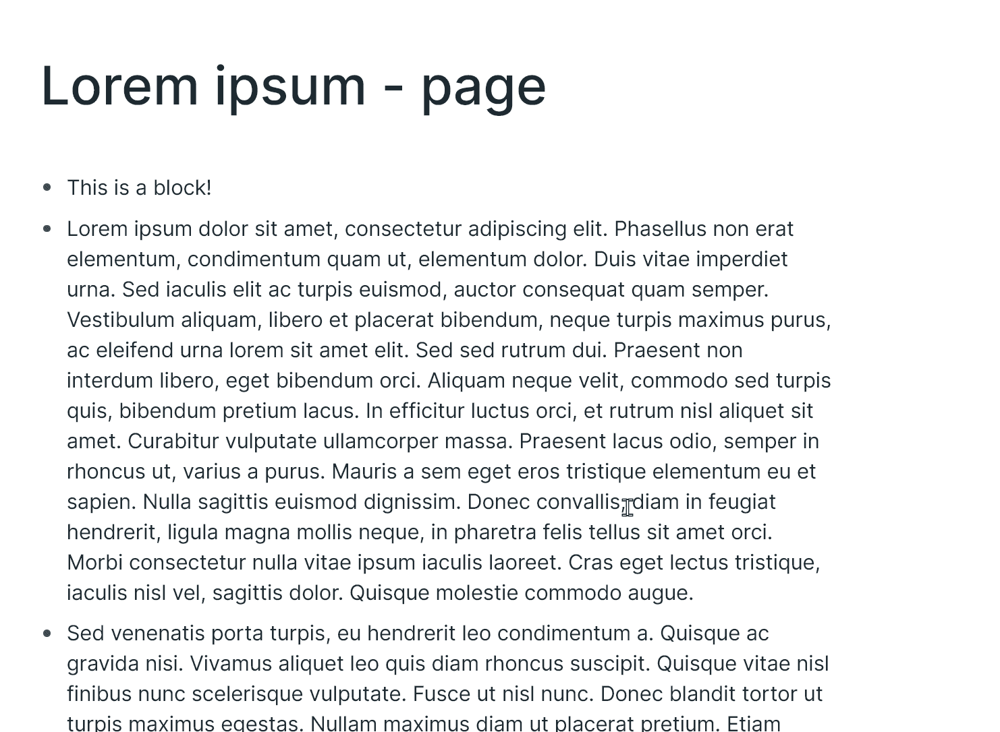

一块黏糊糊的东西

**重要提示:**如果`#sticky`没有正确覆盖其他元素，请尝试更改`z-index`。数字越高，它在其他元素前面的位置就越多。

你会在我的这篇文章的伙伴页面上找到代码。