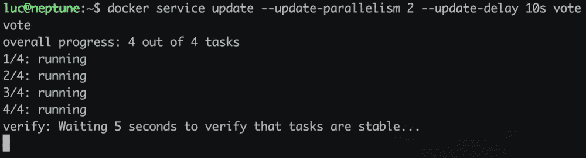
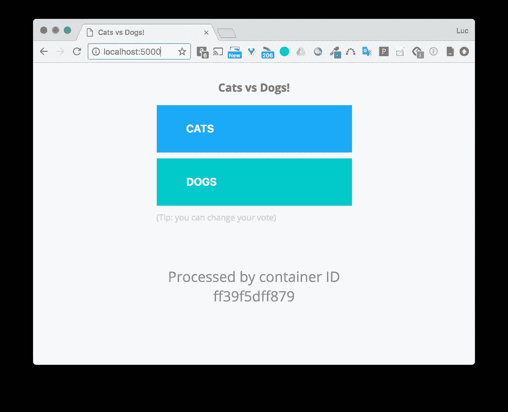
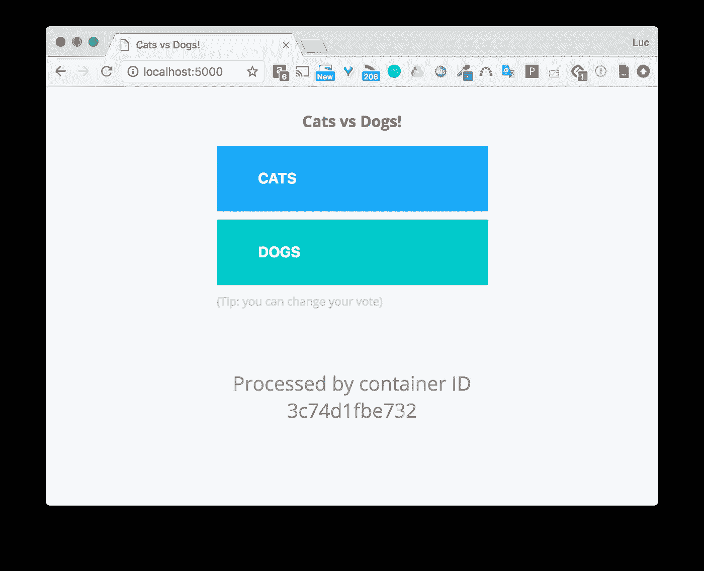
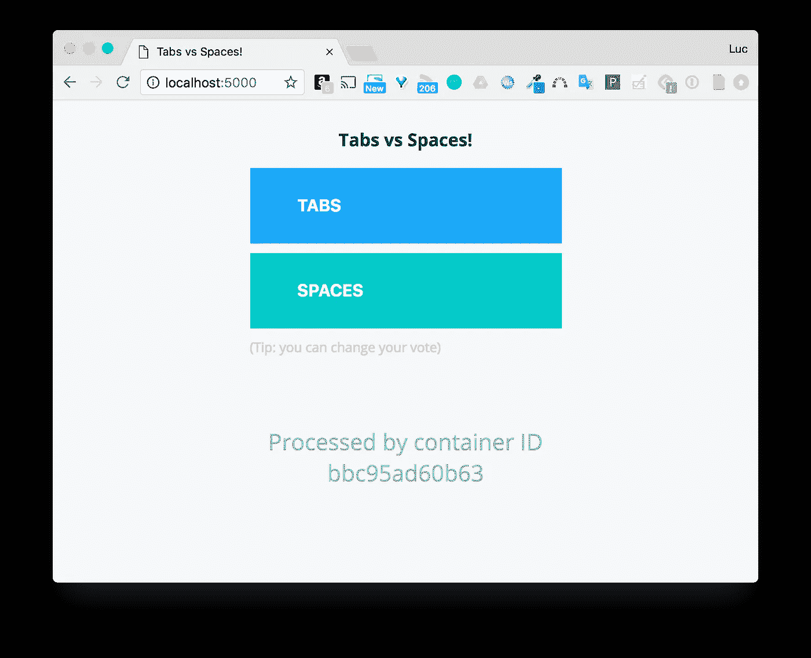
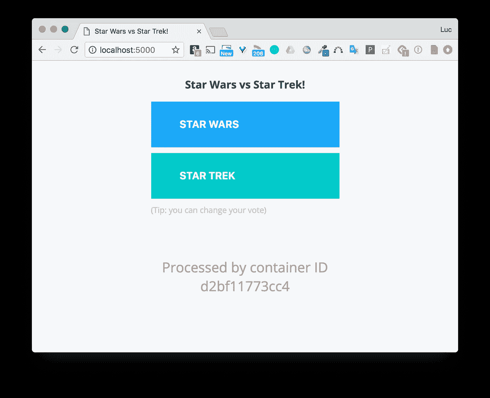
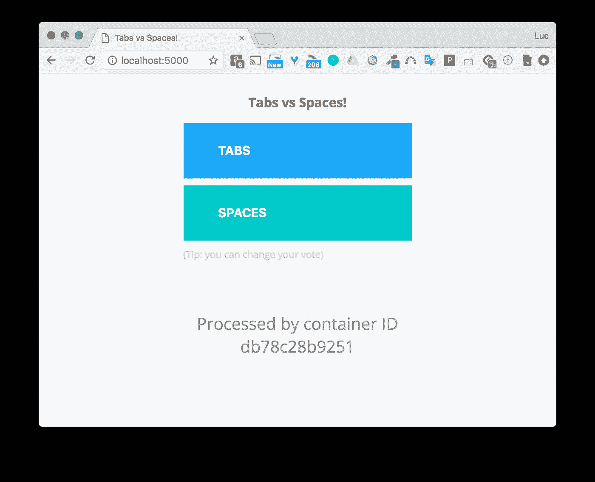

# Docker 提示:Docker Swarm 中的展示和回滚

> 原文：<https://betterprogramming.pub/rollout-and-rollback-in-docker-swarm-7f19e2fe2cd1>



# TL；速度三角形定位法(dead reckoning)

得益于几个选项， [Docker Swarm](https://docs.docker.com/engine/swarm/) 使得对正在运行的服务执行滚动更新变得非常容易。

## 创造一个蜂群

下面的命令是将 Docker 守护进程转移到 Swarm 模式所需要的唯一东西。

```
$ docker swarm init
```

注意:如果你有几个私有 IP，你需要使用其中的一个，并用它来喂养`--advertise-addr`。上面的命令将会是:

```
$ docker swarm init --advertise-addr MY_IP
```

一旦创建了群，我们可以添加额外的节点，但这在本文中没有用——单节点群完全可以。

免责声明:不要通过在生产中运行单节点群集。

## 部署服务

在 Swarm 上，服务可以手动部署，也可以通过堆栈文件部署。让我们使用第一个选项，并基于`instavote/vote`映像创建一个服务。


上面运行的命令如下所示。

```
$ docker service create \ 
--name vote \
--replicas 4 \
--publish 5000:80 \
instavote/vote 
```

它为服务指定了 4 个副本。在幕后，这意味着投票服务的四个任务(一个任务运行一个容器)现在在 Swarm 上运行。当在端口 5000 上向投票服务发送一个请求时，这个请求会针对四个任务中的一个进行负载平衡(默认情况下以循环方式)。

下面的屏幕截图展示了投票服务的两个连续调用——每个调用由不同的容器处理。



注意:这个服务只是提供了[投票 App](https://github.com/dockersamples/example-voting-app) 的前端，并不允许我们投票，不过下面我们会看到的举例说明滚动更新就可以了。

## 滚动更新

假设我们现在需要更新服务，用`instavote/vote:indent`的图片改变原始图片。更新服务非常简单:

```
$ docker service update \
--image instavote/vote:indent \
vote 
```

让我们看看现场直播:


从上面的视频中，我们注意到为了更新服务，任务是按顺序更新的。每一个都经历以下状态:

*   准备的
*   准备好的
*   开始
*   运转

一旦一个任务被更新，那么就轮到下一个了，以此类推。这是默认行为。当向服务发送请求时，我们现在可以在制表符和空格之间投票。



使用服务配置中的以下选项，我们可以自定义完成更新的方式:

*   `--update-parallelis`:同时更新的任务数。
*   `--update-delay`:更新下一批任务前等待的时间。

注意:[文档](https://docs.docker.com/engine/reference/commandline/service_create/)提供了可用于服务创建/更新的所有选项的列表。

让我们再次更新服务，指定我们希望任务两个两个地进行，并且每一批都应该在前一批完成 10 秒后更新。以下命令允许我们这样做:

```
$ docker service update \
--update-parallelism 2 \
--update-delay 10s \
vote
```


我们可以看到任务在这个过程中没有停止；它们保持在`running`状态，因为只有服务参数被更新。这里不需要重新开始。

如果我们现在用新的映像更新服务，滚动更新将有所不同。让我们用`instavote/vote:movies`来更新服务:

```
$ docker service update \
--image instavote/vote:movies \
vote
```


正如所料，更新了两个任务。十秒钟后，另外两个完成了。我们现在可以选择科幻电影。



## 服务检查

如果我们检查服务，我们可以看到`Spec`和`PreviousSpec`键。而`Spec`键指的是服务的当前规范(带有`movies`图像标签的那个)，而`PreviousSpec`指的是带有`indent`标签的图像。Swarm 跟踪服务历史中的两个层次。

## 反转

因为 Swarm 知道投票服务以前的规范，所以可以用下面的命令回滚到这个规范:

```
$ docker service rollback vote
```


正如我们所看到的，任务一个接一个地回滚。由于我们没有提供额外的配置来指定回滚应该如何完成，所以它使用默认行为(一个任务接一个任务地更新，并且每次更新之间没有延迟)。至于滚动更新的配置，我们可以在服务定义中使用以下选项来指定我们希望完成回滚的方式:

*   `--rollback-parallelism`
*   `--rollback-delay`

注意:[文档](https://docs.docker.com/engine/reference/commandline/service_create/)提供了可用于服务创建/更新的所有选项的列表。

回滚后，映像`instavote/vote:indent` 再次被服务使用。



## 关于自动回滚

在上面的例子中，我们已经执行了服务的手动回滚。但是，如果我们希望在新版本很糟糕的情况下自动回滚，该怎么办呢？让我们考虑另一个例子。

`lucj/whoami:1.0`和`lucj/whoami:2.0`是简单 API 的两个版本，它们只返回容器的主机名，该容器处理在`/whoami` 端点上接收到的 HTTP GET 请求。标签为 1.0 的图像运行良好，标签为 2.0 的图像有问题。用于构建这些图像的 docker 文件如下:

这里需要注意的重要一点是`HEALTHCHECK`指令的存在。它用于验证服务的良好状态。基本上，它从容器中定期检查**端点是否响应。Swarm 使用这个`HEALTHCHECK`的结果来执行我们可以在服务级别配置的附加动作。**

让我们使用标签为 1.0 的图像来创建服务。

我们指定了`--update-failure-action`标志并赋予它`rollback`值，这样不成功的更新将自动触发回滚。此外，`--update-delay`和`--update-monitor`用于为`HEALTHCHECK`提供额外的定时。

让我们用有缺陷的`lucj/whoami:2.0`映像来更新服务。


因为第一个任务无法更新(运行状况检查失败)，所以会自动执行回滚。在这个过程中，第二个任务没有受到影响，确保了服务仍然可用。如果我们只指定了一个副本，服务将在更新过程中关闭，显然这是我们想要避免的。

# 摘要

我希望这篇文章对说明 Docker Swarm 的滚动更新功能有用。在定义服务时，指定更新配置选项被认为是最佳实践，以便最大限度地减少停机时间。