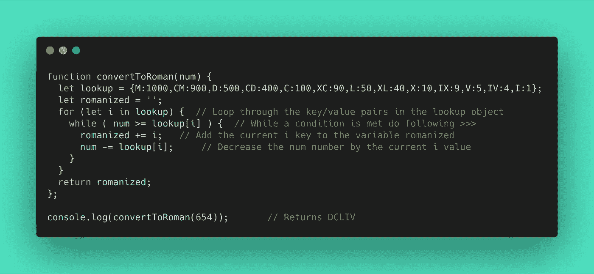

# 罗马数字转换器

> 原文：<https://betterprogramming.pub/roman-numeral-converter-ed895971b530>

## 我的前端 web 项目的快速总结

这是我的前端 web 项目的摘要，它将任何给定的数字转换成罗马数字。在我的[**GitHub**](https://github.com/libormarko/Roman_Numeral_Converter)**profile 上找到这个项目的源代码。**

****

**罗马数字转换器**

# **使用的编程概念**

*   **ES6**
*   **正则表达式**
*   **数据结构**
*   **算法脚本**
*   **排除故障**
*   **函数式编程**

# **使用的技术**

*   **Java Script 语言**

# **它是如何工作的**

**罗马数字是一种源于古罗马的数字系统。这个系统中的数字是由拉丁字母组合而成的。**

**我创建了一个接受给定数字并返回罗马数字的函数。我定义了一个变量*lookup* ，它包含一个对象，该对象具有罗马数字及其十进制等价物的键/值对。**

**我用罗马数字( *I，V，X，L* ，…)定义了由不同字母表示的数字，以及出现在新字母之前的数字( *IV，IX，XL* ，…)。**

**一个空字符串变量，*罗马化，*将保存一个最终的罗马数字。for 循环遍历 lookup 对象中的键/值对。如果满足 while 条件，则将当前的 *i* 键加到罗马化的变量*中，并将当前的 *i* 值减去 *num* 号。最终的罗马数字作为函数的结果返回。***

**例子:让我们把数字 654 变成一个罗马数字。
1。我在变量 lookup 中循环，以满足 I 等于 D:500 时的 while 条件(让 roman=D，让 num = 654–500 = 154)。
2。循环:在 I 处满足的 while 条件等于 C:100(设罗曼=DC，设 num = 154–100 = 54)。
3。循环:在 i1:50 时满足的条件(设 roman=DCL，设 num = 54–50 = 4)。
4。循环:i IV:4 时满足的条件(***let Roman = DC liv***，let num = 4–4 = 0)。**

**每当我陷入困境时，我就使用阅读-搜索-提问的方法。我发现这些页面非常有用:**

** [## 堆栈溢出—开发者学习、分享和发展职业生涯的地方

### Stack Overflow 是最大、最值得信赖的在线社区，供开发人员学习、分享他们的编程…

stackoverflow.com](https://stackoverflow.com/)  [## JavaScript 指南

### JavaScript 指南向您展示了如何使用 JavaScript，并对该语言进行了概述。如果您需要详尽的…

developer.mozilla.org](https://developer.mozilla.org/en-US/docs/Web/JavaScript/Guide)  [## 通过免费的在线课程、编程项目和面试准备学习编码…

### 我们的使命:帮助人们免费学习编码。我们通过制作成千上万的视频、文章和…

www.freecodecamp.org](https://www.freecodecamp.org/) 

我会让你知道我的最新进展！**