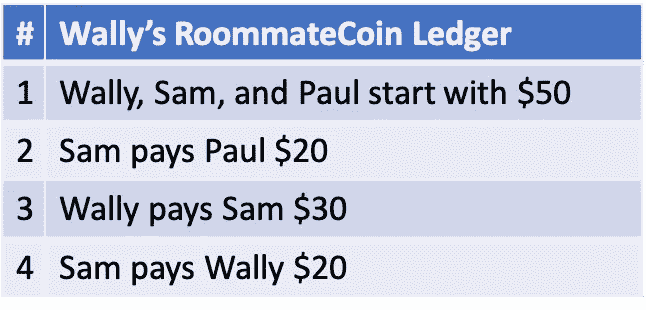
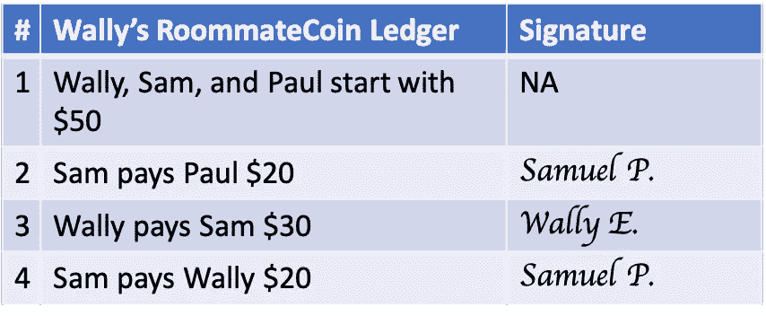
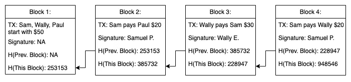
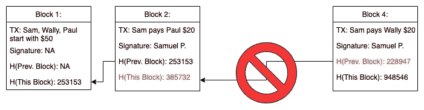
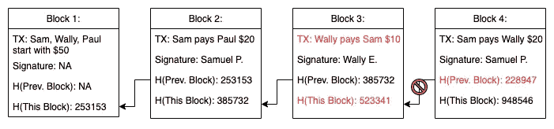
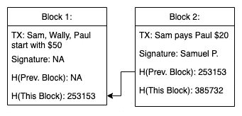
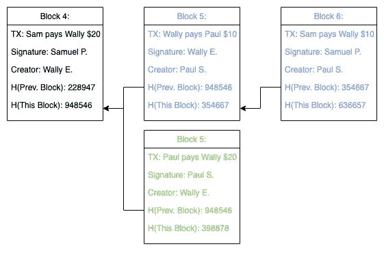
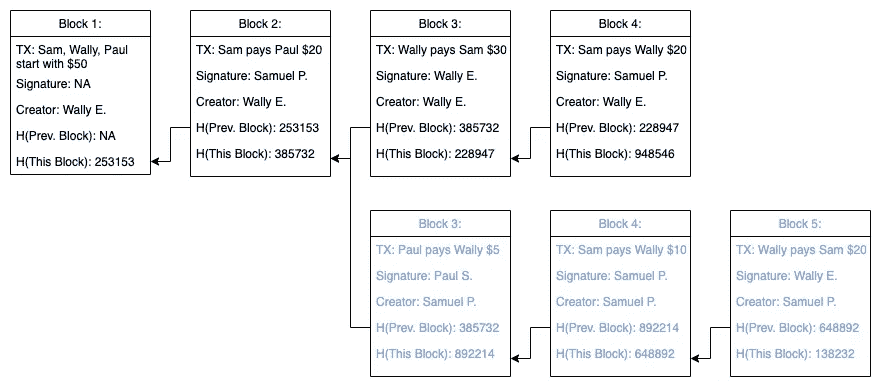
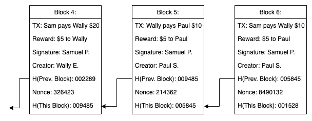

# RoommateCoin:简单而全面的区块链介绍

> 原文：<https://betterprogramming.pub/roommatecoin-a-simple-but-thorough-intro-to-crypto-de16a3f483e2>

## 了解如何使用区块链来平衡室友之间的账目

所以你想了解加密货币的工作原理，却厌倦了“加密货币是黄金的数字形式”等过于简化的解释。在本文中，我们将介绍创建我们自己的货币 RoommateCoin 的过程。我将提供一个记录金钱的系统，然后揭露这个设计的内在缺陷。对于每个缺陷或漏洞，我们将使用加密货币的工具和概念来纠正系统。

到最后，你应该对比特币和其他类似的加密货币的运作有了很深的理解。最后一点:如果你不知道如何编码，就忽略它，我保证还有很多东西要学。你知我知，反正我是在事后加上代码的。让我们开始吧！

# 室友硬币的需求

我们从三个室友开始:沃利、保罗和萨姆。这三个室友经常发现他们需要在房租、水电费、食品和其他杂项上相互转账。有时他们会回到自己的家乡，所以现金转账可能会很麻烦。最后，他们有信任问题。他们不信任金融机构来管理他们的资金，更不用说相互信任了。他们一起决定推出自己的货币 RoommateCoin，以解决他们所有的财务需求。

# 最初的 RoommateCoin 解决方案

沃利是最有条理的室友，所以他自愿记录这些钱。他会保留一个账户分类账，记录发生的每一笔交易。任何一个室友都可以向 Wally 报告一笔交易，并询问他们的账户上目前有多少钱。

图一。Wally 记录室友硬币的原始分类账

他们遇到的第一个问题是伪造交易。Sam 声称他从未同意图 1 中的交易#2，在该交易中他向 Paul 支付了 20 美元 RoommateCoin。管理账本的沃利声称山姆同意了，但无法客观证明。三个室友都意识到这是一个问题，并决定改变他们的协议。他们现在将要求沃利账本上的每笔交易都要有签名。由于 Wally、Paul 和 Sam 的笔迹明显不同，因此可以认为签名是无法伪造的。加密货币也反映了这一概念；但是，有加密的数字签名可以客观地证明同意，而不是有物理的钢笔和墨水签名。

图 2，添加到每笔交易中以防止伪造的签名。

我们现在已经核实了不能伪造的交易；然而，这并不意味着沃利不能篡改账本的历史。如果 Wally 缺钱，他可以决定删除图 3 中的交易#3，他向 Sam 支付了$30 RoommateCoin。实际上，沃利只是从萨姆那里偷了 30 美元，而没有伪造交易。尽管保罗和山姆很爱沃利，但他们需要修改协议，防止沃利修改账本的历史。

图 3，从分类账中删除交易:Wally 能够通过从分类账中删除以前的交易来从 Sam 那里偷钱。

# RoommateCoin 的集中式区块链解决方案

图 4。不变的区块链:沃利的账本现在变成了不变的区块链。每个块通过包含前一个块的散列 H(前一个块)指向它前面的块。

萨姆是一名计算机科学学生，最近学习了一种叫做区块链的数据结构。在其核心，区块链依赖于所谓的*散列函数*。哈希函数接收一大块数据，然后吐出一个一致但看似随机的数字。在下图中，对块#1 中的所有数据进行哈希运算得到的结果是数字 253153，H(块#1)=253153。块#2 通过包括字段 H(前一块):253153 来指示它跟随在块#1 之后。类似地，块#3 包括 H(块#2)，块#4 包括 H(块#3)。通过这种方式，形成了一系列被称为区块链的块体。

集中式区块链的 Python 3 实现。

如果沃利试图改变区块链，它会被发现。如果他删除了块#3，如图 5 所示，这个链就会被打断。Paul 和 Sam 注意到，块#4 的 H(前一块)=228947，而 H(块#2)=385732。显然，块#4 没有指向块#2，所以 Paul 和 Sam 知道丢失了一个块。

图 5。试图删除区块链中的块:块不能被从区块链中删除而不被注意。由于块#4 表示 H(前一块)=228947，而块#2 表示 H(块#2)=385732，很明显块#4 不指向块#2。因此 Wally 不能再删除任意的交易。

类似地，如果 Wally 试图改变块#3，如图 6 所示，它将被检测到。当 Wally 改变块#3 的交易量时，块#3 的哈希值变为 H(块#3)=523341。由于块#4 表明 H(前一个块)=228947，Paul 和 Sam 再次知道该链已经被篡改。

图 6。试图改变区块链:一个块不能在区块链被编辑而不被注意。如果 Wally 改变了块#3 中的交易量，那么整个块的散列也改变了。在改变交易前 H(块#3)=228947，在改变交易后 H(块#3)=523341。由于块#4 表示 H(前一块)=228947，我们知道新的改变是无效的。

虽然沃利不能改变历史，但他仍然可以从区块链移除砖块。如图 7 所示。在下图中，Wally 从区块链中移走了 3 号和 4 号地块。剩下的链条虽然较短，但仍然完好无损。通过移走这两块积木，沃利实际上从萨姆那里偷了 10 美元的室友硬币。山姆没有办法证明沃利从区块链移走了木块，除非他保存的是自己的《区块链》副本。

图 7。从区块链移走石块:集中的区块链仍然允许链条的顶端被移走。尽管删除了块#3 和块#4，剩余的区块链仍然被认为是有效的。我们需要一个分散的区块链来解决这个问题。

中央集权的区块链的各种优势和劣势的演示。

# RoommateCoin 的去中心化区块链解决方案

保罗和山姆已经决定完全不再相信沃利。他们现在都将保存自己的区块链账本。这就把我们带到了一个分权的区块链。现在没有权威人物控制 RoommateCoin 取而代之的是，所有的室友都跟踪事务，并且可以向其他室友提议新的事务。Paul、Wally 和 Sam 都认为 1-4 号地块是区块链的一部分，但现在他们想继续添加更多的交易。保罗提议建造蓝色的 5 号和 6 号地块，沃利提议建造绿色的 5 号地块。这被称为分叉，因为区块链已经分裂成两个独立的链，如图 8 所示。Sam 希望添加另一个事务，但是需要决定在 fork 中构建哪个链。

图 8。去中心化区块链的一个岔口:保罗、沃利和萨姆同意 1-4 号地块。然而，在块#5 上，链分裂。保罗创造了蓝色的 5 号和 6 号积木，沃利创造了绿色的 5 号积木。室友们需要找到一种方法来决定哪条链是正确的。他们认为最长的链条永远是正确的。因此，蓝色链现在是区块链的一部分，绿色块将被遗忘。

室友们认识到分叉将是一个常见的问题，需要有一种方法来解决它。他们提出了一个规则，即最长的区块链是应该被延长的链。在上面的例子中，蓝色区块链有六个街区，比绿色区块链的五个街区要长。因此，沃利、萨姆和保罗将决定继续在蓝色区块链上建造。绿色块将被认为是孤立的或无效的，永远不会发生。他们所创造的被称为*分布式共识*方法。他们的规则允许所有的室友就正确的账目达成一致，而不需要任何中央权威来指定信任。

我们几乎已经实现了一种可以正常工作的加密货币，但还有一个问题需要解决。在任何时间点，Wally、Paul 或 Sam 都可以创建一堆块来创建一个新的最长的区块链，同时使旧的块无效，如图 9 所示。

图 9。一系列快速的事务使旧的事务无效:室友们先前已经认识到黑块#3 和#4 是区块链的一部分；然而，Sam 在 2 号积木后很快就搭建了三个蓝色积木。由于蓝色区块链是现在最长的区块链，它被认为是正确的。黑色区块#3 和# 4 不再是区块链的一部分，被认为从未发生过。

尽管三个男孩都认为黑色区块# 1–4 是区块链的一部分，但如果萨姆决定在区块#2 之后建造三个蓝色区块，旧的黑色区块#3 和#4 就不再是最长的区块链的一部分，因此是无效的。在保罗和沃利看来，山姆已经还原了他们之前认为正确的两个街区。他们决定对 RoommateCoin 再做一次修改。

# RoommateCoin 的安全去中心化区块链解决方案

为了防止新的最长的链恢复旧的块，室友们使得创建块很费时间/精力。创建新块的困难阻止了任何单个室友在短时间内创建大量块，从而阻止了新的、破坏性的最长链的创建。这个需求是他们的分布式共识方法的一部分，被命名为*工作证明*。

室友们再次求助于散列函数来实现。他们首先给每个区块添加一个名为*随机数*的随机数。这个随机数改变了块的散列等于什么。对于证明工作证明的块，整个块的散列必须具有一定数量的前导 0。随机数被重复改变，直到块的散列达到所需数量的 0。由于散列函数看起来是随机的，所以这种工作证明只能通过使用大量时间和计算能力的重复计算机计算来完成。

因为现在很难在区块链上制作新的积木，男孩们决定奖励积木制作者。任何用工作证明创建一个街区的室友都可以给自己 5 美元的室友硬币作为奖励。他们已经建立了被密码社区称为*挖掘*的流程。在一个分散的区块链，一名矿工经历了创建新区块的艰难任务，以换取加密货币奖励。

图 10。区块链中的工作证明:为了使创建事务变得困难，需要工作证明。随机数值被重复改变，直到整个块的散列具有一定数量的前导 0。例如，在块#4 中，通过添加随机数值 326423，H(块#4)=009485。009485 有两个前导 0，因此表明已经花费了努力来创建该块。由于 Wally 是第 4 块的创造者，他可以奖励自己$5 RoommateCoin。这整个过程被称为流行术语*采矿*。

区块链的分散式实现。

就是这样。RoommateCoin 现在是一种安全的加密货币。它是数字化的、分散的、不可信的。Paul、Sam 和 Wally 可以使用它来满足他们的特定需求，并且它足够灵活，他们的任何朋友都可以加入，而不会受到信任。

Wally、Paul 和 Sam 使用分散式区块链的演示。

# RoommateCoin 和比特币等硬币有多相似？

RoommateCoin 在概念上与比特币几乎相同。比特币使用加密签名来防止交易伪造。比特币使用哈希函数来创建不可变的区块链。比特币矿工根据工作证明使用最长的链作为他们的分布式共识方法。最终，虽然比特币可能在细节上有所不同，但概念与 RoommateCoin 是一样的。

虽然不是所有 RoommateCoin 的概念都会转移到一些尖端的加密货币上，但基本目的仍然是相同的。归根结底，几乎所有加密货币的目标都是创建一个可信的系统，其中系统中的任何个人都不可信。