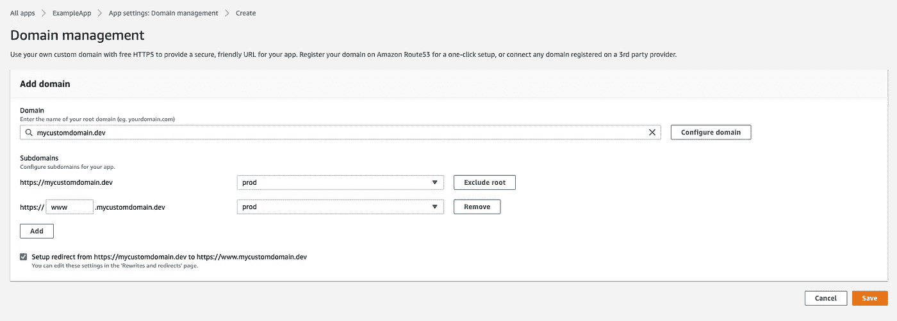
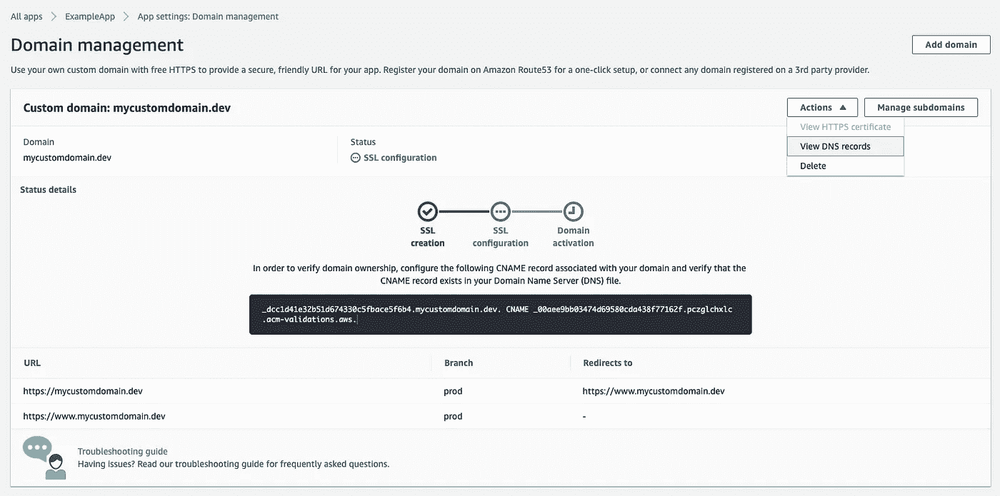
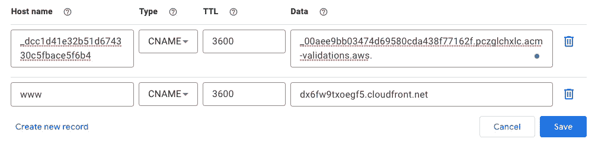
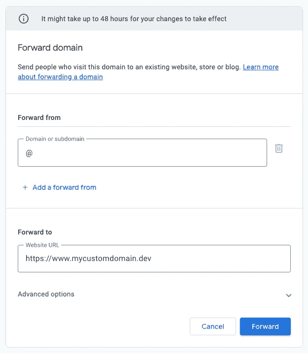
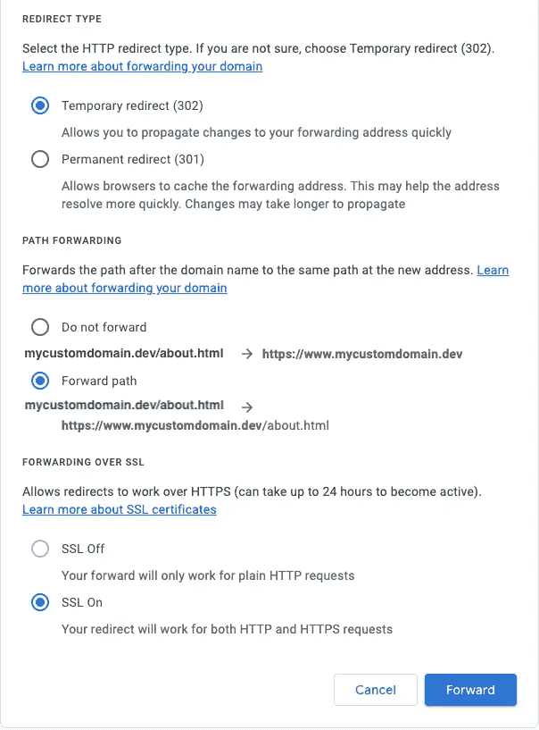

# 如何将 AWS Amplify 应用程序路由到 Google 域

> 原文：<https://betterprogramming.pub/routing-an-aws-amplify-app-to-a-google-domain-7ca06fe88f0>

## 当您的域不在 Route53 中时的分步指南

照片由来自[像素](https://www.pexels.com/photo/midsection-of-man-working-326522/?utm_content=attributionCopyText&utm_medium=referral&utm_source=pexels)的 [Tranmautritam](https://www.pexels.com/@tranmautritam?utm_content=attributionCopyText&utm_medium=referral&utm_source=pexels) 拍摄

AWS Amplify 主机控制台使选择 Route53 中管理的自定义域变得极其简单，但当您的自定义域位于 Google Domains 中时，您能做什么呢？

虽然将域名管理迁移到 Route53 是一个选项，但也可以通过一些额外的步骤将你的应用程序直接链接到谷歌域名。

*注意:本指南假设您的 Amplify 应用程序的其余部分已经按照要求进行了配置，并且您的自定义域名已经在 Google Domains 中购买。*

# 步骤 1:在 Amplify 控制台中添加自定义域

1.  你可以在 Amplify 控制台的应用程序设置下找到“域管理”。从那里，点击“添加域”按钮。
2.  添加您的自定义域，然后单击“配置域”按钮。填写子域和分支以匹配您的用例，完成后单击“保存”。

在 Amplify 控制台中添加域的设置

# 第二步:在 Amplify 中找到你的 DNS 记录

1.  Amplify 将为您提供所需的 DNS 记录。这些可以在“域管理>>操作>>查看 DNS 记录”下找到

“查看 DNS 记录”在操作按钮下。

2.这将向您显示一个包含三条记录的弹出窗口:一条用于验证您的域所有权的`CNAME`记录，一条用于配置根域的`ANAME (ALIAS)`记录，以及第二条用于配置 DNS 提供商的`CNAME`记录。

Amplify 给你提供了三个 DNS 记录。

# **第三步:在 Google 域中创建 DNS 记录**

1.  在 Google 域中，导航到您希望与 Amplify 应用程序关联的域。打开“DNS”设置，在“资源记录”部分添加两条`CNAME`记录。

在资源记录部分添加两个 CNAME 记录。

2.现在，因为 Google Domains 不支持`ANAME`记录，导航到“网站”设置，点击按钮“添加转发地址”。将“@”放入“转发自”字段，并将您的自定义域作为“转发至”值。

3.最后，您需要通过选择临时或永久重定向、转发路径并打开 SSL 来配置“高级选项”。完成后，点击“转发”。

配置转发下的高级设置。

# 第 4 步:验证它是否有效！

Amplify 可能需要几分钟来验证您的域名所有权(在此阅读更多信息), Google Domains 警告说，您的转发可能需要 48 小时才能生效(但通常不会花那么长时间！).

尝试在浏览器中导航到您的新自定义域，您应该能够点击您的 Amplify 应用程序。

我希望这能对你有所帮助，祝你好运！