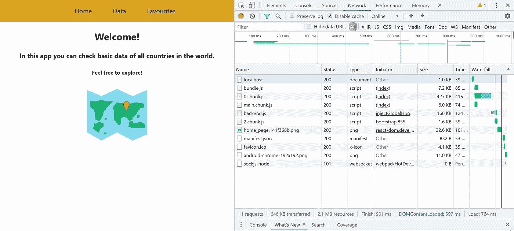
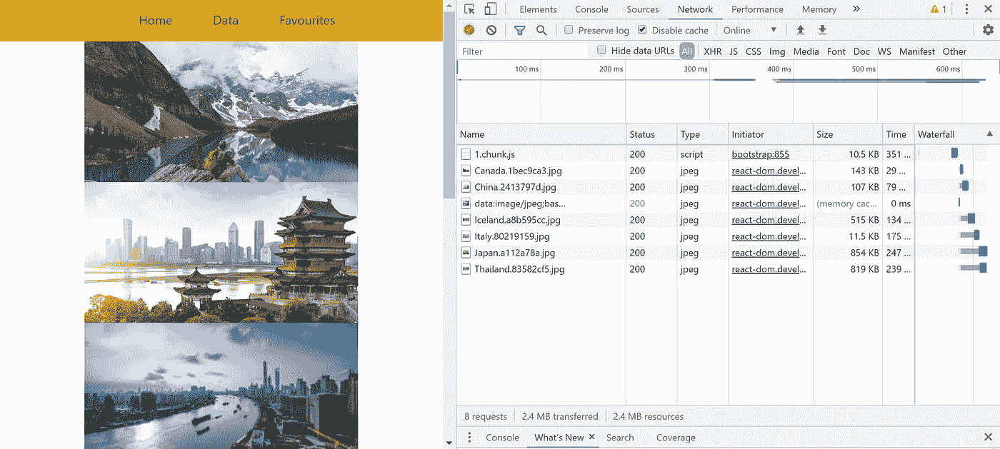

# React 中的路由和代码拆分

> 原文：<https://betterprogramming.pub/routing-and-code-splitting-in-react-fc7315f0bde4>

## 用 React.lazy()和悬念正确实现 React 路由器


尼古拉斯·杰夫韦在 [Unsplash](https://unsplash.com?utm_source=medium&utm_medium=referral) 上拍摄的照片

如果您希望 React 应用程序中有多个路由，您应该了解 React 路由器的实现。没那么难。

但是，如果您的应用程序可能会扩展并添加更多路线，您可能会遇到性能问题。一些路线可能甚至没有被用户访问过，但是它们仍然会被导入。这将增加应用程序所需的数据量。

此外，您不能忘记处理应用程序中不存在的路线。一个好的开发人员应该预料到这样的问题会发生。

在这篇文章中，我将演示如何使用 React 路由器，同时考虑使用基于路由的代码分割进行性能优化。

首先，您可以克隆 GitHub repo 。如果你有兴趣从头开始构建整个应用程序，请随意阅读我关于用钩子构建 React 应用程序的最佳实践的文章。

现在，让我们言归正传。

# 安装

首先，我们需要使用以下命令安装 React 路由器:

```
npm install --save react-router-dom
```

这允许我们在它们之间创建路线和链接。

在我们的应用程序中，我们需要更新我们的文件夹结构。因为您可能不确定将来会有多少条路线，所以最好将路线分别放在单独的文件夹中。

让我们在`src`目录下创建这个文件夹，并将其命名为`routes`。这是我们将要创建和管理所有路由的地方，其中每条路由都是一个单独的组件。

# 构建路线作为示例

首先，我们将有三条路线:`Home`、`Favourites`和`CountriesContainer`:

*   让我们从默认路线开始，它在路径`/`上。它应该是第一页，如果用户访问您的网站，就会显示出来。在我们的例子中是`Home.js`。
*   我们还创建了 route `[Favourites.js](https://github.com/Dromediansk/countries-app-blog/blob/react-router-implementation/src/routes/Favourites.js)`，用图片展示了几个国家。这条路线将是一个很好的例子，在这篇文章的后面演示路线的代码分割。到这条路线的路径将是`/favourites`。
*   我们正在将`CountriesContainer.js`移动到`/data`路径中的`routes`文件夹。在前一篇文章中已经构建了这个组件。
*   您可以随意添加任意多的路线。

# 404 页

每一个坚实的网站都应该照顾到用户意想不到的行为。如果你想成为一名优秀的开发者，你的责任就是处理这些情况。那么让我们来解决下面这个问题:

*如果用户输入了您网站上不存在的路线，应该显示什么？*

它应该告诉用户这样的页面不存在，这样也更人性化。这里有一些 404 页的好例子，你可以从中获得灵感。

# 创建导航栏

当然，您需要能够在路线之间导航，所以让我们在`components`文件夹中构建我们的导航栏:

*   路线是在项目列表中创建的。
*   每个条目(route)都使用 react-router-dom 中的`NavLink`组件，这是我们之前安装的。
*   `NavLink`有一个必需的属性`to`，点击后会重定向到路由。

# **航线实施**

现在，让我们用最重要的部分来完成这个设置。所有的路线都将在`App.js`中实现，它位于组件树结构的顶部。

首先，我们需要从`react-router-dom`导入一些组件:

```
import { Switch, Route, BrowserRouter as Router } from "react-router-dom"
```

如果我们将路线添加到应用程序组件中，它将看起来像这样:

在 React 路由器的实施过程中，请记住以下原则:

*   最上面的标签是`Router`，所有的路线都包含在`Switch`中。
*   每个`Route`都有支柱`path`和`component`。
*   路由的顺序很重要，因为 React 路由器会遍历每条路由，并选择路径正确的路由。
*   作为最后一条路线，你要加一个没有`path`道具的 404 页面。这意味着如果上述路径都不等于要求的路径，路由器将显示此页面。

# 代码分割

现在，随着项目的增长，你需要考虑网站的捆绑大小。

下面是来自 [React 文档](https://reactjs.org/docs/code-splitting.html)的捆绑的确切定义:

> 捆绑就是跟踪导入的文件并将它们合并成一个文件的过程:一个“捆绑包”。然后，这个包可以包含在网页上，一次加载整个应用程序。

你需要留意你的包中包含的代码——不要意外地使它变得太大，以至于你的网站需要很长时间来加载。

这也适用于路由。如果您添加 15 条路线，它们将被捆绑在一个文件中，并在用户访问网站时立即加载。这是没有效率的，因为一些路线可能甚至没有被用户访问过，或者他们甚至是不可访问的(例如，管理页面)。

因此，正确的解决方案是使用代码分割。这个特性允许您将代码分成不同的包，然后按需或并行加载。

让我们在我们的网站上演示一下。

## 用 lazy()和悬念进行代码拆分

React 在 16.8 版本中发布了适合这些情况的特性:`React.lazy()`和`Suspense`。

所以让我们更新一下我们的`App.js`:

以下是一些需要记住的亮点:

*   如果需要，可以使用`React.lazy()`动态导入路线
*   `<Suspense>`是作为整个内容的包装器添加的。它有一个必需的道具`fallback`，在加载`<Suspense>`里面的内容时显示一个组件。通常，它应该是某种装载旋转器。

`React.lazy()`和`<Suspense>`也可以用于组件的动态导入，而不仅仅是路由。至少在大尺寸的内容中使用它是一个好习惯，比如图像和视频。它们只有在用户需要时才会被导入。

# 测试我们的结果

你如何知道通过使用上面的技术你实际上节省了多少数据？

我们来分析一下我们的网站。在 Chrome 中，打开 DevTools，点击网络选项卡。

**注意:**为了获得正确的结果，请清理内存缓存，并使用键盘上的 *shift* + *F5* 重新加载页面。



主页

正如您在下面看到的，资源的总大小是 2.1 MB。

现在，让我们重定向到收藏夹路径，在这里我们动态导入几个图像:



收藏夹路线

此页面上请求的数据总大小为 2.4MB。如果我们没有实施代码分割，所有图像将在用户访问第一页时立即下载。那会浪费资源和加载时间！

您可以检查、克隆或派生 GitHub repo 的最终版本。

如果你有兴趣更深入地了解性能，你可以使用另一种叫做*记忆*的技术。

[](https://medium.com/better-programming/boost-performance-of-your-react-app-with-memoization-e414f4f64c05) [## 通过记忆提升 React 应用的性能

### React.memo()和 useMemo()挂钩何时有用的全面解释

medium.com](https://medium.com/better-programming/boost-performance-of-your-react-app-with-memoization-e414f4f64c05) 

感谢阅读！